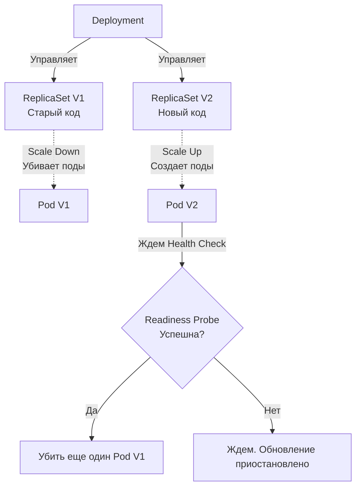

## Пересборка двигателя в полете: Релиз без права на ошибку

В эпоху монолитов обновление приложения было событием, к которому готовились неделями. Серверы выводили из балансировки, останавливали демоны, копировали новые бинарники и запускали систему заново. Даунтайм (время простоя) был неизбежен.

В мире микросервисов и непрерывной доставки (CI/CD) мы выкатываем новые версии десятки раз в день. Делать это с даунтаймом — непозволительная роскошь. Нам нужно менять код "на живую", пока система обрабатывает тысячи запросов в секунду (RPS).

В Kubernetes этот процесс называется **Rolling Update (Постепенное обновление)**. Это стратегия по умолчанию для контроллера Deployment.

В этой статье мы разберем математику безопасного обновления, механику отбрасывания трафика на уровне `iptables` и научимся писать Go-код, который умеет "умирать" красиво (Graceful Shutdown), не обрывая транзакции пользователей.

---

## Анатомия Rolling Update

Когда вы меняете образ контейнера в манифесте Deployment (например, с `myapp:v1` на `myapp:v2`), Kubernetes не убивает все старые поды разом. Он запускает танец двух ReplicaSet.



Процесс строго контролируется контроллером Deployment (в составе `kube-controller-manager`). Он плавно увеличивает количество реплик в новом `ReplicaSet V2` и уменьшает их в старом `ReplicaSet V1`.

### Математика безопасности: maxSurge и maxUnavailable

Скорость и безопасность этого танца регулируются двумя параметрами в манифесте:

```yaml
strategy:
  type: RollingUpdate
  rollingUpdate:
    maxSurge: 25%
    maxUnavailable: 25%
```

* **`maxUnavailable` (Максимум недоступных):** Сколько подов от желаемого количества могут быть недоступны во время обновления. Если у вас 100 подов и `maxUnavailable: 25%`, Kubernetes имеет право мгновенно убить 25 старых подов. У вас останется 75 подов для обработки текущего трафика.
* **`maxSurge` (Максимальное превышение):** На сколько подов можно превысить желаемое количество во время обновления. Если лимит 100, а `maxSurge: 25%`, кластер может создать 25 новых подов, доводя общее количество подов в моменте до 125.

> [!tip] Собеседование
> **Вопрос:** Что произойдет, если установить `maxUnavailable: 0%` и `maxSurge: 100%` для Deployment из 10 подов?
> **Ответ:** Вы получите Blue-Green Deployment в рамках одного контроллера. Kubernetes создаст сразу 10 новых подов (Surge 100%). Старые поды не будут удаляться (Unavailable 0%), пока все 10 новых не станут `Ready`. В моменте кластер будет потреблять х2 ресурсов (CPU/RAM). Это абсолютно безопасно для трафика, но требует огромного запаса "железа" в кластере.

## Mechanical Sympathy: Смерть пода и сетевой лаг

Самое слабое место Rolling Update кроется в распределенной природе Kubernetes. Когда `kube-controller-manager` решает удалить старый под, происходят два независимых асинхронных процесса:

1. **Endpoint Controller** убирает IP-адрес пода из сущности Endpoints. `kube-proxy` на каждой ноде замечает это и начинает переписывать правила `iptables`, чтобы новые сетевые пакеты больше не летели в этот под.
2. **Kubelet** посылает вашему Go-контейнеру сигнал `SIGTERM` (просьба мягко завершить работу).

**Ловушка (Gotcha):** Эти процессы параллельны! `iptables` обновляются не мгновенно (в больших кластерах это может занять секунды). Ваш под уже получил `SIGTERM` и начал останавливаться, но роутеры K8s всё ещё посылают в него новые HTTP-запросы. Если ваше Go-приложение завершится сразу после получения `SIGTERM`, все эти новые запросы (и те, что уже находились в обработке) упадут с ошибкой `Connection refused`.

### Идиоматичный Graceful Shutdown на Go

Чтобы избежать потери трафика, мы обязаны перехватывать сигналы ОС и использовать встроенный в стандартную библиотеку механизм `server.Shutdown()`.

```go
package main

import (
	"context"
	"errors"
	"log/slog"
	"net/http"
	"os"
	"os/signal"
	"syscall"
	"time"
)

func main() {
	mux := http.NewServeMux()
	mux.HandleFunc("/", func(w http.ResponseWriter, r *http.Request) {
		time.Sleep(2 * time.Second) // Имитация тяжелого запроса
		w.Write([]byte("Hello from Go!"))
	})

	srv := &http.Server{
		Addr:    ":8080",
		Handler: mux,
	}

	// 1. Создаем канал для прослушивания сигналов ОС
	quit := make(chan os.Signal, 1)
	// Подписываемся на SIGINT (Ctrl+C) и SIGTERM (Kubernetes)
	signal.Notify(quit, syscall.SIGINT, syscall.SIGTERM)

	// 2. Запускаем сервер в отдельной горутине
	go func() {
		slog.Info("Server is starting", "port", 8080)
		if err := srv.ListenAndServe(); err != nil && !errors.Is(err, http.ErrServerClosed) {
			slog.Error("ListenAndServe failed", "error", err)
			os.Exit(1)
		}
	}()

	// 3. Блокируемся и ждем сигнала от ОС (или Kubelet)
	<-quit
	slog.Info("SIGTERM received. Starting graceful shutdown...")

	// 4. Создаем контекст с таймаутом (например, 30 секунд). 
	// Это хард-лимит на завершение всех текущих запросов.
	ctx, cancel := context.WithTimeout(context.Background(), 30*time.Second)
	defer cancel()

	// 5. srv.Shutdown: 
	// - Сразу закрывает listener (перестает принимать новые TCP-соединения)
	// - Ждет завершения всех активных горутин, обрабатывающих HTTP-запросы
	if err := srv.Shutdown(ctx); err != nil {
		slog.Error("Server forced to shutdown", "error", err)
		os.Exit(1)
	}

	slog.Info("Server gracefully stopped")
}
```

> [!info] Под капотом: preStop Hook
> Даже идеального Go-кода иногда недостаточно из-за задержек `iptables`. Продвинутый паттерн — добавить в YAML манифест пода искусственную задержку перед отправкой `SIGTERM`.
> ```yaml
> lifecycle:
>   preStop:
>     exec:
>       command: ["/bin/sh", "-c", "sleep 5"]
> ```
> В эти 5 секунд под продолжит штатно принимать трафик, давая `kube-proxy` время обновить таблицы маршрутизации по всему кластеру. И только потом Kubelet пошлет `SIGTERM` в ваш бинарник.

---

## Архитектурные ловушки

### 1. Отсутствие Readiness Probes
Rolling Update опирается на статусы подов. Если вы не настроили **Readiness Probe** (см. [[6. Health checks]]), Kubernetes посчитает ваш новый под "готовым" в ту же секунду, когда запустится процесс в контейнере. 
Если вашему Go-приложению нужно 5 секунд на установку соединений с базой данных и прогрев кэша, K8s этого не поймет. Он убьет старые поды и пустит весь трафик на новые, которые еще не готовы отвечать. Результат — веерные ошибки `503 Service Unavailable`.

### 2. Слом контрактов БД (Backward Incompatibility)
Вы обновили код без даунтайма. Но ваш код работает с базой данных. 
Представьте: Версия 1 (V1) пишет данные в колонку `full_name`. Версия 2 (V2) пишет данные в `first_name` и `last_name`.
В процессе Rolling Update (который может длиться минуты) **V1 и V2 будут работать одновременно**, записывая данные в одну и ту же БД!
**Решение:** Разделяйте деплой кода и миграции БД. Применяйте паттерн расширения-сжатия (Expand-Contract) и гарантируйте [[7. Backward compatibility]]. Миграции должны быть неразрушающими.

### 3. Слишком короткий terminationGracePeriodSeconds
По умолчанию Kubernetes дает вашему поду ровно 30 секунд на Graceful Shutdown. Если у вас есть фоновая горутина, которая генерирует тяжелый отчет за 2 минуты, через 30 секунд после `SIGTERM` Kubelet пошлет `SIGKILL`, уничтожив процесс на полуслове.
Если вашему сервису нужно больше времени на "уборку", вы обязаны явно увеличить этот параметр в манифесте Deployment.

## Итог

1. **Математика релиза:** `maxSurge` и `maxUnavailable` позволяют балансировать между скоростью обновления и запасом отказоустойчивости.
2. **Асинхронность:** Маршрутизация трафика отключается параллельно с остановкой пода. Используйте `preStop` hook для компенсации сетевого лага.
3. **Graceful Shutdown:** Использование `http.Server.Shutdown(ctx)` с перехватом `SIGTERM` — абсолютный стандарт для любого Go-бэкенда.
4. **Зависимость от Health Checks:** Без правильно настроенных Readiness Probes плавное обновление превращается в русскую рулетку.

Мы научились разворачивать и бесшовно обновлять наш микросервис. Но теперь наш кластер превратился в черный ящик: десятки сервисов, тысячи подов, динамическое масштабирование и непредсказуемая сеть. Если что-то пойдет не так (например, начнет течь память в одной из 100 реплик), как мы об этом узнаем? В следующей статье мы открываем глаза нашей системе: [[7. Observability в Kubernetes]].