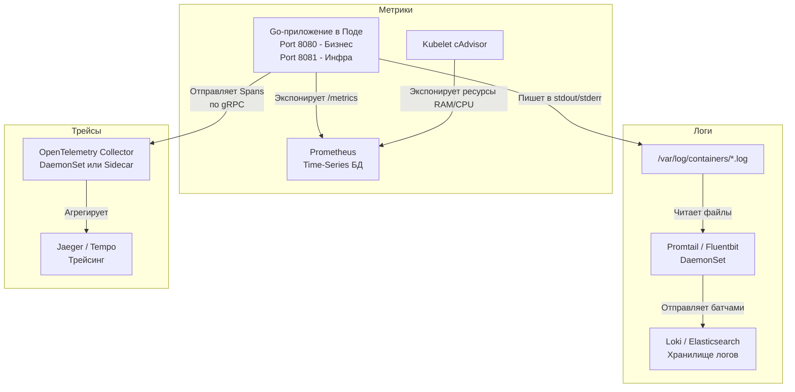

## Прозрение в темноте: Как понять, почему всё сломалось

В предыдущих статьях мы научились запускать наше Go-приложение в контейнере, масштабировать его через HPA (см. [[5. Horizontal scaling]]) и обновлять без даунтайма (см. [[6. Rolling updates]]). 

Теперь представьте ситуацию: вы развернули 50 экземпляров вашего микросервиса. Пользователи жалуются, что запросы периодически "отваливаются" с 500-й ошибкой, а некоторые транзакции занимают 10 секунд вместо 100 миллисекунд. Вы заходите в консоль, смотрите на список из 50 подов и понимаете: **ваша система — это черный ящик**. 

В монолите вы могли зайти на сервер по SSH, открыть `top` и почитать `/var/log/syslog`. В Kubernetes поды живут часы или минуты. Они эфемерны. Если под упал по OOM (Out Of Memory), он просто исчезнет вместе со всеми локальными файлами.

**Observability (Наблюдаемость)** — это архитектурный подход, позволяющий понять внутреннее состояние системы по ее внешним выходным данным. В Kubernetes observability строится на трех столпах (Three Pillars): Логи, Метрики и Трейсы.

В этой статье мы разберем, как правильно интегрировать Go-приложение в экосистему Kubernetes-мониторинга, почему `fmt.Println` может заблокировать ваши горутины, и как расследовать тихие "смерти" подов.

---

## Три столпа Observability в кластере

Чтобы видеть систему насквозь, нам нужны три разных типа данных, каждый из которых собирается своим инструментом.



---

## 1. Метрики: Пульс системы и Prometheus

Метрики — это числа во времени (Time Series). Нам не нужно знать каждый запрос, нам нужно знать агрегацию: *сколько* запросов в секунду (RPS), *каков* 99-й перцентиль задержки (Latency), *сколько* мегабайт кучи (Heap) сейчас использует Go.

В Kubernetes абсолютным стандартом является **Prometheus**. В отличие от старых систем (вроде StatsD, куда приложение само *отправляет* метрики — Push model), Prometheus использует **Pull model**. 

Ваше Go-приложение должно просто выставить HTTP-эндпоинт (обычно `/metrics`), а Prometheus сам будет приходить раз в 15 секунд и "забирать" текст.

> [!info] Под капотом: Service Discovery
> Как Prometheus узнает IP-адреса всех ваших 50 подов, если они постоянно меняются?
> Prometheus глубоко интегрирован с Kubernetes API. Он подписывается на события создания Подов (через Watch API) и ищет специальные аннотации в манифестах (например, `prometheus.io/scrape: "true"`) или использует объекты `ServiceMonitor` (в Prometheus Operator). Ему не нужны балансировщики — он ходит напрямую по IP каждого пода.

### Mechanical Sympathy: Ловушка High Cardinality

Одна из самых частых ошибок Go-разработчиков при добавлении метрик — это **High Cardinality (Высокая кардинальность)**.

Представьте, что вы создали гистограмму для времени выполнения HTTP-запросов. Вы решили добавить лейбл `path`, чтобы видеть метрики по каждому роуту.
Если вы запишете в лейбл сырой URL: `path="/api/users/123"`, `path="/api/users/456"`, то для **каждого** пользователя Prometheus создаст новую временную шкалу (Time Series) в оперативной памяти. На миллион пользователей вы получите миллион метрик. Prometheus упадет по OOM (Out Of Memory).

**Правило:** В метриках `path` должен быть шаблоном (например, `/api/users/:id`), а лейблы (Labels) должны принимать только ограниченный словарь значений (Enum).

### Метрики железа: cAdvisor
Вам не нужно писать код на Go, чтобы собирать CPU и RAM вашего контейнера. Демон `kubelet` (см. [[2. Kubernetes. Основы]]) содержит встроенный модуль `cAdvisor`. Он читает данные напрямую из `cgroups` ядра Linux и сам экспонирует их для Prometheus.

---

## 2. Логирование: Иллюзия `stdout`

В Kubernetes логирование устроено максимально просто для разработчика и максимально сложно для инфраструктуры.

Ваше Go-приложение не должно писать логи в файлы. Оно должно писать их строго в `stdout` (стандартный вывод) и `stderr`. 
Container Runtime (например, containerd) перехватывает этот вывод и сохраняет его в физические файлы на Worker Node по пути `/var/log/containers/`.
Затем сборщик логов (например, Promtail или Fluentbit), запущенный как `DaemonSet` (по одному экземпляру на каждую ноду), читает эти файлы, прикрепляет к ним метаданные Kubernetes (имя пода, namespace, лейблы) и отправляет в центральное хранилище (Loki или ELK).

### Идиоматичный Go: log/slog и JSON

> [!tip] Собеседование
> **Вопрос:** Почему в распределенных системах запрещено писать логи простым текстом (plain text), как `log.Printf("user %s created", user)`?
> **Ответ:** Текстовые логи невозможно эффективно искать и агрегировать, когда у вас терабайты данных. Если вам нужно найти логи всех ошибок оплаты для конкретного `user_id` в кластере из 100 микросервисов, регулярные выражения (Grep) убьют сервер. 

Логи должны быть структурированными, в формате JSON. В Go начиная с версии 1.21 есть встроенный пакет `log/slog`.

```go
// Идиоматичная настройка логгера для Kubernetes
logger := slog.New(slog.NewJSONHandler(os.Stdout, &slog.HandlerOptions{
    Level: slog.LevelInfo,
}))
slog.SetDefault(logger)

// Использование
slog.Info("payment processed",
    slog.String("user_id", "12345"),
    slog.Int("amount", 500),
    slog.Duration("latency", 45*time.Millisecond),
)
```

Такой лог Loki распарсит за микросекунды, позволяя делать SQL-подобные запросы: `{app="payment"} | json | amount > 100`.

### Mechanical Sympathy: Блокирующий stdout

> [!warning] Ловушка / Gotcha
> Вызов `fmt.Println` или `slog.Info` в Go кажется мгновенным. Но на уровне ОС `stdout` — это pipe (труба) или socket, подключенный к демону `containerd`. 
> 
> У этого пайпа есть буфер ядра (обычно 64 КБ). Если вы логируете слишком много, а `containerd` не успевает читать этот буфер (например, нода перегружена по I/O, потому что кто-то пишет логи со скоростью гигабайт в секунду), буфер переполняется.
> 
> В этот момент **системный вызов `write` в Go блокируется**. Ваша горутина останавливается. Если это происходит в горячем пути HTTP-хендлера, весь ваш Go-сервис мгновенно зависнет. Никогда не логируйте каждый чих (например, тело каждого запроса) в production.

---

## 3. Трассировка (Tracing): Поиск виновного в толпе

Трейсинг решает проблему, с которой метрики и логи не справляются. 
Клиент нажимает кнопку "Купить". Запрос идет в `API Gateway`, оттуда в `Order Service`, оттуда в `Payment Service`, оттуда в базу данных. Вся цепочка заняла 5 секунд. **Кто тормозил?**

Для этого используется распределенная трассировка (см. [[6. Distributed tracing]]). В Kubernetes стандартом стал **OpenTelemetry (OTel)**.

Суть в том, что на самом входе (`API Gateway`) запросу присваивается уникальный `TraceID`. Этот ID должен передаваться по сети в HTTP-заголовках (например, `traceparent`) в каждый следующий микросервис.

### Трассировка в Go через context

В Go этот процесс неразрывно связан с пакетом `context`. Вы не можете просто получить `TraceID` из глобальной переменной, так как каждый HTTP-запрос обрабатывается в своей горутине. Вы обязаны пробрасывать `ctx` через все функции вашего приложения.

```go
// Пример: Извлекаем контекст из HTTP запроса (содержит TraceID от прошлого сервиса)
ctx := r.Context()

// Начинаем новый Span (отрезок времени) внутри этого сервиса
ctx, span := tracer.Start(ctx, "process_payment_db")
defer span.End()

// Передаем контекст дальше в БД или другой сервис!
err := db.ExecContext(ctx, "UPDATE balances ...")
```

OpenTelemetry SDK в Go асинхронно собирает эти спаны (Spans) и по gRPC отправляет их в **OpenTelemetry Collector** (развернутый в K8s как `DaemonSet`). Коллектор уже агрегирует их и шлет в Jaeger. Вы получаете красивый водопад (Waterfall) вызовов, где видно, что из 5 секунд 4.9 секунды занял `UPDATE` в базе данных.

---

## Расследование инцидентов: Когда поды умирают молча

Самая страшная ситуация в Kubernetes — это "тихая смерть" пода.
У вас есть утечка памяти (Memory Leak) в Go-коде. Потребление RAM растет. Достигает лимита (например, 512Mb).
Ядро Linux вызывает **OOM Killer** (Out Of Memory Killer) и мгновенно убивает ваш процесс `SIGKILL`. 

**В чем проблема?** Go-приложение не может перехватить `SIGKILL`. Оно не успеет написать в лог `slog.Error("dying from OOM")`. В Loki вы увидите, что логи просто обрываются.

Как понять, что произошло?
1. **События кластера (Events):** Kubelet отправляет событие об убийстве пода в API Server. Мы можем увидеть его через `kubectl describe pod <name>` или `kubectl get events`.
2. **Kube-state-metrics:** Это специальный экспортер, который транслирует статусы объектов K8s в метрики Prometheus. Если настроить алертинг на метрику `kube_pod_container_status_terminated_reason == "OOMKilled"`, вы получите уведомление в Telegram ровно в ту секунду, когда ядро Linux убило ваш Go-сервис.

## Итог

1. **Метрики (Prometheus):** Покажут *симптомы* (CPU вырос, Latency скакнул). Требуют защиты от High Cardinality.
2. **Логи (Loki / ELK):** Покажут *детали* (текст ошибки `sql: connection refused`). Пишем в `stdout` строго в JSON через `log/slog`.
3. **Трейсы (OpenTelemetry):** Покажут *местоположение* проблемы в распределенной цепочке вызовов, пробрасывая `TraceID` через `context.Context` Go.
4. **Опасность `stdout`:** Логирование — это дисковая I/O операция. Переполнение пайпа `containerd` приведет к блокировке рантайма Go.

Мы сделали наш кластер прозрачным. Мы видим каждый запрос, каждую ошибку и потребление каждого байта памяти. Но как этот запрос вообще физически попадает в наш Под из интернета? Как работают балансировщики, Ingress-контроллеры и внутренний DNS? Пришло время спуститься на сетевой уровень. Следующая статья: [[8. Kubernetes networking]].