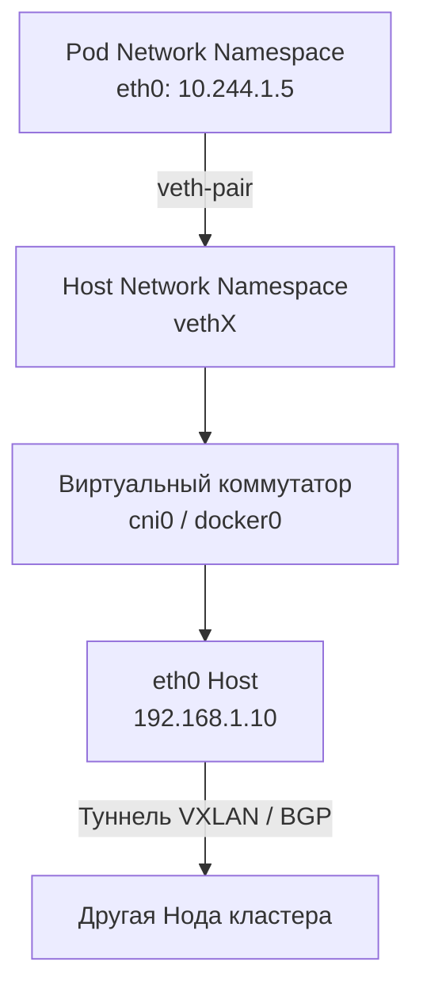

## Анатомия сети: От горутины до дата-центра

В предыдущей статье [[7. Observability в Kubernetes]] мы сделали наш кластер прозрачным для наблюдения. Мы видим логи, метрики и трейсы. Но остается последний "черный ящик" инфраструктуры — сама сеть.

Для многих разработчиков сеть в Kubernetes кажется магией. Мы создаем манифесты, и внезапно поды на разных физических серверах начинают общаться друг с другом, а клиенты из интернета магическим образом попадают в нужный HTTP-хендлер нашего Go-приложения.

Однако магии не существует. Есть лишь виртуозная оркестрация фундаментальных примитивов ядра Linux: сетевых пространств имен (Network Namespaces), таблиц маршрутизации, `iptables` и eBPF. 

В этой финальной статье раздела по Kubernetes мы разберем механику работы Container Network Interface (CNI), вскроем фатальную проблему DNS в Go, убивающую производительность, и научимся тюнинговать сетевой стек Go специально для работы в кластере.

---

## 1. Плоская сеть и CNI (Container Network Interface)

Фундаментальное правило Kubernetes: **Любой под может связываться с любым другим подом без использования NAT (Network Address Translation).** Каждый под получает свой собственный, уникальный в пределах кластера IP-адрес. Это означает, что вашему Go-приложению внутри пода кажется, что оно работает на отдельном физическом хосте.

За реализацию этого правила отвечает **CNI-плагин** (например, Calico, Flannel или Cilium).

### Mechanical Sympathy: Как под получает сеть?

Когда `kubelet` просит Container Runtime запустить ваш Go-контейнер, происходит следующее:

1. Создается изолированное сетевое пространство имен (Network Namespace). Ваш код видит только пустой интерфейс `lo` (localhost).
2. Вызывается бинарник CNI-плагина.
3. CNI создает виртуальный патч-корд — **veth pair** (Virtual Ethernet Pair). Это "труба" из двух виртуальных сетевых интерфейсов.
4. Один конец трубы помещается внутрь неймспейса вашего пода (и переименовывается в `eth0`). Ему назначается IP-адрес (например, `10.244.1.5`).
5. Другой конец трубы остается в корневом неймспейсе хоста (ноды) и подключается к виртуальному коммутатору — `bridge` (например, `cni0`).
6. CNI прописывает маршруты: весь трафик из пода отправлять в мост `cni0`, а оттуда — в физический интерфейс ноды.



Если поды находятся на разных нодах, CNI-плагин инкапсулирует пакет (например, засовывает IP-пакет пода внутрь UDP-пакета хоста через VXLAN) и отправляет по физической сети.

---

## 2. Внешний трафик: Ingress и обход kube-proxy

В статье [[3. Pod, Deployment, Service]] мы разбирали, как работает `Service` (ClusterIP) для внутреннего взаимодействия через `kube-proxy` и `iptables`. Но как трафик из интернета попадает в кластер?

Для этого используется **Ingress Controller** (самый популярный — Ingress Nginx, не путать с обычным Nginx).

Ingress Controller — это просто под, висящий на публичном IP-адресе или за облачным Load Balancer. Но у него есть суперсила: **он обходит `kube-proxy`**.

Когда запрос летит снаружи, Nginx читает правило Ingress (маршрут). Вы думаете, что Nginx проксирует трафик на ClusterIP вашего Service? Нет!
Ingress Controller подписывается на Kubernetes API (Endpoints) и держит в оперативной памяти актуальный список IP-адресов **всех ваших подов**. Когда приходит запрос, Nginx открывает TCP-соединение *напрямую* с нужным подом. Это избавляет пакет от лишнего NAT-преобразования в ядре Linux, снижая Latency.

---

## 3. Проклятие DNS: Проблема `ndots:5` в Go

Это самая коварная проблема производительности Go-сервисов в Kubernetes. О ней спрашивают на собеседованиях уровня Principal/Staff.

В Kubernetes есть свой DNS-сервер — **CoreDNS**. При запуске пода, Kubelet инжектирует в контейнер файл `/etc/resolv.conf`:

```text
search default.svc.cluster.local svc.cluster.local cluster.local
nameserver 10.96.0.10
options ndots:5
```

Параметр `ndots:5` означает: "Если в доменном имени, которое вы ищете, **меньше 5 точек**, сначала примените к нему суффиксы из списка `search`".

Представьте, что ваше Go-приложение хочет сделать вызов к стороннему API: `http.Get("https://api.stripe.com")`.
В строке `api.stripe.com` всего 2 точки.

> [!info] Под капотом: Рантайм Go
> По умолчанию в Go используется чистый внутренний DNS-резолвер (pure-Go resolver), встроенный в пакет `net`. Он послушно читает `/etc/resolv.conf`.
> 
> Вместо одного запроса к `api.stripe.com`, пакет `net` отправит в CoreDNS шквал UDP-пакетов:
> 1. `api.stripe.com.default.svc.cluster.local.` (NXDOMAIN)
> 2. `api.stripe.com.svc.cluster.local.` (NXDOMAIN)
> 3. `api.stripe.com.cluster.local.` (NXDOMAIN)
> 4. `api.stripe.com.` (Успех!)

На один исходящий HTTP-запрос вы генерируете 4 DNS-запроса по сети! При 10 000 RPS ваше приложение сгенерирует 40 000 мусорных запросов к CoreDNS. В лучшем случае у вас вырастет Latency (из-за потерь UDP-пакетов). В худшем — вы убьете CoreDNS и "положите" весь кластер.

**Как это лечить?**
1. **Явная точка (FQDN):** В Go-коде всегда добавляйте замыкающую точку для внешних адресов: `http.Get("https://api.stripe.com.")`. Это говорит резолверу: "Это абсолютное имя, не подставляй суффиксы".
2. **Тюнинг Pod Spec:** Измените `ndots` в манифесте Deployment:
```yaml
      dnsConfig:
        options:
          - name: ndots
            value: "1" # Искать локально только имена без точек (напр. 'database')
```

---

## 4. Egress и переполнение таблицы Conntrack

Еще один неочевидный архитектурный сбой возникает, когда ваше Go-приложение отправляет слишком много запросов к внешней базе данных (например, к AWS RDS), находящейся за пределами кластера.

Когда пакет покидает пределы Worker-ноды, ядро Linux обязано сделать **SNAT (Source NAT)**. Оно подменяет внутренний IP-адрес пода (10.244.x.x) на IP-адрес самой ноды, иначе внешний сервер не будет знать, куда отправить ответ.

Чтобы ядро помнило, какому поду вернуть ответный пакет, оно записывает информацию о каждом соединении в специальную таблицу в оперативной памяти — **`nf_conntrack` (Connection Tracking)**.

> [!warning] Ловушка / Gotcha
> Размер таблицы `conntrack` жестко ограничен (например, 262144 записей на ноду).
> Если ваш Go-сервис при пиковой нагрузке открывает десятки тысяч короткоживущих TCP-соединений (short-lived connections) к внешним ресурсам, таблица `conntrack` мгновенно переполняется.
> 
> Ядро Linux начинает молча уничтожать (DROP) новые пакеты. В логах Go вы увидите `dial tcp: i/o timeout` или `connection reset by peer`, хотя внешняя БД работает идеально.

**Решение на уровне Go:** Никогда не используйте дефолтный `http.Client` или `sql.DB` без настройки пула соединений в Kubernetes. Вы обязаны переиспользовать TCP-соединения (Connection Pooling), чтобы минимизировать нагрузку на NAT и `conntrack`.

---

## 5. Идиоматичный HTTP Transport для K8s

С учетом всех знаний о сети, CNI, таймаутах (см. [[3. Timeout]]) и DNS, вот как должен выглядеть базовый сетевой транспорт для микросервиса на Go, работающего внутри Kubernetes:

```go
package network

import (
	"net"
	"net/http"
	"time"
)

// NewK8sHTTPClient создает клиента, оптимизированного для агрессивной сетевой среды кластера
func NewK8sHTTPClient() *http.Client {
	return &http.Client{
		Timeout: 10 * time.Second, // Глобальный хард-лимит (защита горутин)
		Transport: &http.Transport{
			Proxy: http.ProxyFromEnvironment,
			DialContext: (&net.Dialer{
				Timeout:   3 * time.Second,  // Быстрый отказ при проблемах CNI/сети
				KeepAlive: 30 * time.Second, // Поддержание TCP (обход conntrack)
			}).DialContext,
			
			// Форсируем HTTP/2, чтобы использовать мультиплексирование
			ForceAttemptHTTP2:     true,
			
			// Максимальное количество соединений на ВЕСЬ транспорт
			MaxIdleConns:          1000, 
			// Максимальное количество соединений к ОДНОМУ хосту
			MaxIdleConnsPerHost:   100,  
			
			// Очистка мертвых соединений, если под на другой стороне умер
			IdleConnTimeout:       90 * time.Second,
			TLSHandshakeTimeout:   5 * time.Second,
			// Защита от Slowloris на принимающей стороне
			ExpectContinueTimeout: 1 * time.Second,
		},
	}
}
```

## Итог раздела "Kubernetes и деплой"

1. **Изоляция и Namespaces:** Сеть пода — это изолятор. CNI пробрасывает трафик из этого изолятора в виртуальный коммутатор ноды.
2. **Ingress Controller:** Умный L7 прокси, который сокращает путь пакета, обходя правила `iptables` и отправляя трафик напрямую в поды.
3. **Осторожно с DNS:** Дефолтная конфигурация `resolv.conf` с `ndots:5` убьет ваш кластер мусорными запросами. Используйте явную точку в URL (`.`) или тюнингуйте манифест.
4. **Тюнинг HTTP клиента:** В Kubernetes пул TCP-соединений (Keep-Alive) — это вопрос не только скорости приложения, но и выживания сетевого стека ОС (`conntrack`).

Мы прошли огромный путь: от устройства процессора и ядра ОС, через глубокие механизмы рантайма Go, паттерны распределенных систем, до тонкостей оркестрации в Kubernetes. 

Теперь мы готовы соединить все эти знания воедино. Мы переходим к самому важному практическому разделу. В следующей статье мы перестанем писать разрозненные куски кода и спроектируем архитектуру реального приложения, которое будет легко поддерживать, тестировать и разворачивать: [[1. Структура микросервисного проекта на Go]].