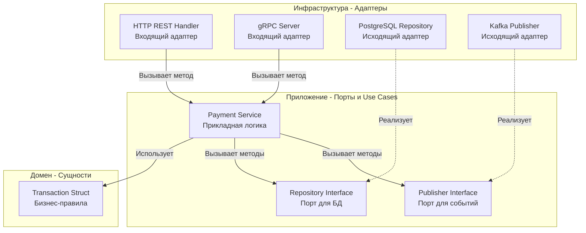

## От хаоса к порядку: Каркас надежного микросервиса

Поздравляю, мы пережили глубокое погружение в теорию распределенных систем, сетевые протоколы, оркестрацию и паттерны надежности. Теперь начинается раздел «Практика». Мы будем писать код.

Один из самых сильных шоков для разработчиков, приходящих в Go из мира Java (Spring), C# (.NET) или PHP (Laravel/Symfony) — это полное отсутствие навязанной структуры проекта. Go не говорит вам, куда класть файлы. В нем нет встроенного DI-контейнера на рефлексии или обязательного ORM.

С одной стороны, это дарит невероятную свободу. С другой — приводит к тому, что каждый джуниор изобретает свой собственный, ни на что не похожий фреймворк, который через полгода превращается в «большой комок грязи» (Big Ball of Mud).

В этой статье мы спроектируем production-ready структуру микросервиса на Go, основанную на гексагональной архитектуре (Ports and Adapters), разберем магию директории `internal` на уровне компилятора и поймем, почему классическое ООП-наследование убивает Go-проекты.

---

## Standard Go Project Layout: Базовый скелет

Хотя официального стандарта от создателей языка не существует, де-факто индустриальным стандартом стал [golang-standards/project-layout](https://github.com/golang-standards/project-layout). Он адаптирован для микросервисов и состоит из трех главных директорий:

```bash
my-microservice/
├── cmd/               # Точки входа в приложение
│   └── payment/       # Имя микросервиса
│       └── main.go    # Инициализация (DI, чтение конфигов, запуск)
├── internal/          # Приватный код (бизнес-логика и адаптеры)
│   ├── app/           # Use Cases (сценарии использования)
│   ├── domain/        # Доменные сущности (структуры без зависимостей)
│   └── infrastructure/# Адаптеры (БД, HTTP, gRPC клиенты)
├── pkg/               # Публичный код (клиенты для других микросервисов)
├── go.mod
└── go.sum
```

### Зачем нужен `cmd/`?
В микросервисе может быть несколько точек входа. Например, `cmd/payment/main.go` — это HTTP-сервер, а `cmd/worker/main.go` — это фоновый процесс, разгребающий очередь Kafka. Они шарят одну и ту же логику из `internal/`, но собираются в разные бинарники.

### Магия директории `internal/`

Многие разработчики используют `internal/` просто потому, что «так принято», не понимая ее физического смысла.

> [!info] Под капотом
> Директория `internal/` — это не просто соглашение об именовании. Это жесткое правило, вшитое в **компилятор Go**. 
> Код, находящийся внутри директории `internal`, может быть импортирован только тем кодом, который находится в дереве директорий *выше* или *на том же уровне* родителя `internal`. 
> Если другой микросервис попытается сделать `import "github.com/you/payment/internal/domain"`, компилятор Go (`go build`) выбросит ошибку компиляции. Это аппаратная защита инкапсуляции. Вы физически не сможете случайно завязать два микросервиса на внутренние структуры друг друга.

---

## Гексагональная архитектура (Ports and Adapters)

Классический MVC (Model-View-Controller) из веб-фреймворков плохо подходит для сложных бэкендов. Он провоцирует создание «толстых контроллеров» или размазывание бизнес-логики по SQL-запросам (Active Record).

В Go доминирует **Чистая архитектура (Clean Architecture)** или ее вариация — **Гексагональная архитектура**.

Главное правило: **Зависимости всегда направлены внутрь.**



### 1. Доменный слой (`internal/domain`)
Это сердце вашего приложения. Здесь лежат простые Go-структуры (`struct`) и функции, описывающие фундаментальные бизнес-правила.
**Важно:** Домен не знает ни про JSON, ни про HTTP, ни про GORM, ни про SQL. Здесь нет никаких внешних импортов, кроме стандартной библиотеки.

```go
package domain

import "errors"

var ErrInsufficientFunds = errors.New("insufficient funds")

// Transaction - доменная сущность
type Transaction struct {
	ID     string
	Amount int64
	Status string
}

// Бизнес-правило инкапсулировано в домене
func (t *Transaction) Process() error {
	if t.Amount <= 0 {
		return errors.New("invalid amount")
	}
	t.Status = "PROCESSED"
	return nil
}
```

### 2. Прикладной слой (`internal/app`)
Здесь находятся сценарии использования (Use Cases) или Сервисы. Они оркестрируют логику: идут в БД, обновляют доменную сущность, отправляют событие в очередь.

Здесь мы объявляем **Порты (Интерфейсы)**. 

> [!tip] Собеседование
> **Вопрос:** В чем заключается принцип "Accept interfaces, return structs" в Go?
> **Ответ:** Это фундаментальная идиома Go. В отличие от C# или Java, где интерфейсы лежат рядом с реализацией (например, `IUserRepository` и `UserRepository`), в Go интерфейсы неявные (Implicit Interfaces). Интерфейс должен определяться **там, где он используется** (потребителем), а не там, где реализуется.

```go
package app

import (
	"context"
	"myapp/internal/domain"
)

// Порт: Сервис сам определяет, что ему нужно от базы данных
type TransactionRepository interface {
	Save(ctx context.Context, tx *domain.Transaction) error
}

type PaymentService struct {
	repo TransactionRepository // Зависимость через интерфейс
}

// Конструктор
func NewPaymentService(repo TransactionRepository) *PaymentService {
	return &PaymentService{repo: repo}
}

// Use Case
func (s *PaymentService) MakePayment(ctx context.Context, tx *domain.Transaction) error {
	if err := tx.Process(); err != nil {
		return err
	}
	// Сохраняем абстрактно. Сервис не знает, Postgres это или MongoDB.
	return s.repo.Save(ctx, tx) 
}
```

### 3. Инфраструктурный слой (`internal/infrastructure` или `internal/adapter`)
Здесь живут конкретные реализации портов. SQL-запросы, парсинг JSON, интеграция с Redis.

```go
package postgres

import (
	"context"
	"database/sql"
	"myapp/internal/domain"
)

// Адаптер
type TransactionRepo struct {
	db *sql.DB
}

func NewTransactionRepo(db *sql.DB) *TransactionRepo {
	return &TransactionRepo{db: db}
}

// Реализация интерфейса TransactionRepository. 
// Заметьте, здесь нет "implements", компилятор проверяет совпадение сигнатур.
func (r *TransactionRepo) Save(ctx context.Context, tx *domain.Transaction) error {
	_, err := r.db.ExecContext(ctx, "INSERT INTO transactions ...")
	return err
}
```

---

## Mechanical Sympathy: Интерфейсы и Escape Analysis

> [!warning] Ловушка / Gotcha: Налог на абстракцию
> Гексагональная архитектура требует обильного использования интерфейсов для Dependency Injection. 
> На низком уровне рантайма Go вызов метода через интерфейс (Dynamic Dispatch) стоит чуть дороже прямого вызова (Static Dispatch). Но более важно то, как интерфейсы влияют на **Escape Analysis**.
> 
> Когда вы передаете структуру по указателю в метод интерфейса, компилятору гораздо сложнее доказать, что этот указатель не «убежит» за пределы текущего стека (потому что реализация скрыта за интерфейсом). В результате компилятор перестраховывается и аллоцирует вашу доменную структуру в **Куче (Heap)**, а не на **Стеке (Stack)**.
> 
> В 99% бизнес-логики (сохранение в БД) это абсолютно приемлемо и оправдано (выигрыш в архитектуре важнее). Но в сверх-горячих путях (миллионы вызовов в секунду, парсинг сетевых пакетов) чрезмерная "слоистость" убьет производительность из-за нагрузки на Garbage Collector. Балансируйте абстракции!

---

## Сборка воедино: Dependency Injection в main.go

В отличие от Spring (с его `@Autowired`), в идиоматичном Go внедрение зависимостей делается явно, руками, в точке входа `cmd/payment/main.go`. Это называется **Composition Root**. Никакой рефлексии, никаких тормозов при старте, полная проверка типов на этапе компиляции.

```go
package main

import (
	"database/sql"
	"log"
	"myapp/internal/adapter/postgres"
	"myapp/internal/app"
	"myapp/internal/adapter/http"
)

func main() {
	// 1. Инициализация БД
	db, err := sql.Open("postgres", "postgres://...")
	if err != nil {
		log.Fatal(err)
	}
	defer db.Close()

	// 2. Сборка графа зависимостей (DI)
	// Адаптеры (снизу вверх)
	repo := postgres.NewTransactionRepo(db)
	
	// Приложение (Use Cases)
	service := app.NewPaymentService(repo)
	
	// Входящие адаптеры (Транспорт)
	handler := http.NewPaymentHandler(service)

	// 3. Запуск сервера (с Graceful Shutdown, как мы учились ранее)
	// ...
}
```

*Примечание:* В проектах с сотнями зависимостей ручная сборка `main.go` может превратиться в "простыню" из тысячи строк. В таких случаях используют библиотеки кодогенерации `google/wire` (compile-time DI, полностью сохраняющий строгую типизацию) или `uber-go/fx` (runtime DI на рефлексии). Но начинать всегда стоит с явного ручного DI.

## Итог

1. **`internal/` — ваш броня:** Используйте эту директорию для защиты бизнес-логики от импорта извне.
2. **Ports and Adapters:** Отделяйте то, *что* делает система (Домен, Use Cases), от того, *как* она связывается с внешним миром (БД, gRPC, HTTP).
3. **Accept interfaces, return structs:** Определяйте интерфейсы (порты) в слое потребителя (в сервисе). Пусть адаптеры подстраиваются под бизнес-логику, а не наоборот.
4. **Explicit DI:** Собирайте зависимости явно в `main.go`. Код должен быть простым и читаемым как сверху вниз, так и снизу вверх.

Мы создали идеальную структуру для одного микросервиса. Но в распределенной системе у нас их десятки. Рано или поздно у вас появится общая логика: клиент к внутренней БД, утилиты логирования, обработчики ошибок. Возникает соблазн вынести всё это в общий пакет-библиотеку. Почему это может стать фатальной ошибкой для независимости микросервисов? Переходим к вечному холивару: [[2. Shared libraries vs copy paste]].