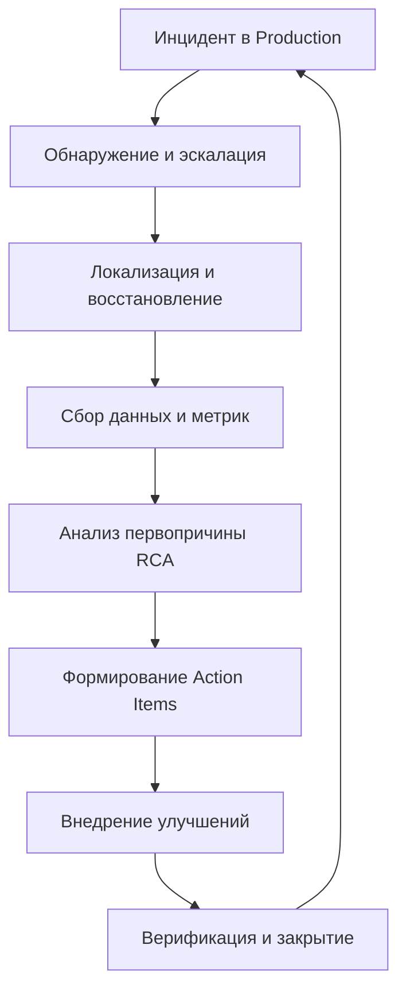

## Введение: Постмортем как инженерный артефакт

В распределенных системах инциденты неизбежны. Высокая сложность, частичные отказы (`Partial failure`), сетевые задержки и каскадные эффекты делают невозможным полное исключение сбоев. Задача инженерной культуры — не предотвратить инцидент вообще (это невозможно), а минимизировать его влияние, быстро восстановить сервис и, главное, **не допустить повторения**.

**Постмортем (Postmortem)** — это структурированный, документированный анализ произошедшего инцидента. Это не отчет о том, кто виноват, а инженерный артефакт, цель которого — извлечь системные уроки и превратить хаос production-инцидента в конкретные технические и процессные улучшения.

В контексте Go-бэкенда постмортем тесно связан с наблюдаемостью (`Observability`), отладкой рантайма и архитектурными решениями. Инцидент редко возникает из-за одной строки кода; чаще это цепочка: неоптимальная аллокация → рост GC pauses → деградация планировщика → таймауты в gRPC-клиентах → каскадный отказ зависимостей.

## Фундаментальные принципы и культура

Классический постмортем базируется на четырех столпах. Нарушение любого из них превращает анализ в бюрократическую формальность или политическую игру.

1. **Blameless (Беспричинный/Без поиска виноватых):** Фокус смещается с «кто сломал» на «как система позволила этому случиться». Если разработчик боится наказания, он скроет детали, уничтожит логи или промолчит о ранней симптоматике. В Go это критично, так как многие проблемы (goroutine leaks, deadlocks, GC stalls) требуют честного признания архитектурных просчетов.
2. **Data-driven (Основанный на данных):** Гипотезы заменяются метриками. Время обнаружения (MTTD), время восстановления (MTTR), точные таймстампы, трейсы, стеки.
3. **Actionable (С конкретными действиями):** Каждый пункт «lessons learned» должен превращаться в тикет с четким критерием готовности (Definition of Done). «Улучшить мониторинг» — плохой пункт. «Добавить метрику `http_request_duration_bucket` и алерт при p99 > 200ms» — хороший.
4. **Timely (Своевременный):** Постмортем пишется в течение 1-3 рабочих дней после инцидента, пока память свежа, а данные еще доступны в кластере.

> [!warning] Ловушка / Gotcha
> **Культура vs Процесс:** Blameless не означает отсутствие ответственности. Это означает, что ответственность лежит на *системе* и *процессах*, а не на отдельном инженере. Если после 5 постмортемов проблема не решена, виноват процесс принятия решений, а не автор кода.

## Структура и методология анализа

Хороший постмортем следует строгой структуре, чтобы избежать когнитивных искажений (например, эффекта выжившего или предвзятости подтверждения).

### 1. Таймлайн инцидента (Timeline)
Восстановление хронологии событий. Важно разграничить:
- Когда проблема *фактически* возникла (First Trigger).
- Когда система *начала деградировать* (Degradation Start).
- Когда она *была обнаружена* (Detection).
- Когда начались *действия по восстановлению* (Response Start).
- Когда сервис *полностью восстановился* (Recovery).

### 2. Оценка воздействия (Impact)
Количественная и качественная оценка: потеря пользователей, отказ транзакций, финансовые потери, нарушение SLA/SLO.

### 3. Анализ первопричины (Root Cause Analysis, RCA)
Используем методологии, отсекающие симптомы и находящие ядро проблемы:
- **5 Whys (5 почему):** Последовательный вопрос «почему?» до достижения системной причины.
- **Дерево отказов (Fault Tree):** Визуализация логических связей между событиями.
- **Рыбья кость (Ishikawa):** Группировка причин по категориям (Код, Конфигурация, Сеть, Зависимости, Данные, Люди).

### 4. Действия и улучшения (Action Items)
Разбиваются на:
- **Краткосрочные (Short-term):** Патчи, откаты, ручные обходы, добавление логов.
- **Долгосрочные (Long-term):** Архитектурные изменения, рефакторинг, внедрение новых примитивов синхронизации, изменение политик деплоя.



## Под капотом: Сбор данных и Go-рантайм

В распределенных системах на Go инциденты часто маскируются под «проблемы с сетью» или «зависания», хотя причина кроется в работе рантайма. Инженер должен уметь интерпретировать данные из Go-специфичных источников.

### 1. Panic и Stack Traces
В Go `panic` — это фатальное событие, которое останавливает текущую горутину и поднимается по стеку до `main`, вызывая crash. В микросервисах это часто приводит к обрыву соединения с клиентом и `502 Bad Gateway` от прокси.
```go
func main() {
    // Базовый recovery для HTTP-хендлеров
    defer func() {
        if r := recover(); r != nil {
            // runtime.Stack собирает стек ВСЕХ горутин, а не только упавшей
            stack := runtime.Stack(true)
            log.Printf("PANIC recovered: %v\nStack:\n%s", r, stack)
            // Важно: не пытаемся продолжить выполнение в том же контексте
            // без явной валидации состояния
        }
    }()
    // ... логика
}
```
> [!info] Под капотом
> `runtime.Stack(true)` блокирует сборщик мусора и приостанавливает все горутины на время обхода стека. В production это дорого. Используйте его только при критических сбоях или в отладочных бинарниках. Для продакшена лучше полагаться на `pprof` и структурированное логирование.

### 2. Goroutine Leaks и Scheduler Deadlocks
Распространенная причина деградации: горутины блокируются навсегда (закрытие канала, ожидание контекста, который никогда не отменится). Это приводит к:
- Росту RSS памяти (каждая горутина имеет стек, который растет динамически).
- Конкуренции за `P` (logical processors) в планировщике.
- Увеличению `GOMAXPROCS` нагрузки и снижению пропускной способности.

Диагностика через `pprof/goroutine`:
```bash
# В production обычно поднимаем debug endpoint или используем Prometheus client_golang
go tool pprof -top http://service:6060/debug/pprof/goroutine?debug=1
```

### 3. GC Pauses и Memory Pressure
В распределенных системах таймауты часто возникают из-за `Stop-The-World` (STW) пауз GC. Если приложение делает массовые аллокации в горячем пути, GC может запускаться чаще, чем настроено (`GOGC=100` по умолчанию).
- **Escape Analysis:** Если переменная утекает в кучу (escapees to heap), она попадает в цикл GC.
- **GOMEMLIMIT:** В Go 1.19+ можно задать лимит памяти. Если превышен, GC запускается агрессивно, даже если `GOGC` позволяет работать дальше.
- **Корреляция:** Сопоставление всплесков GC с падением QPS и ростом latency в метриках.

### 4. Correlation ID и Distributed Tracing
В микросервисной архитектуре один запрос проходит через 5-20 сервисов. Без трассировки постмортем превращается в гадание.
```go
// Идентификатор запроса должен передаваться через контекст и заголовки
type contextKey string
const correlationIDKey contextKey = "correlation_id"

func WithCorrelationID(ctx context.Context, id string) context.Context {
    return context.WithValue(ctx, correlationIDKey, id)
}

func GetCorrelationID(ctx context.Context) string {
    if v, ok := ctx.Value(correlationIDKey).(string); ok {
        return v
    }
    return ""
}
```
В постмортеме мы ищем `correlation_id` в логах всех сервисов (Kafka, DB, Cache), чтобы построить точный путь запроса и найти узкое место.

## Инструментарий и автоматизация

Ручной сбор данных для постмортема в высоконагруженных системах неэффективен. Автоматизация должна покрывать:

1. **Структурированное логирование:** Использование `slog` (Go 1.21+) с обязательными полями: `level`, `msg`, `correlation_id`, `service_name`, `trace_id`.
2. **OpenTelemetry:** Интеграция трейсов и метрик. Автоматическая генерация `span` для HTTP, gRPC, DB запросов.
3. **Системы агрегации:** Prometheus (метрики), Grafana (визуализация), Loki/ELK (логи), Jaeger/Tempo (трейсы).
4. **Скрипты для постмортема:** Автоматический сбор `pprof` дампов, `core` файлов, состояния `etcd`/`Consul` на момент инцидента.

> [!tip] Собеседование
> **Вопрос:** Как вы будете диагностировать инцидент, где CPU загружен на 100%, но приложение не обрабатывает запросы?
> **Ответ:** Сначала проверяю `pprof/profile` и `pprof/goroutine`. Если CPU высокий, а QPS низкий, это классический признак:
> 1. **Busy waiting** или бесконечный цикл без `runtime.Gosched()`.
> 2. **GC thrashing:** Частые STW паузы. Смотрю `go_gc_duration_seconds` и `go_memstats_alloc_bytes`.
> 3. **Syscall contention:** Много блокирующих системных вызовов (например, `epoll_wait`, `accept4`). Использую `pprof/threadcreate` или `block` profile.
> 4. **Deadlock в планировщике:** Все `P` заблокированы на мьютексах или каналах.
> В продакшене сразу активирую `GODEBUG=gctrace=1` (с осторожностью) или беру `pprof` дамп, не перезапуская сервис.

## Культура и процесс (Blameless)

Техническая часть постмортема бесполезна без правильной процессной культуры.

- **Ретроспектива:** Проводится через 24-48 часов. Участвуют все, кто был в эскалации, а также архитекторы и SRE.
- **Action Items Tracking:** Каждый пункт привязывается к Jira/Linear тикету. Назначается ответственный и дедлайн. Без этого постмортем превращается в «кладбище идей».
- **Chaos Engineering:** Инциденты должны быть источником данных для тестирования отказоустойчивости. Если постмортем выявил отсутствие circuit breaker, следующий шаг — внедрение `chaos-mesh` или `Toxiproxy` для проверки гипотезы на staging.
- **Postmortem как документация:** Статья должна быть самодостаточной. Через год, когда придет новый инженер, он должен понять: что сломалось, почему, как лечили и как предотвратить.

## Итог и переход к следующей статье

Постмортем — это не отчет о провале, а фундамент для инженерного роста. В распределенных системах на Go он требует глубокого понимания рантайма (планировщик, GC, аллокации), сетевых взаимодействий и инструментов наблюдаемости. Ключ к эффективному анализу — данные, беспричинная культура и системный подход к устранению первопричин, а не симптомов.