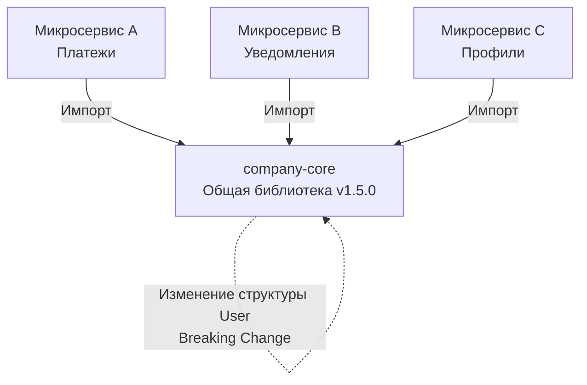

## Цена независимости: Меньше DRY, больше автономности

Один из создателей языка Go, Роб Пайк (Rob Pike), сформулировал знаменитую пословицу: **«Небольшое копирование лучше, чем небольшая зависимость»** (A little copying is better than a little dependency). 

Когда разработчики приходят в архитектуру распределенных систем из классической энтерпрайз-разработки, у них часто срабатывает рефлекс DRY (Don't Repeat Yourself). Увидев три одинаковые структуры `User` или идентичный код парсинга JWT-токена в трех разных микросервисах, они немедленно создают репозиторий `company-core` (или `shared-lib`), складывают туда весь общий код и подключают его во все проекты.

В этот момент микросервисная архитектура умирает. Рождается **Распределенный монолит**.

В этой статье мы разберем, почему копипаст в мире Go-микросервисов — это часто архитектурная необходимость, как общие библиотеки ломают сборку на уровне рантайма, и где проходит граница между полезной утилитой и токсичной зависимостью.

---

## Иллюзия переиспользования и Распределенный монолит

Главная цель микросервисов — **независимость развертывания (Independent Deployability)**. Команда сервиса `A` должна иметь возможность выкатить свой код в production, не спрашивая разрешения у команды сервиса `B`.

Что происходит, когда вы создаете общую библиотеку `company-core`, содержащую:
* Доменные модели (структуры `User`, `Order`).
* Настройки логгера.
* Обертки над HTTP-клиентом.
* Middleware для авторизации.



Представьте, что сервису `C` (Профили) понадобилось добавить новое поле в общую структуру `User` или изменить сигнатуру функции в логгере. 
Они выпускают `company-core v2.0.0`. Теперь, чтобы сервисы `A` и `B` могли получить обновления безопасности (или фиксы багов) из других частей библиотеки, они **обязаны** обновить свой код под ломающие изменения (breaking changes) второй версии, хотя им это новое поле `User` абсолютно не нужно!

Релизы перестают быть независимыми. Команды вынуждены синхронизировать выкатки. Это и есть распределенный монолит — он объединяет минусы микросервисов (сетевые задержки) с минусами монолита (жесткая связность кода).

---

## Mechanical Sympathy: Под капотом общих библиотек

Раздутые общие библиотеки бьют не только по процессам команд, но и по физической сборке и работе Go-приложений.

### 1. Угроза функций init()
В Go есть функция `init()`, которая выполняется до старта функции `main`. 
В больших общих библиотеках разработчики часто используют `init()` для регистрации SQL-драйверов, метрик или глобальных переменных.

> [!warning] Ловушка / Gotcha
> Если ваш микросервис импортирует пакет `company-core/logger`, а внутри репозитория `company-core` в другом пакете `database` есть функция `init()`, которая импортирует драйвер `github.com/lib/pq`... 
> Компилятор Go может затянуть этот код в бинарник (особенно если есть перекрестные внутренние ссылки). Ваш маленький микросервис, которому нужен был только логгер и который вообще не ходит в БД, внезапно начинает регистрировать SQL-драйверы при старте, увеличивая размер бинарного файла и время холодного запуска.

### 2. MVS (Minimal Version Selection)
Go Modules используют алгоритм Minimal Version Selection для разрешения графа зависимостей. Если ваша общая библиотека зависит от `grpc-go v1.50`, а ваш микросервис пытается использовать `grpc-go v1.55`, Go выберет максимальную из минимально требуемых версий. 
Чем больше зависимостей в вашей `shared-lib`, тем выше шанс **Dependency Hell (Ада зависимостей)**. Каждое обновление внешней библиотеки внутри `company-core` может сломать транзитивные зависимости в десятках микросервисов. 

**Правило:** Общая библиотека на Go должна иметь **ноль** внешних зависимостей (в `go.mod` не должно быть ничего, кроме стандартной библиотеки), либо их количество должно быть минимальным.

---

## Bounded Context: Почему копипаст структур — это норма

Самый частый аргумент противников копипаста: "Зачем мне описывать структуру `User` в каждом микросервисе, если она одна и та же?"

> [!tip] Собеседование
> **Вопрос:** У нас есть сущность `Product` (Товар) в интернет-магазине. Стоит ли вынести её в общую библиотеку, чтобы все микросервисы использовали одну структуру?
> **Ответ (уровень Senior):** Категорически нет. Это нарушение принципа Bounded Context (Ограниченных контекстов) из Domain-Driven Design (DDD). Товар в сервисе "Склад" — это вес, габариты и количество на полке. Товар в сервисе "Каталог" — это красивая картинка, SEO-описание и категория. Товар в сервисе "Биллинг" — это только ID, цена и ставка налога. 
> Если вы создадите одного "Убер-Товара" (`Uber-Product`) со всеми этими полями в общей библиотеке, вы свяжете (tightly couple) независимые домены. 

В идиоматичной архитектуре (см. [[1. Структура микросервисного проекта на Go]]) каждый микросервис описывает **свою собственную** структуру для одной и той же сущности реального мира, содержащую только те поля, которые нужны именно этому сервису. 
Да, это дублирование поля `ID` и `Name`. Но это **независимость**. См. статью [[2. Границы сервисов]].

---

## Что МОЖНО и НУЖНО выносить в общие библиотеки?

Не весь общий код — это зло. Выносить в библиотеки нужно то, что обладает **высокой технической когезией и нулевой бизнес-логикой**.

### 1. SDK и Клиенты (Генерация кода)
Если сервис `A` предоставляет API, он не должен заставлять другие сервисы писать HTTP-клиенты руками. 
Идеальный паттерн — использование кодогенерации (например, Protocol Buffers для gRPC или OpenAPI/Swagger для REST). Вы генерируете Go-структуры и методы клиента из контракта и публикуете их как библиотеку (или складываете в отдельный модуль). Клиентам остается только импортировать этот сгенерированный SDK. Это не нарушает связность, так как это интерфейс взаимодействия.

### 2. Чистые функции и Алгоритмы (Pure Functions)
Функции, которые принимают данные, возвращают данные и не имеют побочных эффектов (side-effects).
* Кастомный алгоритм хеширования паролей.
* Специфичная для компании математика округления валют.
* Валидаторы стандартизированных номеров (например, ИНН или номера страховок).

### 3. Инфраструктурные обертки (с осторожностью)
Вы можете создать библиотеку `platform-go`, которая стандартизирует подключение к метрикам (OpenTelemetry) или логгеру (`log/slog`). Но эта библиотека должна быть **очень тонкой**. Она не должна прятать за собой оригинальные интерфейсы инструментов.

```go
// ХОРОШО: Тонкая обертка, возвращает стандартный интерфейс
package telemetry

import "go.opentelemetry.io/otel/trace"

func SetupTracer(serviceName string) (trace.TracerProvider, error) {
    // ... стандартизированная настройка OTel экспортера ...
    return provider, nil
}
```

```go
// ПЛОХО: Толстая абстракция, прячущая реальность
package companycore

// Убили возможность использовать фичи OTel, придумали свой велосипед
func StartSpan(name string) MyCustomSpan { 
    // ...
}
```

---

## Копипаст (Deduplication via Copy-Paste)

Когда вы пишете новый микросервис и вам нужна функция для извлечения JWT-токена из заголовка `Authorization`, или стандартный HTTP middleware для логирования запросов:

1. **Не пишите общую библиотеку сразу.** 2. **Скопируйте код** из соседнего микросервиса. (В Go это обычно 20-50 строк кода).
2. Соблюдайте **Правило Трех (Rule of Three):** Только когда вы копируете один и тот же, абсолютно неизменный кусок кода в *третий* раз, и вы точно уверены, что баг в этом коде придется исправлять синхронно в трех местах — только тогда рассмотрите возможность выноса его в утилитарный пакет.

## Итог

1. **DRY в микросервисах опасен:** Стремление к переиспользованию бизнес-кода приводит к жесткой связности (Tight Coupling) и разрушает автономность команд.
2. **Изоляция доменов:** Никогда не шарьте доменные модели (сущности) между сервисами. Каждый сервис должен декларировать структуры заново под свои нужды (Bounded Context).
3. **Go Modules:** Большие общие библиотеки (`common`, `core`) тянут за собой гигантские графы зависимостей, замедляя компиляцию и увеличивая риск конфликтов MVS.
4. **Кодогенерация лучше библиотеки:** Вместо написания общих клиентов и DTO, используйте генерацию из спецификаций (gRPC/OpenAPI).

Мы решили проблему изоляции кода на уровне модулей. Но как нам физически хранить код этих десятков независимых сервисов? Должны ли мы создать 50 разных репозиториев в GitHub/GitLab, или лучше сложить весь исходный код компании в одну гигантскую папку? В следующей статье мы разберем эпическую битву подходов к хранению кода: [[3. Monorepo vs polyrepo]].