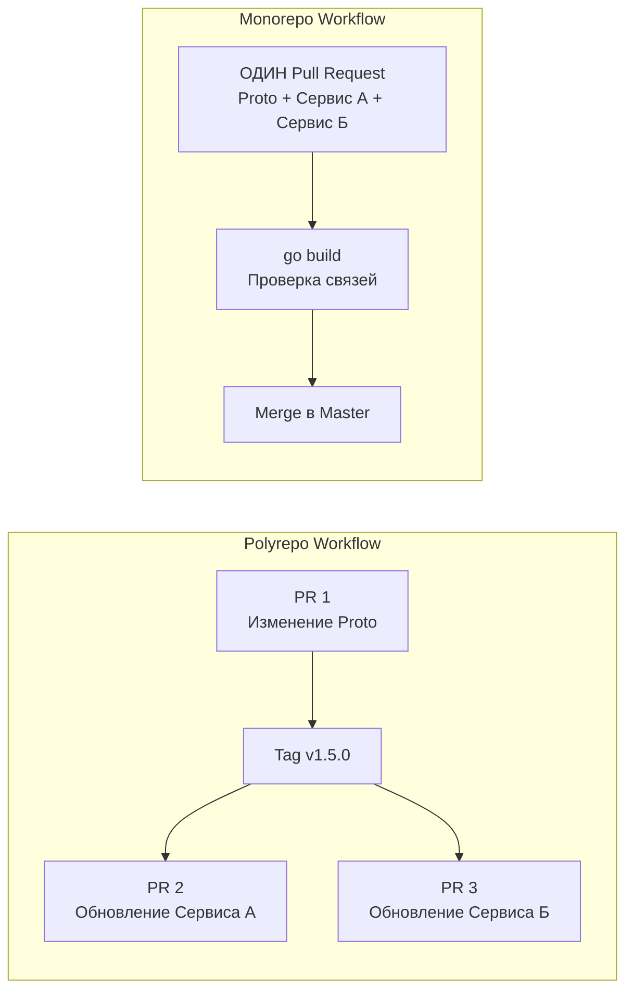

## Где живет ваш код: Эпическая битва репозиториев

В предыдущих статьях мы спроектировали идеальный каркас одного сервиса ([[1. Структура микросервисного проекта на Go]]) и договорились избегать создания раздутых общих библиотек ([[2. Shared libraries vs copy paste]]). Но теперь перед нами встает сугубо инфраструктурный вопрос. 

У нас есть 50 микросервисов. Как мы будем физически хранить их исходный код в Git? 

Исторически индустрия разделилась на два непримиримых лагеря: **Polyrepo** (Много репозиториев, один сервис = один репозиторий) и **Monorepo** (Единый репозиторий для всех сервисов компании).

Для Go-разработчика этот выбор влияет не только на удобство работы в IDE, но и на то, как компилятор разрешает зависимости, как работает кэш сборки и как устроены модули (`go.mod`). В этой статье мы разберем оба подхода, вскроем боль управления зависимостями и научимся использовать киллер-фичу Go 1.18 — `go.work`.

---

## Polyrepo: Иллюзия полной независимости

**Polyrepo (или Multirepo)** — это подход по умолчанию для большинства стартапов. Вы создаете новый микросервис `payment-api` — вы создаете новый репозиторий на GitHub/GitLab.

### Плюсы подхода
1. **Жесткие границы (Conway's Law):** Код изолирован физически. Разработчик из команды "А" не может случайно влезть в код команды "Б" и сломать его.
2. **Гранулярный контроль доступа:** Вы можете дать права на чтение/запись только нужным людям в нужные репозитории.
3. **Легковесный CI/CD:** Вы запушили коммит в `payment-api` — запустился пайплайн только для `payment-api`. Никакой магии с вычислением затронутых директорий.

### Фатальный недостаток: Dependency Hell (Ад зависимостей)

В микросервисной архитектуре сервисы общаются друг с другом. Обычно это делается через gRPC и Protocol Buffers.
Представьте, что вы решили добавить новое поле `discount_code` в `Order.proto`.

**Ваши действия в Polyrepo:**
1. Открыть репозиторий `protobuf-contracts`. Добавить поле. Создать Pull Request (PR), пройти ревью, влить в `master`.
2. Релизить новую версию `v1.5.0` в этом репозитории (git tag).
3. Открыть репозиторий `order-service`. Сделать `go get github.com/company/contracts@v1.5.0`.
4. Обновить Go-код для работы с новым полем. Сделать PR, влить в `master`.
5. Открыть репозиторий `billing-service` (который читает заказы). Обновить версию контрактов через `go get`. Сделать PR, влить в `master`.

Это называется **Diamond Dependency Problem**. Чтобы выкатить одну крошечную фичу, затрагивающую два сервиса, вам нужно сделать три PR в три разных репозитория в строгой последовательности. А если вы ошиблись в `order-service`? Придется повторять цикл. Скорость разработки падает до нуля.

---

## Monorepo: Все яйца в одной корзине (правильно сложенные)

**Monorepo** — это подход, который используют IT-гиганты (Google, Meta, Uber, Yandex). Весь исходный код бэкенда (а часто и фронтенда, и мобилок) лежит в одном гигантском Git-репозитории.

> [!warning] Ловушка / Gotcha: Монорепо != Монолит
> Самый частый провал на собеседованиях. Монорепо — это паттерн **хранения кода** (Repository Layout). Монолит — это паттерн **развертывания** (Deployment Layout). 
> Вы можете хранить 100 абсолютно независимых микросервисов в одном репозитории. Они будут собираться в 100 разных Docker-образов и деплоиться в кластер независимо друг от друга.

### Главное преимущество: Атомарные коммиты

Вернемся к примеру с добавлением поля `discount_code`.
В Monorepo вы делаете **один** Pull Request. В этом PR вы:
1. Меняете `.proto` файл.
2. Меняете код `order-service`.
3. Меняете код `billing-service`.

**Mechanical Sympathy компилятора:** Как только вы нажмете `go build` или запустите тесты в корне репозитория, компилятор Go мгновенно скажет вам: *"Эй, ты изменил контракт, но забыл обновить `billing-service` на строке 42!"*. 
Вы получаете мгновенную обратную связь от компилятора для всей распределенной системы. Код в ветке `master` всегда консистентен. Невозможно получить ситуацию, когда клиент и сервер используют несовместимые версии контрактов.



---

## Go под капотом: Как правильно готовить Monorepo

До версии Go 1.18 работа с монорепозиториями в Go была болью. Разберем эволюцию подходов.

### Подход 1: Один глобальный `go.mod`
Вы кладете один файл `go.mod` в корень репозитория. Все сервисы используют одни и те же версии внешних зависимостей.
* **Плюсы:** Нет конфликтов версий.
* **Минусы:** Обновление версии пакета (например, `gin` или `grpc`) для одного сервиса заставляет вас обновить этот пакет для ВСЕХ 50 сервисов сразу. Это может сломать половину компании.

### Подход 2: `go.mod` на каждый сервис (Мультимодульность)
Каждый микросервис имеет свой собственный `go.mod` и управляет своими зависимостями независимо.
```bash
monorepo/
├── go.work             # <-- Магия Go 1.18+
├── contracts/
│   └── go.mod          # [github.com/company/mono/contracts](https://github.com/company/mono/contracts)
├── services/
│   ├── order/
│   │   └── go.mod      # Зависит от contracts
│   └── billing/
│       └── go.mod      # Зависит от contracts
```

Но как `order` сможет сослаться на локальную папку `contracts`, если он еще не запушен в GitHub? 

**Темные времена (до Go 1.18): Директива `replace`**
Разработчикам приходилось писать в `go.mod` сервиса `order`:
`replace github.com/company/mono/contracts => ../../contracts`
Это был кошмар. Эти `replace` случайно коммитили в мастер, они ломали CI/CD, потому что пути на сервере сборки отличались от путей на ноутбуке разработчика.

### Светлое будущее: Go Workspaces (`go.work`)

В Go 1.18 появился механизм рабочих пространств (Workspaces). 
Вы создаете в корне монорепозитория файл `go.work`:

```go
go 1.22

use (
	./contracts
	./services/order
	./services/billing
)
```

> [!info] Под капотом: Механика gopls и go.work
> Файл `go.work` **не коммитится** в репозиторий (он добавляется в `.gitignore`) или коммитится только для фиксации структуры локальной разработки.
> 
> Когда язык-сервер (`gopls` в вашем VSCode или Goland) или компилятор видят файл `go.work`, они перестают смотреть в сеть для поиска модулей, указанных в блоке `use`. Они строят единое дерево абстрактного синтаксиса (AST), объединяя все эти модули в памяти. 
> 
> Это значит, что вы можете менять код в `./contracts`, и автокомплит в `./services/order` мгновенно подхватит эти изменения, вообще не изменяя файлы `go.mod`! Никаких `replace`, никаких пушей в сеть. Абсолютно бесшовный опыт разработки.

---

## Архитектурные ловушки Monorepo

Если монорепо так хорошо, почему его не используют все? Потому что оно требует серьезной инфраструктуры сборки.

### 1. Долгий CI/CD
Если у вас один репозиторий, то при любом пуше (даже изменения в README) стандартный пайплайн попытается собрать все 50 микросервисов и прогнать 10 000 юнит-тестов. Пайплайн будет идти 40 минут.
**Решение:** Вам нужен "умный" CI. Скрипты должны уметь вычислять измененные директории (через `git diff --name-only`) и запускать сборку только для затронутых сервисов (Affected Targets). Это требует инженерных усилий.

### 2. Кэш сборки (Build Cache)
В мире огромных монорепозиториев (как у Google) используют монструозные системы сборки вроде **Bazel**. Они умеют кэшировать бинарные артефакты на удаленных серверах.
К счастью для Go-разработчиков, стандартный компилятор Go имеет невероятно быстрый и умный внутренний кэш (`GOCACHE`). Для монорепозитория малого и среднего размера (до пары сотен сервисов) достаточно стандартного `go build` и использования Taskfile/Makefile для оркестрации. Базел вам не нужен, пока вы не станете Убером.

### 3. Отсутствие дисциплины (The Big Ball of Mud)
В монорепо очень легко нарушить инкапсуляцию. Разработчик может импортировать приватную функцию из соседнего сервиса просто потому, что она лежит в соседней папке.
**Решение:** Соблюдайте Bounded Context. Используйте встроенную защиту компилятора Go — директорию `internal/` (которую мы детально разбирали в [[1. Структура микросервисного проекта на Go]]). Код сервиса `A` никогда не должен иметь физической возможности импортировать код сервиса `B`, кроме публичных DTO или сгенерированных gRPC клиентов.

## Итог

1. **Polyrepo** дает иллюзию безопасности через физическую изоляцию, но превращает рефакторинг API и обновление контрактов в адское испытание для команды.
2. **Monorepo** поощряет атомарные коммиты. Вы меняете контракт и все его реализации в рамках одного PR, а компилятор Go сам проверяет консистентность всей вашей распределенной системы.
3. **Go Workspaces (`go.work`):** Это стандарт де-факто для локальной разработки мультимодульных проектов. Забудьте про директиву `replace` навсегда.
4. **Инфраструктурный налог:** Монорепо требует умной настройки CI/CD, чтобы не собирать весь мир при каждой опечатке в документации.

Итак, мы выбрали Monorepo, настроили `go.work` и теперь пишем код с невиданной скоростью. Но код нужно как-то тестировать, линтить, собирать в Docker-образы и отправлять в Kubernetes. И, как мы выяснили, в монорепо нельзя просто запустить "собери всё". Нам нужны умные пайплайны. Этому посвящена следующая статья: [[4. CI_CD для микросервисов]].