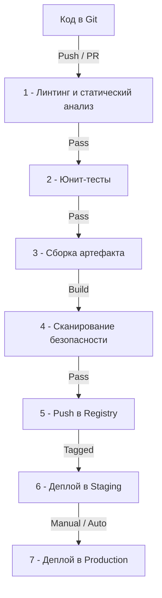

## Архитектура пайплайна и Go-специфика

В микро сервисной архитектуре CI/CD (Continuous Integration / Continuous Delivery) перестает быть просто инструментом автоматизации и становится центральным нервным узлом системы. Каждая служба должна собираться, тестироваться и развертываться изолированно, но при этом обеспечивать согласованность версий, безопасность и предсказуемость. Go предоставляет фундаментальные преимущества перед динамическими языками (Python, PHP) и JVM-экосистемой (Java, C#): статическая компиляция, отсутствие зависимости от рантайма на уровне хоста, встроенный модульный менеджер и невероятно быстрый `go test`. Однако эти же преимущества требуют осознанного подхода к кешированию, кросс-компиляции и управлению артефактами.

Типичный пайплайн для Go-микросервиса строится вокруг строгих стадий, которые должны выполняться детерминированно:



### Управление модулями и кеширование зависимостей
Go использует `go.mod` и `go.sum` для детерминированной сборки. В CI-среде критически важно правильно настроить кеширование, чтобы избежать сетевого OOM (Out of Memory) и долгих загрузок с `proxy.golang.org` или внутренних Artifactory/Nexus.

В отличие от `npm` или `pip`, где зависимости хранятся в локальных директориях, Go хранит их в глобальном кеше `$GOPATH/pkg/mod`. В контейнерных CI-раннерах (GitHub Actions, GitLab CI, Jenkins) этот кеш нужно монтировать или эмулировать.

```bash
# Пример настройки кеша в GitHub Actions
- name: Cache Go modules
  uses: actions/cache@v4
  with:
    path: ~/go/pkg/mod
    key: ${{ runner.os }}-go-${{ hashFiles('**/go.sum') }}
    restore-keys: |
      ${{ runner.os }}-go-
```

> [!info] Под капотом
> Когда `go mod download` извлекает пакет, он не просто копирует файлы. Go вычисляет хеш содержимого, проверяет `go.sum`, и если версия совпадает, создает жесткие ссылки (hardlinks) или использует `go work` для локального переиспользования. Это экономит сотни мегабайт диска на CI-раннерах. Однако при частых обновлениях зависимостей кеш должен инвалидироваться, иначе вы получите сборку со старыми, потенциально уязвимыми версиями.

### Линтинг и статический анализ
`golangci-lint` — стандарт де-факто. Он агрегирует десятки линтеров (`staticcheck`, `govet`, `govulncheck`, `misspell`, `errcheck`) и запускает их параллельно, используя все доступные ядра CPU раннера.

```yaml
# .golangci.yml
run:
  concurrency: 4
  timeout: 5m
linters:
  enable:
    - staticcheck
    - gosec
    - unconvert
    - unused
    - errcheck
    - bodyclose
    - noctx
    - govet
    - ineffassign
```

> [!warning] Ловушка / Gotcha
> Не отключайте `errcheck` и `govet` ради скорости сборки. `errcheck` ловит потерянные ошибки, а `govet` находит утечки ресурсов и некорректные синхронизации. В распределенных системах потеря `context.Context` или игнорирование ошибки отправки HTTP-запроса приводит к silent failures, которые в продакшене превращаются в распределенные даунтаймы.

## Оптимизация сборки и Docker-образы

Go компилируется в статический бинарный файл. Это радикально отличает его от Java (JAR + JRE) или Node.js (runtime + node_modules). В CI это означает, что мы можем использовать минимальные базовые образы, что сокращает время загрузки контейнера, уменьшает поверхность атаки и ускоряет pull/push операции в реестрах.

### Multistage-сборка и выбор базового образа
Классический подход с `golang:1.22-alpine` устарел для продакшена. Alpine использует `musl libc`, а Go по умолчанию компилируется с `glibc`. При сборке под Alpine нужно явно устанавливать `CGO_ENABLED=0` и `CC=musl-gcc`, иначе бинарник упадет с `segmentation fault` при запуске.

Современный стандарт: `distroless` или `scratch`.

```dockerfile
# 1. Сборка
FROM golang:1.22-alpine AS builder
WORKDIR /app
COPY go.mod go.sum ./
RUN go mod download
COPY . .
# CGO_ENABLED=0 гарантирует статическую линковку и отсутствие зависимостей от libc
RUN CGO_ENABLED=0 GOOS=linux GOARCH=amd64 go build -ldflags="-s -w" -o /server ./cmd/api

# 2. Рендеринг (Production)
FROM gcr.io/distroless/static-debian12:nonroot
WORKDIR /
COPY --from=builder /server /server
USER nonroot:nonroot
ENTRYPOINT ["/server"]
```

> [!tip] Собеседование
> **Вопрос:** Почему образ на основе `scratch` или `distroless` быстрее стартует, чем `ubuntu` или `alpine`?
> **Ответ:** `scratch` — это пустой образ. При запуске контейнера Docker не выполняет инициализацию glibc, не загружает динамический загрузчик `ld.so`, не создает `/dev` или `/proc` (если не смонтированы явно). Процесс Go стартует сразу с `execve`, минуя сотни системных вызовов инициализации окружения. Это сокращает cold start latency на 30-50% по сравнению с традиционными дистрибутивами.

### Кросс-компиляция и атомарность артефактов
В распределенных системах часто требуется поддержка нескольких архитектур (`amd64`, `arm64`). `goreleaser` или `make` скрипты должны генерировать артефакты для каждой платформы изолированно. Важно не смешивать бинарники разных архитектур в одном образе, так как это нарушает слой кеширования Docker и увеличивает размер.

```bash
# Пример кросс-компиляции через make
build:
	@for os in linux darwin windows; do \
		for arch in amd64 arm64; do \
			GOOS=$$os GOARCH=$$arch CGO_ENABLED=0 go build -ldflags="-s -w" -o dist/server-$$os-$$arch ./cmd/api; \
		done; \
	done
```

## Стратегии деплоя и надежность

В Kubernetes деплой Go-микросервисов требует интеграции с механизмами graceful shutdown и health checks. Go 1.21+ предоставляет встроенный `http.Server.Shutdown()` и `context.Context`, которые позволяют корректно завершать обработку запросов без обрыва соединений.

### Health Checks и Rolling Updates
Kubernetes использует `liveness` и `readiness` probes. Для Go критически важно, чтобы `readiness` probe проверял не просто факт прослушивания порта, а состояние внутренних зависимостей (базы данных, брокеров, кеша).

```go
func setupHealthCheck(server *http.Server) {
    mux := http.NewServeMux()
    mux.HandleFunc("/healthz", func(w http.ResponseWriter, r *http.Request) {
        // Проверяем состояние пула коннектов к БД и кеша
        if !dbPool.Ping() || cache.IsDisconnected() {
            w.WriteHeader(http.StatusServiceUnavailable)
            return
        }
        w.WriteHeader(http.StatusOK)
    })
    // ...
}
```

> [!warning] Ловушка / Gotcha
> Не используйте `/healthz` только для проверки доступности самого процесса. Если Go-сервер жив, но не может подключиться к PostgreSQL, Kubernetes продолжит отправлять трафик на этот под. Это создаст "черные дыры" в метриках и ошибки 500 для клиентов. Всегда проверяйте состояние внешних зависимостей в readiness probe.

### Blue/Green и Canary деплои
Для микросервисов с высокой нагрузкой `Rolling Update` может вызывать кратковременные пики ошибок из-за рассинхронизации версий API. В таких случаях применяются:
- **Blue/Green:** Два идентичных окружения. Трафик переключается через Ingress/Service мгновенно.
- **Canary:** Частью трафика (1-5%) отправляется новая версия. Мониторинг ошибок (Sentry, Prometheus) определяет, стабилизировалась ли система, прежде чем масштабировать на 100%.

В Go это реализуется через динамическую конфигурацию или feature flags, а не через пересборку бинарника в рантайме.

## Безопасность и Supply Chain

Микросервисы умножают поверхность атаки. CI/CD должен включать сканирование не только кода, но и зависимостей и образов.

### SBOM и сканирование уязвимостей
`syft` генерирует SBOM (Software Bill of Materials), описывающий все пакеты в образе. `trivy` или `grype` ищут CVE в этих пакетах. `gosec` находит уязвимости на уровне Go-кода (например, `fmt.Printf` с неочищенным вводом, использование `md5` вместо `sha256`).

```bash
# Сканирование образа перед пушем
trivy image --severity HIGH,CRITICAL my-service:latest
syft my-service:latest -o json > sbom.json
```

> [!info] Под капотом
> Когда `trivy` сканирует образ, он распаковывает слои Docker и проверяет файлы `go.sum` и `go.mod` внутри. Go использует хеши SHA256 для верификации модулей. Если злоумышленник скомпрометировал `proxy.golang.org` или подменил хеш, `go` откажется собирать проект. Однако в CI важно проверять и транзитивные зависимости (например, `golang.org/x/net`), так как они часто содержат уязвимости.

### Управление секретами
Никогда не храните пароли от БД, API-ключи или JWT-секреты в `go:embed` или env-переменных образа. Используйте:
- **Kubernetes Secrets** (зашифрованные в etcd)
- **External Secrets Operator** (синхронизация с AWS Secrets Manager, HashiCorp Vault)
- **Sealed Secrets** (шифрование в Git)

В рантайме Go должен считывать секреты через `os.Getenv()` или через `vault-agent` sidecar, с обязательной обработкой ошибок при отсутствии ключа.

## Ловушки и вопросы на собеседованиях

> [!tip] Собеседование
> **Вопрос:** Как оптимизировать CI/CD пайплайн, который начинает тормозить при росте кодовой базы?
> **Ответ:** 
> 1. **Параллелизация:** `golangci-lint` и `go test -p=4` (или `-p=8`) используют несколько ядер. Разбейте тесты на подпакеты.
> 2. **Инкрементальная сборка:** Кэшируйте `go/pkg/mod` и `~/.cache/go-build`. Используйте `go build -a=false` (по умолчанию).
> 3. **Docker layer caching:** `COPY go.mod go.sum ./` перед `COPY . .` гарантирует, что слои сборки не инвалидируются при изменении исходников.
> 4. **Устранение flaky тестов:** Интеграционные тесты должны использовать `testcontainers-go` с изолированными контейнерами и случайными портами. Не полагайтесь на глобальное состояние или фиксированные порты.
> 5. **Анализ метрик:** Используйте `go test -count=1 -benchmem` и `pprof` для выявления утечек памяти в тестах.

> [!warning] Ловушка / Gotcha
> **Dependency Confusion Attack:** Если в CI указан внутренний репозиторий (например, `gitlab.com/internal/pkg`) с приоритетом выше `proxy.golang.org`, злоумышленник может создать публичный пакет с таким же именем и заставить CI скачать вредоносную зависимость. Всегда настраивайте `GOPRIVATE` и используйте `go mod vendor` или `gitsign` для верификации.

## Итог

1. CI/CD для Go-микросервисов строится на статической компиляции, кросс-архитектурной сборке и минимальных дистрибутивах (`scratch`/`distroless`).
2. Правильное кеширование `go mod` и `go build` сокращает время сборки с минут до секунд.
3. `golangci-lint` и `gosec` должны быть обязательными стадиями, а не опциональными.
4. Health checks должны проверять состояние внешних зависимостей, а не только процесс.
5. Безопасность требует SBOM, сканирования образов и централизованного управления секретами (Vault/K8s Secrets).
6. Оптимизация пайплайна — это параллелизация, инкрементальная сборка и борьба с flaky-тестами через изоляцию окружений.

Мы завершили разбор автоматизации, сборки и деплоя Go-микросервисов. Пайплайн готов, образы собраны, артефакты проверены. Но как отследить, что происходит внутри этих сервисов в распределенной среде? Как агрегировать логи из десятков подов, найти trace по Correlation ID и отфильтровать шум? В следующей статье мы разберем: [[5. Логирование в распределенных системах]], чтобы построить наблюдаемую и отлаживаемую архитектуру.