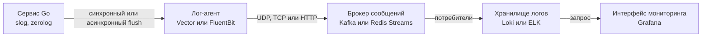

## Введение: Почему логирование в распределенных системах — это отдельная инженерная дисциплина

В монолите логирование решается тривиально: `fmt.Println` в файл, ротация через `logrotate`, поиск через `grep`. В распределенной системе эта парадигма рушится. Микросервисы развернуты в контейнерах, которые уничтожаются и пересоздаются по таймеру или при сбое. Горизонтальное масштабирование означает, что один запрос проходит через 5-10 сервисов, каждый из которых живет на своей машине. Сетевые задержки, частичные отказы и динамическое выделение ресурсов делают классический подход `cat app.log` неэффективным.

Логирование в распределенных системах превращается из простого вывода текста в **инженерный конвейер сбора, агрегации и корреляции событий**. Задача разработчика на Go — не просто писать логи, а обеспечить их структурность, минимальный overhead на генерацию, корректную передачу контекста через сетевой стек и безопасную асинхронную доставку в централизованную систему.

## Фундаментальные принципы

### Структурированное логирование
Текстовые логи (`"User 123 logged in"`) не поддаются машинной обработке. В Go мы обязаны использовать структурированные логи (JSON, MsgPack, UBJSON). Это позволяет парсерам на стороне сбора выделять поля `level`, `trace_id`, `duration`, `status` без регулярных выражений.

> [!info] Под капотом
> Структурирование требует аллокации `map[string]any` или создания `[]byte` с ключами. В Go 1.21+ пакет `slog` использует `encoding/json` с `Marshaler` интерфейсами, что добавляет накладные расходы. Для hot-pathей (внутренние циклы, high-frequency API) выбирают `zerolog` или `zap` с `sync.Pool`, где байтовый буфер переиспользуется, а GC pause минимизируется за счет отсутствия промежуточных мап.

### Correlation ID и контекст
Каждый входящий запрос должен получить уникальный идентификатор (`trace_id` или `request_id`). Он должен прокидываться через все слои: HTTP/gRPC заголовки, БД (как колонка), брокеры сообщений, внутренние вызовы. В Go это реализуется через `context.Context`.

> [!warning] Ловушка / Gotcha
> `context.Context` — это immutable цепочка. Каждый `context.WithValue` создает новый объект. Если вы делаете это в цикле или на hot-path, вы генерируете garbage в пропорции `O(n)` к количеству вызовов. В Go 1.21+ `slog` автоматически вычитывает значение `slog.Default().With("trace_id", id)` из контекста, но кастомные хендлеры могут забыть это сделать, что приведет к потере корреляции в продакшене.

### Уровни логирования и семплирование
В высоконагруженных системах полный лог каждого запроса убивает I/O и стоимость хранения. Применяется динамическое семплирование:
- `DEBUG` / `TRACE`: 1% запросов или только при `duration > threshold`.
- `INFO`: 100% ошибок, бизнес-событий, медленных запросов.
- `WARN` / `ERROR`: 100% без семплирования.

## Под капотом: Как Go обрабатывает логи

### Lock-free логирование и атомарные операции
Классические библиотеки логирования используют `sync.Mutex` для защиты глобального буфера. В конкурентном Go-сервере это создает contention на уровне кэш-линий CPU (cache line bouncing). Современные рантаймы и `slog` используют `atomic` операции и `unsafe.Pointer` для lock-free push в буфер:

```go
// Упрощенная логика lock-free буфера в slog
func (h *handler) Enabled(ctx context.Context, level Level) bool {
    // atomic.LoadInt32(&h.minLevel) — проверка без мьютекса
    // Кэш-линия L1 не инвалидируется, пока другие горуны только читают
    return atomic.LoadInt32(&h.minLevel) <= int32(level)
}
```

### Борьба с GC: sync.Pool и аллокации
Каждый вызов `log.Info("msg", "key", val)` в `slog` создает `map[string]any`. При 10k RPS это 10k аллокаций в секунду на один инстанс. Go GC (марковская сборка с барьером записи) начнет работать чаще, повышая `P99 latency`.

**Решение:** Переиспользование `[]byte` через `sync.Pool`. Библиотеки вроде `zerolog` выделяют один буфер на `runtime.NumCPU()` горутин. Запись в буфер — это просто `unsafe.Add(ptr, offset)`, что эквивалентно указательной арифметике в C. GC видит 0 аллокаций на hot-path.

> [!tip] Собеседование
> **Вопрос:** Как вы измеряете overhead логирования на production?
> **Ответ:** Используем `pprof` с `alloc_space` и `trace`. Смотрим на `runtime.mallocs` и `gc cpu fraction`. Если `gc cpu fraction` > 15% на сервисе с тяжелым логированием, переводим на `zerolog` или `zap` с кастомным `sync.Pool`. Также проверяем `sync.Pool` hit/miss ratio через `pprof.Lookup("sync.Pool").WriteTo`.

### Синхронное vs Асинхронное логирование: syscall write
Запись на диск — это дорогой syscall. Даже с `O_SYNC` или `O_DSYNC` ядро блокирует поток до подтверждения записи в кэш диска (writeback). В Go это означает блокировку `M` (системного треда) и, как следствие, паузу планировщика.

**Архитектурное решение:** Асинхронный flush. Горутина читает из буфера (chan или lock-free queue) и делает `batch write` каждые 50-100мс или при заполнении буфера. Это превращает тысячи мелких syscall в десятки крупных `writev()`, экономя такты CPU и увеличивая пропускную способность диска.

## Архитектура сбора и агрегации логов

В распределенной системе Go-приложение не пишет логи напрямую в ELK/Loki. Это нарушает принцип single responsibility и создает сетевой overhead. Используется паттерн **Log Shipper**:



1. **Лог-агенты (Vector, Fluent Bit, Filebeat):** Пишутся на Rust/C. Они мониторят файловые дескрипторы (`inotify`/`kqueue`), читают логи асинхронно, батчат их и отправляют с гарантией доставки (at-least-once). Это снимает I/O нагрузку с Go-процесса.
2. **Протоколы передачи:** Для логов предпочтителен `UDP` (без гарантий, но max throughput) или `HTTP/2` с `gRPC` (доставляемость, сжатие). В Go `net/http` с `h2` и `http2.Transport` автоматически использует заголовочное сжатие, что экономит ~40% трафика.
3. **Хранение:** `Loki` использует индексацию только по лейблам, а не по содержимому. Это делает его дешевым и быстрым для Go-бэкенда. `ELK` (Elasticsearch) индексирует каждое слово, что дает мощный поиск, но убивает disk I/O и CPU.

## Идиоматичная реализация в Go

### Пропускация контекста и Trace ID
Корреляция должна быть сквозной. Используем middleware для HTTP и gRPC.

```go
// middleware.go
func WithTraceID(next http.Handler) http.Handler {
    return http.HandlerFunc(func(w http.ResponseWriter, r *http.Request) {
        // Извлекаем или генерируем trace_id
        id := r.Header.Get("X-Trace-Id")
        if id == "" {
            id = uuid.New().String()
        }
        
        // Контекст передается в slog автоматически через slog.Default().With
        ctx := context.WithValue(r.Context(), traceIDKey{}, id)
        
        // Передаем в next handler
        next.ServeHTTP(w, r.WithContext(ctx))
    })
}
```

### Кастомный Handler для `slog`
Если стандартный `slog` не покрывает нужное форматирование или требует специфичного batch-записи:

```go
// logger.go
type AsyncHandler struct {
    logCh chan []byte
    done  chan struct{}
}

func NewAsyncHandler(ctx context.Context) *AsyncHandler {
    h := &AsyncHandler{
        logCh: make(chan []byte, 1024), // Буфер для burst-нагрузок
        done:  make(chan struct{}),
    }
    // Фоновая горуна flush-ит логи батчами
    go func() {
        ticker := time.NewTicker(100 * time.Millisecond)
        defer ticker.Stop()
        for {
            select {
            case <-ctx.Done():
                close(h.done)
                return
            case <-ticker.C:
                flushBatch(h.logCh) // Вызов syscall writev()
            }
        }
    }()
    return h
}

func (h *AsyncHandler) Enabled(context.Context, slog.Level) bool { return true }

func (h *AsyncHandler) Handle(ctx context.Context, r slog.Record) error {
    // Marshal в JSON/MsgPack
    b, _ := json.Marshal(r)
    select {
    case h.logCh <- b:
        return nil
    default:
        // Критический случай: буфер полон. Не блокируем горутину!
        // Логгируем в fallback или игнорируем (drop)
        return nil
    }
}
```

> [!warning] Ловушка / Gotcha
> Если буфер `logCh` переполнится, `select` с `default` пропустит лог. В продакшене это допустимо для `DEBUG`, но для `ERROR` нужно либо увеличивать буфер, либо использовать `sync.Cond` с блокировкой (что вернет нас к contention). Правильный подход: использовать `Vector` или `FluentBit` как независимый процесс, который сам управляет буферизацией на уровне ОС.

## Ловушки, производительность и вопросы на собеседованиях

### Log flooding и retry storms
Если сервис падает по таймауту и начинает бесконечно логировать `ERROR: connection refused`, вы получите:
1. **Log storm**: миллионы записей в секунду.
2. **Disk exhaustion**: контейнер падает по `ENOSPC`.
3. **Network saturation**: лог-агент не успевает отправлять.

**Решение:** Rate limiting на уровне логгера. В `slog` это реализуется через кастомный `Handler` с `atomic` счетчиком для каждого `key-value` паттерна. Если счетчик > 10 за 1 сек, логируем `WARN: rate limit exceeded, dropping DEBUG`.

### Контекст и таймауты
Частая ошибка: передача `context.Background()` в асинхронные горуны, которые пишут логи. Если основной запрос завершается, а горуна продолжает работать, она может использовать `nil` контекст или утонуть в `panic`. Всегда передавайте `ctx` в `slog.WithContext(ctx)`.

### Типичные вопросы Senior/Lead Go Engineer
1. **Как вы измеряете и оптимизируете overhead логирования?**
   *Ответ:* `pprof -mem` для `alloc_space`, `runtime.MemStats.PauseTotalNs`, `go tool trace` для анализа GC и scheduler. Оптимизация: переход на `zerolog` с `sync.Pool`, отключение `DEBUG` в prod, batch flush через `Vector`.
2. **Как гарантировать, что Trace ID не потеряется при вызове gRPC?**
   *Ответ:* Используем `grpc.SendHeader` и `grpc.SetTrailer` с `metadata.Pairs("x-trace-id", id)`. На стороне клиента извлекаем через `grpc.Header()`. Важно: заголовки gRPC имеют лимит 8KB (HTTP/2 HEADERS frame). Если логи или метаданные огромные, нужно использовать `grpc.SetCompressor` или выносить тяжелые данные в тело запроса.
3. **Почему `slog` медленнее `zap` на hot-path?**
   *Ответ:* `slog` создает `map[string]any` и использует `encoding/json` с рефлексией на каждом вызове. `zap` использует `reflect` только при инициализации, а на hot-path работает с `[]byte` и `unsafe.Pointer`. Для инфраструктурных компонентов (API gateway, message processor) `zap`/`zerolog` предпочтительнее. Для бизнес-логики `slog` достаточен и проще в поддержке.
4. **Как реализовать graceful shutdown при активном логировании?**
   *Ответ:* В `defer` или `context.Done()` закрываем канал `logCh`, ждем `wg.Wait()` для фоновой flush-горутины, закрываем файловые дескрипторы. Не блокируем основной `main()` на запись логов — это нарушит SLA graceful shutdown (обычно 5-10 сек).

## Итог

Логирование в распределенных Go-системах — это баланс между наблюдаемостью и производительностью. 
1. **Структурируйте** логи с самого дня 0.
2. **Пропускайте** `trace_id` через `context.Context` и сетевые заголовки.
3. **Минимизируйте GC** через `sync.Pool` и lock-free буферы.
4. **Выносите I/O** на уровень агентов (`Vector`/`FluentBit`), чтобы Go-процесс фокусировался на бизнес-логике.
5. **Защищайтесь** от log flooding через rate limiting и семплирование.