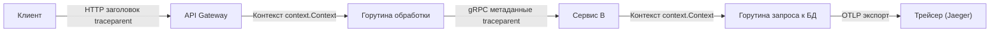
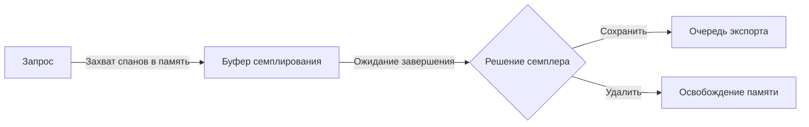

## Введение: От логов к трассировке

В монолитной архитектуре отладка ограничивалась стеком вызовов внутри одного процесса. В распределенных системах запрос проходит через десятки сервисов, каждый из которых может работать на разных фреймворках, версиях и даже языках. Логи (`[[Логирование в распределенных системах]]`) дают точечные срезы событий, метрики (`[[Метрики и мониторинг]]`) агрегируют статистику, но ни один из этих инструментов не отвечает на вопрос: **как прошел конкретный запрос от клиента до базы данных и обратно?**

Дистрибьютид трейсинг (Distributed Tracing) решает эту проблему, связывая все операции в единую цепочку через уникальный идентификатор. В экосистеме Go стандартом де-факто стал OpenTelemetry (OTel), который заменяет устаревшие `Zipkin` и `Jaeger` SDK.

> [!info] Под капотом
> Трейсинг не является магической функцией рантайма Go. Это пользовательская надстройка, которая:
> 1. Генерирует и транслирует идентификаторы (TraceID/SpanID) через `context.Context`.
> 2. Аллоцирует структуры спанов в куче.
> 3. Отправляет данные в бэкенд через сетевые `syscalls` (gRPC/HTTP).
> Понимание этих этапов критично для предотвращения утечек памяти и блокировок в высоконагруженных системах.

## Фундаментальные концепции: Trace, Span, Context

Каждый запрос в распределенной системе представляется как **Trace** (трассировка). Внутри трассы выполняются атомарные операции, называемые **Spans** (спаны). Связь между спанами осуществляется через **Context** (контекст).

### Идентификация и формат заголовков
Современный стандарт передачи контекста в сети — W3C Trace Context. Он определяет два ключевых поля:
- `traceparent`: `version-traceid-spanid-traceflags`
- `traceid`: 16-байтный UUID (128 бит), уникальный для всей цепочки.
- `spanid`: 8-байтный идентификатор текущего спана.

В Go передача контекста происходит нативно через пакет `context`. При создании нового спана OTel автоматически извлекает `traceparent` из входящего HTTP/gRPC заголовка, создает новый `spanid` и сохраняет пару в `context.Context`. При выходе запроса в сеть заголовок извлекается из контекста и добавляется в исходящий запрос.



## OpenTelemetry в Go: Архитектура SDK

Пакет `go.opentelemetry.io/otel` построен вокруг трех базовых компонентов:
1. **TracerProvider**: Менеджер жизненного цикла трассировщиков. Создает и кэширует `Tracer` по имени и версии.
2. **Tracer**: Фабрика спанов. Не хранит состояние, поэтому потокобезопасна.
3. **Span**: Представляет отдельную операцию. Имеет методы `AddEvent`, `SetStatus`, `End()`.

### Ручная и автоматическая инструментация
- **Автоматическая**: `otelhttp` и `otelgrpc` перехватывают создание HTTP/gRPC клиентов и серверов. Они извлекают контекст, создают спаны, записывают статусы и ошибки, автоматически завершая спан при возврате из middleware.
- **Ручная**: Используется для бизнес-логики, длительных фоновых задач или кастомных протоколов. Требует явного вызова `tracer.Start(ctx, "operation")` и `span.End()`.

> [!warning] Ловушка / Gotcha
> Автоматическая инструментация не покрывает внутренние вызовы между пакетами внутри одного сервиса. Если вы вызываете `service.Do()` из `handler.Do()`, OTel не создаст для этого спан автоматически. Это приведет к разрыву трассировки внутри одного микросервиса. Всегда используйте ручное создание спанов для бизнес-уровня.

## Под капотом: Производительность и аллокации

Каждый спан в OTel SDK — это структура `Span`. При ее создании выделяется память в куче. В высоконагруженном Go-приложении, обрабатывающем 100k RPS, создание спанов может стать узким местом из-за давления на Garbage Collector.

### Механизмы оптимизации в OTel
1. **`sync.Pool`**: OTel активно использует пулы объектов для временных структур (например, для буферизации атрибутов спана перед экспортом). Это снижает частоту аллокаций и нагрузку на GC.
2. **Non-blocking экспорт**: Экспортеры (например, `otlphttp` или `otlpgrpc`) не блокируют горутины пользователей. Данные помещаются в буферизированный канал (`exporter.exportSpans`), а фоновая горутина (`exporter.Start()`) асинхронно отправляет батчи.
3. **Контекст как дерево**: `context.Context` в Go реализован как связное дерево (или слайс в новых версиях `context2` концепции). Обход дерева для извлечения `traceparent` занимает `O(log n)` или `O(1)` в зависимости от реализации, но каждый `WithValue` создает новый объект контекста. Это безоперационно для GC, но увеличивает footprint памяти.

```go
// Пример безопасного создания спана с отложенным завершением
func HandleRequest(ctx context.Context) error {
    // 1. Извлекаем провайдер и создаем трассировщик
    tracer := otel.Tracer("github.com/app/service")
    
    // 2. Создаем спан с явным указанием контекста
    ctx, span := tracer.Start(ctx, "process_order",
        trace.WithAttributes(semconv.DBSystemKey.String("postgres")),
    )
    defer span.End() // Критично! Иначе трассировка "зависнет"

    // 3. Передаем контекст в базу данных
    err := db.Query(ctx, "SELECT * FROM orders")
    if err != nil {
        span.RecordError(err)
        span.SetStatus(codes.Error, "DB query failed")
        return err
    }
    
    span.AddEvent("order_processed", trace.WithAttributes(semconv.DBRowsKey.Int(1)))
    return nil
}
```

### Влияние на Garbage Collector
OTel SDK по умолчанию создает новые слайсы атрибутов для каждого спана. При большом количестве атрибутов это приводит к "мусору" в Gen0/Gen1. Для снижения давления на GC:
- Используйте `semconv` (semantic conventions) для предсозданных атрибутов.
- Избегайте создания сложных структур в `trace.WithAttributes(...)`.
- В Go 1.21+ можно использовать `otel.SetTracerProvider` с кастомным `SpanExporter`, который использует `sync.Pool` для буферов.

## Стратегии семплирования и экспорт

Семплирование (Sampling) определяет, какая часть запросов сохраняется полностью. Без него стоимость хранения трейсов превысит стоимость самого приложения.

### Head-based vs Tail-based
- **Head-based**: Решение принимается ДО обработки. OTel SDK поддерживает `trace.AlwaysOn()`, `trace.AlwaysOff()`, `trace.ParentBased()`, `trace.TraceIDRatioBased()`. Быстро, но может пропустить редкие ошибки.
- **Tail-based**: Решение принимается ПОСЛЕ завершения спана. Все спаны буферизуются в памяти, затем на основе метаданных (статус, длительность, атрибуты) принимается решение об экспорте. Реализуется через `otlptail` или внешние прокси (например, `siglens`/`jaeger-tail-sampler`). Позволяет сохранять 100% ошибок и 100% медленных запросов, отбрасывая нормальные.



### Экспорт в бэкенд
OTel поддерживает протокол OTLP (OpenTelemetry Protocol) через gRPC или HTTP. В Go `otlpgrpc` устанавливает пул HTTP/2 соединений. При падении сети OTLP экспортер использует экспоненциальный бэкофф (`backoff.NewExponentialBackOff()`) для повторных попыток. **Критично**: экспортер должен корректно останавливаться через `Shutdown()`, иначе часть спанов уйдет в "никуда".

## Интеграция и лучшие практики

### Контекст и отмена
В Go `context.Context` передается по ссылке. Если горутина, создавшая спан, отменит контекст (например, таймаут клиента), спан должен быть помечен как `Canceled` или `DeadlineExceeded`. OTel SDK автоматически записывает статус при вызове `span.End()`, если контекст отменен.

### Graceful Shutdown
При остановке сервиса необходимо:
1. Остановить прием новых запросов (`http.Server.Shutdown()`).
2. Дождаться завершения активных горутин.
3. Вызвать `tracerProvider.Shutdown(ctx)`. OTel экспортирует оставшиеся батчи перед завершением.

### Корреляция с логами и метриками
Трейсинг не работает изолированно. Для полной наблюдаемости (`[[Observability (Мониторинг и наблюдаемость)]]`) необходимо:
- Записывать `traceID` и `spanID` в логи.
- Использовать `otelmetric` для сбора метрик (latency, error rate, active spans).
- Настроить `[[Service discovery]]` и `[[Circuit breaker]]` для автоматического восстановления.

## Ловушки и вопросы на собеседованиях

> [!tip] Собеседование
> **Вопрос:** Почему создание спана в Go может быть медленнее, чем в Java Spring?
> **Ответ:** В Java Spring Instrumentation часто использует агенты на основе ByteBuddy, которые модифицируют байткод на лету. В Go OTel SDK работает на уровне API и не может модифицировать чужой байткод. Поэтому в Go требуется явная или middleware-инструментация. Это увеличивает строчный код, но дает полный контроль над аллокациями и GC.

> [!warning] Ловушка / Gotcha
> **Блокирующий экспорт:** Если экспортер OTLP не справляется с нагрузкой или сеть недоступна, внутренний буфер канала может переполниться. По умолчанию OTel SDK блокирует вызывающую горутину при переполнении буфера. Это убьет производительность. Всегда настраивайте `WithBufferedExportOptions(otlptrace.WithMaxExportBatchSize(), ...)` и используйте `otlpgrpc.WithRetry()` с лимитами.

> [!tip] Собеседование
> **Вопрос:** Как отличить `traceID` от `spanID` на уровне байтов?
> **Ответ:** `traceID` — 16 байт (128 бит), `spanID` — 8 байт (64 бит). В заголовке W3C они идут как hex-строки: `traceid` (32 символа), `spanid` (16 символов). При парсинге в Go используйте `hex.DecodeString` или `encoding/hex`. Ошибка в размере приведет к десериализации контекста и потере трассировки.

> [!tip] Собеседование
> **Вопрос:** Как отловить "разрыв" трассировки?
> **Ответ:** Разрыв возникает, если:
> 1. Заголовок `traceparent` не передан в следующий сервис.
> 2. Контекст не передан в новую горутину (`go func(ctx context.Context)`).
> 3. Экспортер упал и не записал спан.
> Для отлова используйте `trace.SpanFromContext(ctx).SpanContext().IsValid()` и логи с `traceID`.

## Итог

Дистрибьютид трейсинг в Go строится на трех китах: `context.Context` для передачи состояния, `otel.Tracer` для создания иерархии спанов, и `OTLP` для асинхронного экспорта. Ключ к производительности — минимизация аллокаций через `sync.Pool`, корректное управление семплированием и гарантированный `Shutdown` экспортера. В связке с `[[Логирование в распределенных системах]]` и `[[Circuit breaker]]` это формирует основу наблюдаемости высоконагруженных систем.

В следующем разделе мы разберем, как связать трейсы с логами на уровне идентификаторов, чтобы избежать хаоса при отладке: [[7. Correlation ID]].