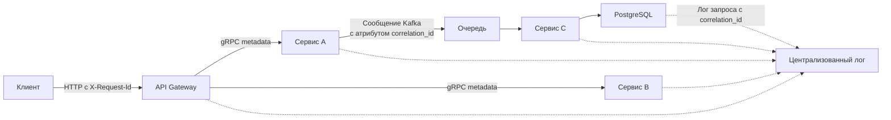

## Что такое Correlation ID и зачем он нужен

В монолите трассировка запроса тривиальна: один процесс, один лог-файл, стек вызовов восстанавливается глазами. В распределённой системе запрос проходит через десятки микросервисов, очередей и баз данных. Без единого идентификатора сквозного прохождения запроса отладка превращается в кошмар: логи разных сервисов невозможно связать, аномалии в p99 задержки не привязаны к конкретному пользователю, а инциденты длятся часами, пока инженеры сопоставляют таймстемпы.

**Correlation ID** (иногда Request ID, Trace ID, X-Request-Id) — это уникальный идентификатор, присваиваемый каждому входящему запросу на границе системы и передаваемый через все внутренние вызовы. Он действует как «паспорт» запроса, позволяя связать записи в логах, метриках и трейсах, полученные в разных сервисах, в единый причинно-следственный граф.

Для Go-разработчика Correlation ID — это не просто строчка в заголовке, а архитектурная нить, прошивающая [[3. context и его использование]], [[1. Logging и observability]] и [[2. OpenTelemetry tracing]]. Правильная реализация уменьшает MTTR (Mean Time To Recovery) и повышает наблюдаемость системы до уровня, требуемого для Senior/Lead позиции.



## Генерация Correlation ID

Идентификатор должен быть уникальным глобально во времени и пространстве, чтобы избежать коллизий даже при миллионах запросов в секунду. Стандарт индустрии — UUID v4 (случайный) или UUID v7 (временной порядок). 

```go
import "github.com/google/uuid"

func NewCorrelationID() string {
    return uuid.New().String()
}
```

Генерация через `uuid.New()` аллоцирует память (порядка 36 байт на строку плюс внутренние структуры). В высоконагруженных системах, где Correlation ID генерируется для каждого запроса, можно использовать альтернативные библиотеки с пулами буферов или генерировать ID на основе `crypto/rand` напрямую, кодируя в base64.

На границе системы (API Gateway, load balancer) Correlation ID может быть взят из входящего заголовка, если клиент его прислал, либо сгенерирован заново. Важно **доверять** или **не доверять** внешнему ID: если вы принимаете ID от клиента без проверки, злоумышленник может подделать ID и усложнить разбор инцидентов. Обычно внешний ID логируется отдельно, а внутренний всегда генерируется системой.

## Передача Correlation ID между сервисами

### HTTP

Стандартный заголовок — `X-Request-Id` или `X-Correlation-Id`. В Go его извлекают из `http.Request.Header`:

```go
func extractOrCreateCorrelationID(r *http.Request) string {
    if id := r.Header.Get("X-Request-Id"); id != "" {
        return id
    }
    return uuid.New().String()
}
```

При вызове downstream-сервисов ID пробрасывается в заголовках HTTP-клиентом:

```go
req, _ := http.NewRequestWithContext(ctx, "GET", url, nil)
req.Header.Set("X-Request-Id", correlationID)
```

### gRPC

В gRPC аналогом заголовков является **metadata**. Correlation ID передаётся через метаданные:

```go
// Отправка
md := metadata.Pairs("x-correlation-id", correlationID)
ctx = metadata.NewOutgoingContext(ctx, md)
// Вызов
resp, err := client.SomeMethod(ctx, req)

// Приём
func extractFromIncoming(ctx context.Context) string {
    md, ok := metadata.FromIncomingContext(ctx)
    if !ok {
        return uuid.New().String()
    }
    vals := md.Get("x-correlation-id")
    if len(vals) == 0 {
        return uuid.New().String()
    }
    return vals[0]
}
```

### Очереди сообщений (Kafka, RabbitMQ, NATS)

В асинхронных системах Correlation ID помещается в заголовки (headers) или атрибуты сообщения. Для Kafka — в `RecordHeader`, для RabbitMQ — в `AMQP.BasicProperties.CorrelationId`, для NATS — в `Header`. При получении сообщения ID извлекается и помещается в контекст обработчика.

```go
// Kafka producer
headers := []kafka.Header{{Key: "correlation_id", Value: []byte(correlationID)}}
producer.Produce(&kafka.Message{
    Headers: headers,
    ...
}, nil)
```

## Хранение в context.Context

Correlation ID должен быть доступен во всём стеке вызова: в обработчиках HTTP/gRPC, бизнес-логике, вызовах базы данных, логировании. Естественный контейнер — `context.Context` ([[3. context и его использование]]). ID помещается в контекст через middleware.

```go
type contextKey string
const correlationIDKey contextKey = "correlationID"

// Middleware для HTTP
func CorrelationIDMiddleware(next http.Handler) http.Handler {
    return http.HandlerFunc(func(w http.ResponseWriter, r *http.Request) {
        id := extractOrCreateCorrelationID(r)
        ctx := context.WithValue(r.Context(), correlationIDKey, id)
        w.Header().Set("X-Request-Id", id) // пробрасываем клиенту
        next.ServeHTTP(w, r.WithContext(ctx))
    })
}

// Извлечение
func GetCorrelationID(ctx context.Context) string {
    if id, ok := ctx.Value(correlationIDKey).(string); ok {
        return id
    }
    return "unknown"
}
```

Стоимость `context.WithValue` — создание нового узла в цепочке контекстов (аллокация `context.valueCtx`, ~80-100 байт). Поиск по цепочке при каждом извлечении — O(N), но на практике глубина контекстов невелика (2-3), поэтому оверхед минимален.

## Логирование с Correlation ID

Каждая запись лога должна автоматически включать Correlation ID, избавляя разработчика от ручной вставки. В Go это достигается через кастомный логгер, читающий ID из контекста.

Пример с `slog` (Go 1.21+):

```go
func LoggerWithCorrelationID(ctx context.Context, base *slog.Logger) *slog.Logger {
    return base.With("correlation_id", GetCorrelationID(ctx))
}

// В обработчике:
logger := LoggerWithCorrelationID(ctx, slog.Default())
logger.Info("processing request", "user_id", 123)
```

Для высоконагруженных систем, где логгер создаётся на каждый запрос, аллокация нового `*slog.Logger` (через `With`) может быть избыточной. Альтернатива — хранить ID в `context` и извлекать его внутри кастомного `Handler`, который добавляет атрибут только при выводе.

См. также [[1. Logging и observability]].

## Связь с распределённой трассировкой (OpenTelemetry)

Correlation ID не заменяет трассировку, но является её предшественником и дополнением. Современные стандарты (W3C Trace Context) подразумевают два идентификатора: `trace-id` (сквозной для всей цепочки) и `span-id` (для каждого отдельного звена). Correlation ID можно использовать как `trace-id` или как дополнительный бизнес-идентификатор.

Если вы внедряете OpenTelemetry ([[2. OpenTelemetry tracing]]), ID автоматически распространяется через контекст. Но Correlation ID может остаться полезным как «публичный» идентификатор для клиента, в отличие от внутреннего trace-id.

## Ловушки и частые ошибки

> [!warning] Ловушка / Gotcha
> **Потеря ID при асинхронных вызовах.** Если горутина запускается с `go func()`, она не наследует контекст автоматически. Передавайте `context` явно, иначе логи останутся безымянными.

```go
// Плохо
go process(data)

// Хорошо
go process(ctx, data)
```

> [!warning] Ловушка / Gotcha
> **Перезапись ID на границах.** Если каждый сервис генерирует свой ID, сквозной tracing невозможен. ID должен создаваться только в точке входа во всю систему (API Gateway) или проверяться на наличие входящего.

> [!warning] Ловушка / Gotcha
> **Утечка ID во внешние ответы.** Не возвращайте клиенту внутренний Correlation ID без необходимости — это информация о внутренней инфраструктуре. Можно возвращать публичный Request ID, отдельный от внутреннего.

> [!warning] Ловушка / Gotcha
> **Использование `string` как ключа контекста.** Ключи контекста должны быть непрозрачными типами, чтобы избежать коллизий между пакетами. Используйте `type contextKey string` или интерфейсные ключи.

## Mechanical Sympathy: оверхед Correlation ID

С точки зрения производительности Correlation ID добавляет:
- **Аллокации при генерации UUID** (~36 байт строка + структура). Для 100k RPS это ~3.6 МБ/с аллокаций, заметно для GC. Можно использовать `uuid.New().String()` с пулом или более быстрые генераторы (xid, ulid).
- **Вставка в контекст** — одна аллокация `context.valueCtx`. Пренебрежимо.
- **Извлечение для каждого лога** — поиск по цепочке контекстов (несколько сравнений указателей), практически бесплатно.
- **Логирование** — добавление атрибута в лог может увеличить размер лог-сообщения и аллокации. Если логгер создаётся через `With` на каждый запрос, аллокации растут. Лучше внедрить ID на уровне `Handler` (slog) или использовать context-aware логгеры, как в zerolog.

## Собеседование

> [!tip] Собеседование
> **Вопрос:** Как вы обеспечите сквозное логирование запроса в микросервисной архитектуре на Go?
> **Ответ:** Присваиваю уникальный Correlation ID на границе системы (API Gateway), помещаю его в `context.Context` через middleware. Передаю ID в заголовках HTTP (`X-Request-Id`) или gRPC metadata. В логгере добавляю ID как поле, извлекая из контекста. Для асинхронных операций передаю ID в заголовках сообщений (Kafka, NATS). Использую OpenTelemetry для автоматического propagation.

> [!tip] Собеседование
> **Вопрос:** В чём разница между Correlation ID и Trace ID в OpenTelemetry?
> **Ответ:** Trace ID идентифицирует всю цепочку распределённого запроса и генерируется согласно стандарту W3C. Correlation ID может использоваться как упрощённый Trace ID или как бизнес-идентификатор, независимый от трассировки. Trace ID обычно не показывается клиенту, в отличие от Correlation ID.

## Итог

- Correlation ID — ключ к наблюдаемости распределённых систем, связывающий логи, метрики и трейсы.
- Генерируется на границе системы (UUID), передаётся через HTTP-заголовки, gRPC metadata, атрибуты сообщений.
- Хранится в `context.Context` и извлекается в middleware.
- Логгер автоматически подхватывает ID из контекста.
- Взаимодействует с распределённой трассировкой (OpenTelemetry), но может существовать независимо.
- Требует внимания к асинхронности, безопасности и производительности (аллокации при генерации и логировании).