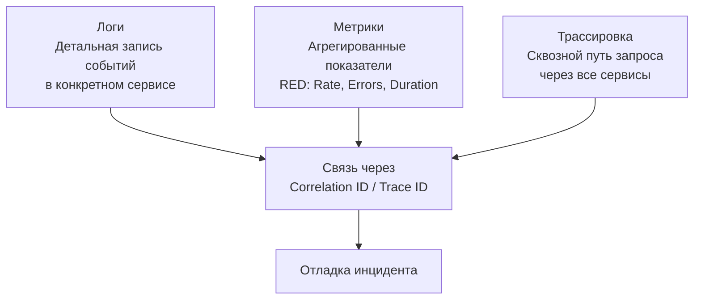

## Почему отладка распределённых систем — это навык уровня Senior

Микросервисы, очереди, асинхронные события, базы данных, кэши — распределённая система Go состоит из десятков, а то и сотен процессов, взаимодействующих через сеть. Когда в такой системе падает запрос, ответ приходит с задержкой в 10 секунд или возвращается 500-я ошибка, локализация причины превращается в детективное расследование, несопоставимое с отладкой монолита.

В монолите у вас есть один стек-трейс и один лог-файл. В микросервисах запрос пересекает границы процессов, сериализуется в сообщения очередей, теряется из-за повторных попыток и маскируется тайм-аутами. Без специально выстроенных практик отладка распределённого приложения сводится к гаданию по логам.

Эта статья — систематизация подходов, инструментов и ментальных моделей для отладки распределённых систем на Go. Мы соединим всё, что изучено в предыдущих практиках: [[7. Correlation ID]], [[1. Graceful Shutdown]], [[2. Rate Limiting]], [[3. Circuit Breaker]], [[4. Retries]], [[5. Idempotency]], [[6. Backpressure]]. И поднимемся на уровень выше, объединив наблюдаемость ([[1. Logging и observability]], [[2. OpenTelemetry tracing]]) с глубинными инструментами профилирования ([[1. pprof. Введение]], [[2. CPU profiling в Go]], [[5. pprof memory profile]]) и знанием рантайма ([[1. Scheduler Go. G M P модель]]).

## Фундаментальная сложность распределённой отладки

Ключевые источники сложности, отличающие распределённую отладку от локальной:

1. **Отсутствие единого стека вызовов.** Запрос проходит через HTTP, gRPC, очередь сообщений, воркер. Нельзя просто поставить брейкпойнт и пройти шаг за шагом — брейкпойнт в сервисе A не покажет, что в этот момент делает сервис B.
2. **Недетерминированность.** Сеть вносит случайные задержки, переповторы, потерю пакетов. Очереди могут переупорядочивать сообщения. Гонки данных становятся вероятностными. Баг, проявившийся один раз на миллион запросов, практически невозможно воспроизвести локально.
3. **Частичные отказы (partial failures).** В распределённой системе отказ одного компонента не останавливает всю систему, но вызывает каскадные эффекты: тайм-ауты, повторные попытки, срабатывание Circuit Breaker'ов, накопление отложенных задач. Причина и симптом могут быть разделены несколькими сервисами и минутами времени.
4. **Невозможность остановить мир.** В отличие от локального отладчика, вы не можете заморозить production-кластер для инспекции состояния. Все наблюдения должны проводиться на живой, движущейся системе с минимальным воздействием.
5. **Сложность воспроизведения.** Конфигурация кластера, версии сервисов, состояние данных в базах и кэшах, топология сети — всё это составляет состояние системы, которое трудно эмулировать в staging.

Преодоление этих сложностей требует комбинации дисциплин: логирования, трассировки, метрик, хаос-инжиниринга и специальных инструментов Go.

## Три столпа наблюдаемости: логи, метрики, трассировка

Современная отладка распределённых систем базируется на трёх китах, образующих так называемый «треугольник наблюдаемости» (observability triad).



- **Логи (Logs)** — детальная, неизменяемая запись событий внутри одного сервиса. Отвечают на вопрос «что произошло?». В Go — через `slog`, `zerolog`, `zap`. Обязательно включают Correlation ID ([[7. Correlation ID]]) для фильтрации.
- **Метрики (Metrics)** — агрегированные числовые показатели: latency (p50, p95, p99), error rate, throughput. Отвечают на вопрос «есть ли проблема?». Экспортируются в Prometheus, визуализируются в Grafana. Позволяют строить дашборды RED (Rate, Errors, Duration) и USE (Utilization, Saturation, Errors).
- **Трассировка (Tracing)** — запись пути запроса через все сервисы с указанием времени на каждом отрезке. Отвечает на вопрос «где именно произошла задержка?». В Go — через OpenTelemetry ([[2. OpenTelemetry tracing]]).

Эти три источника данных связываются общим идентификатором (Correlation ID = Trace ID), что позволяет, увидев на дашборде всплеск ошибок, перейти к трассировке конкретного запроса, а от неё — к логам затронутых сервисов.

## Correlation ID и трассировка: как собрать путь запроса

В предыдущей статье [[7. Correlation ID]] мы детально разобрали, как присвоить запросу уникальный идентификатор и пронести его через HTTP-заголовки, gRPC metadata и атрибуты сообщений. Теперь свяжем это с отладкой.

Представьте: пользователь жалуется, что операция заняла 20 секунд вместо обычных 200 мс. Алгоритм расследования:

1. В логах API Gateway по времени или ID пользователя находим Correlation ID проблемного запроса.
2. Вносим этот ID в систему агрегации логов (Loki, ELK) и видим все логи, помеченные этим ID.
3. В Jaeger/Zipkin/Tempo вводим тот же ID (или Trace ID) и видим граф вызовов с таймингами.
4. Обнаруживаем, что сервис A ждал ответ от сервиса B 19 секунд.
5. Смотрим логи сервиса B: оказывается, он выполнял долгий запрос к базе данных из-за отсутствия индекса.
6. Попутно замечаем, что Circuit Breaker ([[3. Circuit Breaker]]) на сервисе B разомкнулся после этого инцидента, и последующие запросы фейлились быстро (как и задумано).

Без Correlation ID мы бы гадали, совпадают ли таймстемпы, и ушло бы на это несколько часов.

> [!info] Под капотом
> В Go передача Correlation ID через `context.Context` использует цепочку `valueCtx`. Поиск по цепочке — O(N), но глубина редко превышает 3-4. Накладные расходы минимальны. Однако важно, чтобы ID извлекался один раз на входе обработчика и передавался явно в функции, а не дёргался через `context.Value` в горячих циклах, чтобы избежать избыточных навигаций по цепочке.

## Логи: как не утонуть в потоке данных

В распределённой системе объём логов колоссален. Без структуры и дисциплины логи превращаются в бесполезный шум. Правила эффективного логирования для отладки:

1. **Структурированные логи (structured logging).** `slog` с ключами `correlation_id`, `user_id`, `service`, `error`. Это позволяет делать точные запросы в агрегаторе: `correlation_id="abc123" AND level=ERROR`.
2. **Контекстные логи.** Каждая запись лога в обработчике должна автоматически подхватывать Correlation ID ([[7. Correlation ID#Логирование с Correlation ID]]). Это реализуется через middleware, который оборачивает логгер.
3. **Уровни логирования.** `DEBUG` для деталей, `INFO` для ключевых точек (запрос начат, запрос завершён, внешний вызов), `WARN` для подозрительного, `ERROR` для ошибок. В production обычно устанавливают `INFO`, но с возможностью динамически поднять до `DEBUG` для конкретного сервиса или Correlation ID.
4. **Сэмплирование.** Если каждый запрос пишет 20 строк лога, при 10k RPS это 200k строк в секунду. Внедряют сэмплирование: писать детальные логи только для 1% запросов или для запросов с ошибками.
5. **Агрегация.** Все логи должны стекаться в централизованное хранилище (Loki, Elasticsearch) с Retention Policy, индексироваться по `correlation_id` и `timestamp`. Без этого отладка сводится к SSH на машины и grep'анию файлов.

## Распределённая трассировка: OpenTelemetry в Go

Логи показывают, *что* произошло внутри сервиса. Трассировка показывает, *как* запрос шёл между сервисами и *где* потратил время. OpenTelemetry ([[2. OpenTelemetry tracing]]) — стандарт индустрии, поддерживаемый в Go через пакет `go.opentelemetry.io/otel`.

Практическая схема:

```go
import (
    "go.opentelemetry.io/otel"
    "go.opentelemetry.io/otel/trace"
)

func handleRequest(w http.ResponseWriter, r *http.Request) {
    tracer := otel.Tracer("my-service")
    ctx, span := tracer.Start(r.Context(), "handleRequest")
    defer span.End()

    // ... бизнес-логика

    // Вызов downstream
    callDownstream(ctx)
}

func callDownstream(ctx context.Context) {
    ctx, span := otel.Tracer("my-service").Start(ctx, "callDownstream")
    defer span.End()

    // Создаём HTTP запрос — propagation headers добавятся автоматически
    req, _ := http.NewRequestWithContext(ctx, "GET", url, nil)
    otel.GetTextMapPropagator().Inject(ctx, propagation.HeaderCarrier(req.Header))
    resp, _ := http.DefaultClient.Do(req)
    ...
}
```

Трейс строится из спанов: корневой спан на Gateway, дочерние — на сервисах A, B, C. Каждый спан содержит время начала, длительность, статус (OK/Error), атрибуты (http.status_code, db.statement, correlation.id). Трассировка делает задержку видимой: «сервис A ждал B 500 мс, из которых 400 мс ушло на запрос к PostgreSQL».

> [!info] Под капотом
> OpenTelemetry SDK использует `context.Context` для неявной передачи текущего спана. Когда создаётся дочерний спан, он добавляется в цепочку контекста. Экспорт трейсов (в Jaeger, Zipkin, OTLP-коллектор) происходит асинхронно через batch-процессор, чтобы не замедлять основной код. Внутри спана — `trace.SpanContext` с TraceID и SpanID, оба 16-байтные. Memory overhead спана — около 200-400 байт, но при тысячах спанов в секунду аллокации могут быть заметны; batch-экспортёр смягчает нагрузку.

## Инструменты Go для отладки в распределённом контексте

### pprof в production

Профилировщик Go ([[1. pprof. Введение]], [[2. CPU profiling в Go]]) можно и нужно использовать на работающих экземплярах для диагностики аномалий производительности. HTTP-эндпоинты `net/http/pprof` позволяют снять CPU-профиль, память, горутины без остановки процесса.

Пример сценария: в production внезапно выросла загрузка CPU. Инженер подключается к одному из подов, снимает 30-секундный CPU-профиль, скачивает файл и анализирует локально через `go tool pprof`. Видит, что 40% времени уходит на новую функцию сериализации. Откатывает проблемный деплой или точечно правит код.

Важно: порт pprof должен быть закрыт для внешнего мира и защищён аутентификацией.

### Execution tracer

[[3. execution tracer]] позволяет заглянуть глубже: увидеть работу планировщика горутин, GC-паузы, ожидания на каналах. Идеально для расследования «странных» задержек, которые не объясняются CPU-профилем. В production включается на короткое время.

### Race detector

Race detector (`go test -race`, `go build -race`) обнаруживает гонки данных. В production включение race detector не рекомендуется из-за 5-10x замедления и 5-10x увеличения потребления памяти. Однако для отладки трудновоспроизводимых багов можно на ограниченное время запустить один из экземпляров сервиса с `-race` в staging-среде, максимально приближенной к production (см. [[3. Race detector в проде]]).

### Delve

[Delve](https://github.com/go-delve/delve) — интерактивный отладчик Go. В распределённой отладке используется редко (нельзя остановить один сервис, не нарушив тайм-ауты), но может быть полезен для post-mortem анализа core dump или в полностью изолированном staging-окружении.

## Анализ конкретных проблем

### 1. Рост p99 latency без явных причин

Симптом: метрики показывают, что p99 внезапно вырос с 50 мс до 500 мс. Шаги:

- Смотрим распределение задержек по сервисам в Jaeger. Обнаруживаем, что 80% времени занимает вызов кэша Redis.
- Смотрим логи сервиса: ошибок нет. Запрашиваем метрики Redis в Grafana — видим рост `slowlog` записей.
- Выясняется: истечение TTL большого количества ключей одновременно вызвало каскадное перестроение кэша с запросами в БД.

### 2. Утечка горутин

Симптом: `go_goroutines` метрика монотонно растёт.

- Подключаемся к `/debug/pprof/goroutine?debug=2`, видим тысячи горутин в `runtime.chanrecv` на одном и том же канале, который никто не читает.
- С помощью Correlation ID находим запросы, создавшие эти горутины: код запускает горутину для каждого запроса, но не предусматривает тайм-аут для канала.
- Решение: добавить `select` с `ctx.Done()` или использовать пул горутин.

### 3. Каскадный сбой

Один сервис начинает отвечать с задержкой, вызывая тайм-ауты в вызывающих сервисах, которые запускают Retries ([[4. Retries]]), утраивая нагрузку на и без того перегруженный сервис. Circuit Breaker ([[3. Circuit Breaker]]) должен предотвратить каскад, но если он настроен неправильно, проблема усугубляется.

Отладка: смотрим метрики Circuit Breaker (состояния Closed → Open → Half-Open) и число повторных попыток. Если CB не срабатывает, корректируем пороги.

## Хаос-инжиниринг: упреждающая отладка

Не ждите, пока проблема возникнет в production — внедряйте её сами. Хаос-инжиниринг (Chaos Engineering) — практика намеренного введения отказов для проверки устойчивости системы. Для Go-сервисов можно:

- Случайно завершать поды (kubectl delete pod).
- Внедрять сетевые задержки (tc netem, Toxiproxy, Chaos Mesh).
- Уменьшать лимиты CPU/memory для контейнеров.
- Имитировать замедление или отказ внешних зависимостей (HTTP-прокси с задержками).

Если после внедрения хаоса система продолжает работать в рамках SLO, вы уверены в её надёжности. Если нет — вы нашли уязвимость, которую нужно устранить, прежде чем она проявится в 3 часа ночи.

## Распределённый трейсинг и логирование — сборка пазла

Наиболее частый workflow отладки выглядит так:

1. **Алерт:** Prometheus фиксирует рост 500-х ошибок выше порога.
2. **Метрики:** Grafana показывает, что ошибки идут из сервиса B.
3. **Трейсы:** Jaeger отфильтрован по сервису B, статус=Error. Видим, что спаны ошибок заканчиваются на `INSERT INTO orders`.
4. **Логи:** В Kibana запрос: `service:"B" AND error:"duplicate key"`. Находим конкретный Correlaton ID.
5. **Код:** Ошибка duplicate key вызвана отсутствием идемпотентности ([[5. Idempotency]]) — повторная отправка сообщения из очереди создала дубликат.
6. **Исправление:** добавляем идемпотентный ключ.

Этот цикл занимает минуты, а не часы, потому что все компоненты наблюдаемости связаны общим ID.

## Mechanical Sympathy: как наблюдаемость влияет на систему

Инструменты наблюдаемости не бесплатны. Senior-инженер понимает их стоимость и находит баланс:

- **Логирование.** Каждая структурированная запись лога — это аллокация строки и полей. При 10k RPS и 10 строках лога на запрос — это 100k аллокаций в секунду, давление на GC ([[9. Когда GC становится bottleneck]]). Используйте сэмплирование, асинхронную запись, избегайте `fmt.Sprintf` в горячих путях.
- **Трассировка.** Создание спана на каждый запрос — это 200-400 байт аллокаций. Batch-экспортёр снижает нагрузку, но спаны до экспорта живут в памяти. Если спаны создаются с высокой частотой, возможен memory overhead. Настройте `OTEL_SPAN_SAMPLER` на `parentbased_traceidratio` с разумным процентом (например, 10%).
- **pprof.** CPU-профилирование с частотой 100 Гц почти незаметно (1-3% overhead). Memory-профилирование дороже, а block/mutex профилирование при rate=1 может внести значительные задержки. Включайте их точечно.
- **Race detector.** 5-10x замедление, годится только для staging.

Распределённая система должна сохранять работоспособность, даже когда один из сервисов замедлен профилировщиком или отключен для деплоя. Поэтому применяются паттерны Graceful Shutdown ([[1. Graceful Shutdown]]), Rate Limiting ([[2. Rate Limiting]]) и Backpressure ([[6. Backpressure]]).

## Инфраструктура для отладки

Без правильно настроенной инфраструктуры методы отладки не работают.

- **Service Mesh (Istio, Linkerd).** Автоматически инжектит distributed tracing, метрики RED, retries и circuit breaking на уровне прокси. Упрощает отладку, но добавляет latency и сложность.
- **Centralized Logging (Loki, ELK).** Все логи в одном месте с возможностью полнотекстового поиска.
- **Distributed Tracing Backend (Jaeger, Tempo).** Принимает и визуализирует трейсы.
- **Метрики (Prometheus + Grafana).** Хранение числовых показателей с быстрыми запросами.
- **Alertmanager.** Настройка алертов с маршрутизацией, чтобы инцидент попадал к нужной команде.

## Итог

- Отладка распределённых систем — это системный навык, основанный на трёх столпах: логи, метрики, трассировка.
- Correlation ID ([[7. Correlation ID]]) связывает все источники данных в единую картину.
- Распределённая трассировка (OpenTelemetry, [[2. OpenTelemetry tracing]]) визуализирует путь запроса и задержки.
- Структурированное логирование с автоматическим подхватом Correlation ID позволяет фильтровать события.
- Специфические инструменты Go (pprof, execution tracer, race detector) точечно применяются для диагностики аномалий внутри сервиса.
- Хаос-инжиниринг и контролируемые отказы проверяют устойчивость системы проактивно.
- Наблюдаемость имеет цену: логирование, трейсинг и профилирование создают аллокации и потребляют CPU; требуется баланс и сэмплирование.
- Senior-инженер видит за метриками не просто графики, а поведение планировщика, GC и кэш-памяти, что позволяет быстрее находить корневые причины.