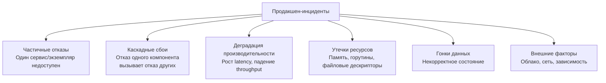
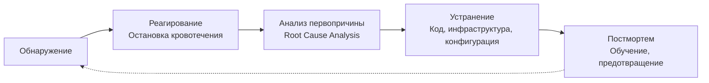

## Production Incidents: жизнь в мире частичных отказов

В [[8. Debugging distributed systems]] мы систематизировали подходы к отладке: логи, метрики, трассировка, Correlation ID ([[7. Correlation ID]]). Но отладка — это реактивная практика, которая начинается *после* того, как что-то пошло не так. Теперь мы переходим к более широкому понятию — **продакшен-инциденты** (production incidents) — и культуре их проживания: от обнаружения до постмортема.

Инцидент — это не просто баг. Это событие, которое нарушает или угрожает нарушить SLO ([[9. SLO и SLA]]), влияет на пользователей и требует немедленной реакции. В распределённых системах на Go инциденты неизбежны: сеть ненадёжна, базы данных замедляются, сборщик мусора внезапно замирает, горутины утекают. Невозможно предотвратить все инциденты, но можно построить систему, которая быстро их обнаруживает, локализует и изящно деградирует, а команда — учится на каждом таком событии.

Эта статья объединяет весь инструментарий, изученный в разделе «Практика» ([[1. Graceful Shutdown]] — [[8. Debugging distributed systems]]), с глубинными знаниями о производительности Go ([[1. GC в Go. Обзор]], [[6. GC pause и latency]], [[9. Когда GC становится bottleneck]], [[1. Scheduler Go. G M P модель]], [[7. Contention и lock profiling]]) и создаёт целостную картину: как Senior-инженер встречает, проживает и разбирает инциденты, превращая их в улучшение системы.

## Классификация инцидентов в Go-системах

Инциденты удобно классифицировать по первопричине. Одна и та же система в разное время может страдать от разных классов проблем.



### 1. Частичные отказы

Один под сервиса падает по OOM. Или сетевой сплит изолирует часть кластера. Или база данных отклоняет соединения. Распределённая система должна переживать частичные отказы без полной остановки — через репликацию, повторные попытки ([[4. Retries]]) и Circuit Breaker ([[3. Circuit Breaker]]).

### 2. Каскадные сбои

Отказ сервиса A вызывает тайм-ауты в сервисе B, который запускает Retries, утраивая нагрузку на сервис A. Тот окончательно падает, утягивая за собой C и D. Классический snowball effect. Лечится Rate Limiting ([[2. Rate Limiting]]), Backpressure ([[6. Backpressure]]), грамотными тайм-аутами и CB.

### 3. Деградация производительности

p99 latency ползёт вверх, но явных ошибок нет. Причины могут быть внутри Go: GC-паузы ([[6. GC pause и latency]]), mark assist ([[9. Когда GC становится bottleneck]]), contention на мьютексах ([[7. Contention и lock profiling]]), ложное разделение кэша ([[8. False sharing]]), миграция горутин ([[3. Work stealing]]).

### 4. Утечки ресурсов

Медленная утечка памяти ([[6. Утечки памяти]]), горутин ([[2. Goroutines под капотом]]), файловых дескрипторов. Система работает нормально, пока ресурс не заканчивается — и тогда внезапный отказ.

### 5. Гонки данных

Самая трудновоспроизводимая категория. Некорректная синхронизация приводит к повреждению состояния, которое может проявиться через часы или дни.

### 6. Внешние факторы

Облачный провайдер мигрирует VM, сеть вносит 10% потерь пакетов, истекает сертификат, заканчивается квота диска.

## Жизненный цикл инцидента

Каждый инцидент проходит через пять фаз. Senior-инженер знает свою роль в каждой из них.



### 1. Обнаружение

Инцидент регистрируется автоматически, а не из жалобы пользователя. Основа автоматического обнаружения — **метрики, алерты, SLO**.

- **Метрики RED** (Rate, Errors, Duration) по каждому сервису. Рост ошибок 5xx выше 1% или рост p99 выше заданного порога — алерт.
- **Метрики USE** (Utilization, Saturation, Errors) по инфраструктуре. CPU throttling, OOM Kill, рост горутин.
- **Бюджет ошибок (Error Budget)** на основе SLO ([[9. SLO и SLA]]). Когда бюджет исчерпан на 20% — warning, на 80% — critical.
- **Синтетические проверки** (blackbox monitoring) — эмулируют пользовательский путь и оповещают о его недоступности.

В Go специфические метрики, критичные для обнаружения:
- `go_goroutines` — резкий скачок → утечка или всплеск.
- `go_memstats_gc_cpu_fraction` > 15% → GC bottleneck.
- `go_gc_duration_seconds` (p99) > 10 мс → проблема GC.
- Контеншн на мьютексах через mutex profile ([[6. mutex profile]]) — не метрика, но профиль, снимаемый по алерту.

### 2. Реагирование — остановка кровотечения

Первая цель — не починить систему, а **восстановить сервис** в рамках SLO. Приоритеты:
1. Откатить проблемный деплой.
2. Переключить трафик на здоровый регион/кластер.
3. Увеличить ресурсы (CPU, память, реплики).
4. Включить деградацию: отключить некритичный функционал, перейти на статический кэш.

Шаблоны, помогающие пережить инцидент без полной остановки:
- **Graceful Shutdown** ([[1. Graceful Shutdown]]) — корректно завершает inflight-запросы при перезапуске.
- **Circuit Breaker** ([[3. Circuit Breaker]]) — предотвращает распространение отказа.
- **Rate Limiting** ([[2. Rate Limiting]]) — защищает перегруженный сервис от лавины.
- **Backpressure** ([[6. Backpressure]]) — ограничивает очередь и сбрасывает избыточные запросы явно, вместо неявного тайм-аута.
- **Idempotency** ([[5. Idempotency]]) — позволяет безопасно повторять запросы после восстановления.

> [!tip] Собеседование
> **Вопрос:** Ваш сервис начинает падать по OOM каждые 20 минут. Ваши действия в первые 5 минут после алерта?
> **Ответ:** 1) Увеличу лимит памяти для подов, чтобы выиграть время. 2) Если увеличение невозможно — подниму количество реплик для распределения нагрузки. 3) Включу pprof memory profile на одном из экземпляров для быстрой диагностики. 4) Если известен недавний деплой, инициирую откат. 5) Оповещу команду в инцидент-канале.

### 3. Анализ первопричины (Root Cause Analysis, RCA)

Когда сервис восстановлен, начинается расследование. Ключевой принцип: **не «кто виноват?», а «что произошло и почему система не предотвратила это сама?»**

Инструментарий Go для RCA:
- **pprof** ([[1. pprof. Введение]]) — CPU, heap, goroutine профили.
- **Execution tracer** ([[3. execution tracer]]) — если инцидент связан с задержками из-за планировщика или GC.
- **Mutex/Block профили** ([[6. mutex profile]], [[5. block profile]]) — для contention.
- **Логи** с Correlation ID ([[7. Correlation ID]]) — восстановление последовательности событий.
- **Трассировка** ([[2. OpenTelemetry tracing]]) — узкое место в цепочке сервисов.

Методология: **«Пять почему»** (Five Whys). Пример:
1. Почему упал сервис? — OOMKill.
2. Почему OOM? — Куча выросла до 2 ГБ при лимите 512 МБ.
3. Почему куча выросла? — Добавили кэш без ограничения размера.
4. Почему не заметили до падения? — Не было алерта на рост кучи.
5. Почему не было алерта? — Метрика `go_memstats_heap_inuse_bytes` не была добавлена в дашборды.

На пятом «почему» мы вышли на системную проблему: отсутствие мониторинга.

### 4. Устранение

После нахождения корневой причины внедряется исправление. Оно может быть:
- **Кодовым** (утечка горутин, отсутствие тайм-аута).
- **Инфраструктурным** (увеличение лимитов, настройка автоскейлинга).
- **Конфигурационным** (неправильный GOMEMLIMIT ([[8. GOMEMLIMIT]]), слишком низкий GOGC ([[7. GOGC и tuning]])).
- **Процессным** (добавление метрик, алертов, нагрузочного тестирования).

Важно разделять **быстрое устранение** (hotfix, который возвращает сервис) и **долгосрочное устранение** (которое предотвращает повторение). Hotfix должен быть минимальным и безопасным.

### 5. Постмортем

**Постмортем** (postmortem, post-incident review) — это не разбор полётов с поиском виноватых, а structured-written-документ, описывающий:
- Хронологию инцидента (timeline).
- Влияние на пользователей (impact).
- Корневую причину (root cause).
- Предпринятые действия (actions taken).
- Извлечённые уроки (lessons learned).
- План предотвращения (action items).

Культура **blameless postmortem** критична для здоровой инженерной среды. Если разработчик боится наказания за ошибку, он будет скрывать инциденты, и организация потеряет возможность учиться.

Пример шаблона постмортема:

```
# Инцидент #42: Рост p99 latency до 5s на payment-service

**Дата:** 2026-04-27
**Длительность:** 23 минуты (14:02 - 14:25 UTC)
**Влияние:** 3% транзакций завершились с ошибкой тайм-аута (>2s)

**Хронология:**
- 14:02: Алерт Prometheus: p99 latency payment-service > 1s.
- 14:05: Дежурный инженер подтвердил проблему, объявил инцидент.
- 14:10: Обнаружено, что рост коррелирует с деплоем #a3f2b8.
- 14:12: Инициирован откат деплоя.
- 14:20: Откат завершён, метрики восстанавливаются.
- 14:25: Инцидент закрыт.

**Корневая причина:**
Деплой увеличил размер кэша в памяти с 10k до 1M записей без настройки GOGC. Живая память выросла с 200 MB до 800 MB, что вызвало учащение GC-циклов и рост mark assist до 40% CPU, замедляя обработку запросов.

**Уроки:**
1. Изменения кэша должны сопровождаться нагрузочным тестированием.
2. GOMEMLIMIT не был установлен — куча могла выйти за лимит.
3. Алерт на `go_gc_cpu_fraction` отсутствовал.

**Действия:**
- [ ] Установить GOMEMLIMIT=1GiB для payment-service (owner: @ivan, срок: +2d).
- [ ] Добавить алерт на `go_gc_cpu_fraction > 10%` (owner: @alena, срок: +3d).
- [ ] Провести нагрузочное тестирование с новым размером кэша (owner: @ivan, срок: +5d).
```

## Типичные инциденты в Go и их разбор

### Инцидент 1: Утечка горутин

**Симптомы:** Метрика `go_goroutines` растёт линейно, в конце концов сервис перестаёт отвечать (нехватка планировщика, memory pressure от стеков).

**Причина:** В коде:

```go
func handler(w http.ResponseWriter, r *http.Request) {
    ch := make(chan string)
    go func() {
        // дорогой вызов
        ch <- fetchData(r)
    }()
    select {
    case data := <-ch:
        fmt.Fprint(w, data)
    case <-time.After(100 * time.Millisecond):
        http.Error(w, "timeout", 504)
    }
    // горутина с fetchData осталась висеть навсегда,
    // потому что из канала никто не читает
}
```

После тайм-аута горутина навсегда блокируется на `ch <-`, удерживая стек (минимум 2 КБ) и все захваченные переменные. Тысячи таких запросов — и миллионы горутин.

**Быстрое исправление:** буферизировать канал `ch := make(chan string, 1)`, чтобы горутина могла завершиться, даже если результат не прочитан.

**Долгосрочное:** использовать `context.Context` с отменой и передавать его в горутину, чтобы при тайм-ауте горутина прерывала выполнение.

### Инцидент 2: GC-шторм

**Симптомы:** p99 latency периодически подскакивает до 500 мс, CPU утилизация имеет «зубцы», коррелирующие с GC-циклами.

**Причина:** Высокий темп аллокаций (много JSON-парсинга) + GOGC=100 по умолчанию. Куча быстро достигает цели, GC запускается каждые 2 секунды, mark assist замедляет хот-горутины.

**Быстрое исправление:** поднять GOGC до 200 (если позволяет память) или установить GOMEMLIMIT для сглаживания.

**Долгосрочное:** внедрить `sync.Pool` ([[2. sync Pool]]) для переиспользования буферов, заменить `encoding/json` на `sonic`.

Подробнее в [[9. Когда GC становится bottleneck]].

### Инцидент 3: False sharing в счётчике

**Симптомы:** Сервис не масштабируется выше 4 ядер, хотя CPU-bound работа хорошо распараллелена.

**Причина:** Счётчики обновляются атомарно, но расположены в одной кэш-линии:

```go
type Stats struct {
    Success uint64
    Errors  uint64
}
```

`Success` и `Errors` — соседи в памяти (разница 8 байт), они гарантированно в одной 64-байтной кэш-линии. Когда ядро A инкрементирует `Success`, а ядро B — `Errors`, кэш-линия постоянно переходит между ядрами (cache line bouncing), убивая производительность.

**Исправление:** разнести поля на разные кэш-линии с помощью паддинга:

```go
type Stats struct {
    Success uint64
    _       [56]byte // Добивка до 64 байт
    Errors  uint64
}
```

Подробнее в [[8. False sharing]] и [[9. Cache line и выравнивание]].

### Инцидент 4: Каскадный сбой из-за отсутствия Backpressure

**Симптомы:** При пиковой нагрузке сервис A начинает медленно отвечать, вызывая тайм-ауты в сервисе B, который запускает Retries. Нагрузка на A возрастает, A падает окончательно, за ним B, C.

**Причина:** Нет ограничения на число одновременных запросов. Сервис A обрабатывает неограниченное число горутин, каждая из которых конкурирует за CPU и память. latency всех растёт.

**Быстрое исправление:** ввести семафор (буферизированный канал) на максимальное число одновременных обработок. Лишние запросы сразу получают 503.

**Долгосрочное:** Rate Limiting ([[2. Rate Limiting]]) на входе, Retries с exponential backoff ([[4. Retries]]) и Circuit Breaker ([[3. Circuit Breaker]]), чтобы быстро отключать отказавший сервис.

## Mechanical Sympathy: как ОС и железо создают инциденты

Некоторые инциденты невозможно объяснить на уровне Go-кода — их корень в операционной системе и микроархитектуре.

### 1. CPU Throttling в контейнерах

Kubernetes использует CFS (Completely Fair Scheduler) квоты для ограничения CPU. Если контейнер превышает лимит, ядро принудительно приостанавливает процесс (CPU throttling). Это выглядит как внезапные «ступеньки» в latency, невидимые в Go-профилях (там время идёт, а процессорные такты не тратятся). Диагностируется через `container_cpu_cfs_throttled_seconds_total`.

**Решение:** не занижать CPU limits, либо использовать `GOMAXPROCS` меньше, чем выделено ядер, чтобы рантайм Go не пытался использовать больше потоков, чем разрешено.

### 2. OOM Killer и Memory Cgroups

Go не знает о лимите памяти cgroups вплоть до прямого столкновения с ним. Если `GOMEMLIMIT` ([[8. GOMEMLIMIT]]) не установлен, рантайм ориентируется только на `GOGC` и может раздуть кучу до лимита контейнера, после чего OOM Killer убьёт процесс.

**Решение:** всегда выставлять `GOMEMLIMIT`, вычисляя его из лимита cgroups с запасом 10-20%.

### 3. Transparent Hugepages (THP)

Linux может прозрачно объединять страницы памяти в hugepages (2 МБ). Для Go это может быть как плюсом (меньше TLB промахов), так и минусом: компактизация hugepages вызывает резкие задержки в десятки миллисекунд. Если p99 latency имеет необъяснимые миллисекундные пики, проверьте `THP enabled`.

**Решение:** отключать THP (`echo never > /sys/kernel/mm/transparent_hugepage/enabled`) или переходить на явные hugepages по совету с провайдером.

### 4. NUMA-перекос

На многоядерных серверах с несколькими процессорными сокетами память делится на NUMA-узлы. Если горутина обращается к памяти, выделенной на другом узле, задержка возрастает на 30-50%. Это может проявляться как необъяснимая асимметрия производительности между identical-подами.

**Решение:** привязка процессов к NUMA-узлам (taskset, numactl), но в контейнерах это сложно и редко оправдано.

## Культура инцидентов

Senior-инженер не просто тушит пожары — он строит среду, в которой инциденты становятся источником обучения, а не стресса.

- **Blameless.** Ошибки — это системные проблемы. Если разработчик опечатался в конфиге, виноват не он, а отсутствие валидации конфига при деплое.
- **Автоматизация.** Всё, что можно автоматизировать в обнаружении и реагировании, должно быть автоматизировано. Человек принимает решение, машина исполняет.
- **Runbooks.** Задокументированные процедуры для типовых инцидентов (OOM, GC storm, утечка горутин), доступные дежурному инженеру в момент алерта.
- **Game Days.** Плановые учения, когда команда симулирует инциденты (отключение БД, потеря pod'ов, замедление сети) и тренирует реагирование. Хаос-инжиниринг из [[8. Debugging distributed systems]] — часть этой практики.
- **Postmortem-driven improvement.** Каждый постмортем порождает конкретные action items, которые приоритизируются наравне с бизнес-фичами.

## Итог

- Продакшен-инциденты — неизбежная реальность распределённых систем; зрелость команды определяется не отсутствием инцидентов, а умением быстро восстанавливаться и учиться.
- Инциденты классифицируются на частичные отказы, каскадные сбои, деградацию, утечки, гонки и внешние факторы.
- Жизненный цикл: обнаружение (метрики, алерты, SLO) → реагирование (откат, шардирование, деградация) → RCA (pprof, execution tracer, «пять почему») → устранение (hotfix + долгосрочное) → постмортем (blameless, lessons learned).
- Go-специфичные инциденты: утечки горутин, GC-штормы, false sharing, contention. Диагностируются через pprof, mutex/block профили, execution tracer.
- Mechanical sympathy объясняет инциденты, невидимые в коде: CPU throttling, OOM Killer, THP, NUMA.
- Культура blameless, runbooks и game days превращает инциденты из катастроф в возможность улучшить систему.