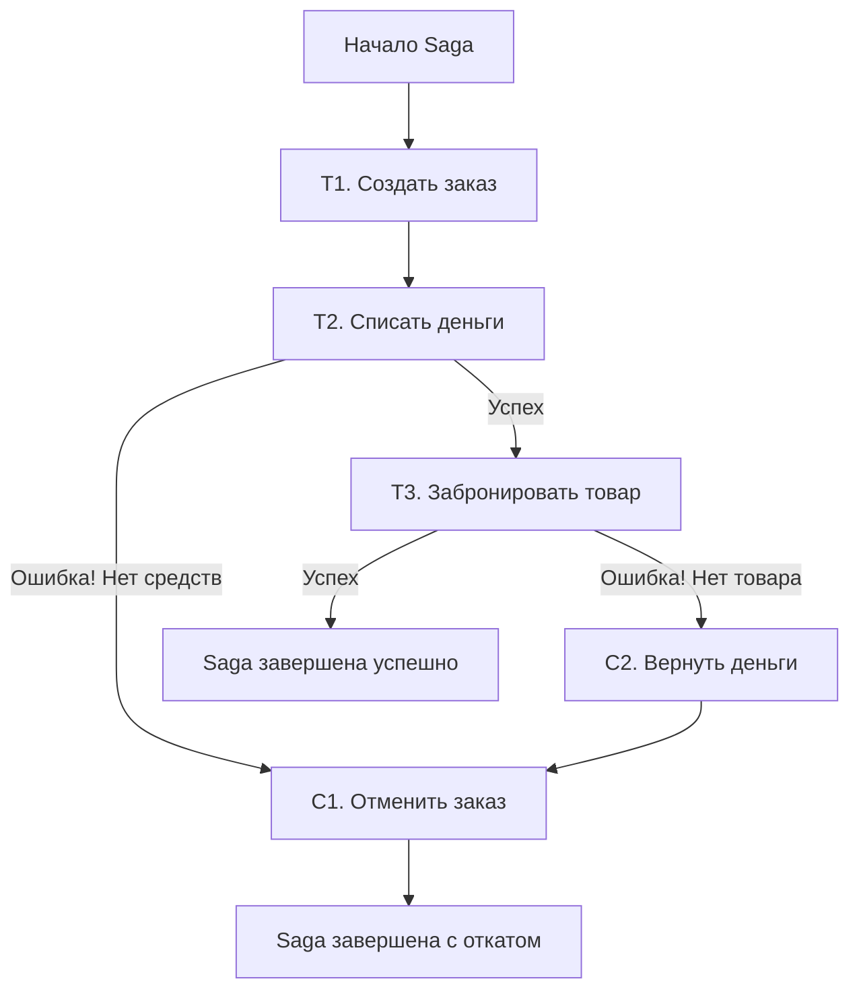

## Транзакции в микросервисах: Проблема распределенного состояния

В классической монолитной архитектуре с реляционной базой данных (PostgreSQL, MySQL) мы привыкли к надежности **ACID-транзакций**. Мы начинаем транзакцию, делаем несколько изменений в разных таблицах, и если что-то идет не так — база данных автоматически откатывает всё обратно. За это отвечают механизмы WAL (Write-Ahead Log) и блокировок на уровне строк.

В мире микросервисов этот комфорт исчезает. Данные распределены по разным сервисам, каждый из которых имеет собственную базу данных (паттерн **Database per Service**).

Представь сценарий: **Оформление заказа**.
1.  Сервис **Orders** создает заказ.
2.  Сервис **Payments** списывает деньги.
3.  Сервис **Inventory** резервирует товар.

Если сервис Inventory падает с ошибкой "Товар закончился", деньги уже списаны, заказ создан. В монолите сработал бы `ROLLBACK`. В микросервисах у нас нет единой транзакции, охватывающей разные БД. Нам нужен механизм, который гарантирует согласованность данных **в конечном итоге** (Eventual Consistency).

Этот механизм — **Saga**.

---

## Что такое Saga?

**Saga** — это паттерн проектирования, при котором длинная транзакция (Long Lived Transaction, LLT) разбивается на последовательность локальных транзакций.

Каждая локальная транзакция обновляет данные в рамках одного сервиса и публикует событие или сообщение, чтобы запустить следующий шаг в другом сервисе.

> [!info] Под капотом
> Изначально концепция была предложена Гектором Гарсиа-Молиной в 1987 году для долгих транзакций в БД. В современной распределенной архитектуре она трансформировалась в способ координации изменений состояния между сервисами без использования распределенных блокировок (Distributed Locks), которые являются узким местом и точкой отказа.

Если один шаг транзакции завершается неудачей, выполняются **компенсирующие транзакции** (Compensating Transactions), которые отменяют изменения, сделанные предыдущими шагами.

### Принцип работы

Saga $T$ разбивается на последовательность шагов: $T_1, T_2, \dots, T_n$.
Для каждого шага $T_i$ определяется компенсирующее действие $C_i$.

1.  Выполняется $T_1$.
2.  Если успешно — выполняется $T_2$.
3.  Если успешно — выполняется $T_3$.
...
4.  Если на шаге $k$ происходит ошибка:
    *   Запускается цепочка отката: $C_{k-1}, \dots, C_1$.



---

## Два способа координации: Хореография vs Оркестрация

Существует два основных подхода к реализации Saga. Выбор между ними — это компромисс между сложностью кода и связностью (coupling) сервисов.

### 1. Хореография (Choreography)

Это децентрализованный подход. Нет единого координатора. Каждый сервис выполняет свою работу и публикует событие (Event). Другие сервисы слушают эти события и реагируют.

*   **Сценарий**: Order Service публикует `OrderCreated`.
*   **Реакция**: Payment Service слушает событие, списывает деньги, публикует `PaymentProcessed`.
*   **Реакция**: Inventory Service слушает `PaymentProcessed`, бронирует товар. Если товара нет, публикует `InventoryFailed`.
*   **Откат**: Payment Service слушает `InventoryFailed` и возвращает деньги.

**Плюсы**:
*   Простота для простых сценариев (2-3 сервиса).
*   Слабая связность (сервисы знают только о событиях, но не друг о друге).

**Минусы**:
*   **Spaghetti Logic**: Сложно отследить весь процесс целиком. Логика размазана по всем сервисам.
*   **Риск циклических зависимостей**: Сервис A слушает B, B слушает A.
*   Сложность добавления новых шагов.

> [!warning] Ловушка / Gotcha
> При хореографии легко столкнуться с проблемой "Lost Update" или неопределенности состояния. Если Payment Service успешно списал деньги, но упал перед публикацией события `PaymentProcessed`, система зависнет в неопределенном состоянии. Обязательно используй паттерн **Outbox** для гарантии доставки событий.

### 2. Оркестрация (Orchestration)

Централизованный подход. Существует отдельный сервис-координатор (Orchestrator), который управляет процессом. Он говорит сервисам, что делать, и принимает решения о последствиях.

*   Orchestrator командует Payment Service: "Списать деньги".
*   Получает ответ: "OK".
*   Командует Inventory Service: "Забронировать товар".
*   Получает ответ: "Error".
*   Командует Payment Service: "Вернуть деньги".

**Плюсы**:
*   Централизованная логика: Проще понимать состояние текущей транзакции.
*   Упрощенная обработка ошибок и откаты.
*   Легче добавлять новые шаги и менять логику.

**Минусы**:
*   Дополнительная инфраструктура (Orchestrator).
*   Сильная связность: Orchestrator должен знать API всех участников.

> [!tip] Собеседование
> **Вопрос:** Какой подход выбрать?
> **Ответ:** Если бизнес-процесс простой (2-3 шага) — используй **Хореографию**, чтобы не переусложнять архитектуру. Если процесс сложный, содержит много ветвлений и условий — выбирай **Оркестрацию**. Она добавляет связность, но резко снижает когнитивную сложность понимания потока данных.

---

## Реализация Оркестратора на Go

В Go оркестратор обычно реализуется как конечный автомат (State Machine). Каждое состояние Saga сохраняется в БД оркестратора (для отказоустойчивости), а общение с сервисами происходит через очереди сообщений (RabbitMQ, Kafka) или gRPC.

Пример структуры данных для хранения состояния Saga в БД оркестратора:

```go
type SagaStatus string

const (
	StatusRunning    SagaStatus = "RUNNING"
	StatusCompleted  SagaStatus = "COMPLETED"
	StatusCompensating SagaStatus = "COMPENSATING" // Идет откат
	StatusFailed     SagaStatus = "FAILED"         // Откат не удался или бизнес-ошибка
)

type SagaStep struct {
	Name       string
	Status     SagaStatus
	Compensate bool // Флаг: нужно ли выполнять компенсацию для этого шага
}

type SagaInstance struct {
	ID          uuid.UUID
	OrderID     uuid.UUID
	CurrentStep int
	Status      SagaStatus
	Steps       []SagaStep
	CreatedAt   time.Time
	UpdatedAt   time.Time
}
```

### Обработчик шагов (упрощенно)

Оркестратор получает ответ от сервиса и решает, что делать дальше.

```go
func (o *Orchestrator) HandleReply(reply SagaReply) {
	// Загружаем состояние Saga из БД (чтобы пережить перезапуск)
	saga, err := o.repo.GetSaga(reply.SagaID)
	if err != nil {
		log.Printf("Critical: saga state lost: %v", err)
		return
	}

	if reply.Success {
		saga.Steps[saga.CurrentStep].Status = StatusCompleted
		saga.CurrentStep++

		if saga.CurrentStep == len(saga.Steps) {
			saga.Status = StatusCompleted
			o.repo.Save(saga)
			return
		}
		
		// Запускаем следующий шаг
		o.executeNextStep(saga)
	} else {
		// Ошибка! Начинаем компенсацию
		saga.Status = StatusCompensating
		o.compensate(saga)
	}
	
	o.repo.Save(saga)
}

func (o *Orchestrator) compensate(saga *SagaInstance) {
	// Идем в обратном порядке от текущего шага
	for i := saga.CurrentStep - 1; i >= 0; i-- {
		step := saga.Steps[i]
		if step.Status == StatusCompleted {
			// Отправляем команду на компенсацию (например, RefundPayment)
			o.sendCompensateCommand(saga.ID, step)
		}
	}
	saga.Status = StatusFailed
}
```

---

## Проблемы и аномалии Saga

Saga не дает изолированности (Isolation) в классическом понимании ACID. Это порождает специфические проблемы.

### 1. Lost Updates (Потерянные обновления)
Два экземпляра одной Saga могут одновременно работать с одними данными.
*   Saga A читает баланс ($100).
*   Saga B читает баланс ($100).
*   Saga A списывает $10 ($90).
*   Saga B списывает $10 ($90).
*   Итог: баланс $90, хотя должно быть $80.

**Решение**: Пессимистичные блокировки (не рекомендуется в распределенных системах) или **Оптимистичные блокировки** (версионирование данных). В SQL: `UPDATE accounts SET balance = balance - 10, version = version + 1 WHERE id = ? AND version = ?`.

### 2. Dirty Reads (Грязное чтение)
Внешний наблюдатель может увидеть промежуточное состояние. Например, деньги списаны (Saga T2), но товар еще не забронирован (Saga T3). Пользователь видит "Заказ в обработке" и списанные деньги, а потом заказ отменяется.

**Решение**: Не показывать пользователю состояние "Успешно" до завершения последнего шага Saga. Использовать семантические блокировки (например, флаг `status: PENDING` в БД сервисов).

---

## Semantic Lock и идемпотентность

Для надежной работы Saga критически важна **идемпотентность** операций.

При оркестрации ответ от сервиса может потеряться. Оркестратор не знает, списались деньги или нет. Он должен повторить запрос. Если операция списания не идемпотентна, деньги спишутся дважды.

В Go для обеспечения идемпотентности при работе через очереди (RabbitMQ/Kafka) часто используют уникальный ключ запроса (Idempotency Key), который генерирует оркестратор.

```go
// В сервисе Payments
func (s *Service) Withdraw(cmd WithdrawCommand) error {
	// Проверяем, обрабатывали ли мы этот ключ
	exists, _ := s.idempotencyRepo.Exists(cmd.IdempotencyKey)
	if exists {
		return nil // Уже обработали, просто возвращаем успех
	}
	
	// Выполняем бизнес-логику внутри локальной транзакции
	err := s.db.Transaction(func(tx *gorm.DB) error {
		// 1. Списываем деньги
		// 2. Сохраняем Idempotency Key
		return nil
	})
	return err
}
```

---

## Сравнение с 2PC (Two-Phase Commit)

Часто спрашивают: почему не использовать распределенные транзакции (XA, 2PC)?

| Характеристика | 2PC (Two-Phase Commit) | Saga |
| :--- | :--- | :--- |
| **Изоляция** | Строгая (Serializability) | Отсутствует (на уровне всей транзакции) |
| **Блокировки** | Долгосрочные блокировки ресурсов | Нет блокировок между сервисами |
| **Производительность** | Низкая (узкие места в координаторе) | Высокая (асинхронность) |
| **Доступность** | Низкая (если координатор упал, всё висит) | Высокая (сервисы автономны) |
| **Сложность** | Реализуется на уровне БД/драйверов | Требует написания кода компенсации |

**Итог:** В микросервисной архитектуре, где доступность (Availability) и отказоустойчивость важнее строгой согласованности, **Saga** является предпочтительным выбором.

---

## Итог

1.  **Saga** — это способ обеспечения согласованности данных в распределенных системах без глобальных блокировок.
2.  Она разбивает транзакцию на локальные шаги и определяет **компенсирующие действия** на случай ошибок.
3.  **Хореография** подходит для простых потоков, **Оркестрация** — для сложных бизнес-процессов.
4.  Главная сложность — отсутствие изоляции (Dirty Reads, Lost Updates) и необходимость писать код отката (Compensating Logic).
5.  В Go реализуется через конечные автоматы, очереди сообщений и сохранение состояния в БД.

В следующей статье мы перейдем к паттерну, который позволяет разделить нагрузку на чтение и запись, часто используемому в связке с Saga и Event Sourcing — [[2. CQRS]].