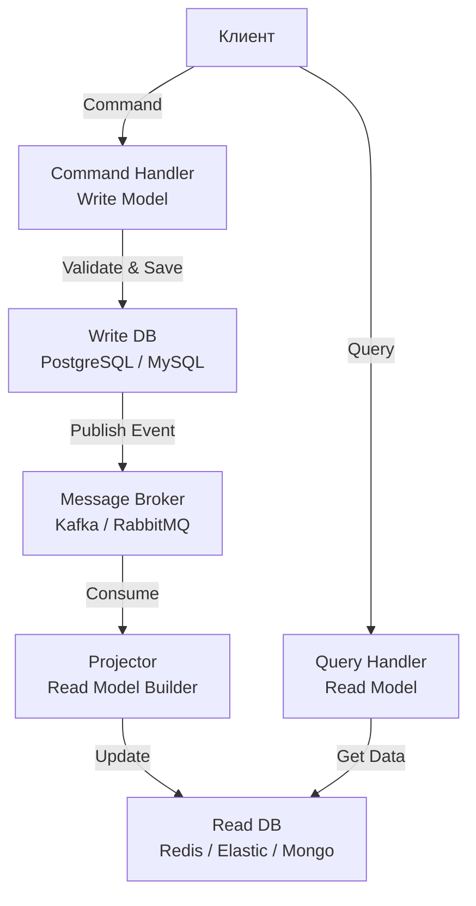

## CQRS: Разделение ответственности за команду и запрос

В традиционной архитектуре (например, используя Active Record в PHP Laravel или Doctrine в Java Spring) мы привыкли работать с одной и той же моделью данных и для чтения, и для записи. У нас есть сущность `User`, мы меняем её поля (`setName`, `setEmail`) и сохраняем в базу. Потом мы её же читаем, чтобы показать в профиле.

Этот подход (CRUD — Create, Read, Update, Delete) отлично работает для простых приложений. Но по мере роста сложности и нагрузки он начинает «проседать».

**CQRS (Command Query Responsibility Segregation)** — это паттерн, который радикально меняет этот подход. Он гласит: **Модель для изменения состояния (Command) должна быть отделена от модели для чтения состояния (Query).**

---

## Зачем разделять чтение и запись?

В высоконагруженных системах требования к операциям записи и чтения кардинально различаются:

1.  **Запись (Write)**: Требует строгой консистентности, валидации бизнес-правил, транзакционности. Данные должны быть нормализованы (3NF), чтобы избежать аномалий. Количество записей обычно на порядки меньше количества чтений.
2.  **Чтение (Read)**: Требует максимальной скорости. Данные удобно денормализовать (готовые джойны, view-модели), чтобы избежать сложных SQL-запросов. Количество чтений огромно (соотношение может быть 100:1 или 1000:1).

Если мы используем одну модель, мы попадаем в ловушку компромиссов. Индексы, ускоряющие чтение, замедляют запись (INSERT/UPDATE). Сложная бизнес-логика в сеттерах тормозит простые SELECT-запросы.

> [!info] Под капотом
> С точки зрения Mechanical Sympathy, CQRS позволяет оптимизировать работу с памятью и кэшем CPU.
> *   **Write Model**: Содержит сложные объекты с множеством полей и связей. В Go это могут быть большие структуры с тяжелыми методами.
> *   **Read Model**: Это легковесные DTO (Data Transfer Objects) или плоские структуры, идеально укладывающиеся в кэш-линии процессора. Они не содержат бизнес-логики, только данные. Это позволяет обрабатывать тысячи запросов на чтение с минимальными накладными расходами.

---

## Архитектура CQRS

CQRS не диктует использование двух баз данных, но именно там раскрывается его истинная мощь.



### 1. Командная сторона (Write Side)

Это "мозг" системы. Здесь живут **Агрегаты** (из DDD), инварианты и бизнес-логика.
*   Вход: **Command** (объект, выражающий намерение, например, `CreateOrderCommand`).
*   Обработка: Команда попадает в Command Handler. Он загружает агрегат, вызывает методы, сохраняет изменения.
*   Хранение: Оптимизировано под транзакции (обычно реляционная БД).
*   Результат: Система генерирует **Event** (например, `OrderCreatedEvent`).

**Код на Go (Command Handler):**

```go
type CreateOrderCommand struct {
	OrderID   uuid.UUID
	UserID    uuid.UUID
	ProductID uuid.UUID
	Quantity  int
}

type OrderCommandHandler struct {
	repo      OrderRepository
	publisher EventPublisher
}

func (h *OrderCommandHandler) Handle(ctx context.Context, cmd CreateOrderCommand) error {
	// 1. Загрузка агрегата (если это обновление)
	// order, _ := h.repo.Load(cmd.OrderID)

	// 2. Бизнес-логика
	order := NewOrder(cmd.OrderID, cmd.UserID, cmd.ProductID, cmd.Quantity)
	
	// 3. Валидация инвариантов внутри агрегата
	if err := order.Validate(); err != nil {
		return fmt.Errorf("validation failed: %w", err)
	}

	// 4. Сохранение в Write DB (транзакционно)
	if err := h.repo.Save(ctx, order); err != nil {
		return fmt.Errorf("save failed: %w", err)
	}

	// 5. Публикация события для обновления Read Model
	// Это делает Write Side "слепым" к тому, кто и как будет читать данные.
	event := NewOrderCreatedEvent(order)
	return h.publisher.Publish(ctx, "order-events", event)
}
```

### 2. Сторона запросов (Read Side)

Это "лицо" системы. Здесь царит скорость и удобство для фронтенда.
*   Вход: **Query** (например, `GetOrderQuery`).
*   Обработка: Query Handler просто делает SELECT из хранилища чтения.
*   Хранение: Оптимизировано под поиск (Elasticsearch, MongoDB, Redis) или простые плоские таблицы (Materialized View в Postgres).

**Код на Go (Query Handler):**

```go
type OrderDTO struct {
	ID        string `json:"id"`
	UserName  string `json:"user_name"` // Имя уже подтянуто!
	Product   string `json:"product"`
	Status    string `json:"status"`
	CreatedAt string `json:"created_at"`
}

type OrderQueryHandler struct {
	readDB *sql.DB // Или клиент Redis/Elastic
}

func (h *OrderQueryHandler) Handle(ctx context.Context, query GetOrderQuery) (*OrderDTO, error) {
	// Никакой бизнес-логики. Просто маппинг результата запроса в DTO.
	// Данные уже денормализованы (UserName лежит рядом с заказом).
	var dto OrderDTO
	err := h.readDB.QueryRowContext(ctx, 
		"SELECT id, user_name, product, status FROM orders_view WHERE id = $1", 
		query.OrderID,
	).Scan(&dto.ID, &dto.UserName, &dto.Product, &dto.Status)
	
	if err != nil {
		return nil, err
	}
	return &dto, nil
}
```

---

## Projection (Проекции)

Ключевой элемент CQRS — **Проектор**. Это сервис, который слушает события из Write Side и обновляет Read Side.

Именно здесь происходит "магия" денормализации.
Допустим, у нас есть событие `UserChangedEmail`. В Write базе мы обновили одну строку в таблице `users`. Но в Read базе (Elasticsearch) у нас может быть индекс `orders_view`, где email пользователя продублирован в каждом заказе для быстрого поиска. Проектор должен найти все записи в `orders_view`, принадлежащие этому юзеру, и обновить в них email.

> [!warning] Ловушка / Gotcha
> **Eventual Consistency (Согласованность в конечном итоге).**
> В CQRS Read Side обновляется асинхронно. Пользователь отправляет команду "Сменить email", получает ответ "ОК". Сразу после этого он делает запрос "Показать мой профиль" и видит **старый** email.
> Это нормально для CQRS, но может шокировать пользователей и бизнес.
> **Решение**: На фронтенде можно использовать Optimistic UI update (предсказывать новое состояние на клиенте) или показывать лоадер/скелетон с таймаутом, ожидая обновления.

---

## Polyglot Persistence (Полиглотное хранение)

CQRS часто идет рука об руку с использованием разных баз данных (Polyglot Persistence).

*   **Write DB**: PostgreSQL. Нужна строгая транзакционность, ACID, сложные связи.
*   **Read DB**:
    *   **Redis**: Для сессий, профилей, кэшей. Key-Value доступ — сверхбыстро.
    *   **Elasticsearch**: Для полнотекстового поиска.
    *   **ClickHouse**: Для аналитики и отчетов.

Проекторы в Go могут быть простыми воркерами, читающими Kafka.

```go
func (p *Projector) Run(ctx context.Context) {
	for msg := range p.consumer.Messages() {
		event := p.deserialize(msg.Value)
		
		// Обновляем Read Model в зависимости от типа события
		switch e := event.(type) {
		case *OrderCreated:
			p.updateReadDB(e)
		case *OrderStatusChanged:
			p.updateOrderStatus(e)
		}
		
		p.consumer.CommitMessages(ctx, msg) // Ручной коммит офсета
	}
}
```

---

## Когда НЕЛЬЗЯ использовать CQRS

CQRS добавляет значительную сложность в инфраструктуру. Вам нужно:
1.  Настроить пайплайн событий (Message Broker).
2.  Писать код проекторов.
3.  Поддерживать две схемы БД.
4.  Решать проблемы рассинхрона (Outbox pattern, Replay events).

> [!tip] Собеседование
> **Вопрос:** Когда оправдано использование CQRS?
> **Ответ:**
> 1. **High Load**: Когда чтение и запись имеют радикально разные паттерны нагрузки.
> 2. **Сложная бизнес-логика**: Когда валидация записи требует сложных правил, которые мешают простому чтению.
> 3. **Разные контексты**: Когда один и тот же набор данных нужен в совершенно разных форматах (для сайта, для мобильного приложения, для аналитики).
>
> **Не используйте CQRS для простых CRUD-приложений** (админки, блоги). Это будет overengineering и "распределенный монолит".

---

## Связь с Event Sourcing

CQRS часто упоминается в связке с [[3. Event sourcing]], но это **паттерны-ортогоналы**.
*   CQRS разделяет *модели*.
*   Event Sourcing меняет *способ хранения данных* (хранение последовательности событий вместо текущего состояния).

Однако они идеально дополняют друг друга: Event Store отлично подходит на роль Write DB в CQRS, а Проекторы строят Read Models, "накатывая" события.

---

## Итог

1.  **CQRS** разделяет приложение на две части: Command Model (запись) и Query Model (чтение).
2.  Это позволяет масштабировать чтение и запись независимо и использовать разные технологии хранения.
3.  Цена — сложность инфраструктуры и **Eventual Consistency**.
4.  Ключевой механизм синхронизации — События и Проекторы.

В следующей статье мы разберем [[3. Event sourcing]], который часто становится "двигателем" для CQRS, позволяя хранить не текущее состояние, а историю всех изменений.