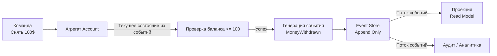

## Event Sourcing: Храним историю, а не состояние

В традиционном подходе к проектированию баз данных мы привыкли хранить **текущее состояние** (Current State). Если пользователь переводит деньги со счета, мы выполняем SQL-запрос `UPDATE accounts SET balance = balance - 100`. Старое значение баланса безвозвратно теряется.

Но что, если нам нужно узнать, *почему* баланс стал таким? Что, если аудитор потребует историю всех действий за последние 5 лет? Что, если мы захотим откатить систему к состоянию на "вчерашний день"?

**Event Sourcing (ES)** — это паттерн, который переворачивает представление о хранении данных с ног на голову. Вместо того чтобы хранить текущее состояние, мы храним **последовательность событий**, которые привели к этому состоянию.

---

## Основная идея: Событие как источник истины

В Event Sourcing состояние объекта (Агрегата) не хранится в базе данных напрямую. Оно вычисляется (реконструируется) путем повторного воспроизведения всех событий, которые происходили с этим объектом с момента его создания.

> [!info] Под капотом
> С точки зрения системного дизайна, Event Sourcing реализует паттерн **Append-Only Log**. Это крайне эффективный способ записи для диска и SSD.
> Запись в конец файла (append) — это последовательная операция. Она не требует поиска места на диске (seek time) и работает на порядки быстрее случайной записи (random write), которая происходит при `UPDATE`.
> Это объясняет, почему Event Store может обрабатывать колоссальное количество транзакций: он просто дописывает данные в конец журнала.

### Пример: Банковский счет

*   **CRUD подход**: В базе лежит одна строка: `id: 1, balance: 900`.
*   **Event Sourcing подход**: В базе лежит поток событий:
    1.  `AccountOpened` (balance: 0)
    2.  `MoneyDeposited` (amount: 1000)
    3.  `MoneyWithdrawn` (amount: 100)
    4.  `MoneyDeposited` (amount: 50)

Чтобы узнать баланс, мы "проигрываем" эти события: $0 + 1000 - 100 + 50 = 950$.



---

## Архитектура Event Sourcing в Go

Реализация Event Sourcing в Go требует смены мышления. Вместо структур, маппящихся на таблицы SQL, мы работаем с потоком событий.

### 1. Определение событий

События должны быть иммутабельными (неизменяемыми) и содержать все данные, необходимые для восстановления контекста.

```go
// Событие — это факт, произошедший в прошлом. Глагол в прошедшем времени.
type Event interface {
	AggregateID() string
	EventType() string
}

type MoneyDeposited struct {
	ID     string    `json:"id"`
	Amount float64   `json:"amount"`
	Date   time.Time `json:"date"`
}

func (e MoneyDeposited) AggregateID() string { return e.ID }
func (e MoneyDeposited) EventType() string   { return "money_deposited" }

type MoneyWithdrawn struct {
	ID     string    `json:"id"`
	Amount float64   `json:"amount"`
	Date   time.Time `json:"date"`
}
// ... методы аналогично
```

### 2. Агрегат (Aggregate) и реконструкция состояния

Агрегат — это сущность, которая защищает инварианты. Он не имеет публичных сеттеров. Его состояние меняется только через метод `Apply(event)`.

```go
type Account struct {
	ID      string
	Balance float64
	Version int // Для оптимистичной блокировки (Concurrency Control)

	// Список новых событий, которые нужно сохранить
	uncommittedChanges []Event
}

// Фабричный метод: создание нового
func OpenAccount(id string) *Account {
	acc := &Account{}
	// Создание аккаунта — это тоже событие
	acc.raiseEvent(AccountOpened{ID: id})
	return acc
}

// Бизнес-метод: Deposite
func (a *Account) Deposit(amount float64) {
	if amount <= 0 {
		panic("amount must be positive") // или return error
	}
	// Мы не меняем баланс напрямую! Мы генерируем событие.
	a.raiseEvent(MoneyDeposited{ID: a.ID, Amount: amount, Date: time.Now()})
}

// Бизнес-метод: Withdraw
func (a *Account) Withdraw(amount float64) error {
	if a.Balance < amount {
		return errors.New("insufficient funds") // Бизнес-правило!
	}
	a.raiseEvent(MoneyWithdrawn{ID: a.ID, Amount: amount, Date: time.Now()})
	return nil
}

// Метод "поднятия" события: меняет состояние и сохраняет событие в очередь
func (a *Account) raiseEvent(event Event) {
	a.applyChange(event)
	a.uncommittedChanges = append(a.uncommittedChanges, event)
}

// ГЛАВНЫЙ МЕТОД: Применение события к состоянию
func (a *Account) applyChange(event Event) {
	// Switch по типу события
	switch e := event.(type) {
	case AccountOpened:
		a.ID = e.ID
		a.Balance = 0
	case MoneyDeposited:
		a.Balance += e.Amount
	case MoneyWithdrawn:
		a.Balance -= e.Amount
	}
	a.Version++ // Каждое событие увеличивает версию
}

// Метод для загрузки из истории (используется репозиторием)
func (a *Account) LoadFromHistory(events []Event) {
	for _, event := range events {
		a.applyChange(event)
		// При загрузке истории мы не добавляем события в uncommittedChanges
	}
}
```

### 3. Репозиторий и Event Store

Репозиторий отвечает за сохранение событий и загрузку агрегата.

```go
type EventStore interface {
	Save(events []Event, expectedVersion int) error
	Load(aggregateID string) ([]Event, error)
}

type AccountRepository struct {
	store EventStore
}

func (r *AccountRepository) Save(acc *Account) error {
	// Сохраняем только новые события
	err := r.store.Save(acc.uncommittedChanges, acc.Version - len(acc.uncommittedChanges))
	if err != nil {
		return err
	}
	acc.uncommittedChanges = nil // Очищаем очередь
	return nil
}

func (r *AccountRepository) Get(id string) (*Account, error) {
	// 1. Загружаем все события из БД
	events, err := r.store.Load(id)
	if err != nil {
		return nil, err
	}

	// 2. Реконструируем состояние
	acc := &Account{}
	acc.LoadFromHistory(events)
	return acc, nil
}
```

---

## Проблемы и решения

Event Sourcing — это мощно, но это не "серебряная пуля". Он приносит специфические проблемы.

### 1. Производительность: Снэпшоты (Snapshots)

Что делать, если у аккаунта было 100 000 событий? Загрузка и проигрывание всех 100 000 событий при каждом запросе займет слишком много времени.

**Решение: Снэпшоты.**
Мы периодически (например, каждые 100 событий) сохраняем текущее состояние агрегата в отдельную таблицу `snapshots`.
При загрузке мы сначала берем последний снэпшот (например, состояние после 100-го события), а затем проигрываем только события с 101-го по текущее.

```go
type Snapshot struct {
	AggregateID string
	Version     int
	Data        []byte // JSON сериализованное состояние
}

func (r *AccountRepository) Get(id string) (*Account, error) {
	// 1. Пытаемся загрузить снэпшот
	snap, _ := r.snapshotStore.Load(id)
	
	acc := &Account{}
	var startVersion int
	
	if snap != nil {
		// Восстанавливаем из снэпшота
		json.Unmarshal(snap.Data, acc)
		startVersion = snap.Version
	}
	
	// 2. Загружаем только события ПОСЛЕ снэпшота
	events, _ := r.store.LoadFromVersion(id, startVersion)
	
	acc.LoadFromHistory(events)
	return acc, nil
}
```

### 2. Schema Evolution (Эволюция схемы)

В обычной БД вы меняете схему таблицы (`ALTER TABLE`). В Event Sourcing события immutable. Если вы изменили структуру события `OrderCreated` (добавили поле `Source`), старые события в базе останутся в старом формате.

**Решение: Upcasters (Апкастеры).**
Это слой преобразователей, который при загрузке событий из БД превращает "старое" событие в "новое" на лету.
`Event_V1 -> Upcaster -> Event_V2`.

> [!warning] Ловушка / Gotcha
> Никогда не удаляйте и не переименовывайте поля в событиях. Event Sourcing требует тщательного управления версионированием данных. В Go это часто решается через `interface{}` в полях событий или отдельные структуры для разных версий.

### 3. Конкуренция (Concurrency)

Два пользователя одновременно пытаются снять деньги.
1. Оба загружают состояние (Баланс 100).
2. Оба генерируют событие `Withdraw(100)`.
3. Оба пытаются сохранить.

В обычной БД работает `UPDATE ... WHERE balance >= 100`.
В Event Sourcing мы используем **Optimistic Concurrency Control** (OCC). При сохранении событий мы проверяем `expectedVersion`. Если версия в базе уже изменилась (кто-то успел сохранить события раньше), мы отклоняем сохранение, перезагружаем агрегат с новыми событиями и повторяем операцию.

---

## Связь с CQRS

Event Sourcing и [[2. CQRS]] — "лучшие друзья".
В классическом ES у нас нет удобного способа делать выборки (SELECT * FROM ... WHERE ...). Мы не можем сделать "показать всех пользователей с балансом > 100", не загрузив всех пользователей в память.

Поэтому ES практически всегда используется вместе с CQRS:
1.  **Write Side**: Event Store + Агрегаты (как описано выше).
2.  **Read Side**: Проекции (Projectors), которые слушают события и строят удобные таблицы для чтения (например, `users_balance_view` в PostgreSQL или документы в MongoDB).

---

## Итог

1.  **Event Sourcing** хранит события, а не состояние.
2.  Это дает полный аудит, возможность отладки (Time Travel) и соответствует реальному миру (факты неизменны).
3.  Требует **Snapshotting** для производительности и **Upcasters** для эволюции схемы.
4.  Практически всегда требует паттерна **CQRS** для удобного чтения данных.
5.  Сложность внедрения высока, но для финансовых систем, инвентаризации и сложных доменов это оправдано.

В следующей статье мы поднимемся на уровень выше и разберем паттерн, который объединяет входные запросы к микросервисам — [[4. API Gateway]].