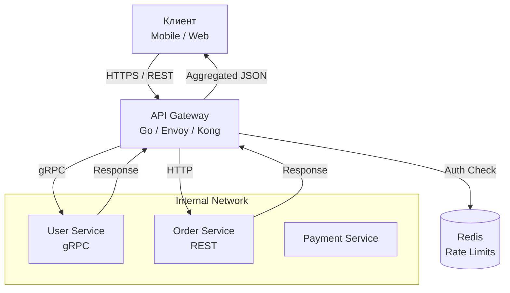

## API Gateway: Единая точка входа в микросервисный джунгли

В монолитной архитектуре клиент (браузер или мобильное приложение) общается с одним сервером. Все просто: один URL, один протокол, одна аутентификация.

В микросервисной архитектуре ситуация резко усложняется. У нас могут быть десятки или сотни сервисов: Auth Service, Order Service, Inventory Service, User Profile Service.
Если клиент будет обращаться к каждому сервису напрямую:
1.  **Сложность клиента**: Клиент должен знать адреса и порты всех сервисов.
2.  **Проблемы безопасности**: Внутренние сервисы (например, `Inventory`) не должны быть доступны из интернета.
3.  **Множество протоколов**: Внутри системы может использоваться gRPC, а клиент понимает только HTTP/REST.
4.  **Избыточные запросы**: Чтобы отрисовать одну страницу "Профиль пользователя", клиенту может потребоваться сделать 5-10 запросов к разным сервисам.

**API Gateway** — это паттерн, который решает эти проблемы, выступая единым "привратником" для всей системы.

---

## Что такое API Gateway?

API Gateway — это сервер, который является **единой точкой входа** (Single Entry Point) для всех клиентских запросов. Он работает как обратный прокси (Reverse Proxy), принимая запросы, маршрутизируя их к соответствующим микросервисам и возвращая агрегированный ответ.

> [!info] Под капотом
> С точки зрения сетевого стека, Gateway работает на L7 (Application Layer) модели OSI.
> Он разрывает TCP-соединение с клиентом, анализирует HTTP-заголовки, тело запроса (JSON/XML) и устанавливает новые соединения с бэкенд-сервисами.
> В Go это реализуется через мощный мультиплексор (ServeMux) или роутеры (Chi, Gin, Echo), которые позволяют не просто сопоставлять пути, но и выполнять сложную логику Middleware.

### Основные функции

1.  **Маршрутизация (Routing)**: Направляет запрос `/users/*` в User Service, а `/orders/*` в Order Service.
2.  **Аутентификация и Авторизация**: Проверяет JWT-токен или сессию перед тем, как пропустить запрос дальше. Внутренние сервисы освобождаются от этой обязанности.
3.  **Rate Limiting**: Защищает систему от DDoS и перегрузки, ограничивая количество запросов от конкретного клиента.
4.  **Агрегация данных**: Может сделать параллельные запросы в несколько сервисов и склеить ответ (Composer pattern).
5.  **Protocol Translation**: Превращает внешний REST-запрос во внутренний gRPC-вызов.



---

## Реализация API Gateway на Go

Хотя существуют готовые решения (Kong, Nginx, Envoy, Traefik), в Go-экосистеме часто пишут кастомные Gateway. Это позволяет гибко управлять бизнес-логикой агрегации и использовать единый tech stack.

### Простейший Reverse Proxy

В стандартной библиотеке Go есть пакет `net/http/httputil`, который содержит `ReverseProxy`. Это "кирпичик", из которого строится Gateway.

```go
package main

import (
	"log"
	"net/http"
	"net/http/httputil"
	"net/url"
)

func main() {
	// Адреса внутренних сервисов
	userServiceURL, _ := url.Parse("http://user-service:8081")
	orderServiceURL, _ := url.Parse("http://order-service:8082")

	// Создаем прокси для User Service
	userProxy := httputil.NewSingleHostReverseProxy(userServiceURL)
	// Создаем прокси для Order Service
	orderProxy := httputil.NewSingleHostReverseProxy(orderServiceURL)

	// Роутер
	mux := http.NewServeMux()

	// Маршрутизация
	mux.Handle("/users/", http.StripPrefix("/users", userProxy))
	mux.Handle("/orders/", http.StripPrefix("/orders", orderProxy))

	log.Println("API Gateway started on :8080")
	log.Fatal(http.ListenAndServe(":8080", mux))
}
```

### Расширение функционала: Middleware

Реальная сила Go-шлюха — в мидлварях. Здесь мы внедряем логику, общую для всех сервисов.

```go
// Middleware для аутентификации и логирования
func withMiddleware(next http.Handler) http.Handler {
	return http.HandlerFunc(func(w http.ResponseWriter, r *http.Request) {
		// 1. Логирование
		log.Printf("Request: %s %s", r.Method, r.URL.Path)
		start := time.Now()

		// 2. Аутентификация (проверка JWT)
		token := r.Header.Get("Authorization")
		if !validateToken(token) {
			http.Error(w, "Unauthorized", http.StatusUnauthorized)
			return // Прерываем цепочку
		}

		// 3. Rate Limiting (упрощенно)
		if isRateLimited(r.RemoteAddr) {
			http.Error(w, "Too Many Requests", http.StatusTooManyRequests)
			return
		}

		// 4. Вызов следующего обработчика
		next.ServeHTTP(w, r)

		// 5. Метрики
		duration := time.Since(start)
		metrics.ObserveRequestDuration(duration)
	})
}
```

### Director: Модификация запроса на лету

Часто нужно изменить запрос перед отправкой в сервис. Например, добавить заголовок `X-User-ID` после валидации токена, чтобы сервис знал, кто делает запрос, не парся токен заново.

Для этого используется поле `Director` в структуре `ReverseProxy`.

```go
proxy := &httputil.ReverseProxy{
	Director: func(req *http.Request) {
		// Перенаправляем запрос на целевой сервис
		req.URL.Scheme = targetURL.Scheme
		req.URL.Host = targetURL.Host
		req.URL.Path = targetURL.Path + req.URL.Path
		
		// Добавляем пользовательский заголовок
		// (допустим, мы извлекли userID из токена в мидлваре и положили в контекст)
		userID := ctx.Value("userID").(string)
		req.Header.Set("X-User-ID", userID)
		
		// Убираем заголовок Authorization, чтобы не "светить" токен во внутренней сети
		req.Header.Del("Authorization")
	},
}
```

---

## Mechanical Sympathy: Цена косвенности

API Gateway добавляет лишний сетевой хоп (hop). Это увеличивает Latency.

*   **Вариант "Прямо"**: Client -> Service (2 сетевых перехода: туда-обратно).
*   **Вариант "Gateway"**: Client -> Gateway -> Service -> Gateway -> Client (4 перехода + оверхед на обработку в Gateway).

В Go этот оверхед минимизирован благодаря горутинам. Gateway может держать тысячи открытых соединений (Keep-Alive) с бэкенд-сервисами, избегая дорогого TCP-handshake на каждом запросе.

> [!warning] Ловушка / Gotcha
> **Timeout Cascade (Каскад таймаутов).**
> Если клиент ждет ответ 30 секунд, а Gateway ждет бэкенд 29 секунд, а бэкенд делает запрос в БД с таймаутом 28 секунд, вы получаете гонку.
> Всегда настраивайте таймауты в Go через `context.WithTimeout`.
> 
> **Правило**: Timeout Gateway < Timeout Клиента. Timeout Бэкенда < Timeout Gateway.

```go
// В Director или Middleware
ctx, cancel := context.WithTimeout(r.Context(), 2*time.Second)
defer cancel()
r = r.WithContext(ctx)
```

---

## Агрегация данных (API Composition)

Частая задача Gateway — объединить данные из нескольких сервисов в один ответ, чтобы не мучать клиент множеством запросов (паттерн BFF — Backend for Frontend, хотя BFF — это более узкое понятие, о нем в следующей статье).

```go
func aggregateHandler(w http.ResponseWriter, r *http.Request) {
    var wg sync.WaitGroup
    userDataChan := make(chan []byte)
    orderDataChan := make(chan []byte)
    
    // Запрос 1: User Service
    wg.Add(1)
    go func() {
        defer wg.Done()
        resp, _ := http.Get("http://user-service/profile")
        body, _ := io.ReadAll(resp.Body)
        userDataChan <- body
    }()
    
    // Запрос 2: Order Service
    wg.Add(1)
    go func() {
        defer wg.Done()
        resp, _ := http.Get("http://order-service/history")
        body, _ := io.ReadAll(resp.Body)
        orderDataChan <- body
    }()
    
    // Ждем оба ответа
    go func() {
        wg.Wait()
        close(userDataChan)
        close(orderDataChan)
    }()
    
    userData := <-userDataChan
    orderData := <-orderDataChan
    
    // Склеиваем JSON
    combined := combineJSON(userData, orderData)
    w.Write(combined)
}
```

> [!tip] Собеседование
> **Вопрос:** В чем разница между API Gateway и Load Balancer?
> **Ответ:** Load Balancer работает на уровне L4 (TCP/UDP) или L7, но его задача — просто распределить трафик по инстансам *одного* сервиса по алгоритму Round Robin. API Gateway работает строго на L7, он понимает *смысл* запроса (URL, Headers), может трансформировать данные, агригировать их и управлять доступом. Gateway — это про логику, Balancer — про доступность и пропускную способность.

---

## API Gateway vs Service Mesh

С появлением Service Mesh (Istio, Linkerd), часть функций Gateway (routing, mTLS, observability) переехала на уровень инфраструктуры (Sidecar proxy).

*   **API Gateway**: Остается на границе системы (Edge), работая с внешним миром (Auth, Rate Limiting, DDoS protection).
*   **Service Mesh**: Работает внутри кластера, управляя общением "сервис-сервис".

Современная архитектура часто использует оба подхода: Ingress Gateway (на базе Envoy/Nginx) на входе, и Mesh внутри.

---

## Итог

1.  **API Gateway** — это фасад для микросервисов, скрывающий сложность внутренней архитектуры от клиента.
2.  На нем лежат сквозные задачи: Auth, Routing, Rate Limiting, Aggregation.
3.  В Go реализуется через `httputil.ReverseProxy` и цепочки middleware.
4.  Необходимо тщательно управлять **Timeouts** и **Connection Pools**, чтобы Gateway не стал узким местом.

В следующей статье мы рассмотрим более специализированный паттерн, который является подвидом Gateway — [[5. BFF]], когда мы создаем отдельные шлюзы для разных типов клиентов.