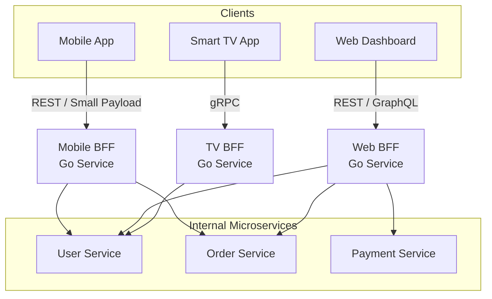

## BFF (Backend for Frontend): Специализация ради эффективности

В предыдущей статье мы рассмотрели [[4. API Gateway]] как универсальную точку входа. Но по мере роста системы выясняется, что "универсальность" — это компромисс.

Мобильное приложение требует компактных JSON-ответов для экономии трафика и батареи. Веб-приложение, наоборот, нужно богатое UI-состояние сразу (пагинация, фильтры, детали). Умные часы требуют вообще минимального набора данных. Если мы заставим все клиенты использовать один и тот же API, мы либо перегрузим мобильных пользователей лишними данными, либо заставим веб-клиент делать множество лишних запросов.

**BFF (Backend for Frontend)** — это паттерн, при котором мы создаем отдельный сервис (слой) для каждого конкретного типа клиента.

---

## Проблема "One Size Fits All"

Представьте ресурс "Профиль пользователя".
*   **Мобильный клиент**: Хочет только имя, аватар и статус. Интернет может быть дорогим или медленным (3G/4G).
*   **Веб-админка**: Хочет имя, историю заказов, последние логины, настройки подписки и график активности.

Если у вас один эндпоинт `GET /users/{id}`:
1.  Вы возвращаете "все и сразу". Мобильный клиент тратит трафик впустую, парсит мегабайты ненужного JSON.
2.  Вы возвращаете "минимум". Веб-клиент вынужден делать 5 дополнительных запросов к другим эндпоинтам, что увеличивает время отрисовки страницы (Time to Interactive).

---

## Суть паттерна BFF

BFF предлагает создать два разных бэкенд-сервиса:
1.  **Mobile BFF**: Оптимизирован под ограничения мобильных сетей.
2.  **Web BFF**: Оптимизирован под скорость работы UI и богатство данных.

Каждый BFF — это полноценный сервис на Go, который:
1.  Принимает запросы только от "своего" клиента.
2.  Обращается к внутренним микросервисам (User Service, Order Service).
3.  Агрегирует и трансформирует данные под нужды клиента.
4.  Возвращает идеально сформированный ответ.



---

## Реализация BFF на Go

BFF в Go — это, по сути, агрегатор. Он не содержит бизнес-логики (она в доменных сервисах), но содержит *логику представления* (Presentation Logic).

### Пример: Aggregation Pattern

Мобильный BFF хочет показать карточку заказа. Для этого нужны данные из Order Service и User Service.

```go
package main

import (
	"context"
	"encoding/json"
	"net/http"
	"sync"
	"time"
)

// Структура ответа, заточенная под мобильный UI
type MobileOrderView struct {
	OrderID    string `json:"order_id"`
	StatusText string `json:"status_text"` // Человекочитаемый статус
	Customer   string `json:"customer"`    // Только имя
	TotalPrice string `json:"total_price"` // Уже отформатированная валюта
}

type MobileBFF struct {
	orderClient *OrderClient
	userClient  *UserClient
}

func (b *MobileBFF) GetOrderDetails(w http.ResponseWriter, r *http.Request) {
	orderID := r.URL.Query().Get("id")
	ctx, cancel := context.WithTimeout(r.Context(), 2*time.Second)
	defer cancel()

	// Параллельный запрос в два сервиса
	var (
		order *Order
		user  *User
		err   error
	)

	var wg sync.WaitGroup
	wg.Add(2)

	// Запрос 1: Заказ
	go func() {
		defer wg.Done()
		order, err = b.orderClient.GetOrder(ctx, orderID)
	}()

	// Запрос 2: Пользователь
	go func() {
		defer wg.Done()
		user, err = b.userClient.GetUser(ctx, order.UserID) // Допустим, знаем ID
	}()

	wg.Wait()

	if err != nil {
		http.Error(w, "Internal error", http.StatusInternalServerError)
		return
	}

	// Трансформация данных под клиента
	view := MobileOrderView{
		OrderID:    order.ID,
		StatusText: localizeStatus(order.Status), // Локализация для мобильного
		Customer:   user.Name,
		TotalPrice: formatCurrency(order.Total, user.Locale),
	}

	json.NewEncoder(w).Encode(view)
}
```

### Особенности реализации

1.  **Конкурентность**: Go идеально подходит для BFF благодаря горутинам. Запросы к внутренним сервисам (`wg.Add`) выполняются параллельно, сокращая общую latency.
2.  **Отказоустойчивость**: BFF должен быть устойчив к падениям бэкендов. Используйте Circuit Breaker и Fallback значения. Если сервис рекомендаций упал, покажите "похожие товары" из кэша, а не 500 ошибку.
3.  **Таймауты**: BFF — это граница. Он должен жестко контролировать таймауты, чтобы не держать соединение с мобильным клиентом бесконечно.

---

## Mechanical Sympathy: Сетевой аспект

Почему BFF лучше, чем прямой вызов клиентом множества сервисов?

1.  **Сокращение Round Trips**:
    *   *Без BFF (Mobile -> Service A, Mobile -> Service B)*: 2 круга по "медленному" мобильному интернету (RTT ~100-300ms). Итоговая задержка: 200-600ms.
    *   *С BFF (Mobile -> BFF)*: 1 круг по мобильному интернету. BFF делает 2 вызова внутри дата-центра по быстрой сети (RTT ~1ms). Итоговая задержка: ~100-150ms + время работы сервера.
    *   **Выигрыш**: Кратное уменьшение latency для пользователя.

2.  **Экономия трафика**:
    *   Внутри дата-центра BFF может общаться с сервисами по бинарному протоколу gRPC (быстро, компактно).
    *   С мобильным клиентом BFF общается по HTTP/JSON (или protobuf, если клиент поддерживает).
    *   BFF выступает "транслятором", отрезая лишние поля и сжимая данные перед отправкой в "медленный мир".

---

## Анти-паттерн: Размывание ответственности

Главная опасность BFF — соблазн перенести в него бизнес-логику.

> [!warning] Ловушка / Gotcha
> BFF не должен валидировать бизнес-правила (например, "может ли пользователь купить этот товар?"). Это задача Domain Service. BFF только *показывает* результат или *отправляет* команду.
> Если вы начнете писать бизнес-логику в BFF, вы получите "Распределенный Монолит", где логика дублируется в Mobile BFF и Web BFF.

**Что можно в BFF:**
*   Форматирование дат и валют.
*   Фильтрация полей (hide sensitive data).
*   Агрегация данных из нескольких источников.
*   Адаптация протоколов (gRPC -> REST).

**Что нельзя:**
*   Расчет скидок.
*   Проверку прав доступа (кроме базовой маршрутизации).
*   Прямую запись в базу данных.

---

## BFF и GraphQL

Web BFF часто реализуют не на REST, а на GraphQL.
Почему? Веб-интерфейсы часто меняются. Добавить поле в форму — значит, менять API. GraphQL позволяет фронтенду самому запрашивать ровно те поля, которые нужны сейчас, без переделки BFF.

Go имеет отличные библиотеки для GraphQL (например, `gqlgen`).

```go
// В Web BFF на GraphQL фронтенд сам решает, что ему нужно
// Query {
//   user(id: "1") {
//     name
//     lastLogin // Web хочет это, а Mobile - нет
//     orders(first: 5) {
//       items { title }
//     }
//   }
// }
```
Mobile BFF в этом случае может остаться на REST для простоты и предсказуемости расхода батареи.

---

## Итог

1.  **BFF** — это сервис-посредник, заточенный под конкретный интерфейс пользователя.
2.  Он решает проблему "Chatty API" (много мелких запросов) и "Overfetching" (лишние данные).
3.  **Go** идеален для BFF благодаря легковесным горутинам для параллельной агрегации данных.
4.  Главная сложность — не превратить BFF в свалку бизнес-логики и поддерживать синхронизацию между разными BFF, если их функционал пересекается.

В следующей статье мы рассмотрим [[6. Backend for frontend]], где разберем практические аспекты реализации этого паттерна и варианты его эволюции.