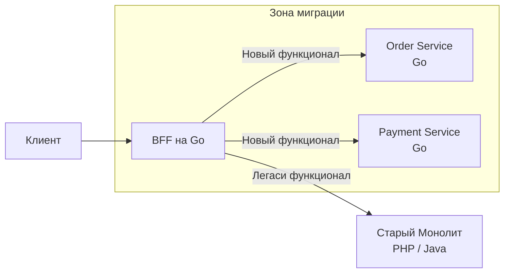

## Backend for Frontend: Глубокое погружение и организация команды

В предыдущей статье мы рассмотрели [[5. BFF]] как паттерн проектирования API. Но термин **Backend for Frontend (BFF)** — это не просто архитектурный компонент, это организационная концепция, меняющая взаимодействие команд разработки.

Если кратко: **BFF — это сервис, который принадлежит команде фронтенда.**

В классической модели бэкенд-разработчики создают "универсальный API", а фронтендеры страдают, подгоняя его под свои нужды. В модели BFF фронтенд-команда сама контролирует слой, отвечающий за доставку данных в их UI.

---

## Организационный аспект: Team Topology

В современных подходах к DevOps (например, *Team Topologies* by Matthew Skelton) выделяют четыре типа команд:
1.  **Stream-aligned teams**: Команды, создающие ценность для пользователя (например, "Команда поиска", "Команда оформления заказа").
2.  **Enabling teams**: Помогают другим командам (методологи, архитекторы).
3.  **Complicated subsystem teams**: Эксперты по сложным частям (БД, AI).
4.  **Platform teams**: Создают инструменты для других команд.

**BFF-команда** — это часто подтип Stream-aligned команды. Они отвечают за "User Experience" целиком: от кнопки в браузере до BFF-слоя.

> [!info] Под капотом
> Этот подход снижает "фрикцию" (трение) между фронтендом и бэкендом.
> *   **Было**: Фронтендер создает тикет в Jira бэкенд-команды: "Добавь поле `userName` в ручку `/order`". Бэкенд-команда ставит задачу в бэклог на 2 недели спустя.
> *   **Стало**: Фронтендер сам правит код в BFF (на Go или Node.js), добавляет агрегацию и деплоит, не дергая основную бэкенд-команду.

---

## Эволюция BFF: От Monolith to Micro-frontends

BFF часто становится "спасательным кругом" при миграции с монолита.

### Сценарий: Strangler Fig Pattern

У вас есть огромный легаси-монолит на PHP или Java. Вы хотите переписать систему на Go.
Вместо переписывания всего сразу, вы ставите перед монолитом **BFF на Go**.

1.  Новый функционал пишется в микросервисах на Go.
2.  BFF направляет запросы к новым сервисам.
3.  Старый функционал проксируется в легаси-монолит.
4.  Постепенно "лепестки" монолита отмирают, и BFF начинает общаться только с новыми сервисами.



---

## Проблема разделения ресурсов

Если у вас 5 разных фронтендов (iOS, Android, Web, TV, Watch), создает ли это 5 разных BFF?
Это называется **BFF Explosion**. Поддерживать 5 кодовых баз — дорого.

**Решение: Shared Kernel (Общее ядро)**.

Вы можете написать BFF на Go, где:
1.  **Core** — общая часть (клиенты к сервисам, модели данных, логика ретраев).
2.  **Transport Layer** — разные эндпоинты для разных клиентов.

Или использовать **GraphQL Federation**. В этом случае BFF превращается в GraphQL Gateway, где фронтенды сами запрашивают нужные поля, и вам не нужно писать отдельные ручки `/mobile/order` и `/web/order`.

---

## Backend for Frontend и Code Sharing

Главная проблема BFF — дублирование кода трансформации данных.
Фронтенд на TypeScript ожидает интерфейс `User`. Бэкенд на Go отдает структуру `UserDTO`.
Чтобы не синхронизировать их вручную, используют генерацию кода.

### OpenAPI / Swagger Specification

Мы описываем контракт API BFF в YAML (OpenAPI).
1.  Бэкенд-генератор создает Go-код (структуры и интерфейсы) для BFF.
2.  Фронтенд-генератор создает TypeScript-интерфейсы для клиента.

Это гарантирует, что если в Go-структуре появилось поле, оно автоматически появится в TypeScript типах.

```go
//go:generate go run github.com/deepmap/oapi-codegen/cmd/oapi-codegen --package=api -generate types api.yaml
//go:generate go run github.com/deepmap/oapi-codegen/cmd/oapi-codegen --package=api -generate gin api.yaml

// Код в BFF автоматически генерируется из спецификации
// Фронтенд использует ту же спецификацию для генерации TS-типов.
```

---

## Mechanical Sympathy: Go vs Node.js для BFF

Исторически BFF часто писали на Node.js, так как "фронтендеры знают JavaScript". Однако для высоконагруженных систем **Go** подходит лучше.

1.  **Типобезопасность**: Go — строго типизированный язык. Если контракт меняется, вы узнаете об ошибке компиляции, а не в рантайме (в отличие от слабой типизации JS).
2.  **Производительность**:
    *   Node.js работает в одном потоке (Event Loop). Если BFF делает тяжелую трансформацию JSON, он блокирует Event Loop, и запросы висят.
    *   Go использует горутины. Тяжелая задача выполняется параллельно и не блокирует остальные запросы.
3.  **Потребление памяти**: Сервисы на Go потребляют значительно меньше памяти, что критично в Kubernetes, где вы платите за ресурсы.

> [!tip] Собеседование
> **Вопрос:** Кто должен писать BFF?
> **Ответ:** Команда, отвечающая за фронтенд (Full-stack команда). Но выбор языка (Go vs Node.js) зависит от компетенций команды и требований к нагрузке. Если фронтендеры знают только JS — Node.js. Если важна производительность и строгая типизация — Go. Go проще в изучении для бэкенд-разработчиков, чем C++ или Java, и часто "фулстеки" быстро осваивают его.

---

## Итог

1.  **Backend for Frontend** — это паттерн, который ставит потребности UI во главу угла.
2.  Он снижает коммуникационные издержки между фронтендом и бэкендом, позволяя фронтенд-командам самостоятельно развивать API.
3.  Go — отличный выбор для BFF благодаря производительности, строгой типизации и отличной поддержке генерации кода (OpenAPI, Protobuf).
4.  BFF помогает в миграции с монолита (Strangler Fig Pattern).

В следующей статье мы разберем, чего делать **не стоит**, и рассмотрим [[7. Anti patterns микросервисов]], чтобы избежать типичных ошибок при построении распределенных систем.