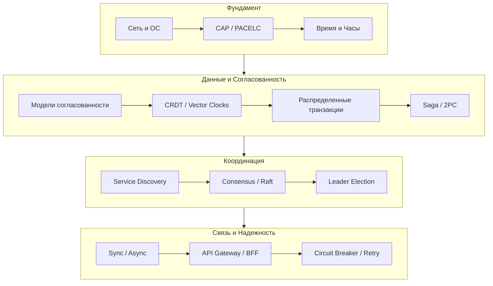

## От теории к практике: Итоги раздела распределенных систем

Мы завершили масштабное путешествие по миру распределенных систем. Мы начали с фундаментальных вопросов «Почему это так сложно?» в статье [[1. Обзор раздела. Почему распределенные системы сложны]], прошли через дебри консенсуса и сетевых паттернов, и закончили разбором архитектурных паттернов и антипаттернов.

В этом итоге мы структурируем полученные знания и сформируем «инженерный компас» для принятия архитектурных решений.

---

## Главный урок: Fallacies of Distributed Computing

Если из этого раздела нужно запомнить только одну вещь, то это **Заблуждения распределенных вычислений**. Все проблемы, которые мы решали (Saga, Raft, Circuit Breaker, Observability), возникают из-за того, что разработчики забывают об этих аксиомах:

1.  **Сеть надежна**. Нет. Мы проектировали [[1. Retry и backoff]] и [[1. Circuit breaker]], потому что пакеты теряются.
2.  **Latency равна нулю**. Нет. Мы обсуждали Mechanical Sympathy и почему вызов функции в памяти несравним с RPC.
3.  **Пропускная способность бесконечна**. Нет. Мы внедряли [[6. Rate limiting]] и [[5. Load shedding]].
4.  **Топология не меняется**. Нет. Мы изучали [[8. Service discovery]].
5.  **Существует один администратор**. Нет. Мы говорили о Chaos Engineering и [[10. Постмортемы]].

> [!tip] Собеседование
> На вопрос «Какие главные вызовы в микросервисах?» всегда начинайте с заблуждений сети. Это покажет вашу зрелость. Senior Engineer знает, что сеть — это враг, с которым нужно заключить перемирие с помощью паттернов надежности.

---

## Слои архитектуры: Итоговая карта

Распределенная система — это слоеный пирог. Ошибка на одном уровне ломает уровни выше.

### Уровень 1: Фундамент
Здесь живут сетевые протоколы (TCP/UDP/gRPC) и теоретические ограничения (CAP теорема). Выбор здесь определяет, какую цену мы платим за доступность. Мы выяснили, что в реальности редко выбирают CP или AP в чистом виде, а следуем PACELC: жертвуем Latency ради Consistency или Availability ради Latency.

### Уровень 2: Данные
Данные — самое ценное, и самое сложное для переноса в распределенную среду. Мы изучили, как избежать распределенных транзакций (паттерн Saga) и как разрешать конфликты без блокировок (CRDT).
*   **Ключевой инсайт**: В Go работа с данными в распределенной среде требует строгого подхода к сериализации (Protobuf) и понимания стоимости аллокаций при маршлинге JSON.

### Уровень 3: Координация
Сервисы должны находить друг друга (Discovery) и договариваться о состоянии (Consensus).
*   **Ключевой инсайт**: Избегайте координации там, где это возможно. Если сервисы могут работать автономно (Event Sourcing, CQRS), масштабируйте их линейно. Если им нужно голосование (Raft) или блокировка (Distributed Locks) — масштабирование ограничено скоростью согласования.

### Уровень 4: Связь и Надежность
Это "лицо" системы. API Gateway, BFF, gRPC, Event Bus.
*   **Ключевой инсайт**: Переход от синхронного общения к асинхронному (Message Brokers) — это переход от хрупкости к устойчивости. Система перестает падать целиком при отказе одной части.

---

## Роль Go в распределенных системах

Почему именно Go стал «языком облака» для этого раздела?

1.  **Горутины как средство борьбы с Latency**:
    В статье [[3. Latency и network fallacies]] мы выяснили, что сеть медленная. Если бы мы использовали модель "один поток на соединение" (как Java Thread per request в старых версиях или PHP с блокирующим I/O), наши серверы тратили бы гигабайты памяти на простаивающие стеки. Горутины позволяют держать тысячи «зависших» в ожидании сети запросов с минимальными затратами RAM (2KB стек).

2.  **Каналы и Concurrent Programming**:
    Паттерны [[1. Circuit breaker]] или Worker Pools реализуются в Go элегантно и безопасно благодаря философии CSP (Communicating Sequential Processes). Не нужно мучиться с Mutex и Condition Variables так часто, как в C++ или Java.

3.  **Статическая типизация и скорость компиляции**:
    В мире сотен микросервисов возможность быстро скомпилировать бинарник и быть уверенным в типах интерфейсов (где это критично) ускоряет цикл разработки (Time to Market).

4.  **Инструментарий**:
    Docker, Kubernetes, Prometheus, Consul, Terraform — всё это написано на Go. Понимая внутренности языка, вы лучше понимаете инструменты, которыми управляете инфраструктурой.

---

## Чек-лист зрелости архитектора

Проверьте себя. Умеете ли вы ответить на эти вопросы при проектировании системы?

*   **Если сетевой разделитель (Partition)** случится между БД и сервисом, что произойдет с данными? (Потеряются? Восстановятся? Заблокируются?)
*   **Если latency** между сервисами вырастет с 5мс до 500мс, выдержит ли ваш Connection Pool? Не упадет ли Gateway по таймауту?
*   **Если нагрузка** вырастет в 10 раз, какие части системы придется масштабировать? Есть ли там Singleton-узлы (лидеры Raft), которые станут узким горлышком?
*   **Как откатить** изменения, если деплой новой версии сломал продакшн? Понимаете ли вы, что в распределенных системах откат кода не откатывает состояние данных?