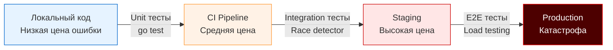

В большинстве языков программирования тестирование — это надстройка. В Java вам нужен JUnit и Maven/Gradle, в C# — xUnit или NUnit, в Python — pytest, в PHP — PHPUnit. Вы тянете сторонние зависимости, настраиваете раннеры и пишете сложные конфигурации просто для того, чтобы запустить первый тест. 

Когда разработчики приходят в Go, они часто испытывают культурный шок. В Go тестирование — это гражданин первого класса (first-class citizen). Инструментарий встроен прямо в тулчейн (`go test`), а пакет `testing` является частью стандартной библиотеки. Вам не нужно ничего скачивать, чтобы начать писать production-ready тесты, бенчмарки и даже фаззинг.

Этот раздел базы знаний посвящен хардкорной инженерии качества в Go. Мы не просто будем писать `if a != b { t.Fail() }`. Мы разберем, как архитектура вашего кода влияет на тестируемость, как заглянуть "под капот" тестов, как управлять побочными эффектами и как тестировать конкурентный код так, чтобы потом не просыпаться от алертов в 3 часа ночи.

## Философия тестирования в Go

Создатели Go (Роб Пайк, Кен Томпсон, Роберт Гризмер) заложили в язык прагматичный подход. В Go нет встроенных `assert`-ов (хотя мы обсудим сторонние библиотеки позже). Язык заставляет вас обрабатывать ошибки в тестах точно так же, как вы делаете это в бизнес-логике. 

**Тестирование в Go — это не просто проверка на баги. Это инструмент архитектурного дизайна.**

Если функцию сложно протестировать в Go, это почти всегда означает, что она плохо спроектирована. В языках с динамической типизацией (Python, PHP, Ruby) вы можете использовать "monkey patching" — подменить любую функцию или класс в рантайме. В Go статическая типизация и строгий компилятор лишают вас этой возможности. Вы не можете просто так подменить вызов к базе данных на заглушку, если ваша функция жестко завязана на глобальный объект `sql.DB`. Вам *придется* внедрять зависимости (Dependency Injection) и использовать интерфейсы (см. [[4. Testability и дизайн кода]]).

> [!info] Под капотом
> Как работает команда `go test`? 
> Когда вы запускаете тесты, Go не выполняет ваш код интерпретатором. Инструмент `go test` сканирует файлы `*_test.go`, генерирует "на лету" временный файл `main.go` (точку входа), собирает ваш пакет вместе с тестами в отдельный бинарный файл (`executable`), запускает этот бинарник, собирает результаты и затем удаляет его.
> Именно поэтому тесты в Go выполняются так быстро: вы запускаете нативно скомпилированный машинный код. Это также означает, что ваши тесты подвержены всем тем же правилам оптимизации компилятора, escape-анализу и работе Garbage Collector-а, что и основной код.

## Место тестирования в жизненном цикле Backend-системы

Ошибки в распределенных системах стоят дорого. Если вы пропустили deadlock или состояние гонки (data race) на локальной машине, обнаружить его на production-серверах с тысячами RPS будет стоить вам недель дебага и миллионов сожженных нервных клеток.

Чем раньше найдена ошибка, тем дешевле ее исправить (правило "Shift Left").

В бэкенде мы пишем не просто скрипты, мы пишем демоны, которые работают 24/7, обрабатывают сотни тысяч горутин и постоянно взаимодействуют с I/O (сеть, диски, БД). Тестирование такого кода требует специфичного подхода:
1. **Детерминизм:** Тесты должны выдавать один и тот же результат всегда. Если тест иногда падает — это не тест, это генератор шума.
2. **Изоляция окружения:** Ваш код не должен лезть в "боевую" БД. Мы будем активно разбирать подходы с использованием интерфейсов и поднятием локальных контейнеров (см. [[4. testcontainers go]]).
3. **Механическая симпатия (Mechanical Sympathy):** Вы должны понимать, как ваш код использует ресурсы. Пакет `testing` дает встроенные инструменты для бенчмаркинга. Мы научимся измерять не только время выполнения, но и количество аллокаций памяти (`B/op`, `allocs/op`), потому что каждая лишняя аллокация в горячем контуре бэкенда нагружает GC и увеличивает latency (задержку) ответа сервера.

> [!tip] Собеседование
> **Вопрос:** Почему в Go принято писать `if err != nil` в тестах, а не использовать макросы типа `ASSERT_EQ` как в C++?
> **Ответ:** Дизайн языка поощряет явное программирование без "магии". Использование обычного Go-кода (`if a != b`) позволяет писать сложную логику проверок, выводить детализированные сообщения об ошибках с помощью `t.Errorf` и не прерывать выполнение теста при первой же ошибке (в отличие от panic-подобных ассертов), что дает больше контекста о том, что именно сломалось. Впрочем, на практике в production-коде часто используют библиотеку `testify` для сокращения бойлерплейта, но знание "ванильного" подхода обязательно.

## Ловушки: к чему нужно быть готовым

Переход на Go-тестирование требует изменения привычек:
* **Глобальное состояние:** Глобальные переменные (даже синглтоны) — ваш главный враг в Go. Если вы запустите тесты параллельно через `t.Parallel()`, глобальное состояние приведет к непредсказуемым Data Races и падениям.
* **Горутины-зомби:** Если функция в тесте порождает горутину, которая блокируется навсегда (например, ждет чтения из пустого канала), тест завершится, но горутина останется висеть в памяти (Goroutine leak), что может аффектить последующие тесты в этом же бинарнике.
* **Пакетные циклы (Import Cycles):** Go строго запрещает циклические импорты. Часто при попытке написать тест в отдельном пакете `mypackage_test` разработчик сталкивается с тем, что не может импортировать нужные зависимости без создания кольца. Это лечится правильным архитектурным разделением.

## Что вас ждет в этом разделе?

Мы пройдем путь от написания банального Unit-теста до сложных интеграционных пайплайнов и поиска плавающих багов. Раздел разбит на несколько логических блоков:

1. **Фундамент и философия:** Разберем виды тестов, пирамиду тестирования и принципы написания "тестопригодного" (testable) кода.
2. **Инструментарий `testing`:** Полный разбор стандартной библиотеки, table-driven тестов, параллелизма и управления жизненным циклом теста.
3. **Моки и зависимости:** Как правильно подменять слои. Ручные моки против генерации (gomock, testify). Концепция интерфейсов потребителя (Consumer Interfaces).
4. **Интеграционное тестирование:** Как тестировать базу данных без боли? Транзакции, откаты (rollbacks), миграции "на лету" и Testcontainers.
5. **Сетевое взаимодействие:** Поднятие HTTP и gRPC серверов прямо в тестах с помощью пакета `net/http/httptest`.
6. **Конкурентность и Фаззинг:** Охота на Data Race и дедлоки. Использование встроенного в Go фаззера (см. [[1. Встроенный fuzzing в Go]]) для автоматического поиска edge-кейсов.
7. **Производительность:** Бенчмарки, профилирование прямо из тестов и поиск узких мест (bottlenecks).

Настоящий Senior-инженер тратит на проектирование тестов и инфраструктуры вокруг них не меньше времени, чем на саму бизнес-логику. Готовы погрузиться? Переходим к классификации: [[2. Виды тестирования. Unit, Integration, E2E]].