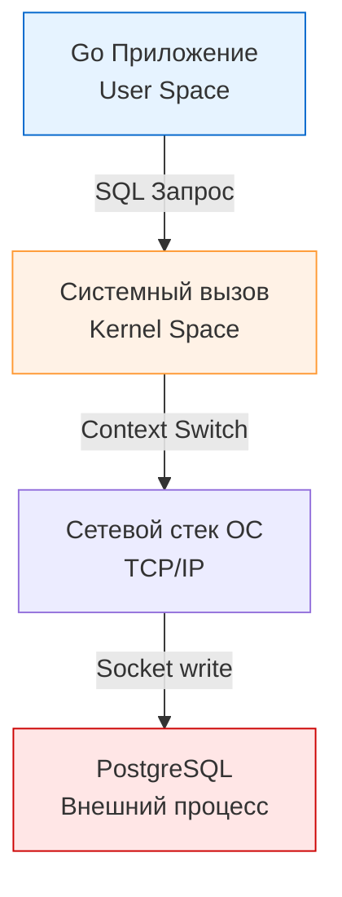
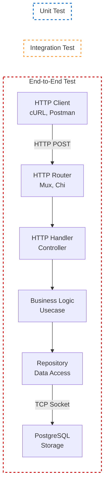

## Анатомия доверия: Зачем нам разные уровни тестирования?

Когда вы пишете микросервис на Go, ваша конечная цель — не просто выполнить набор инструкций в CPU, а корректно обработать входящий запрос (например, по HTTP или gRPC), выполнить бизнес-логику, обновить состояние в базе данных и вернуть ответ. 

Ни один инструмент не может эффективно протестировать эту цепочку за один проход с оптимальным соотношением "скорость/надежность". Если мы будем тестировать всё только через поднятие реальной базы данных и отправку реальных HTTP-запросов, наши тесты будут идти часами. Если мы замокаем абсолютно всё — мы получим "зеленый" пайплайн, который падает в production при первой же реальной интеграции из-за опечатки в SQL-запросе или несовпадения контрактов API.

Поэтому тестирование в бэкенде разделяется на три фундаментальных уровня, каждый из которых решает свою инженерную задачу и имеет разную цену (в терминах CPU, времени разработчика и обслуживания).

---

## 1. Unit-тестирование (Модульные тесты)

**Unit-тесты** проверяют наименьшую тестируемую часть кода в полной изоляции. В контексте Go "юнитом" обычно выступает отдельная функция, метод или структура с её поведением.

Главное правило Unit-теста: **Он не должен покидать пределы процесса и User Space.**

### Mechanical Sympathy и Unit-тесты
В идеальном Unit-тесте нет I/O операций. Нет сети, нет чтения с диска, нет общения с ядром ОС через системные вызовы (syscalls). Вся работа происходит исключительно в оперативной памяти и кэшах L1/L2/L3 процессора. 
Благодаря этому планировщик Go (Goroutine scheduler) не отправляет горутины тестов в состояние ожидания (waiting), треды ОС (M) не блокируются, и тысяча unit-тестов может выполниться за несколько миллисекунд.

**Что мы тестируем здесь:**
* Алгоритмы и бизнес-правила.
* Сложные математические вычисления.
* Валидацию данных (например, проверку JWT-токена, если секрет передан в памяти).
* State-машины.

```go
// Сервис корзины покупок (бизнес-логика, не знает про БД)
package cart

import "errors"

var ErrNegativeQuantity = errors.New("quantity cannot be negative")

type Cart struct {
	Items map[string]int
}

func (c *Cart) AddItem(itemID string, qty int) error {
	if qty < 0 {
		return ErrNegativeQuantity
	}
	c.Items[itemID] += qty
	return nil
}
```

> [!info] Под капотом: Пакеты в Go и тестирование
> В Go есть два подхода к Unit-тестированию: **White-box** и **Black-box**.
> 1. Если ваш файл называется `cart_test.go` и имеет `package cart`, вы получаете доступ к неэкспортируемым (приватным) полям и методам. Это white-box тестирование.
> 2. Если файл имеет `package cart_test`, тест компилируется как внешний пакет. Вы можете тестировать *только* публичный API вашего пакета (экспортируемые функции). Это Black-box подход, который Go-сообщество настоятельно рекомендует, так как он заставляет тестировать поведение, а не внутреннюю реализацию (которая может часто рефакториться).

> [!warning] Ловушка / Gotcha
> Огромная ошибка пришедших из других языков — пытаться тестировать приватные функции "насильно". Если приватную функцию сложно протестировать через публичный метод, это сигнал архитектурной проблемы. Скорее всего, приватная функция делает слишком много и её нужно вынести в отдельный компонент (интерфейс) и тестировать уже его публичный API.

---

## 2. Integration-тестирование (Интеграционные тесты)

Если Unit-тесты гарантируют, что шестеренки крутятся правильно, то **Интеграционные тесты** проверяют, что шестеренки цепляются друг за друга. 

Здесь мы пересекаем границу нашего Go-приложения. Интеграционный тест **обязан** делать системные вызовы, ходить по сети или общаться с файловой системой.

**Что мы тестируем здесь:**
* Репозитории (Data Access Layer) — отправляем реальные SQL-запросы в реальную базу данных.
* HTTP-клиенты — делаем запросы к реальным (или тестовым) внешним API.
* Продюсеры/Консьюмеры очередей — пишем в Kafka/RabbitMQ и читаем оттуда.

### Цена интеграционного теста
В момент, когда ваш Go-код делает `db.QueryRow()`, происходит `syscall` (например, `sendto` или `write` в сокет). Горутина переходит в состояние `Gsyscall`, планировщик (P) может отцепиться от треда (M), чтобы не простаивать, пока по сети летит TCP-пакет к базе данных. 
Тест становится **I/O bound**. Его скорость выполнения падает на несколько порядков по сравнению с Unit-тестом (миллисекунды против наносекунд).



В современном Go для таких тестов стандартом де-факто стал подход с поднятием эфемерных контейнеров (см. [[4. testcontainers go]]). Вы не мокаете базу, вы поднимаете настоящий PostgreSQL в Docker прямо из кода теста, прогоняете миграции, тестируете репозиторий и "убиваете" контейнер.

> [!tip] Собеседование
> **Вопрос:** В чем разница между тестированием HTTP-хендлера через `httptest.ResponseRecorder` и `httptest.NewServer`?
> **Ответ:** Это тонкая грань между Unit и Integration тестом. `ResponseRecorder` просто передает структуры данных `http.Request` напрямую в функцию хендлера. Сетевой стек ОС не задействован, системных вызовов нет — это **Unit-тест**. `httptest.NewServer` реально открывает TCP-порт (слушает `127.0.0.1`), и клиент делает настоящий HTTP-запрос через сетевой интерфейс loopback (с участием ядра ОС) — это **Интеграционный тест**.

---

## 3. E2E-тестирование (End-to-End, Сквозное тестирование)

E2E тест рассматривает вашу систему как "черный ящик", полностью собранный и запущенный в среде, максимально приближенной к production. 

Вы не вызываете Go-функции напрямую. Вы компилируете бинарник, запускаете его, он подключается к своим базам данным, кэшам и брокерам сообщений. Тестовый скрипт (который может быть написан на Go, а может и на Python/JS) выступает в роли конечного клиента (например, мобильного приложения или фронтенда).

**Что мы тестируем здесь:**
* Общую конфигурацию (Dependency Injection, чтение env-переменных).
* Работу middleware (аутентификация, rate-limiting, CORS).
* Деградацию системы (например, что отдаст API, если отвалился Redis-кэш).

В E2E тестах максимальная задержка и максимальная вероятность flaky-тестов (плавающих ошибок) из-за сетевых тайм-аутов, гонок при инициализации системы и асинхронных процессов.

---

## Резюме: Распределение зон ответственности

Для наглядности, давайте посмотрим, какие компоненты покрывает каждый вид тестирования при обработке типичного REST API запроса на создание пользователя:



Понимание этих границ критично для проектирования пайплайнов CI/CD. Unit-тесты запускаются на каждый коммит и отрабатывают за секунды. Integration и E2E тесты запускаются перед мерджем в `master` или перед релизом, так как требуют поднятия инфраструктуры.

Как найти правильный баланс между этими тремя видами тестов, чтобы не разориться на поддержке кода, но при этом спать спокойно, когда ваш сервис деплоится в пятницу вечером? Об этом мы поговорим в следующей статье: [[3. Пирамида тестирования]].