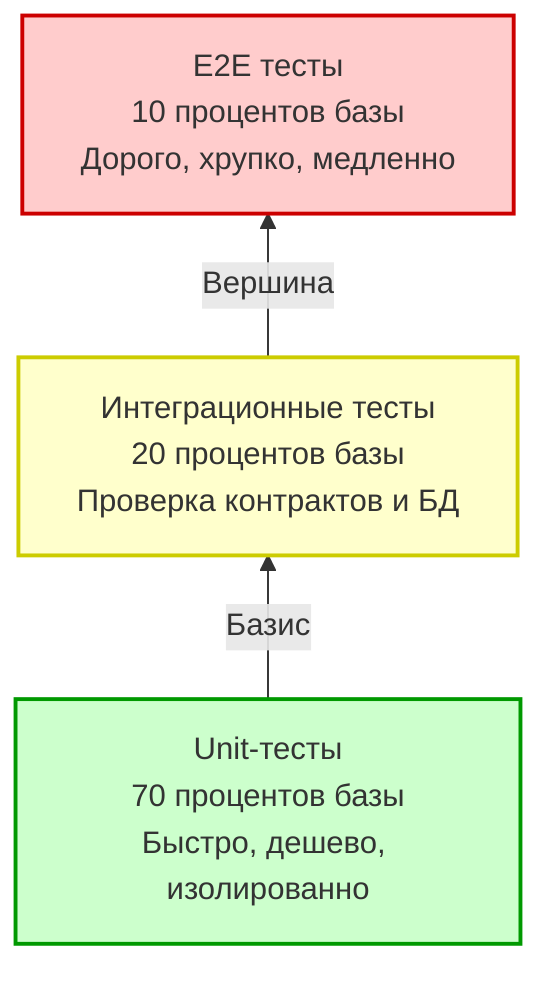
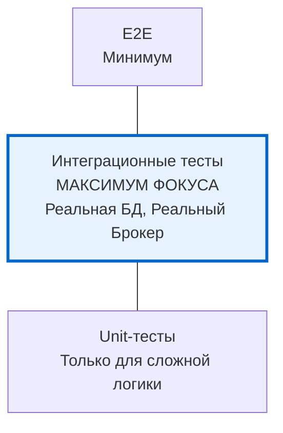

В предыдущей статье [[2. Виды тестирования. Unit, Integration, E2E]] мы определили физические и логические границы различных видов тестов. Мы выяснили, что Unit-тест живет исключительно в оперативной памяти, а интеграционный — заставляет ОС совершать полезную, но дорогую работу с IO.

Теперь возникает архитектурный вопрос: в какой пропорции мы должны писать эти тесты? Если интеграционные тесты дают больше уверенности в работоспособности системы (ведь они проверяют реальную базу), почему бы не писать *только* их? Ответ кроется в концепции **Пирамиды тестирования**.

## Классическая пирамида тестирования

Концепция пирамиды была предложена Майком Коном (Mike Cohn) в начале 2000-х. Её суть проста: тесты должны быть распределены по уровням в зависимости от их скорости выполнения, стоимости написания и уровня изоляции.

Чем выше мы поднимаемся по пирамиде, тем:
1. Выше **уверенность** в том, что фича работает для конечного пользователя.
2. Выше **стоимость** написания и поддержки теста.
3. Ниже **скорость** выполнения.
4. Выше шанс получить **flaky** тест (плавающий тест, который падает из-за сетевых таймаутов или гонок в окружении, а не из-за бага в коде).

### Mechanical Sympathy Пирамиды

Давайте посмотрим на пирамиду глазами планировщика Go (G-M-P) и железа:

* **Фундамент (Unit):** Когда вы запускаете 1000 unit-тестов, они выполняются в User Space. Горутины тестов (G) быстро сменяют друг друга на логических процессорах (P). Память аллоцируется в L1/L2 кэшах процессора. Нет системных вызовов. Выполнение занимает микросекунды.
* **Середина (Integration):** Запуск 100 интеграционных тестов с реальным PostgreSQL требует открытия TCP-сокетов. Горутина делает syscall `write` (отправка SQL), после чего планировщик паркует горутину в `netpoller`, освобождая тред (M) для других задач. Когда БД отвечает, приходит аппаратное прерывание, ОС будит `netpoller`, и горутина возвращается в очередь на выполнение. Это огромный оверхед (переключение контекста, сетевые задержки). Тест занимает миллисекунды или секунды.

> [!info] Под капотом: t.Parallel() на разных слоях
> В Go есть отличный инструмент `t.Parallel()`, который запускает тесты конкурентно. 
> В слое Unit-тестов это работает идеально: тесты утилизируют все ядра вашего процессора на 100%. 
> Но если вы бездумно примените `t.Parallel()` к сотне интеграционных тестов, каждая горутина-тест попытается открыть TCP-соединение с БД. Вы мгновенно исчерпаете пул соединений (`max_connections` в Postgres или лимит открытых файловых дескрипторов в Linux `ulimit -n`). Интеграционные тесты требуют строгой оркестрации ресурсов.

## Эволюция пирамиды: Go и микросервисы

Классическая пирамида отлично работала для больших монолитов со сложной доменной логикой. Но современный Go-бэкенд — это часто набор микросервисов. 

Представьте типичный микросервис на Go: он принимает JSON по HTTP, валидирует поля, делает простейший `INSERT` в PostgreSQL и кладет сообщение в Kafka. 
Где здесь алгоритмы? Их нет. Бизнес-логика сводится к перекладыванию байтов. 

Если в таком сервисе следовать классической пирамиде (70% Unit-тестов), вам придется писать моки для БД (через `gomock` или `sqlmock`) и моки для Kafka. Вы напишете тысячи строк кода, который просто проверяет, что "метод X вызвал мок Y с аргументом Z". Такие тесты **не проверяют ничего полезного**. Вы деплоите сервис на прод, и он падает, потому что вы забыли добавить колонку в таблицу, а моки об этом не знали.

Поэтому в экосистеме Go (и микросервисов в целом) популярность набирает **Testing Honeycomb** (Соты тестирования), концепция, популяризованная инженерами Spotify.

Благодаря легковесности Go, встроенному `net/http/httptest` и таким инструментам как [[4. testcontainers go]], мы можем поднимать реальное окружение прямо в рамках `go test` за секунды. 

В Go-микросервисах **интеграционные тесты становятся ядром уверенности**. Unit-тесты мы оставляем только для действительно сложной алгоритмической логики (например, расчет скидки в корзине, парсинг специфичного бинарного протокола, сложная конечная машина состояний).

## Антипаттерны тестирования

### 1. Рожок с мороженым (Ice Cream Cone)
Это перевернутая пирамида. Огромное количество E2E тестов, запускаемых через UI или внешние API-скрипты, немного интеграции и полное отсутствие Unit-тестов.
**Симптомы:** Пайплайн в CI идет по 40 минут. При падении одного базового компонента (например, сломался сервис авторизации) падают *все* 500 E2E тестов, создавая хаос и мешая понять корневую причину (Root Cause). 

### 2. Паттерн "Песочные часы" (Hourglass)
Много Unit-тестов, много E2E-тестов, но нет интеграционных. 
**Симптомы:** Код отлично покрыт "зелеными" моками, но система постоянно разваливается на стыках компонентов (контракты между микросервисами, взаимодействие с БД), что ловится только на долгих E2E прогонах в staging-окружении.

> [!tip] Собеседование
> **Вопрос:** Почему 100% Test Coverage (покрытие кода) — это плохая метрика (Vanity Metric)?
> **Ответ:** Во-первых, покрытие показывает, какие строки кода были *выполнены* во время тестов, но не гарантирует, что их результаты были *проверены* (asserts). Во-вторых, гонка за 100% покрытием заставляет разработчиков тестировать геттеры, сеттеры и примитивный маппинг структур с помощью сложных моков. Это делает тесты хрупкими: любой рефакторинг внутренней реализации ломает тесты, даже если публичное поведение (API) не изменилось. Тесты должны цементировать контракты, а не реализацию.

## Балансировка в реальном Go-проекте

Чтобы тесты были эффективными, они должны быть встроены в архитектуру. Вы не можете просто "накатить" хорошие тесты поверх сильно связанного (tightly coupled) кода. 

Если ваш HTTP-хендлер напрямую инстанцирует `sql.DB` и делает внутри `SELECT`, вы физически не сможете написать для него Unit-тест без поднятия базы. Вы оказались в заложниках у архитектуры. 

Пирамида (или соты) тестирования — это индикатор здоровья дизайна вашего приложения. В следующей статье мы разберем главный инженерный принцип, который позволяет делать код тестируемым на любом уровне пирамиды: [[4. Testability и дизайн кода]].