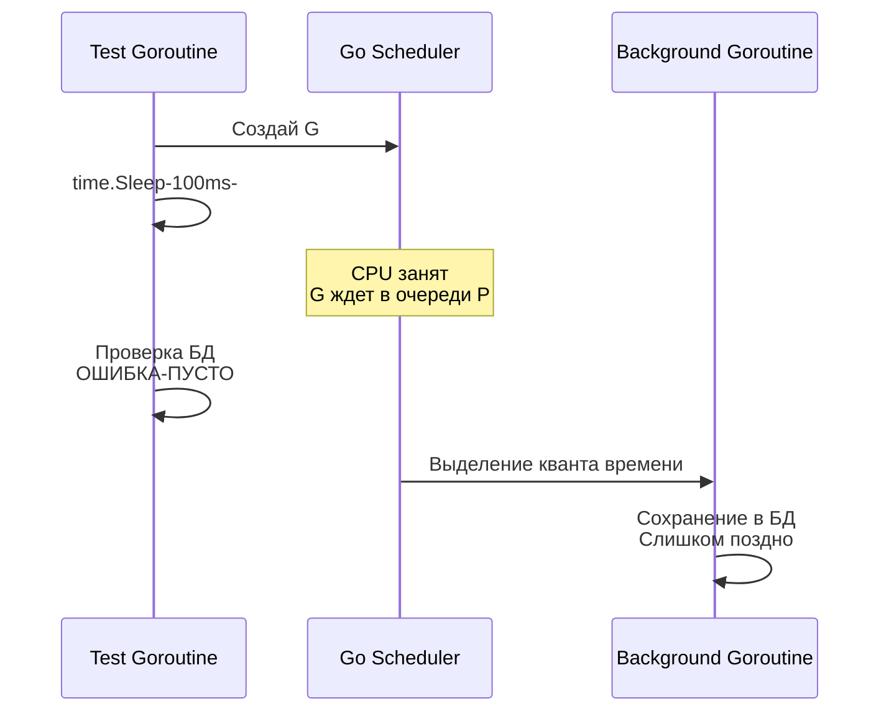

В предыдущей статье [[4. Testability и дизайн кода]] мы разобрали, как архитектура влияет на возможность написать тест в принципе. Но написать тест — это только половина дела. Настоящая инженерная проблема начинается тогда, когда тест ведет себя нестабильно: сегодня он "зеленый", а завтра "красный", хотя код никто не менял.

Фундаментальное свойство любого надежного теста — это **Детерминизм (Determinism)**. 

Детерминированный тест при одинаковых входных данных и одинаковом начальном состоянии системы *всегда* выдает один и тот же результат. Независимо от того, запускаете ли вы его на своем мощном MacBook M3, на нагруженном CI-сервере или в контейнере с ограниченным CPU. 

Отсутствие детерминизма разрушает доверие к CI/CD пайплайну. Если разработчики привыкают нажимать кнопку "Restart Job" при падении тестов в надежде, что "со второго раза пройдет", ваши тесты больше ничего не гарантируют.

В Go есть несколько встроенных механизмов и частых паттернов, которые по своей природе недетерминированы. Как Senior инженеру, вам нужно знать их в лицо и уметь "укрощать".

## Враг №1: Итерация по `map`

Самый частый источник плавающих багов у новичков в Go — это уверенность в том, что элементы из `map` (хеш-таблицы) извлекаются в том же порядке, в котором были добавлены.

В Go порядок обхода `map` через `for ... range` **намеренно рандомизирован**.

> [!info] Под капотом
> Структура `hmap` (внутреннее представление `map` в исходниках `runtime` Go) содержит поле `hash0` (seed для хеш-функции), которое генерируется случайно при создании каждой новой мапы.
> Более того, когда вы начинаете итерацию (функция `runtime.mapiterinit`), рантайм Go вызывает `fastrand()`, чтобы выбрать случайный стартовый бакет (bucket) и случайное смещение (offset) внутри этого бакета. 
> Авторы языка сделали это специально: во-первых, для защиты от Hash DoS атак, а во-вторых, чтобы разработчики *физически не могли* заложиться на порядок элементов, так как хеш-таблицы математически не гарантируют порядок при масштабировании (evacuation).

**Как это ломает тесты?**
Представьте функцию, которая собирает URL-query параметры из мапы:

```go
func BuildQuery(params map[string]string) string {
	query := ""
	for k, v := range params {
		query += k + "=" + v + "&"
	}
	return query
}
```

Если вы напишете тест `assert.Equal(t, "a=1&b=2&", BuildQuery(map[string]string{"a": "1", "b": "2"}))`, он будет падать примерно в 50% случаев, потому что иногда результат будет `b=2&a=1&`.

**Решение (Детерминизация):**
Ключи нужно извлечь, отсортировать, и только потом формировать результат.

```go
func BuildQuery(params map[string]string) string {
	keys := make([]string, 0, len(params))
	for k := range params {
		keys = append(keys, k)
	}
	sort.Strings(keys) // Детерминируем порядок

	query := ""
	for _, k := range keys {
		query += k + "=" + params[k] + "&"
	}
	return query
}
```

> [!tip] Собеседование
> **Вопрос:** Как эффективно сравнивать две мапы или сложные структуры с мапами внутри в тестах, не писать же каждый раз ручную сортировку?
> **Ответ:** Использовать пакет `github.com/google/go-cmp/cmp`. Он позволяет передать опцию `cmpopts.SortMaps(func(k1, k2 string) bool { return k1 < k2 })`. Это де-факто стандарт для глубокого (deep) и детерминированного сравнения сложных структур в Go, в отличие от устаревшего и подверженного ошибкам `reflect.DeepEqual`.

---

## Враг №2: "Сонная" конкурентность

Тестирование конкурентного кода — это всегда хождение по минному полю. Главная ловушка: использование `time.Sleep()` для синхронизации горутин.

```go
func FireAndForgetAction() {
	go func() {
		// Какая-то долгая фоновая работа (например, асинхронный лог)
		db.SaveLog("action done") 
	}()
}

// ПЛОХОЙ ТЕСТ
func TestFireAndForget(t *testing.T) {
	FireAndForgetAction()
	
	// Ждем, пока горутина отработает
	time.Sleep(100 * time.Millisecond) 
	
	count := db.CountLogs()
	if count != 1 {
		t.Fail()
	}
}
```

**Почему это сломается?**
У вас нет никаких гарантий, что планировщик Go (Scheduler) выдаст квант времени (тайм-слайс) вашей горутине в течение этих 100 миллисекунд. На вашей локальной машине (где 10 ядер простаивают) горутина отработает за 1мс. А на сервере GitHub Actions, где виртуальный CPU троттлится "соседями" по хосту, `time.Sleep` закончится раньше, чем горутина даже начнет выполняться. Тест упадет. Вы добавите `sleep(500ms)`. Потом `sleep(2s)`. Ваши тесты станут мучительно долгими и все равно будут иногда падать.



**Решение (Детерминизация):**
Использовать примитивы синхронизации. Либо передавать в функцию `sync.WaitGroup`, либо использовать каналы (Channels) для уведомления о завершении. В идеале, API должно быть спроектировано так, чтобы его можно было ожидать (например, возвращать канал `<-chan struct{}` или принимать интерфейс синхронизатора).

---

## Враг №3: Время как глобальная переменная

Если ваш код использует `time.Now()`, он недетерминирован по определению. Каждое выполнение дает новое значение.

Мы уже касались этой темы: нельзя сравнивать структуру, в которой есть дата создания, если эта дата генерируется внутри самой тестируемой функции. 
Кроме инжектирования интерфейса `Clock`, есть и другой подход для тестов — замораживание времени на уровне утилит, если вы используете мокирование (однако в Go лучше придерживаться явного DI).

> [!warning] Ловушка / Gotcha
> Остерегайтесь тайм-аутов в тестах. Если тест использует `context.WithTimeout(ctx, 10*time.Millisecond)`, это почти 100% гарантия нестабильности в CI. Всегда делайте таймауты конфигурабельными, либо используйте умножающие коэффициенты в тестах (например, парсите переменную окружения `CI=true` и умножайте все таймауты на 10).

---

## Враг №4: Генераторы псевдослучайных чисел (PRNG)

Если ваша бизнес-логика использует `math/rand` (или `math/rand/v2` в Go 1.22+) для генерации токенов, балансировки или выбора случайных элементов, тесты будут выдавать разные результаты.

Детерминированный тест должен контролировать *seed* (зерно) генератора.

```go
// В тестах всегда инициализируйте локальный rand с фиксированным seed
// Тогда последовательность "случайных" чисел будет всегда одинаковой
func TestRandomLoadBalancer(t *testing.T) {
	// Для math/rand/v2
	rng := rand.New(rand.NewPCG(42, 1024)) // 42 и 1024 - фиксированные числа
	
	balancer := NewBalancer(rng)
	target := balancer.Next()
	
	// Теперь мы точно знаем, какой узел выпадет первым при seed=42
	assert.Equal(t, "node-3", target) 
}
```

---

## Враг №5: Состояние внешнего мира (I/O и БД)

Детерминизм разрушается, если тесты влияют друг на друга через общую базу данных. 
Если `TestA` создает пользователя "admin", а `TestB` проверяет, что в пустой базе пользователей нет, то результат `TestB` будет зависеть от порядка выполнения тестов.

В Go пакет `testing` может запускать тесты в любом порядке (особенно если вы используете флаг `go test -shuffle=on`, что крайне рекомендуется делать в CI для проверки изоляции тестов).

**Решения:**
1. Каждый тест должен использовать уникальные идентификаторы (например, генерировать UUID для email пользователя в тесте, вместо `test@test.com`).
2. Каждый тест должен оборачивать свои действия в SQL-транзакцию и делать `tx.Rollback()` в `defer` (мы детально разберем этот паттерн в разделе интеграционного тестирования).
3. Полная очистка таблиц БД перед (или после) каждым тестом с помощью `TRUNCATE`.

## Итог

Детерминизм — это основа доверия к тестам. Вы должны управлять энтропией:
1. Замораживать время.
2. Фиксировать seed у рандомизаторов.
3. Сортировать ключи `map`.
4. Использовать `WaitGroup` или `Channels` вместо `time.Sleep`.
5. Изолировать состояние БД между тестами.

Когда детерминизм нарушается, тесты начинают мигать (flaky). Борьба с такими тестами — это отдельный инженерный навык, требующий понимания работы рантайма. О том, как системно находить и уничтожать такие плавающие ошибки, мы поговорим в следующей статье: [[6. Flaky тесты и их причины]].