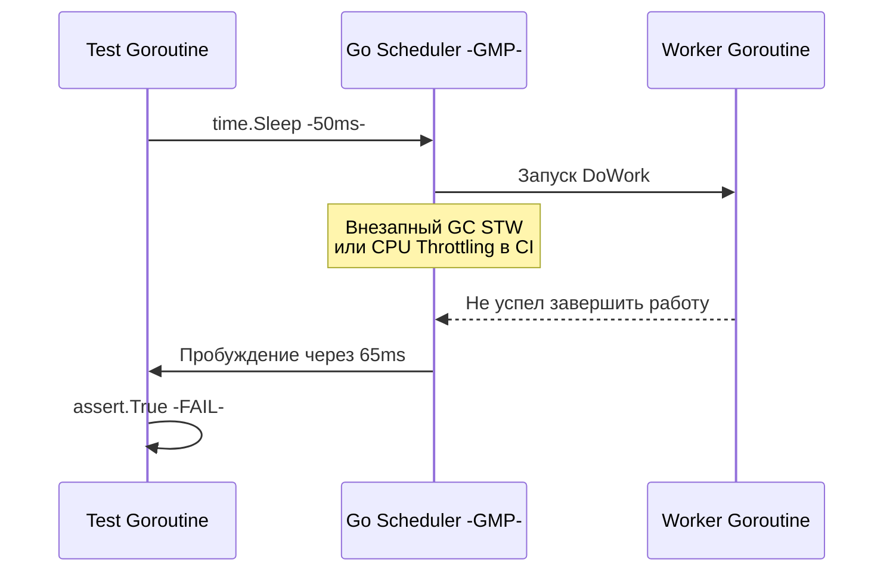

Ты написал тест. Он прошел. Ты залил код в репозиторий, CI/CD пайплайн запустил прогон всех тестов, и твой тест... упал. Ты перезапускаешь пайплайн без единого изменения в коде — тест проходит зеленой галочкой. 

Добро пожаловать в ад **Flaky tests (Мигающих тестов)**. 

Flaky тесты — это тесты, которые демонстрируют недетерминированное поведение. Они подрывают доверие к CI/CD: разработчики начинают игнорировать упавшие билды, списывая это на "снова мигнуло", и в итоге пропускают реальные баги в продакшен. 

Go, с его мощной конкурентностью и специфическим рантаймом, предоставляет множество способов выстрелить себе в ногу при написании тестов. Давай разберем фундаментальные причины "миганий" и то, как железо и рантайм Go делают тайное явным.

## 1. Иллюзия времени: `time.Sleep` в тестах

Самая частая причина flaky тестов — попытка синхронизировать конкурентный код через задержки.

Представь, что мы тестируем асинхронный воркер, который обрабатывает задачу в горутине:

```go
// АНТИПАТТЕРН: Никогда так не делай
func TestWorker_Bad(t *testing.T) {
	worker := NewWorker()
	
	// Запускаем асинхронную работу
	go worker.DoWork("task-1")
	
	// Ждем, пока горутина закончит работу (НАДЕЕМСЯ, что успеет)
	time.Sleep(50 * time.Millisecond)
	
	assert.True(t, worker.IsDone("task-1")) // FLAKY!
}
```

Почему это сломается? На твоем M1/M2 Mac с пустой ОС 50 миллисекунд — это вечность, тест будет проходить всегда. Но в CI/CD (например, на дешевых shared-раннерах GitLab или GitHub Actions) ресурсы CPU жестко лимитированы (CPU Throttling).

> [!info] Под капотом: Планировщик ОС и Go Runtime
> Когда ты вызываешь `time.Sleep`, твоя тестирующая горутина снимается с выполнения (паркуется). Планировщик ядра Linux -CFS- не дает никаких хард-риалтайм гарантий, что поток проснется ровно через 50 мс. 
> Более того, в эти 50 мс рантайм Go может решить запустить цикл сборки мусора -GC-. Произойдет фаза Stop-The-World -STW-, которая заморозит все горутины. В итоге 50 мс превратятся в 150 мс, воркер не успеет обновить статус, и `assert.True` упадет.



### Как лечить? Механизмы синхронизации
Вместо надежды на время, опирайся на **события**. Используй каналы, `sync.WaitGroup` или моки с коллбеками.

```go
// ИДИОМАТИЧНЫЙ ПОДХОД
func TestWorker_Good(t *testing.T) {
	worker := NewWorker()
	done := make(chan struct{})
	
	go func() {
		worker.DoWork("task-1")
		close(done) // Сигнализируем о завершении
	}()
	
	select {
	case <-done:
		assert.True(t, worker.IsDone("task-1"))
	case <-time.After(2 * time.Second):
		// Защита от вечного зависания (deadlock) в тесте
		t.Fatal("Таймаут ожидания воркера")
	}
}
```

## 2. Недетерминированность `map`

Вторая классическая ловушка для новичков в Go — это уверенность в том, что хеш-таблицы (maps) сохраняют порядок элементов. 

```go
func TestSerializeConfig(t *testing.T) {
	cfg := map[string]string{
		"host": "localhost",
		"port": "8080",
	}
	
	result := Serialize(cfg)
	// FLAKY: Иногда вернет "host=localhost;port=8080", 
	// а иногда "port=8080;host=localhost"
	assert.Equal(t, "host=localhost;port=8080", result) 
}
```

> [!tip] Собеседование
> **Вопрос:** Почему при итерации по `map` в Go порядок элементов каждый раз разный? Разве элементы физически перемещаются в памяти?
> **Ответ:** Нет, элементы в памяти (в массиве бакетов `hmap`) лежат там же. Но авторы Go специально добавили рандомизацию в функцию `runtime.mapiterinit`. При старте цикла `for range` Go генерирует случайное число (`fastrand()`) и начинает итерацию со **случайного бакета** и случайного смещения внутри него. Это сделано намеренно (Security & Compatibility feature), чтобы разработчики не завязывались на внутреннюю структуру памяти мапы, которая может измениться в новых версиях компилятора.

### Как лечить?
Если тебе нужно проверять сериализованные структуры на основе мап (например, JSON), парси строку обратно в `map` и сравнивай мапы через `assert.Equal` (или `cmp.Equal`), а не строки. Либо собирай ключи в слайс, сортируй слайс (`sort.Strings`) и итерируйся по нему.

## 3. Конфликты портов (Порты Шредингера)

Когда ты пишешь интеграционные тесты для HTTP-серверов или gRPC-клиентов, тебе нужно поднять реальный сервер.

```go
// ОПАСНО ДЛЯ ПАРАЛЛЕЛЬНЫХ ТЕСТОВ
listener, err := net.Listen("tcp", "localhost:8080")
```

Если ты запустишь тесты через `go test ./...`, Go может запустить разные тестовые пакеты параллельно. Два теста попытаются сделать `bind` на порт `8080`. Один упадет с ошибкой `bind: address already in use`.

### Как лечить? Эфемерные порты
Никогда не хардкодь порты в тестах. Отдавай это на откуп ядру операционной системы. Если передать порт `0`, ОС (Linux/macOS) сама выделит любой свободный эфемерный порт (ephemeral port) из диапазона (обычно 32768–60999).

```go
// БЕЗОПАСНО
listener, err := net.Listen("tcp", "127.0.0.1:0")
require.NoError(t, err)

// Получаем реальный порт, который выдала ОС
addr := listener.Addr().String() 
client := NewClient("http://" + addr)
```
В пакете `net/http/httptest` функция `httptest.NewServer()` под капотом делает ровно это.

## 4. Глобальное состояние и `t.Parallel()`

Функция `t.Parallel()` говорит планировщику тестов: "Этот тест можно запускать конкурентно с другими параллельными тестами". Это сильно ускоряет прогон, но вскрывает проблемы с глобальным состоянием (Shared State).

Если твои тесты меняют переменные окружения (`os.Setenv`), переопределяют глобальные логгеры, мокают глобальные синглтоны (например, `http.DefaultClient.Transport`) или пишут в одну и ту же тестовую базу данных без разделения по схемам — жди беды.

> [!warning] Ловушка / Gotcha: Замыкания в `t.Parallel()`
> До версии Go 1.22 существовала легендарная ловушка с `t.Parallel()` внутри Table-Driven тестов:
> ```go
> for _, tc := range testCases {
>     tc := tc // ДО GO 1.22 ЭТО БЫЛО ОБЯЗАТЕЛЬНО! (Shadowing)
>     t.Run(tc.name, func(t *testing.T) {
>         t.Parallel()
>         assert.Equal(t, tc.expected, Process(tc.input))
>     })
> }
> ```
> Без `tc := tc` горутины, порожденные `t.Parallel()`, замыкались на одну и ту же область памяти переменной цикла. К моменту их старта цикл уже заканчивался, и ВСЕ тесты выполнялись с данными последнего `testCase`. В Go 1.22 семантику циклов `for` изменили, и теперь переменная создается заново на каждой итерации.

## 5. Незаметные Data Races (Гонки данных)

Иногда flake возникает из-за банального Data Race в самом бизнес-коде, который тест случайно "зацепил". 

На уровне железа гонка данных — это рассинхронизация кэшей процессора (L1/L2). 
Допустим, Горутина А выполняется на Ядре 1 и записывает `done = true`. Это значение попадает в *Store Buffer* Ядра 1. 
В это же время Горутина Б выполняется на Ядре 2 и читает `done`. Из-за отсутствия барьеров памяти (Memory Barriers) протокол когерентности кэшей (MESI) не заставляет Ядро 2 сбросить свой кэш и сходить за новым значением в Ядро 1. Горутина Б читает устаревшее `false`. Тест падает.

### Главное оружие: Race Detector

Запускай тесты локально и в CI **только** с флагом `-race`.

```bash
go test -race ./...
```

Race Detector инструментирует компилируемый бинарник, вставляя проверки к каждому обращению к памяти. Он замедляет выполнение тестов в 2-10 раз и потребляет больше памяти, но это единственный способ со 100% гарантией поймать конкурентный доступ к памяти.

Если у тебя есть подозрения на Flaky тест, используй флаг `-count`:
```bash
# Запустить тест 100 раз подряд без использования кэша тестов
go test -run=TestMySuspectLogic -count=100 -race
```

## Итог

6. Искореняй `time.Sleep` в тестах. Используй явную синхронизацию (каналы, WaitGroup).
7. Не завязывайся на порядок элементов в `map`.
8. Изолируй ресурсы: используй порт `0` для сети и очищай БД после каждого теста.
9. Будь осторожен с глобальным состоянием при использовании `t.Parallel()`.
10. Race Detector (`-race`) — твой лучший друг в поиске плавающих багов.

Разобравшись с фундаментом изоляции и недетерминированности, мы подходим к одной из самых сложных тем в тестировании бэкенда. Как тестировать код, который жестко завязан на базу данных (PostgreSQL), брокер сообщений (Kafka) или кэш (Redis), и при этом не ловить конфликты параллельных запусков? Об этом поговорим в следующей статье: [[7. Интеграционные тесты]].