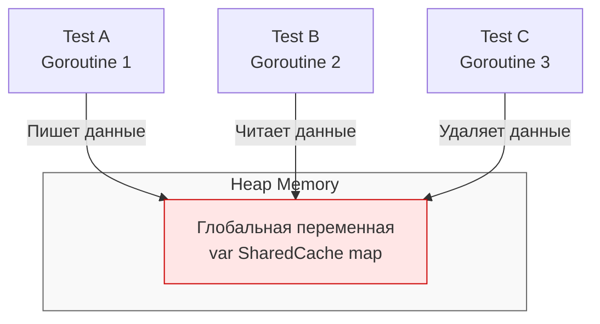

## Анатомия изоляции: Как не наступить на чужие грабли

В статьях [[5. Determinism и воспроизводимость]] и [[6. Flaky тесты и их причины]] мы выяснили, что главный враг CI/CD пайплайна — это нестабильные тесты. И в 90% случаев причиной этой нестабильности является **протечка состояния (State Leak)** между тестами.

**Изоляция тестов (Test Isolation)** — это принцип инженерии качества, согласно которому результат выполнения одного теста не должен зависеть от того, какие тесты выполнялись до него, параллельно с ним или после него. Тест должен запускаться в абсолютно стерильной среде и после своего завершения оставлять среду такой же стерильной.

Для разработчиков, пришедших из PHP или Python (где тесты часто бегут последовательно в одном процессе), параллельное тестирование в Go становится откровением и болью. В Go команда `go test` поощряет конкурентность, и если вы не обеспечите строгую изоляцию, рантайм жестоко накажет вас состояниями гонки (Data Race).

---

## 1. Изоляция памяти: Глобальное состояние

В Go все тесты внутри одного пакета компилируются в один бинарный файл и запускаются в едином адресном пространстве процесса. Это означает, что **все тесты делят одну и ту же кучу (Heap)**.

Если у вас есть глобальная переменная (например, кеш или счетчик метрик), и два параллельных теста попытаются её изменить — вы получите классический Data Race.



> [!warning] Ловушка / Gotcha
> Даже если вы используете `sync.Mutex` для защиты глобальной переменной от Data Race, вы нарушаете детерминизм. `Test B` может прочитать данные, записанные `Test A`, и упасть, потому что ожидал пустой кеш. 
> **Решение:** Избегайте глобального состояния. Инжектируйте зависимости (мы разберем это в [[8. Dependency injection для тестируемости]]). Если вы тестируете legacy-код с глобальными переменными, такие тесты **категорически запрещено** запускать с `t.Parallel()`.

---

## 2. Изоляция окружения: Переменные (Environment Variables)

Многие функции зависят от переменных окружения (`os.Getenv`). В старых версиях Go разработчики делали так:

```go
// АНТИПАТТЕРН: Ручное управление окружением
func TestLegacy(t *testing.T) {
	oldVal := os.Getenv("CONFIG_PATH")
	os.Setenv("CONFIG_PATH", "/tmp/test.yaml")
	defer os.Setenv("CONFIG_PATH", oldVal) // Попытка убрать за собой
	
	// Вызов тестируемой функции...
}
```

Это ужасный подход. Если тесты бегут параллельно, `os.Setenv` (которая делает системный вызов `setenv` в ядро Linux) изменит переменную для **всего процесса**. Соседний тест прочитает `CONFIG_PATH` и пойдет не по тому пути.

**Современный подход (Go 1.17+):**
Используйте встроенный метод `t.Setenv()`.

```go
func TestModern(t *testing.T) {
	t.Setenv("CONFIG_PATH", "/tmp/test.yaml") // Безопасная изоляция
	// ...
}
```

> [!info] Под капотом
> Метод `t.Setenv()` не просто вызывает `os.Setenv`. Он запоминает оригинальное значение и автоматически восстанавливает его в фазе `Cleanup`. 
> Более того, `t.Setenv()` **вызывает панику**, если вы попытаетесь использовать его вместе с `t.Parallel()` в одном и том же тесте. Рантайм Go защищает вас от выстрела в ногу: он понимает, что вы пытаетесь изменить глобальное состояние ОС в конкурентной среде, и принудительно обрывает тест.

---

## 3. Изоляция жизненного цикла: defer vs t.Cleanup

Для очистки ресурсов (закрытие файлов, сетевых соединений, откатов транзакций БД) новички по привычке используют `defer`. В простых тестах это работает. Но в сложной иерархии тестов `defer` становится бомбой замедленного действия.

> [!tip] Собеседование
> **Вопрос:** В чем фундаментальная разница между `defer` и `t.Cleanup()` в контексте вложенных тестов с `t.Parallel()`?
> **Ответ:** `defer` привязан к завершению текущей *функции* (фрейма стека), а `t.Cleanup()` привязан к завершению *теста* в структуре `testing.T`.

Разберем классический пример ловушки:

```go
func TestDatabase(t *testing.T) {
	db, err := setupTestDB()
	if err != nil {
		t.Fatal(err)
	}
	// Кажется логичным, правда?
	defer db.Close() 

	t.Run("insert user", func(t *testing.T) {
		t.Parallel() // Говорим раннеру запустить подтест конкурентно
		db.Insert(...) // ПАНИКА! database/sql - connection is closed
	})
}
```

**Mechanical Sympathy этого бага:**
1. Раннер тестов вызывает функцию `TestDatabase`.
2. Функция устанавливает соединение и регистрирует `defer db.Close()`.
3. Вызывается `t.Run` с `t.Parallel()`. Раннер ставит подтест в очередь планировщика (как новую горутину) и **сразу же возвращает управление** из `t.Run`.
4. Функция `TestDatabase` достигает конца и завершается. 
5. Срабатывает `defer db.Close()`. Соединение закрыто.
6. Планировщик Go будит горутину подтеста "insert user". Она пытается выполнить `db.Insert` в закрытую базу и падает.

**Правильный паттерн изоляции ресурсов:**

```go
func TestDatabase(t *testing.T) {
	db, err := setupTestDB()
	if err != nil {
		t.Fatal(err)
	}
	
	// t.Cleanup гарантирует, что функция выполнится ТОЛЬКО 
	// после завершения самого теста и ВСЕХ его подтестов.
	t.Cleanup(func() {
		db.Close()
	})

	t.Run("insert user", func(t *testing.T) {
		t.Parallel()
		db.Insert(...) // Работает идеально
	})
}
```

---

## 4. Изоляция файловой системы: IO без конфликтов

Если ваш код работает с диском (пишет логи, загружает файлы, парсит конфиги), тесты могут столкнуться (collision) при попытке записи в один и тот же файл `/tmp/out.log`.

Раньше приходилось генерировать сложные UUID-имена файлов. Теперь в Go есть `t.TempDir()`.

```go
func TestFileWriter(t *testing.T) {
	// Создает уникальную директорию вида /tmp/TestFileWriter12345
	// и автоматически удаляет её со всем содержимым после теста!
	dir := t.TempDir() 
	
	filePath := filepath.Join(dir, "config.json")
	err := os.WriteFile(filePath, []byte(`{"key": "value"}`), 0644)
	if err != nil {
		t.Fatal(err)
	}
	// ...
}
```

**Mechanical Sympathy файловой изоляции:**
На современных Linux-системах директория `/tmp` часто монтируется как `tmpfs`. Это файловая система, которая физически располагается в оперативной памяти (RAM) и Page Cache, а не на SSD/HDD. 
Использование `t.TempDir()` делает ваши IO-тесты не только безопасными с точки зрения изоляции, но и невероятно быстрыми, так как вы избегаете реальных аппаратных прерываний для доступа к жесткому диску (Zero Disk IO).

---

## 5. Изоляция сети: Эфемерные порты

Частая задача в бэкенде — поднять HTTP или gRPC сервер внутри теста для проверки интеграции (например, запуск `httptest.NewServer`).

Если вы хардкодите порт (`127.0.0.1:8080`), вы не сможете запустить этот тест параллельно (соседний тест получит `bind: address already in use`), а также ваш тест может упасть в CI, если порт уже занят другим демоном.

**Правило:** Никогда не хардкодьте порты в тестах. Отдайте эту работу ядру ОС.

```go
func TestNetworkService(t *testing.T) {
	// Порт 0 говорит ядру ОС: Выдай мне любой свободный эфемерный порт
	listener, err := net.Listen("tcp", "127.0.0.1:0") 
	if err != nil {
		t.Fatal(err)
	}
	
	// Теперь мы можем узнать, какой именно порт нам выдали
	actualAddr := listener.Addr().String()
	t.Logf("Server listening on %s", actualAddr)
	
	t.Cleanup(func() {
		listener.Close()
	})
	
	// Поднимаем сервер...
}
```

Эфемерные порты (Ephemeral ports) выделяются сетевым стеком ядра (TCP/IP) из динамического диапазона (обычно 32768–60999 в Linux). Ядро гарантирует, что выданный порт уникален, что обеспечивает 100% сетевую изоляцию между параллельными тестами.

---

## Итог

Изолированный тест — это тест, который ничего не знает о внешнем мире и не оставляет в нем следов. 
1. **Память:** Не используем глобальные переменные.
2. **Окружение:** Изменяем только через `t.Setenv()`.
3. **Ресурсы:** Освобождаем строго через `t.Cleanup()`, особенно при конкурентном выполнении.
4. **Диск:** Работаем только внутри `t.TempDir()`.
5. **Сеть:** Биндим слушателей только на `127.0.0.1:0`.

Овладев этими механизмами, вы сможете запускать тысячи тестов параллельно, загружая все ядра процессора на 100% и получая результаты за миллисекунды. Но как спроектировать сам код так, чтобы эти механизмы изоляции было удобно встраивать? Об этом в следующей статье: [[8. Dependency injection для тестируемости]].