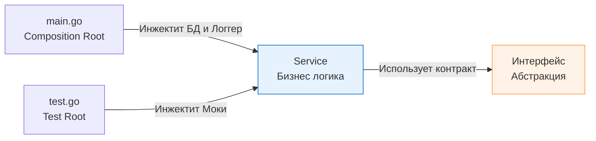

В предыдущей статье [[7. Test isolation]] мы разобрали, почему изоляция состояния критически важна для стабильности тестов. Но как именно достичь этой изоляции на уровне кода? Как подменить реальную базу данных на мок, если код жестко завязан на создание `sql.DB` внутри бизнес-логики? 

Ответ — **Dependency Injection (DI, Внедрение зависимостей)**.

Для разработчиков, пришедших из экосистем Java (Spring) или C# (.NET Core), аббревиатура DI часто ассоциируется с тяжеловесными фреймворками, IoC-контейнерами (Inversion of Control), XML-конфигурациями или магией аннотаций, работающей через рефлексию (Reflection) в рантайме.

В Go философия совершенно иная. **DI в Go — это не фреймворк. Это паттерн проектирования.** В 95% случаев DI в Go реализуется банальной передачей аргументов в функцию-конструктор.

## Зачем нужен DI в контексте тестирования?

Без DI ваша система собирает сама себя (внутренняя инициализация). С DI система собирается снаружи, в так называемом **Composition Root** (обычно это функция `main()` в production или функция `TestXxx()` в тестах).



DI дает нам абсолютный контроль над окружением тестируемого компонента. Мы можем инжектировать ошибки сети, таймауты, "замороженное" время или предзаполненные in-memory хранилища.

## Паттерны DI в Go

### 1. Constructor Injection (Классика)

Это самый распространенный и идиоматичный способ в Go. Зависимости передаются как параметры в функцию, которая возвращает инициализированную структуру.

```go
package payment

import "context"

// Зависимости определяем через интерфейсы
type PaymentGateway interface {
	Charge(ctx context.Context, amount float64) error
}

type Logger interface {
	Info(msg string)
}

type Service struct {
	gateway PaymentGateway
	logger  Logger
}

// NewService - явный конструктор
func NewService(gw PaymentGateway, log Logger) *Service {
	return &Service{
		gateway: gw,
		logger:  log,
	}
}
```

**Плюсы для тестов:** Тест физически не скомпилируется, если вы забудете передать зависимость. Вы получаете строгую гарантию контракта на этапе компиляции.

### 2. Functional Options Pattern (Для опциональных зависимостей)

Constructor Injection становится проблемой, когда зависимостей много (5+), или часть из них опциональна. В Go нет перегрузки функций (Method Overloading) и параметров по умолчанию. Чтобы не писать монструозные конструкторы, применяется паттерн Functional Options (популяризованный Робом Пайком).

Это идеальный инструмент для инжектирования зависимостей, специфичных для тестов (например, интерфейс `Clock` для контроля времени).

```go
type Service struct {
	db    Database // Обязательная зависимость
	clock func() time.Time // Опциональная (по умолчанию time.Now)
}

type Option func(*Service)

// Специфичная для тестов опция
func WithClock(clock func() time.Time) Option {
	return func(s *Service) {
		s.clock = clock
	}
}

func NewService(db Database, opts ...Option) *Service {
	// Базовая инициализация
	s := &Service{
		db:    db,
		clock: time.Now, // Поведение для Production
	}
	// Применение опций
	for _, opt := range opts {
		opt(s)
	}
	return s
}
```

В тесте вы вызываете:
```go
svc := NewService(mockDB, WithClock(func() time.Time { 
    return time.Date(2026, 1, 1, 0, 0, 0, 0, time.UTC) 
}))
```

> [!warning] Ловушка / Gotcha
> Не используйте паттерн Functional Options для *обязательных* зависимостей (например, подключения к БД). Если зависимость критична для работы бизнес-логики, она должна быть явным аргументом конструктора. Функциональные опции — только для логгеров, метрик, таймаутов и часов.

---

## Mechanical Sympathy: DI и Escape Analysis

Внедрение зависимостей через интерфейсы имеет цену на уровне рантайма, и для Senior разработчика важно её понимать.

> [!info] Под капотом
> Когда вы передаете конкретную структуру (value type) в функцию, принимающую интерфейс, компилятор Go проводит **Escape Analysis** (Анализ утечек). 
> В подавляющем большинстве случаев компилятор не может доказать, что время жизни переданного значения не превысит время жизни функции-конструктора (особенно если оно сохраняется в поле возвращаемой структуры). 
> 
> Результат? Значение "убегает" (escapes) со стека (Stack) в кучу (Heap). 
> 
> ```go
> type RealDB struct { ... } // Размер 100 байт
> 
> // Вызов:
> svc := NewService(RealDB{}) 
> ```
> В этом примере `RealDB` будет аллоцирована в Heap, а `Service.gateway` будет хранить `iface` (структуру из двух указателей: на `itab` и на данные в Heap).
> Это создает дополнительную работу для Garbage Collector (GC). Для сервисов, которые инициализируются один раз при старте приложения (Singleton lifetime), это не имеет значения. Но если вы создаете такие объекты на каждый входящий HTTP-запрос (Transient lifetime), обилие DI через интерфейсы ударит по пропускной способности (throughput) и увеличит latency из-за пауз GC.

**Рекомендация:** В высоконагруженном контуре (Hot Path) избегайте динамического полиморфизма и избыточных интерфейсов. Используйте интерфейсы на границах доменов (БД, Сеть, Брокеры), но не внутри узких алгоритмических модулей. Об этом правиле мы также упоминали в [[4. Testability и дизайн кода]].

---

## DI Containers: Wire vs Fx

По мере роста проекта ручная сборка зависимостей в `main.go` может превратиться в "лапшу" из сотен строк кода:

```go
// Ручной DI-ад
cfg := ReadConfig()
logger := NewLogger(cfg)
db := NewDatabase(cfg)
repo := NewRepo(db)
metrics := NewMetrics()
service := NewService(repo, logger, metrics)
handler := NewHandler(service)
// ... и еще 50 строк
```

Чтобы этого избежать, в Go-сообществе выработались два подхода к автоматизации DI:

### 1. Compile-time DI (Рекомендуемый путь: google/wire)
Утилита `wire` от Google использует кодогенерацию. Вы объявляете "провайдеров" (функции-конструкторы), и `wire` перед компиляцией анализирует их сигнатуры, автоматически генерируя файл `wire_gen.go` с идеальным, типизированным Go-кодом ручной сборки.
**Преимущества для тестирования:** Если зависимость пропущена или типы не совпадают, проект падает на этапе компиляции, а не в рантайме. Никакой черной магии. Скорость старта приложения максимальна.

### 2. Run-time DI (uber-go/fx)
Фреймворк `fx` использует рефлексию (`reflect`), чтобы связать зависимости при старте приложения. 
**Минусы для тестирования:** Ошибки графа зависимостей (например, вы забыли предоставить провайдер для логгера) обнаруживаются только при запуске (`panic` в рантайме). Это усложняет тестирование конфигурации и противоречит философии Go о строгой статической типизации.

> [!tip] Собеседование
> **Вопрос:** Почему в Go считается антипаттерном передавать DI-контейнер (или структуру типа `ServiceLocator`) внутрь функции?
> ```go
> func (s *Service) DoWork(locator Container) {
>     db := locator.Get("database").(*sql.DB) // Ужас
> }
> ```
> **Ответ:** Service Locator скрывает реальные зависимости. Глядя на сигнатуру `DoWork(locator)`, вы понятия не имеете, что для работы функции нужна база данных. В тестах вы не будете знать, что именно нужно замокать в `locator`, пока тест не упадет с `nil pointer dereference`. Зависимости должны быть **явными** (Explicit).

## Итог раздела "Фундамент"

Мы завершили базовый блок знаний о тестировании в бэкенде. Теперь вы понимаете:
1. Зачем нужны разные слои тестирования и почему "соты" лучше "пирамиды" для микросервисов.
2. Что отсутствие детерминизма и глобальное состояние превращают CI-пайплайн в рулетку.
3. Что `t.Cleanup()` и эфемерные порты — ваши главные союзники в изоляции.
4. Что архитектура управляет тестами через Dependency Injection, а не наоборот.

Оружие выбрано, теория ясна. Пора спускаться на уровень рантайма и изучать главный встроенный инструмент Go-разработчика. Переходим ко второму разделу: [[1. testing пакет. Основы]].