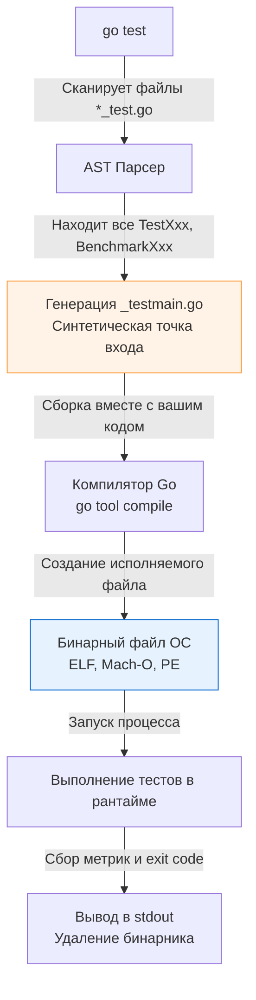

Инструментарий для тестирования в Go — это не внешняя зависимость, которую нужно скачивать через пакетный менеджер. Это фундаментальная часть самого языка, реализованная в стандартной библиотеке `testing` и интегрированная напрямую в тулчейн компилятора через команду `go test`.

В этой статье мы разберем анатомию пакета `testing`, заглянем под капот процесса компиляции тестов и изучим механику работы главного объекта любого теста — `*testing.T`.

## Анатомия пакета testing

Пакет `testing` предоставляет несколько основных типов (структур), каждый из которых отвечает за свой вид проверок:

1.  `*testing.T` — для модульных и интеграционных тестов (проверка корректности).
2.  `*testing.B` — для бенчмарков (измерение производительности и аллокаций).
3.  `*testing.F` — для фаззинга (генерация случайных мутаций входных данных).
4.  `*testing.M` — для управления глобальным жизненным циклом (Setup / Teardown на уровне всего пакета).

Все тесты в Go — это обычные функции, которые начинаются с префикса `Test`, принимают единственный аргумент указатель на `testing.T` и не возвращают ничего.

```go
package calculator_test

import (
	"testing"
)

func TestAdd(t *testing.T) {
	result := Add(2, 2)
	if result != 4 {
		t.Errorf("Add(2, 2) = %d; want 4", result)
	}
}
```

## Под капотом: Как работает go test

В интерпретируемых языках (Python, PHP) или языках с виртуальной машиной (Java, C#) тестовый фреймворк обычно использует рефлексию в рантайме, чтобы найти нужные классы и методы, а затем выполняет их.

В Go процесс принципиально иной. Команда `go test` — это не просто раннер. Это **кодогенератор и обертка над компилятором**.

Когда вы вводите команду `go test` в терминале, происходит следующая магия:



1.  **Парсинг:** Исходный код сканируется (через парсинг AST — Abstract Syntax Tree). Утилита ищет все функции, удовлетворяющие сигнатурам тестов.
2.  **Генерация:** Создается временный файл `_testmain.go`. В нем генерируется классическая функция `main()`, которая регистрирует все найденные тесты в массиве структур `testing.InternalTest` и передает их в движок тестирования (`testing.Main()`).
3.  **Компиляция:** Ваш код и сгенерированный `_testmain.go` компилируются в полноценный, нативный бинарный файл.
4.  **Исполнение:** Бинарник запускается как самостоятельный процесс операционной системы.

**Mechanical Sympathy:**
Именно благодаря этой архитектуре тесты в Go выполняются невероятно быстро. Они не интерпретируются на лету. Когда запускается тест, процессор выполняет оптимизированный машинный код, прошедший через все этапы Escape-анализа и инлайнинга функций компилятором (если только вы явно не отключили оптимизации флагом `-gcflags="-N -l"`).

## Управление потоком выполнения: Error vs Fatal

Сердце модульного теста — это структура `testing.T`. У нее есть несколько методов для сигнализации об ошибках, и Senior-разработчик должен четко понимать разницу в их внутренней реализации.

### 1. Мягкое падение: t.Fail() и t.Error()

* `t.Fail()` помечает текущий тест как "проваленный", но **продолжает выполнение** следующей строчки кода.
* `t.Errorf(format, args...)` — это синтаксический сахар: он вызывает `t.Logf()`, а затем `t.Fail()`.

Используйте `t.Errorf`, когда вы проверяете массив независимых полей структуры, и вам важно увидеть *все* упавшие проверки за один прогон, а не останавливаться на первой же опечатке.

### 2. Жесткое падение: t.FailNow() и t.Fatal()

* `t.FailNow()` помечает тест как проваленный и **немедленно прерывает** выполнение текущего теста.
* `t.Fatalf(format, args...)` — это `t.Logf()` + `t.FailNow()`.

Используйте `t.Fatalf`, если дальнейшее выполнение теста бессмысленно или приведет к панике. Например, если функция вернула ошибку при подключении к тестовой БД, нет смысла проверять данные в этой БД (вы получите `nil pointer dereference`).

> [!info] Под капотом
> Как именно `t.FailNow()` (и следовательно `t.Fatal()`) прерывает тест, не убивая при этом соседние тесты?
> Под капотом `t.FailNow()` вызывает функцию `runtime.Goexit()`. 
> 
> В Go каждый тест запускается в отдельной горутине. Функция `runtime.Goexit()` немедленно прерывает выполнение **текущей горутины** (при этом все `defer` функции внутри этой горутины будут корректно выполнены). Основной поток раннера (в `testing.Main`) просто ловит завершение этой горутины, видит флаг `failed = true` и переходит к запуску следующего теста.

### Главная ловушка конкурентных тестов

Из понимания того, как работает `runtime.Goexit()`, вытекает один из самых частых вопросов на собеседованиях и самая болезненная ошибка новичков.

> [!warning] Ловушка / Gotcha
> Вызов `t.Fatal()` или `t.FailNow()` из порожденной горутины **запрещен** и ведет к непредсказуемому поведению.

```go
func TestConcurrencyGotcha(t *testing.T) {
	go func() {
		err := doSomething()
		if err != nil {
			// ОШИБКА! Это убьет текущую фоновую горутину, 
			// но основная горутина TestConcurrencyGotcha продолжит работу
			// и тест может быть помечен как УСПЕШНЫЙ (PASS).
			t.Fatalf("background error: %v", err) 
		}
	}()
	
	time.Sleep(100 * time.Millisecond) // Эмуляция работы
}
```

Если вы запускаете горутину внутри теста и хотите просигнализировать об ошибке из нее, вы должны использовать `t.Errorf()`, так как он просто атомарно выставляет флаг ошибки под мьютексом, не прерывая горутину. Если вам нужно прервать основной тест, используйте каналы для синхронизации ошибки.

## Логирование в тестах

Для вывода отладочной информации используются методы `t.Log()` и `t.Logf()`. 

**Важное свойство:** Логи, записанные через `t.Log`, буферизируются внутри структуры `T`. Они будут выведены в `stdout` консоли **только в двух случаях**:
1.  Если тест завершился с ошибкой (упал).
2.  Если вы запустили `go test` с флагом verbose: `go test -v`.

Это сделано специально, чтобы при успешном прохождении сотен тестов ваш терминал не засорялся мусором, но при падении конкретного теста вы получили весь контекст его выполнения.

## t.Helper()

Когда вы пишете вспомогательные функции (хелперы) для тестов, вы можете заметить, что при ошибке Go указывает строку кода внутри самого хелпера.

```go
// Вспомогательная функция
func assertEqual(t *testing.T, got, want int) {
	if got != want {
		// При падении в консоли будет указана эта строка, 
		// что неудобно, если хелпер вызывается 10 раз из разных тестов
		t.Errorf("got %d, want %d", got, want) 
	}
}
```

Чтобы тестировочный фреймворк пропускал эту функцию при раскручивании стека вызовов (stack trace) и указывал на строку, где хелпер был *вызван*, всегда используйте метод `t.Helper()`.

```go
func assertEqual(t *testing.T, got, want int) {
	t.Helper() // Теперь ошибка укажет на реальное место вызова в TestXxx
	if got != want {
		t.Errorf("got %d, want %d", got, want)
	}
}
```

> [!tip] Собеседование
> **Вопрос:** Почему в Go нет встроенных функций `AssertEqual` или `AssertNotNil` в стандартном пакете `testing`?
> **Ответ:** Философия Go строится на явной обработке ошибок без скрытой магии. Создатели языка считают, что добавление DSL (Domain Specific Language) для ассертов вроде `assert.That(x).IsEqualTo(y)` заставляет разработчиков учить отдельный мини-язык внутри языка. Использование стандартных конструкций Go (`if a != b`) делает тесты читаемыми для любого, кто знает Go. Тем не менее, для сокращения бойлерплейта в коммерческой разработке почти везде используют стороннюю библиотеку `testify` (разберем её в отдельной статье).

## Итог

Мы рассмотрели базовый слой пакета `testing` и выяснили, что тесты в Go — это полноценные скомпилированные бинарники. Мы поняли фундаментальную разницу между `Error` (логирование) и `Fatal` (`runtime.Goexit()`) и научились правильно помечать вспомогательные функции через `t.Helper()`.

Теперь, когда механика ясна, пришло время разобраться с тем, как правильно организовывать файлы, пакеты и `init`-подобные конструкции в тестовом окружении. Переходим к следующей теме: [[2. Структура тестов в Go]].