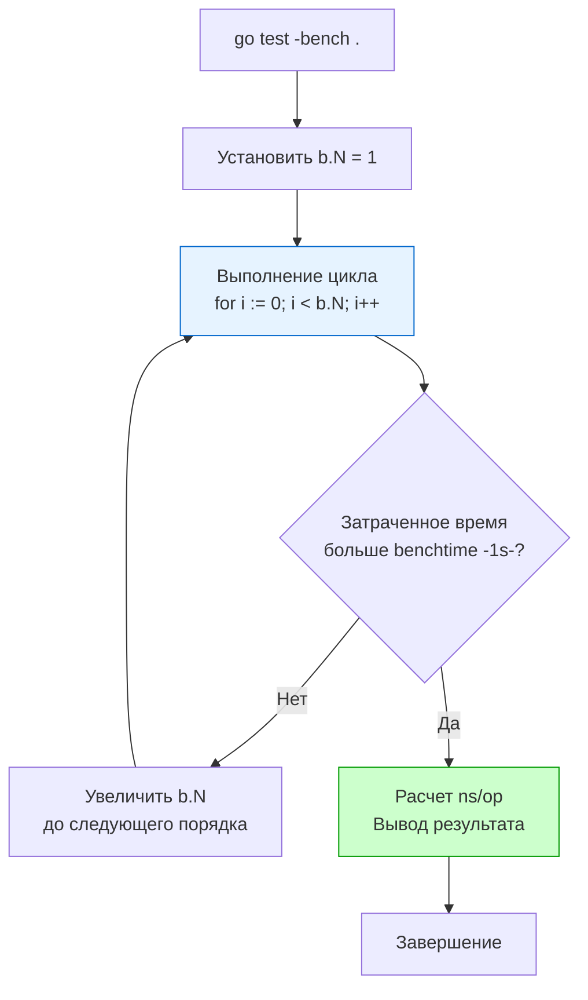

Вы написали 100% покрытый код. Интеграционные тесты "зеленые", Data Race детектор молчит, бизнес-логика работает безупречно. Но когда ваш сервис выходит в production и на него обрушивается трафик в 10 000 RPS, latency (задержка) улетает в космос, а CPU упирается в 100%. 

Код может быть правильным, но при этом катастрофически медленным. 

В Go производительность — это не фича, которую добавляют в конце. Это фундаментальное свойство языка. И для измерения этой производительности пакет `testing` предоставляет инструмент, равных которому по удобству нет ни в одной популярной экосистеме — структуру `*testing.B` и встроенный механизм **Benchmarking**.

В этой статье мы разберем анатомию бенчмарков, заглянем под капот подсистемы измерения времени и научимся обманывать умный компилятор Go.

## Анатомия Benchmark-теста

Бенчмарки пишутся в тех же файлах `_test.go`, что и обычные тесты. Разница лишь в сигнатуре функции: она должна начинаться со слова `Benchmark` и принимать указатель на `testing.B`.

```go
package jsonparser_test

import (
	"encoding/json"
	"testing"
)

// Тестируемая DTO
type User struct {
	ID    int    `json:"id"`
	Email string `json:"email"`
}

func BenchmarkJSONUnmarshal(b *testing.B) {
	payload := []byte(`{"id": 42, "email": "test@example.com"}`)
	
	// Цикл бенчмарка — это сердце измерений
	for i := 0; i < b.N; i++ {
		var u User
		_ = json.Unmarshal(payload, &u)
	}
}
```

Чтобы запустить бенчмарк, обычной команды `go test` недостаточно (она запустит только функциональные тесты `TestXxx`). Вам нужно передать регулярное выражение в флаг `-bench`:

```bash
# Запустить все бенчмарки в текущем пакете
go test -bench=. 
```

### Что такое b.N? (Магия автомасштабирования)

Самый частый вопрос от разработчиков, приходящих из других языков: "Почему я не задаю количество итераций жестко? Что такое `b.N`?".

> [!info] Под капотом
> Рантайм `testing` не знает заранее, сколько времени займет одна итерация вашего кода. Если он запустит парсинг JSON 10 раз, это займет микросекунды, и погрешность измерения из-за планировщика ОС будет огромной. Если запустит 1 миллиард раз — вы будете ждать результат до завтра.
> 
> Поэтому движок бенчмарков работает адаптивно. Он запускает ваш цикл, динамически увеличивая значение `b.N` в последовательности: 1, 100, 10000... и так далее, пока общее время выполнения цикла не превысит значение `benchtime` (по умолчанию 1 секунда).



Когда бенчмарк завершается, вы видите результат вида:
`BenchmarkJSONUnmarshal-10    3284074     351.4 ns/op`
Это означает, что на 10-ядерном процессоре (`-10`) функция выполнилась **3 284 074 раза**, и на одну итерацию в среднем ушло **351.4 наносекунды**.

## Изоляция времени: ResetTimer и StopTimer

Часто перед самим циклом `b.N` вам нужно провести тяжелую подготовку: сгенерировать мегабайты тестовых данных, поднять мок-сервер или прочитать файл. 

Если вы не изолируете это время, оно "размажется" по всем итерациям и исказит результат (особенно на малых `b.N`).

```go
func BenchmarkComplexAlgo(b *testing.B) {
	// Долгая инициализация (I/O, аллокации)
	data := generateHugeDataset() 
	
	// Сбрасываем таймер и счетчик аллокаций. 
	// Время, потраченное выше, не пойдет в зачет.
	b.ResetTimer() 

	for i := 0; i < b.N; i++ {
		Process(data)
	}
}
```

Если тяжелая работа (не относящаяся к измеряемой функции) нужна *внутри* каждой итерации цикла, используйте `b.StopTimer()` и `b.StartTimer()`. Но будьте осторожны: частые остановки таймера внутри цикла `b.N` сами по себе потребляют CPU и могут сделать бенчмарк неточным из-за накладных расходов на системные вызовы замера времени (`VDSO clock_gettime` в Linux).

## Mechanical Sympathy: Охота на аллокации

Для бэкенда на Go скорость выполнения (CPU time) — это только половина картины. Вторая, гораздо более важная половина — это аллокации памяти в куче (Heap). 

> [!warning] Ловушка / Gotcha
> Чем больше аллокаций делает ваш код на горячем пути (Hot Path), тем больше работы у Garbage Collector-а. В высоконагруженном сервисе фазы очистки GC (Mark and Sweep) будут "красть" кванты времени процессора у ваших рабочих горутин, что приведет к катастрофическому росту p99 latency.

Вы обязаны писать бенчмарки с учетом аллокаций. Для этого добавьте флаг `-benchmem` в командной строке или вызовите `b.ReportAllocs()` прямо в коде бенчмарка.

```go
func BenchmarkStringConcat(b *testing.B) {
	b.ReportAllocs() // Эквивалент флага -benchmem
	
	for i := 0; i < b.N; i++ {
		s := ""
		for j := 0; j < 100; j++ {
			s += "a" // Ужасный антипаттерн, порождающий аллокации
		}
	}
}
```

**Вывод:**
`BenchmarkStringConcat-10   168231   6870 ns/op   5304 B/op   99 allocs/op`

Вывод показывает метрики:
* `5304 B/op`: Байт аллоцировано в куче за одну итерацию `b.N`.
* `99 allocs/op`: Количество созданных объектов в куче за итерацию.

Задача Senior-инженера — сводить эти числа к минимуму (в идеале к нулю) в критических секциях кода, используя `sync.Pool`, Escape Analysis и предварительную аллокацию слайсов (`make([]T, 0, capacity)`).

## Ловушка оптимизатора (Dead Code Elimination)

Компилятор Go умен. Если он видит, что результат выполнения функции нигде не используется, он может просто вырезать этот кусок кода при компиляции бинарника (Dead Code Elimination).

```go
// ПЛОХОЙ БЕНЧМАРК
func BenchmarkCompute(b *testing.B) {
	for i := 0; i < b.N; i++ {
		// Результат никуда не сохраняется. 
		// Компилятор может вырезать вызов Compute!
		Compute(i) 
	}
}
```

Вы увидите подозрительно идеальный результат вроде `0.3 ns/op`, решите, что вы гений алгоритмов, задеплоите на прод и получите инцидент. Компилятор просто не выполнял ваш код.

**Идиоматичный способ защиты (Защита от DCE):**
Результат вычислений нужно присвоить глобальной переменной уровня пакета.

```go
// Глобальная переменная
var Result int 

func BenchmarkCompute(b *testing.B) {
	var r int // Локальная переменная для промежуточного результата
	for i := 0; i < b.N; i++ {
		r = Compute(i) 
	}
	// Присваиваем локальную переменную глобальной. 
	// Теперь компилятор не имеет права вырезать код.
	Result = r 
}
```

## Параллельные бенчмарки: b.RunParallel

До сих пор мы измеряли скорость работы кода в один поток. Но бэкенд на Go работает конкурентно. Тысячи горутин могут вызывать вашу функцию одновременно. Если в вашей функции есть `sync.Mutex` или конкурентный доступ к `map`, последовательный бенчмарк покажет идеальное время, а в production вы получите жесточайший Lock Contention (борьбу за блокировку).

Чтобы протестировать код под конкурентной нагрузкой, используется метод `b.RunParallel(pb *testing.PB)`.

```go
func BenchmarkConcurrentCache(b *testing.B) {
	cache := NewThreadSafeCache()
	
	b.ReportAllocs()
	b.ResetTimer()

	// RunParallel создает несколько горутин (по умолчанию равно GOMAXPROCS)
	// и распределяет итерации b.N между ними.
	b.RunParallel(func(pb *testing.PB) {
		// Локальный цикл горутины
		for pb.Next() {
			cache.Set("key", "value")
			cache.Get("key")
		}
	})
}
```

> [!tip] Собеседование
> **Вопрос:** Если `b.RunParallel` по умолчанию запускает количество горутин, равное количеству логических ядер (`GOMAXPROCS`), как мне протестировать поведение моего кэша, если в production к нему будут одновременно обращаться 10 000 горутин?
> **Ответ:** Во время запуска бенчмарка нужно использовать метод `b.SetParallelism(p int)`. Он умножает значение `GOMAXPROCS` на `p`. Например, если у вас 8 ядер, а вы вызовете `b.SetParallelism(100)`, рантайм создаст 800 одновременно работающих горутин, заставляя их жестко конкурировать за планировщик ОС и мьютексы внутри вашего кэша. Это идеально симулирует реальную нагрузку высококонкурентной среды.

## Итог

1. Структура `*testing.B` — это инструмент для написания микро-бенчмарков, который сам подбирает нужное количество итераций `b.N`.
2. Используйте `b.ResetTimer()` для изоляции тяжелой инициализации.
3. Метрика `allocs/op` (включается через `b.ReportAllocs()`) часто важнее, чем `ns/op`, так как она напрямую влияет на задержки от Garbage Collector-а.
4. Защищайтесь от агрессивного компилятора (DCE) путем записи результата в глобальную переменную.
5. Для структур данных, которые будут использоваться из нескольких горутин, всегда пишите конкурентные бенчмарки через `b.RunParallel`.

Теория и механизмы измерений — это хорошо. Но как это выглядит на практике? Как читать профили, находить узкие места в `string` или `interface{}` и оптимизировать реальный код? Мы разберем практический кейс шаг за шагом в следующей статье: [[11. Пример benchmarking и анализ результатов]].