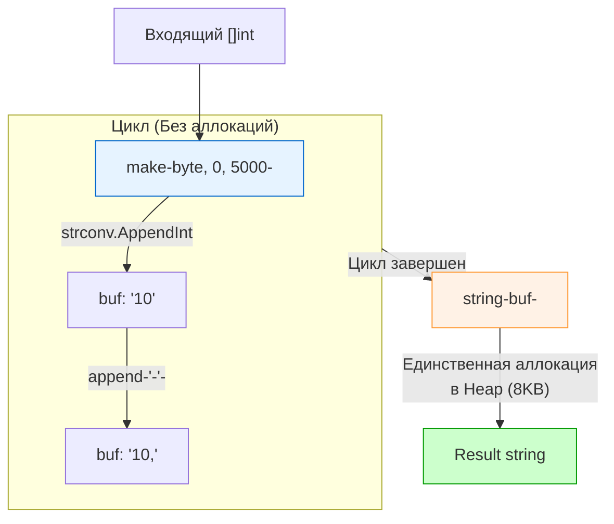

В статье [[10. Benchmark тесты]] мы разобрали теорию: как работает адаптивный цикл `b.N`, как изолировать время инициализации и почему количество аллокаций (allocs/op) часто важнее чистой скорости (ns/op).

Теория мертва без практики. Сегодня мы наденем халат хирурга, возьмем типичную задачу из бэкенда, напишем для нее наивный код, измерим его, а затем шаг за шагом оптимизируем до состояния Zero-Allocation, заглядывая под капот рантайма Go. 

## Задача: Сборка ID для SQL-запроса

**Сценарий:** Вы пишете метод репозитория. К вам приходит слайс `[]int{10, 42, 999, ...}` (например, ID пользователей). Вам нужно склеить их в строку `"10,42,999"` для подстановки в SQL-условие `WHERE id IN (...)`.

### Итерация 1: Наивный подход (Уровень Junior)

Самое очевидное решение — использовать оператор `+` для конкатенации строк внутри цикла.

```go
// concat.go
package optimize

import "strconv"

func BuildIDsNaive(ids []int) string {
	var res string
	for i, id := range ids {
		res += strconv.Itoa(id)
		if i < len(ids)-1 {
			res += ","
		}
	}
	return res
}
```

Напишем для него бенчмарк:

```go
// concat_test.go
package optimize_test

import (
	"testing"
	"myproject/optimize" // Импортируем наш пакет
)

var Result string // Защита от Dead Code Elimination (DCE)

func BenchmarkBuildIDsNaive(b *testing.B) {
	// 1. Инициализация (не входит в зачет)
	ids := make([]int, 1000)
	for i := range ids {
		ids[i] = i
	}
	
	b.ResetTimer()
	b.ReportAllocs()
	
	var r string
	// 2. Измеряемый цикл
	for i := 0; i < b.N; i++ {
		r = optimize.BuildIDsNaive(ids)
	}
	Result = r
}
```

**Результат `go test -bench=Naive -benchmem`:**
```text
BenchmarkBuildIDsNaive-10     13576     88345 ns/op    515328 B/op     1999 allocs/op
```

**Анализ:** 88 микросекунд на 1000 элементов. Полмегабайта (515 KB) аллоцированной памяти и 1999 объектов в куче (Heap) на *каждый* вызов функции! Если этот метод вызывается 1000 раз в секунду, ваш сервис будет генерировать 500 МБ мусора в секунду, уничтожая производительность постоянными запусками сборщика мусора (GC).

**Mechanical Sympathy (Почему так плохо?):** Строки в Go **иммутабельны (immutable)**. Когда вы делаете `res += ","`, процессор не добавляет байт в конец существующей строки. Рантайм Go вынужден выделить в куче новый блок памяти, скопировать туда старую строку и добавить новый символ. На 1000 элементов это происходит 1999 раз (для чисел и для запятых), создавая квадратичную сложность копирования памяти ($O(N^2)$).

---

### Итерация 2: strings.Builder (Уровень Middle)

Раз строки иммутабельны, нам нужен мутабельный буфер. В стандартной библиотеке для этого есть `strings.Builder`.

```go
import "strings"

func BuildIDsBuilder(ids []int) string {
	var b strings.Builder
	for i, id := range ids {
		b.WriteString(strconv.Itoa(id))
		if i < len(ids)-1 {
			b.WriteString(",")
		}
	}
	return b.String()
}
```

**Результат бенчмарка:**
```text
BenchmarkBuildIDsBuilder-10   184512      6320 ns/op     21085 B/op      1012 allocs/op
```

**Анализ:** Скорость выросла в 14 раз! Потребление памяти упало в 25 раз. Но у нас всё еще ~1000 аллокаций. Откуда они берутся?
1. Внутренний буфер `strings.Builder` динамически расширяется (подобно слайсу через `append`). Когда емкости не хватает, он выделяет в два раза больше памяти и копирует данные. Это дает около 12 аллокаций.
2. `strconv.Itoa(id)` возвращает `string`. Каждое число превращается в новую строку, которая аллоцируется в куче (Escape Analysis не может удержать ее на стеке, так как она передается в метод интерфейса или "утекает"). Это дает ровно 1000 аллокаций.

> [!info] Под капотом: Магия b.String()
> Почему мы используем `strings.Builder`, а не `bytes.Buffer`?
> Если вы посмотрите в исходники пакета `strings`, метод `String()` реализован так:
> `return unsafe.String(unsafe.SliceData(b.buf), len(b.buf))`
> Он берет внутренний байтовый слайс `buf` и через `unsafe` заставляет рантайм считать его строкой **без копирования памяти** (Zero-Copy). `bytes.Buffer.String()` так не умеет и всегда делает копию.

---

### Итерация 3: Пред-аллокация и byte slice (Уровень Senior)

Мы знаем длину массива. Мы можем предсказать примерный размер итоговой строки: в среднем около 4 символов на число + запятая = 5 байт на элемент. 
Мы используем метод `Grow()` у билдера, чтобы избежать динамического расширения, и заменим аллоцирующий `strconv.Itoa` на `strconv.AppendInt`, который пишет числа прямо в существующий байтовый слайс!

```go
func BuildIDsZeroAlloc(ids []int) string {
	// Предрасчет емкости
	// 5 байт на ID - это эвристика. Если ID длинные, можно взять больше.
	capacity := len(ids) * 5 
	
	// Используем сырой слайс байтов для работы с AppendInt
	buf := make([]byte, 0, capacity)
	
	for i, id := range ids {
		// AppendInt пишет байты числа прямо в конец buf БЕЗ аллокаций
		buf = strconv.AppendInt(buf, int64(id), 10)
		if i < len(ids)-1 {
			buf = append(buf, ',')
		}
	}
	
	// Итоговая конвертация []byte -> string вызовет ровно ОДНУ аллокацию
	// для обеспечения иммутабельности строки.
	return string(buf) 
}
```

**Результат бенчмарка:**
```text
BenchmarkBuildIDsZeroAlloc-10   735492      1580 ns/op      8192 B/op         1 allocs/op
```

**Анализ:** Мы добились **1 аллокации** (итоговая строка) и ускорили изначальный код в **55 раз**. Мы полностью избавились от давления на Garbage Collector.



> [!tip] Собеседование
> **Вопрос:** Можно ли избавиться вообще от всех аллокаций и сделать 0 allocs/op в этом кейсе?
> **Ответ:** Да. В Go 1.20+ добавили функцию `unsafe.String(&buf[0], len(buf))`. Она превратит наш байтовый слайс в строку без аллокации копии. **Но делать это категорически опасно**, если вы передадите этот буфер куда-то еще или измените его, так как вы нарушите иммутабельность строк в Go, что приведет к трудноотловимым глитчам в памяти (Data Corruption). Одной предсказуемой аллокации `string(buf)` для production-кода более чем достаточно.

---

## benchstat: Научный подход к измерениям

Senior-инженер никогда не говорит: «Я запустил бенчмарк, и код стал быстрее на глаз». В многозадачных ОС (Linux, macOS) на результаты тестов влияют фоновые процессы, троттлинг процессора от перегрева и работа планировщика.

Чтобы доказать свою правоту в Pull Request, вы должны использовать утилиту **`benchstat`** (разрабатывается командой Go). Она использует статистические методы (U-критерий Манна — Уитни), чтобы исключить погрешности (шум).

**Как это работает:**

1. Сохраняем результаты старого кода (минимум 10 прогонов для статистики):
   ```bash
   go test -bench=BenchmarkBuildIDsBuilder -benchmem -count=10 > old.txt
   ```
2. Сохраняем результаты нового кода:
   ```bash
   go test -bench=BenchmarkBuildIDsZeroAlloc -benchmem -count=10 > new.txt
   ```
3. Сравниваем:
   ```bash
   benchstat old.txt new.txt
   ```

**Пример вывода benchstat:**
```text
name               old time/op    new time/op    delta
BuildIDs-10          6.32µs ± 2%    1.58µs ± 1%  -75.00%  (p=0.000 n=10+10)

name               old alloc/op   new alloc/op   delta
BuildIDs-10          21.0kB ± 0%     8.19kB ± 0%  -61.00%  (p=0.000 n=10+10)

name               old allocs/op  new allocs/op  delta
BuildIDs-10            1.01k ± 0%     1.00 ± 0%  -99.90%  (p=0.000 n=10+10)
```

Метрика **`p=0.000`** (P-value) означает, что статистическая значимость изменений абсолютна (изменение реально, а не является системным шумом). Улучшение производительности составило 75%, а количество аллокаций упало на 99.9%. Вы великолепны.

> [!warning] Ловушка / Gotcha
> Перед запуском бенчмарков с флагом `-count=10` обязательно закройте браузер, Docker-контейнеры и Slack. Любой "тяжелый" процесс, проснувшийся во время тестов, создаст всплеск latency, который `benchstat` определит как аномалию (outlier).

## Итог

1. Наивная конкатенация строк в циклах убивает производительность бэкенда за счет квадратичного роста аллокаций.
2. `strings.Builder` решает проблему иммутабельности строк, но использование его без `.Grow()` и в связке с возвращающими строки функциями (`strconv.Itoa`) все равно создает мусор.
3. Истинный Zero-Allocation (минимальный) достигается комбинацией пред-аллоцированного слайса байтов (`make([]byte, 0, cap)`) и функций типа `strconv.AppendInt`.
4. Для доказательства оптимизаций всегда используйте `benchstat` с `-count=10`, а не одиночные запуски.

Мы закончили разбор встроенного инструментария пакета `testing`. Мы научились структурировать тесты, запускать их параллельно, бороться с нестабильностью и выжимать из процессора каждую наносекунду. 

Но стандартные `if got != want` иногда становятся слишком громоздкими, особенно при сравнении сложных вложенных структур. В следующем разделе мы поговорим о том, как сделать код тестов чище и выразительнее с помощью сторонних инструментов: [[1. Assert подход vs plain Go]].