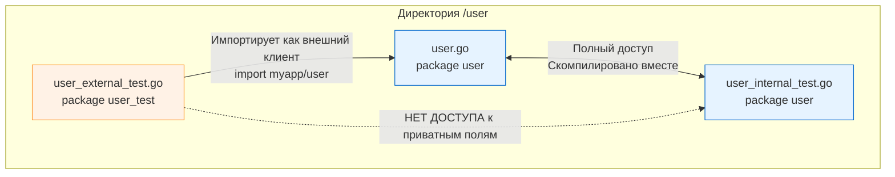

В прошлой статье [[1. testing пакет. Основы]] мы разобрали, что тесты в Go компилируются в отдельные бинарные файлы. Но прежде чем компилятор сможет собрать этот бинарник, он должен найти и правильно интерпретировать ваши исходники. 

Структура файлов и пакетов в Go — это не просто вопрос эстетики или договоренностей в команде. Это жестко зашитые в тулчейн правила, которые влияют на инкапсуляцию, циклы импортов и область видимости. 

В этой статье мы разберем, как физически располагать тесты, чем отличаются подходы Black-box и White-box на уровне пакетов, и как управлять глобальным состоянием всего тестового прогона с помощью `TestMain`.

## Топология файлов: Рядом с кодом

В языках вроде Java или Python принято создавать зеркальную иерархию директорий: `src/` для кода и `tests/` для тестов. В Go этот подход считается антипаттерном.

Тесты в Go **всегда** лежат в той же директории, что и тестируемый код. Файлы должны иметь суффикс `_test.go`.

```text
user/
├── user.go        # Бизнес-логика
├── user_test.go   # Тесты для бизнес-логики
├── auth.go        # Авторизация
└── auth_test.go   # Тесты авторизации
```

> [!info] Под капотом
> Как компилятор разделяет боевой код и тесты, если они лежат в одной папке?
> Тулчейн Go использует механизм **Build Constraints** (ограничения сборки). Когда вы запускаете `go build` для компиляции production-бинарника, парсер исходного кода (`go/build`) игнорирует любые файлы, оканчивающиеся на `_test.go`. Они физически не попадают в дерево абстрактного синтаксиса (AST) итогового приложения, поэтому тесты не увеличивают размер вашего боевого бинарника и не создают лишних аллокаций в сегменте данных.

---

## Дилемма пакетов: White-box vs Black-box

Когда вы создаете файл `user_test.go` внутри директории `user`, у вас есть два архитектурных пути: объявить `package user` или `package user_test`. Это решение фундаментально меняет то, *как* вы будете писать тесты.

### 1. Внутренние тесты (White-box: `package user`)
Если тестовый файл объявляет тот же пакет, что и основной код, он становится **внутренним тестом**. 
Вам доступны все неэкспортируемые (приватные) функции, структуры и переменные пакета.

**Когда использовать:**
* Для тестирования сложных внутренних алгоритмов.
* Для проверки парсеров и мапперов DTO, которые не торчат наружу.

### 2. Внешние тесты (Black-box: `package user_test`)
Если вы добавляете суффикс `_test` к имени пакета, Go рассматривает этот файл как **совершенно другой пакет**, несмотря на то, что он лежит в той же папке. Вы сможете обращаться только к публичному (экспортируемому) API пакета `user`.



**Преимущества Black-box подхода:**
1. **Защита от хрупкости:** Вы тестируете контракты, а не реализацию. Если вы перепишете внутреннюю механику пакета, но не тронете публичный интерфейс, тесты не упадут.
2. **Идеальный пример использования:** Внешний тест заставляет вас использовать ваш пакет так же, как его будет использовать конечный потребитель. Это отлично подсвечивает проблемы неудобного дизайна API.
3. **Разрыв циклических зависимостей:** Если пакету `A` для тестов нужен пакет `B`, а `B` уже импортирует `A`, вы получите `import cycle not allowed`. Создание `A_test` решает эту проблему, так как это виртуальный третий пакет.

> [!tip] Собеседование
> **Вопрос:** Вы пишете внешний тест (`package mypkg_test`), но вам нужно проверить внутреннее состояние пакета, недоступное извне. Как это сделать, не делая приватные поля публичными для production-кода?
> **Ответ:** Использовать паттерн **`export_test.go`**.
> В папке пакета создается файл `export_test.go` с `package mypkg` (внутренний пакет!). В нем вы создаете публичные алиасы на приватные функции/переменные. 
> Так как у файла суффикс `_test.go`, эти публичные "бэкдоры" не попадут в production-бинарник, но будут доступны для вашего Black-box пакета `mypkg_test`.

---

## Глобальный контекст пакета: TestMain

Иногда вам нужно выполнить тяжелую инициализацию перед запуском **всех** тестов в пакете и, что еще важнее, гарантированно очистить ресурсы после них (например, поднять Docker-контейнер через testcontainers-go, накатить миграции, а затем удалить контейнер).

Для этого используется функция `TestMain(m *testing.M)`. Если компилятор находит эту функцию в пакете, он не запускает тесты напрямую. Он передает управление в `TestMain`, и вы сами решаете, когда и как запускать тесты через метод `m.Run()`.

```go
func TestMain(m *testing.M) {
	// 1. Глобальный Setup
	fmt.Println("Поднимаем тяжеловесную БД для пакета...")
	
	// 2. Запуск всех тестов в пакете
	exitCode := m.Run() 
	
	// 3. Глобальный Teardown
	fmt.Println("Удаляем БД...")
	
	// 4. Завершение процесса
	os.Exit(exitCode)
}
```

### Mechanical Sympathy и Ловушка os.Exit

Функция `os.Exit(code)` делает системный вызов (например, `exit_group` в Linux), который немедленно и безусловно убивает процесс. Рантайм Go не получает шанса раскрутить стек (Stack Unwinding) или выполнить "уборку мусора".

> [!warning] Ловушка / Gotcha
> Из-за природы `os.Exit`, **ключевое слово `defer` не сработает внутри `TestMain`**.
> 
> ```go
> func TestMain(m *testing.M) {
>     db := InitDB()
>     defer db.Close() // ЭТО НИКОГДА НЕ ВЫПОЛНИТСЯ!
>     os.Exit(m.Run())
> }
> ```
> **Идиоматичное решение:** Вынести логику `Setup/Teardown` в отдельную функцию, чтобы `defer` успел отработать до вызова `os.Exit`.
> 
> ```go
> func TestMain(m *testing.M) {
>     os.Exit(run(m))
> }
> 
> func run(m *testing.M) int {
>     db := InitDB()
>     defer db.Close() // Теперь сработает, когда run() завершится
>     return m.Run()
> }
> ```

---

## Директория testdata

Когда вашим тестам нужны статические файлы (JSON-ответы от сторонних API, сертификаты, эталонные бинарные дампы — так называемые Golden Files), их не нужно хардкодить в строки. 

В Go есть зарезервированное имя директории: `testdata/`.

```text
parser/
├── parser.go
├── parser_test.go
└── testdata/
    ├── input_valid.json
    └── input_invalid.json
```

**Особенности `testdata`:**
1. Инструмент `go build` и другие утилиты тулчейна полностью игнорируют директории с именем `testdata`.
2. При запуске тестов рабочая директория (CWD - Current Working Directory) всегда устанавливается в директорию пакета. Поэтому в `parser_test.go` вы можете безопасно писать `os.ReadFile("testdata/input_valid.json")`, не переживая об абсолютных путях, независимо от того, откуда был запущен `go test`.

---

## Итог

1. Файлы тестов всегда лежат рядом с тестируемым кодом (`_test.go`), но игнорируются при продакшен-сборке.
2. Используйте `package mypkg_test` (Black-box) по умолчанию для проверки контрактов. Прибегайте к `package mypkg` (White-box) или `export_test.go` только для тестирования сложной внутренней логики.
3. Для инициализации на уровне всего пакета используйте `TestMain`, но помните об архитектурной ловушке `os.Exit` и `defer`.
4. Всю тестовую статику складируйте в `testdata/`.

Мы разобрали, как исходный код тестов лежит на диске. Но что именно делает команда `go test`, когда читает эти файлы? Как она собирает из них исполняемый бинарник и управляет потоками ОС для их выполнения? Об этом пойдет речь в следующей статье: [[3. go test под капотом]].