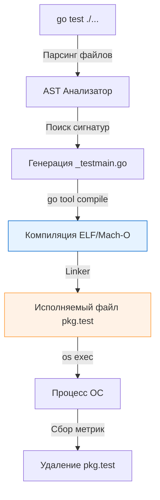

Когда мы пишем `go test` в консоли, магия происходит настолько быстро, что создается иллюзия работы интерпретатора или JIT-компиляции, как в Java. Кажется, будто Go просто "читает" файлы и выполняет их "на лету". 

Но мы инженеры, и магии для нас не существует. За этой скоростью скрывается сложный, многоступенчатый процесс статической кодогенерации, нативной компиляции и изощренной работы с планировщиком ОС.

В этой статье мы препарируем команду `go test`, посмотрим на сгенерированный ею код и разберемся, как тесты исполняются на уровне рантайма (Runtime) и железа.

## Жизненный цикл `go test`

Выполнение команды `go test` можно разделить на три изолированные фазы: **Анализ**, **Сборка** и **Исполнение**. 



### Фаза 1: Анализ и Кодогенерация

Тулчейн Go не использует рефлексию (Reflection) для поиска ваших тестов в рантайме. Рефлексия — это медленно. Вместо этого инструмент статического анализа парсит Abstract Syntax Tree (AST) всех файлов, оканчивающихся на `_test.go` в текущем пакете.

Он ищет функции, удовлетворяющие жестким сигнатурам:
* `TestXxx(t *testing.T)`
* `BenchmarkXxx(b *testing.B)`
* `FuzzXxx(f *testing.F)`
* `TestMain(m *testing.M)`

Как только функции найдены, `go test` динамически генерирует во временной директории (обычно в `$TMPDIR` или кэше сборки) файл `_testmain.go`. Это настоящая точка входа (`func main`) для вашего тестового бинарника.

> [!info] Под капотом
> Как выглядит сгенерированный `_testmain.go`? В упрощенном виде он содержит массив структур `testing.InternalTest`:
> ```go
> package main
> 
> import (
> 	"testing"
> 	"testing/internal/testdeps"
> 	// Импорт вашего пакета под алиасом
> 	_test "myproject/mypackage" 
> )
> 
> var tests = []testing.InternalTest{
> 	{"TestAdd", _test.TestAdd},
> 	{"TestDelete", _test.TestDelete},
> }
> 
> func main() {
> 	m := testing.MainStart(testdeps.TestDeps{}, tests, nil, nil, nil)
> 	os.Exit(m.Run())
> }
> ```
> Этот массив передается в движок пакета `testing`. Никакой магии, только передача указателей на функции.

### Фаза 2: Компиляция

Затем вызывается `go tool compile` (и линковщик `go tool link`). Ваш код и сгенерированный `_testmain.go` собираются в единый монолитный исполняемый файл для вашей архитектуры и ОС (например, `mypackage.test`).

Этот файл подвергается тем же оптимизациям, что и production-сборка: Escape Analysis пытается аллоцировать переменные на стеке (чтобы не нагружать GC), а короткие функции инлайнятся (Inlining) прямо в тело тестов, чтобы избежать накладных расходов на переключение фреймов стека (Call Frame).

> [!tip] Собеседование
> **Вопрос:** Могу ли я скомпилировать тесты сейчас, а запустить их позже на другом сервере, где даже не установлен Go?
> **Ответ:** Да. Команда `go test -c` генерирует тестовый бинарник (по умолчанию `pkg.test` или `pkg.test.exe`), но не запускает его. Вы можете передать этот бинарник на голый production-сервер (Linux) и запустить его вручную `./pkg.test`. Это часто используется в суровых CI/CD пайплайнах для интеграционного тестирования в закрытых контурах.

### Фаза 3: Исполнение и tRunner

Когда бинарник запущен, движок `testing` начинает итерацию по массиву тестов. И здесь начинается самое интересное с точки зрения архитектуры рантайма.

Каждый тест выполняется в отдельной **горутине**, за создание которой отвечает внутренняя функция `tRunner`.

```go
// Упрощенный исходный код testing/testing.go
func tRunner(t *T, fn func(t *T)) {
	// ... инициализация
	defer func() {
		// Перехват panic внутри теста
		err := recover()
		if err != nil {
			t.Errorf("panic: %v", err)
			t.FailNow()
		}
	}()
	
	// Выполнение ВАШЕЙ функции теста
	fn(t)
}
```

Благодаря тому, что каждый тест обернут в `tRunner` с `defer recover()`, если один из ваших тестов словит панику (`index out of range`, `nil pointer dereference`), это "убьет" только горутину конкретного теста. Основной процесс `_testmain` перехватит панику, пометит тест как `FAIL`, выведет Stack Trace и спокойно продолжит выполнять следующие тесты.

## Mechanical Sympathy: Механика t.Parallel()

По умолчанию тесты выполняются **строго последовательно** внутри пакета. Планировщик Go выделяет горутине теста квант времени, она отрабатывает до конца, затем запускается следующая.

Но если вы вызываете метод `t.Parallel()` в первой строчке теста, происходит магия оркестрации:

1. Метод `t.Parallel()` немедленно вызывает `runtime.Goexit()`. Текущая горутина ставится на паузу и помечается как "ожидающая параллельного запуска".
2. Движок тестов переходит к следующему тесту в массиве.
3. Только когда **все** последовательные тесты завершатся, движок берет все отложенные параллельные горутины и "будит" их разом, разрешая планировщику (Scheduler) распределить их по тредам ОС (M) и логическим процессорам (P).

> [!warning] Ловушка / Gotcha
> Количество тестов, которые физически могут выполняться одновременно при `t.Parallel()`, ограничено переменной среды `GOMAXPROCS` (по умолчанию равно количеству ядер процессора). 
> 
> Если у вас 1000 параллельных I/O-bound интеграционных тестов (которые ходят в БД), они не "завалят" вашу БД тысячей одновременных подключений. Они выстроятся в очередь планировщика Go, и параллельно в User Space будут крутиться максимум 8-16 тестов (в зависимости от ваших ядер). Вы можете искусственно поднять этот лимит флагом `go test -parallel N`.

## Кеширование: Почему тесты выполняются за 0.001s?

Тулчейн Go невероятно агрессивен в плане кеширования. Если вы запустите `go test` дважды без изменений в коде, второй прогон вернет `(cached)`.

**Как Go определяет, что кеш валиден?**
Он берет хеш (SHA256) от:
1. Содержимого всех `.go` файлов пакета и его зависимостей.
2. Флагов командной строки (`-tags`, `-gcflags`).
3. Переменных окружения, которые влияют на сборку (`CGO_ENABLED`, `GOOS`, `GOARCH`).

Если хеш совпадает с записью в папке `GOCACHE`, Go **вообще не компилирует и не запускает бинарник**. Он просто выводит в консоль сохраненный `stdout` от прошлого успешного запуска.

**Как инвалидировать кеш?**
Иногда тесты зависят от внешнего мира (например, запрос к удаленному API). Код не поменялся, но ответ API мог измениться. Кеш здесь вреден.
* Идиоматичный способ принудительно запустить тесты: добавить флаг `-count=1` (`go test -count=1 ./...`). Этот флаг отключает подсистему кеширования результатов тестов (но оставляет кеш сборки компилятора).

## Итог

1. `go test` — это не интерпретатор. Это обертка, которая генерирует `_testmain.go`, компилирует нативный исполняемый файл и управляет его запуском.
2. Бинарник можно собрать отдельно через `go test -c`.
3. Каждый тест выполняется в своей собственной горутине под присмотром `tRunner`, который защищает процесс от падений через `recover()`.
4. Инструментарий агрессивно кеширует результаты, опираясь на хеш исходников. Запомните флаг `-count=1` для обхода этой оптимизации.

Теперь, понимая механику рантайма, мы готовы переходить к написанию самих тестов. Начнем с самого важного идиоматичного паттерна в Go, который позволяет писать десятки проверок без дублирования кода: [[4. Table driven tests]].