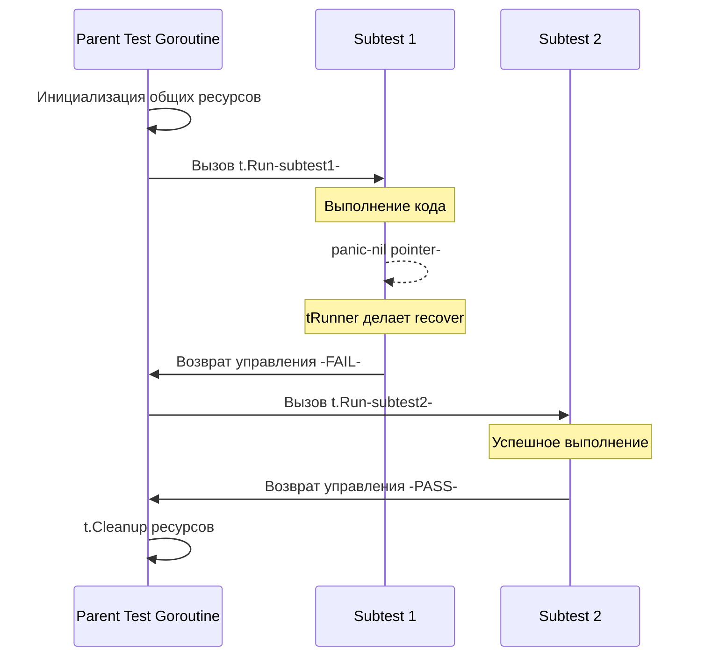

В статье [[4. Table driven tests]] мы увидели, как элегантно запускать десятки сценариев в одном цикле. Ключевым механизмом, который делает эти сценарии читаемыми и управляемыми, является метод `t.Run()`. 

До версии Go 1.7 разработчикам приходилось использовать сторонние библиотеки (например, `testify/suite` или `gocheck`), чтобы группировать тесты, выполнять общую инициализацию (Setup) и выборочно запускать упавшие кейсы. Внедрение `t.Run()` добавило в язык нативную поддержку **иерархических тестов (Subtests)**, навсегда изменив стандарты написания тестового кода в Go.

## Что такое t.Run?

Метод `t.Run` принимает строку (имя подтеста) и замыкание (функцию) с сигнатурой `func(t *testing.T)`. 

```go
func TestProcessor(t *testing.T) {
	// Общий Setup для всех подтестов
	db := setupDatabase()
	t.Cleanup(func() { db.Close() })

	t.Run("valid input", func(t *testing.T) {
		// Вложенный контекст тестирования
		// t здесь — это НОВЫЙ указатель на testing.T
		err := process(db, "good_data")
		if err != nil {
			t.Errorf("unexpected error: %v", err)
		}
	})

	t.Run("invalid input", func(t *testing.T) {
		err := process(db, "bad_data")
		if err == nil {
			t.Errorf("expected error, got nil")
		}
	})
}
```

### Главные преимущества паттерна:
1. **Изоляция сбоев:** Если первый подтест `valid input` словит `panic()` или вызовет `t.Fatal()`, второй подтест `invalid input` **всё равно будет выполнен**. 
2. **Иерархия имен:** Имя подтеста объединяется с именем родительского теста через слэш. В логах это выглядит как `TestProcessor/valid_input`.
3. **Гранулярный контроль:** Вы можете запустить только один конкретный подтест из консоли, не прогоняя весь массив проверок.

> [!info] Под капотом
> Что физически происходит при вызове `t.Run`?
> Рантайм пакета `testing` создает новый экземпляр структуры `testing.T` (наследуя некоторые флаги от родителя) и вызывает внутреннюю функцию `tRunner`.
> 
> Важно: по умолчанию (если внутри нет вызова `t.Parallel()`) замыкание подтеста выполняется **синхронно в той же самой горутине**, что и родительский тест. Вызов `t.Run` блокирует выполнение родительской функции до тех пор, пока замыкание не завершит работу. 
> 
> Однако, так как `t.Run` использует функцию `tRunner`, внутри неё срабатывает `defer recover()`. Именно поэтому паника в подтесте перехватывается, помечает `child_t.Fail()`, раскручивает стек подтеста и спокойно возвращает управление в цикл родительского теста.



## Выборочный запуск тестов (CLI)

Одна из главных причин использовать `t.Run` вместо простого логгирования в цикле — это возможности CLI утилиты `go test`.

Представьте, что у вас есть интеграционный тест `TestAPI`, который содержит 50 подтестов (создание, чтение, удаление записей), и он занимает 10 секунд. Один из кейсов упал. Запускать все 50 кейсов при дебаге — трата времени.

Флаг `-run` принимает **регулярное выражение**, которое матчится по полному имени теста.

**Примеры фильтрации:**

1. Запустить только один подтест:
   ```bash
   # Пробелы в имени автоматически заменяются на подчеркивания
   go test -v -run "^TestAPI/invalid_input$"
   ```

2. Запустить группу подтестов по маске:
   Если вы именуете подтесты структурированно (например, `create_success`, `create_fail`, `delete_success`), вы можете отфильтровать их:
   ```bash
   go test -v -run "TestAPI/create_.*"
   ```

3. Иерархическая фильтрация:
   Вы можете вкладывать `t.Run` друг в друга сколько угодно раз (например, `Test/Group/Case`). 
   ```bash
   # Запустит все кейсы внутри группы validation
   go test -v -run "TestUsers/validation/" 
   ```

> [!tip] Собеседование
> **Вопрос:** Как запустить подтест, если в его названии есть слэш (например, `t.Run("math/add", ...)`), и как утилита `go test` отличает слэш-разделитель иерархии от слэша в самом имени?
> **Ответ:** При парсинге аргумента `-run` утилита разбивает регулярное выражение по неэкранированным слэшам. Если имя вашего подтеста содержит слэш, вы не можете просто написать `-run "Test/math/add"`. Рантайм воспримет `math` как подтест, а `add` как под-подтест. Чтобы матчить буквальный слэш, вы должны использовать экранирование или писать регулярку, например: `-run "Test/math.add"`, где точка заменит любой символ. В идеале — просто **никогда не используйте слэши в названиях `t.Run`**.

## Иерархический Setup и Teardown

`t.Run` позволяет строить сложные графы инициализации ресурсов. Это особенно полезно в интеграционном тестировании.

```go
func TestSystem(t *testing.T) {
	// Уровень 1: Поднимаем тяжелую БД (1 раз)
	db := startDatabase(t) 
	
	t.Run("users logic", func(t *testing.T) {
		// Уровень 2: Накатываем миграции для юзеров
		setupUserTables(t, db)
		
		t.Run("create user", func(t *testing.T) {
			// Уровень 3: Запись и проверка
			// В случае паники здесь, ресурсы будут корректно очищены
			createUser(t, db)
		})
	})
	
	t.Run("payments logic", func(t *testing.T) {
		// Уровень 2: Совершенно независимая ветка
		setupPaymentTables(t, db)
		// ...
	})
}
```

> [!warning] Ловушка / Gotcha
> Как мы обсуждали в статье [[7. Test isolation]], использование ключевого слова `defer` в родительском тесте в связке с асинхронными подтестами — это прямой путь к плавающим багам. 
> Если внутри `t.Run` вы вызываете `t.Parallel()`, метод `t.Run` возвращает управление *мгновенно*, не дожидаясь завершения подтеста. Если вы используете `defer db.Close()` в `TestSystem`, база закроется **до** того, как параллельные подтесты успеют выполниться.
> **Строгое правило:** всегда используйте `t.Cleanup(func)` вместо `defer` в тестах, содержащих `t.Run`. Рантайм Go гарантирует, что `t.Cleanup` родителя вызовется только после того, как все (в том числе параллельные) вложенные подтесты завершат свою работу.

## Итог

1. `t.Run` разбивает монолитные тесты на гранулярные, изолированные шаги (Subtests).
2. Паника в подтесте не убивает родительский тест, позволяя выполнить оставшиеся проверки.
3. Имена подтестов объединяются в пути (например, `TestName/subtest_name`), что позволяет использовать точечный запуск через `go test -run="regexp"`.
4. В комбинации с `t.Cleanup`, `t.Run` предоставляет мощный механизм для иерархического управления зависимостями.

До сих пор мы рассматривали подтесты, которые выполняются последовательно. Но настоящая мощь Go раскрывается в многопоточности. Использование подтестов — это фундамент для создания конкурентных тестовых пайплайнов. О том, как безопасно запустить сотни кейсов одновременно и сократить время ожидания CI в десятки раз, читайте в следующей статье: [[6. Параллельные тесты t.Parallel]].