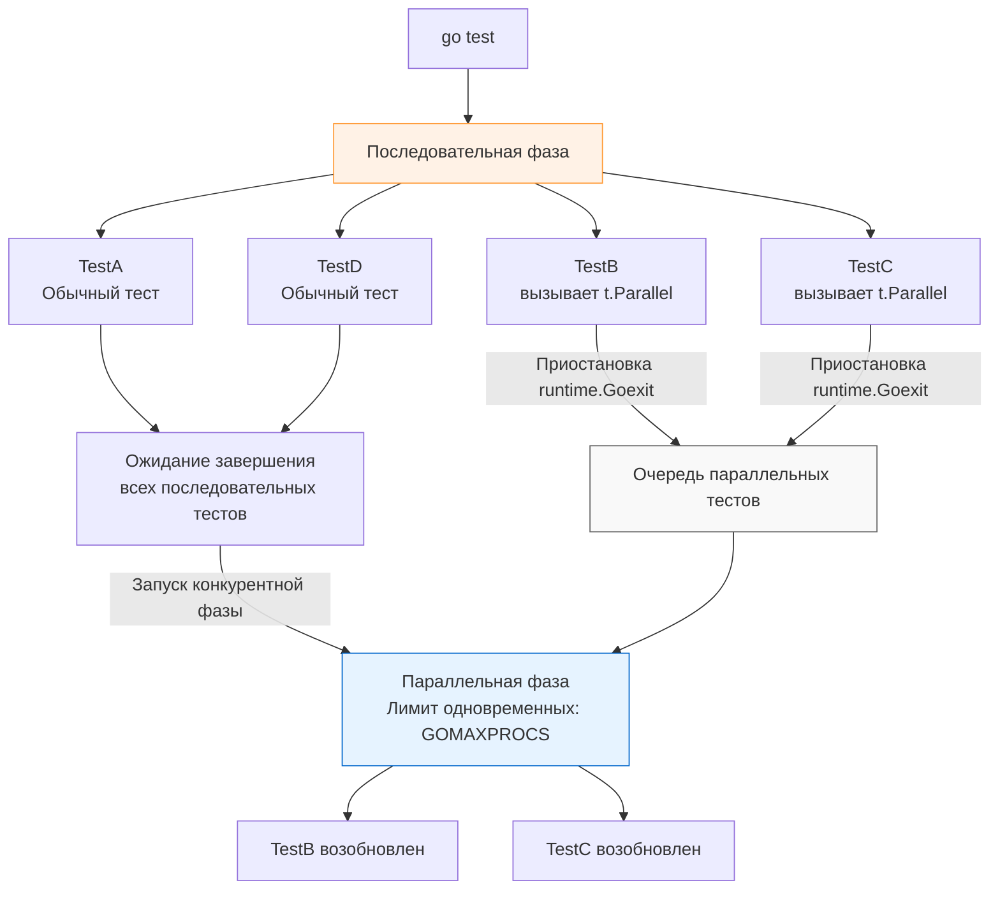

Если ваш CI/CD пайплайн выполняется дольше пяти минут, вы теряете деньги бизнеса и фокус разработчиков. В бэкенде микросервисы часто обращаются к базам данных, внешним API и файловой системе. Тесты становятся I/O-bound (ограниченными вводом-выводом). Запускать такие тесты последовательно — значит заставлять современный многоядерный процессор простаивать в ожидании сетевых ответов.

В Go параллелизм тестов встроен прямо в стандартную библиотеку. Всего один вызов метода `t.Parallel()` способен сократить время прогона тестов в десятки раз. Но эта мощь требует идеальной изоляции состояния и понимания того, как работает рантайм.

В этой статье мы разберем механику `t.Parallel()`, ловушки планировщика и архитектурные антипаттерны, которые приводят к плавающим (flaky) багам.

## Как работает t.Parallel() под капотом

Многие разработчики ошибочно полагают, что `t.Parallel()` мгновенно порождает новую горутину и продолжает выполнение. Это не так. Рантайм пакета `testing` жестко разделяет выполнение на две фазы: **Последовательную** (Sequential) и **Параллельную** (Parallel).

Когда вы запускаете `go test`, все тесты по умолчанию запускаются последовательно.

Если внутри теста вызывается `t.Parallel()`, происходит следующее:
1. Вызов помечает текущий тест как "параллельный".
2. Рантайм вызывает `runtime.Goexit()`. Выполнение текущей горутины **мгновенно приостанавливается** (замораживается), а сам тест помещается во внутреннюю очередь (queue).
3. Планировщик тестов переходит к выполнению следующего последовательного теста в пакете.
4. Только когда **все** последовательные тесты (или фазы) в пакете завершат свою работу, рантайм разблокирует очередь параллельных тестов.
5. Параллельные тесты запускаются конкурентно в новых горутинах. Максимальное количество одновременно работающих тестов ограничено флагом `-parallel` (по умолчанию равно значению `GOMAXPROCS`, то есть количеству ядер CPU).



> [!info] Под капотом
> Что значит ограничение `-parallel`? 
> Представьте, что у вас 1000 тестов с `t.Parallel()`, а у процессора 8 ядер (`GOMAXPROCS=8`). Пакет `testing` не создаст 1000 горутин сразу, чтобы не спровоцировать "шторм" (Goroutine storm) и не исчерпать ресурсы (например, пул подключений к БД). Он использует семафор (канал с буфером 8). Только 8 тестов будут физически выполняться одновременно. Когда один завершается, его место занимает следующий из очереди.

## Правильное использование с t.Run (Subtests)

Самый частый сценарий использования `t.Parallel()` — внутри табличных тестов (Table Driven Tests). Но здесь кроется нюанс с областью видимости и иерархией.

Чтобы подтесты выполнялись параллельно друг другу, нужно вызвать `t.Parallel()` **внутри** замыкания `t.Run`.

```go
func TestProcessor(t *testing.T) {
	// 1. Опционально: делаем сам родительский тест параллельным
	t.Parallel() 

	tests := []struct{
		name  string
		input string
	}{
		{"case 1", "data 1"},
		{"case 2", "data 2"},
	}

	for _, tt := range tests {
		t.Run(tt.name, func(t *testing.T) {
			// 2. Делаем подтесты параллельными между собой
			t.Parallel() 
			
			// Выполнение логики
			process(tt.input) 
		})
	}
}
```

**Mechanical Sympathy этого паттерна:**
Если вы не вызовете `t.Parallel()` в родительском тесте (пункт 1), `TestProcessor` запустится в последовательной фазе, дойдет до цикла, зарегистрирует все подтесты как параллельные и... **заблокируется**, ожидая их завершения. Да, подтесты "case 1" и "case 2" будут работать параллельно друг другу, но следующий верхнеуровневый тест в файле не начнется, пока `TestProcessor` не завершится. 
Добавление `t.Parallel()` в корень теста позволяет планировщику отложить весь этот блок целиком и не блокировать другие тесты пакета.

## Ловушки конкурентности

Когда ваш код начинает работать параллельно, любые архитектурные огрехи немедленно приводят к состоянию гонки (Data Race).

### 1. Переменная цикла (Loop Closure Bug)

Как мы упоминали в статье про табличные тесты, в версиях Go до 1.22 замыкание переменной цикла в асинхронной функции приводит к тому, что все тесты используют последнее значение итератора.

> [!warning] Ловушка / Gotcha
> Если вы поддерживаете legacy-проект на Go 1.21 и ниже:
> ```go
> for _, tt := range tests {
>     tt := tt // КРИТИЧЕСКИ ВАЖНО для Go < 1.22
>     t.Run(tt.name, func(t *testing.T) {
>         t.Parallel()
>         // Использование tt
>     })
> }
> ```
> В Go 1.22+ семантика `for` изменилась, и переменная `tt` пересоздается на каждой итерации автоматически. Костыль больше не нужен, но на собеседованиях об этом всё ещё спрашивают.

### 2. t.Setenv и глобальное состояние среды

Тестирование конфигураций часто требует изменения переменных окружения. В Go 1.17 добавили метод `t.Setenv()`, который безопасно меняет переменную и возвращает её в исходное состояние после теста.

Но переменные окружения ОС — это глобальное состояние всего процесса.

> [!tip] Собеседование
> **Вопрос:** Что произойдет, если вызвать `t.Setenv("KEY", "VAL")` в тесте, который помечен как `t.Parallel()`?
> **Ответ:** Тест немедленно завершится с **паникой** (`panic: testing: t.Setenv called after t.Parallel`). 
> Рантайм Go защищает вас от Data Race на уровне ядра ОС. Если два параллельных теста попытаются одновременно изменить `os.Environ`, они перезапишут данные друг друга, что приведет к недетерминированному поведению. **Правило:** Тесты, меняющие переменные окружения или глобальные переменные в памяти (Singleton), должны запускаться только последовательно.

### 3. Общие I/O ресурсы и порты

Если ваши параллельные интеграционные тесты поднимают HTTP-сервер, вы не можете использовать фиксированный порт (например, `8080`). Второй запустившийся тест упадет с ошибкой `bind: address already in use`.
Всегда используйте эфемерные порты ОС (`:0`), как мы обсуждали в разделе про изоляцию. То же самое касается временных файлов — используйте `t.TempDir()`, чтобы каждый параллельный тест имел свою изолированную песочницу на диске.

## Teardown: defer vs t.Cleanup в параллельной среде

Это самая частая причина утечки ресурсов (например, незакрытых соединений с БД) в CI-пайплайнах на Go.

Посмотрите на этот код:
```go
func TestWithDB(t *testing.T) {
	db := startTestDB()
	defer db.Close() // ОШИБКА АРХИТЕКТУРЫ

	t.Run("parallel query 1", func(t *testing.T) {
		t.Parallel()
		db.Query("...")
	})
	
	t.Run("parallel query 2", func(t *testing.T) {
		t.Parallel()
		db.Query("...")
	})
}
```

Поскольку подтесты вызывают `t.Parallel()`, они замораживают свое выполнение через `runtime.Goexit()`. Родительский тест `TestWithDB` мгновенно завершает выполнение своего тела, так как все его подтесты отложены. 
Что происходит при завершении функции? Вызывается `defer db.Close()`.
База данных закрывается **ДО** того, как подтесты физически начнут выполняться. Когда рантайм разбудит подтесты в параллельной фазе, они попытаются сделать `db.Query` в закрытое соединение и упадут.

**Идиоматичное решение:**
```go
func TestWithDB(t *testing.T) {
	db := startTestDB()
	
	// t.Cleanup гарантированно дождется завершения 
	// ВСЕХ параллельных подтестов перед выполнением.
	t.Cleanup(func() {
		db.Close()
	})
	// ...
}
```

## Итог

1. `t.Parallel()` разделяет прогон тестов на последовательную и конкурентную фазы, останавливая горутину через `runtime.Goexit()`.
2. Максимальный параллелизм ограничен `GOMAXPROCS` (или флагом `-parallel`), предотвращая истощение ресурсов ОС.
3. Для параллельных табличных тестов в старых версиях Go (< 1.22) обязательно теневое копирование переменной итератора (`tt := tt`).
4. Параллельные тесты не совместимы с мутацией глобального состояния (`t.Setenv`, глобальные переменные, статические порты).
5. При использовании `t.Parallel()` в подтестах, очистка ресурсов родителя должна выполняться строго через `t.Cleanup`, а не `defer`.

Мы разобрались, как управлять потоком выполнения, запускать подтесты и распараллеливать нагрузку. Но по мере роста тестовой базы вы начнете писать вспомогательные утилиты для генерации данных и проверок. Как сделать так, чтобы эти утилиты не ломали навигацию по ошибкам в IDE? Об этом — в следующей статье: [[7. Helper функции и t.Helper]].