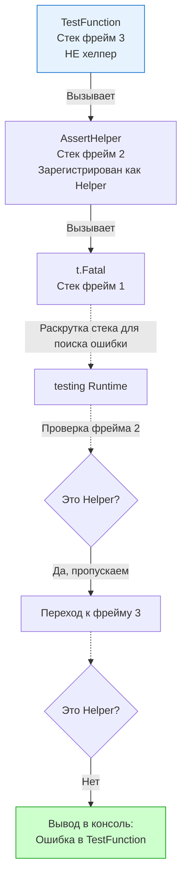

По мере роста кодовой базы ваши тесты неизбежно начнут обрастать дублирующимся кодом. Вы будете писать одни и те же проверки JSON, одинаково инициализировать тестовую базу данных или создавать типовые DTO-структуры.

Следуя принципу DRY (Don't Repeat Yourself), вы вынесете эту логику во вспомогательные функции — **хелперы (Helpers)**. Но как только вы это сделаете, вы столкнетесь с раздражающей проблемой дебага: при падении теста компилятор будет указывать вам не на тот тест, который сломался, а на внутренности самого хелпера.

Чтобы решить эту проблему, в Go 1.9 был добавлен метод `t.Helper()`. В этой статье мы разберем не только то, как его использовать, но и как он работает на уровне стека вызовов рантайма, а также изучим паттерны проектирования production-ready хелперов.

## Проблема навигации по ошибкам

Рассмотрим типичный сценарий: мы написали собственную функцию для сравнения чисел (по сути, мини-assert).

```go
package math_test

import "testing"

// Вспомогательная функция (Helper)
func assertEqual(t *testing.T, got, want int) {
	if got != want {
		// Ошибка сгенерируется ЗДЕСЬ (строка 8)
		t.Errorf("got %d, want %d", got, want) 
	}
}

func TestMath(t *testing.T) {
	assertEqual(t, 2+2, 5) // Вызов из теста (строка 14)
}
```

**Что выведет консоль при падении?**
```text
--- FAIL: TestMath (0.00s)
    math_test.go:8: got 4, want 5
```

Тест указывает на **строку 8**. Представьте, что функция `assertEqual` используется в 500 различных тестах. Если тест падает в CI, кликнув на номер строки в логах, вы перейдете в код хелпера. Вам придется вручную копировать имя упавшего теста (`TestMath`), искать его по всему проекту и смотреть, с какими аргументами он вызывал этот хелпер. Это убивает весь смысл быстрой обратной связи.

## Решение: t.Helper()

Вызов `t.Helper()` сообщает рантайму пакета `testing`, что текущая функция является вспомогательной, и её следует исключить из трассировки стека (Stack Trace) при выводе ошибки.

Исправим наш код:

```go
func assertEqual(t *testing.T, got, want int) {
	t.Helper() // Регистрируем функцию как хелпер
	if got != want {
		t.Errorf("got %d, want %d", got, want) 
	}
}
```

**Новый вывод в консоли:**
```text
--- FAIL: TestMath (0.00s)
    math_test.go:14: got 4, want 5
```

Теперь Go указывает на **строку 14** — то самое место внутри `TestMath`, где произошел вызов. Навигация в IDE снова работает идеально.

> [!info] Под капотом
> Как именно `t.Helper()` скрывает строку кода? 
> Когда вы вызываете `t.Helper()`, движок тестов использует функцию `runtime.Callers(1, pc)`, чтобы получить Program Counter (адрес текущей инструкции) вызывающей функции. Этот адрес сохраняется во внутреннюю `map` структуры `testing.T`.
> 
> Когда вызывается `t.Errorf`, Go начинает **раскручивать стек (Stack Unwinding)**, двигаясь от текущей функции вверх к вызывающим. На каждом фрейме (Stack Frame) он проверяет, не находится ли текущий Program Counter в списке зарегистрированных хелперов.
> Если находит совпадение — пропускает этот фрейм и идет выше, пока не найдет первый "не-хелперный" фрейм стека. Именно его координаты (файл и строка) и выводятся в лог.



## Паттерны проектирования хелперов

Написание хороших хелперов требует соблюдения нескольких архитектурных правил.

### 1. Передача `*testing.T` первым аргументом

Это негласный стандарт сообщества Go. Если функция помогает тесту, она должна принимать контекст этого теста первым аргументом. Это позволяет хелперу логировать ошибки (`t.Log`), прерывать выполнение (`t.Fatal`) и регистрировать отложенные функции (`t.Cleanup`).

### 2. Setup-хелперы с t.Cleanup()

Классический антипаттерн новичков — возвращать функцию очистки (Teardown) из хелпера инициализации.

**Плохой подход (Антипаттерн):**
```go
// ПЛОХО: Возвращаем функцию очистки, заставляя вызывающий код помнить о ней
func setupDatabase() (*sql.DB, func()) {
	db := connect()
	cleanup := func() { db.Close() }
	return db, cleanup
}

func TestBad(t *testing.T) {
	db, cleanup := setupDatabase()
	defer cleanup() // Разработчик может забыть это написать!
	// ...
}
```

**Idiomatic Go подход:**
Используйте `t.Cleanup()` внутри самого хелпера. Это гарантирует очистку ресурсов, снижает когнитивную нагрузку и защищает от Data Race при параллельном выполнении подтестов (как мы обсуждали в статье о `t.Parallel`).

```go
// ХОРОШО: Хелпер берет на себя всю ответственность
func setupDatabase(t *testing.T) *sql.DB {
	t.Helper()
	db, err := sql.Open("postgres", "...")
	if err != nil {
		t.Fatalf("failed to open db: %v", err)
	}
	
	// Регистрация очистки ПРЯМО В ХЕЛПЕРЕ
	t.Cleanup(func() {
		db.Close()
	})
	
	return db
}

func TestGood(t *testing.T) {
	// Идеально чисто. Никаких defer. Ресурс будет очищен автоматически.
	db := setupDatabase(t) 
	// ...
}
```

### 3. Вложенные хелперы

Часто один высокоуровневый хелпер вызывает другой низкоуровневый. 

> [!warning] Ловушка / Gotcha
> Метод `t.Helper()` не имеет транзитивности. Если Хелпер А вызывает Хелпер Б, вы должны вызвать `t.Helper()` **в обеих функциях**. 
> Если вы забудете написать `t.Helper()` в Хелпере А, движок тестов раскрутит стек из Хелпера Б, остановится на Хелпере А и выведет ошибку на него, а не на корневой тест.

```go
func createBaseUser(t *testing.T) *User {
	t.Helper() // Обязательно
	return &User{Role: "user"}
}

func createAdminUser(t *testing.T) *User {
	t.Helper() // Тоже обязательно!
	u := createBaseUser(t)
	u.Role = "admin"
	return u
}
```

## Хелперы и Горутины

Самая неочевидная проблема с хелперами возникает при асинхронном программировании.

Представьте хелпер, который запускает фоновый процесс и мониторит его ошибки:

```go
func startBackgroundWorker(t *testing.T) {
	t.Helper()
	
	go func() {
		// ОШИБКА АРХИТЕКТУРЫ
		// t.Helper здесь не спасет!
		if err := doWork(); err != nil {
			t.Errorf("worker failed: %v", err)
		}
	}()
}
```

**Почему `t.Helper()` здесь бесполезен?**
Вспомните механику рантайма из врезки "Под капотом". `t.Helper()` манипулирует фреймами стека. Когда вы запускаете новую горутину (`go func`), она получает **свой собственный, абсолютно новый стек**, размер которого инициализируется с 2 КБ.
В этом новом стеке нет фрейма корневой функции `TestXxx`. Когда `t.Errorf` внутри горутины начнет раскручивать стек, он дойдет до корня горутины (самой анонимной функции) и выведет строку именно внутри этой горутины. Он физически не может "перепрыгнуть" в стек вызвавшего теста.

**Как тестировать асинхронные ошибки?**
Вместо вызова `t.Error` изнутри горутины, хелпер должен синхронизировать ошибки через каналы, возвращая их в основной поток теста, где они будут обработаны детерминированно.

> [!tip] Собеседование
> **Вопрос:** Библиотека `testify/assert` является стандартом де-факто для проверок в Go. Как вы думаете, как реализована функция `assert.Equal(t, a, b)` внутри самой библиотеки?
> **Ответ:** Каждая функция в `testify/assert` первым делом вызывает `t.Helper()` (через внутренний интерфейс `TestingT`), чтобы ошибки при сравнении указывали на вашу строку кода, а не на исходники `testify` в `GOPATH/pkg/mod/...`. Эта простая функция рантайма сделала возможным существование целой экосистемы assert-библиотек в Go.

## Итог

1. `t.Helper()` необходим для скрытия вспомогательных функций из трассировки стека ошибок, что критически важно для быстрой навигации к сломавшемуся тесту.
2. Под капотом механизм использует `runtime.Callers` для пропуска зарегистрированных Stack Frames при раскрутке стека.
3. Идиоматичные Setup-хелперы должны принимать `*testing.T` и самостоятельно вызывать `t.Cleanup()`, освобождая вызывающий код от управления ресурсами через `defer`.
4. В цепочке вложенных хелперов `t.Helper()` должен вызываться на каждом уровне.
5. Механизм бесполезен при вызове `t.Error` из порожденных горутин из-за изоляции стеков.

Изоляция тестовых данных часто требует работы с файловой системой. Хардкодить пути к конфигам или писать логи в системный `/tmp` — плохая практика, чреватая Data Race. О том, как рантайм пакета `testing` элегантно решает эту проблему без единой строчки ручной очистки, читайте в следующем материале: [[8. Работа с временными файлами и t.TempDir]].