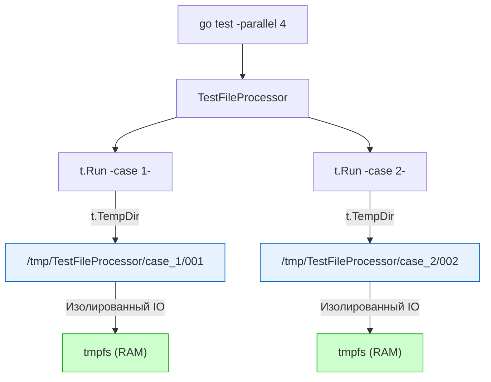

Тестирование кода, который взаимодействует с файловой системой (чтение конфигураций, запись логов, парсинг CSV, генерация отчетов) — это классическая головная боль. 

В идеальном мире юнит-тесты не должны работать с диском (IO). Но в реальности бэкенд-разработчики постоянно пишут интеграционные или модульные тесты для компонентов, где файловая система является неотъемлемой частью контракта.

До Go 1.15 разработчикам приходилось жонглировать путями, обрабатывать ошибки удаления и молиться, чтобы параллельные тесты не перезаписали файлы друг друга. С появлением встроенного метода `t.TempDir()` работа с временными файлами стала элегантной и пуленепробиваемой.

## Наследие прошлого: Как мы страдали раньше

Чтобы понять всю мощь `t.TempDir()`, посмотрим на то, как работали с файлами "деды". Если вы видите подобный код в legacy-проекте, знайте — это мина замедленного действия.

```go
// АНТИПАТТЕРН: Старый подход (До Go 1.15)
func TestLegacyFileIO(t *testing.T) {
	// 1. Создаем временную директорию вручную
	dir, err := os.MkdirTemp("", "mytest_*")
	if err != nil {
		t.Fatal(err)
	}
	
	// 2. Вручную регистрируем очистку
	defer os.RemoveAll(dir) 

	// 3. Формируем пути
	filePath := filepath.Join(dir, "data.txt")
	
	// Работа с файлом...
}
```

**В чем проблема этого подхода?**
1. **Бойлерплейт:** Вы пишете 5 строк инфраструктурного кода ради одного файла.
2. **Ловушка `defer` и `t.Parallel()`:** Как мы уже разбирали в [[7. Test isolation]], использование `defer` для очистки ресурсов в параллельных тестах (особенно внутри `t.Run`) приводит к преждевременному удалению файлов. Тест еще не закончился, а папка уже удалена родительской функцией.
3. **Утечки мусора:** Если тест вызывает `os.Exit` (что иногда случается в сложных интеграционных обвязках), `defer` не срабатывает, и системный `/tmp` забивается мусорными папками.

---

## Современный стандарт: t.TempDir()

Метод `t.TempDir()` решает все эти проблемы одной строчкой. Он создает уникальную временную директорию для текущего теста и **автоматически** регистрирует её удаление через внутренний механизм `t.Cleanup()`.

```go
func TestModernFileIO(t *testing.T) {
	// t.TempDir() возвращает готовую строку с путем. Никаких проверок err != nil!
	dir := t.TempDir() 
	
	filePath := filepath.Join(dir, "config.json")
	
	err := os.WriteFile(filePath, []byte(`{"status": "ok"}`), 0644)
	if err != nil {
		t.Fatal(err)
	}

	// Читаем, проверяем, радуемся.
	// Больше ничего делать не нужно. Папка будет удалена автоматически.
}
```

### Mechanical Sympathy: tmpfs и нулевой Disk I/O

Для Senior-разработчика важно понимать, *куда именно* `t.TempDir()` пишет данные. 

В Linux и macOS системная временная директория (обычно `/tmp` или `/var/folders/...`) почти всегда монтируется как **`tmpfs`** (Temporary File System). 

> [!info] Под капотом
> Файловая система `tmpfs` физически располагается в оперативной памяти (RAM) и в кэше страниц ядра (Page Cache), а не на постоянном носителе (SSD/HDD).
> 
> Это дает колоссальное преимущество для тестов:
> 1. **Нулевая задержка физического диска (Zero Disk Latency):** Ваши вызовы `syscall write` просто копируют байты из User Space в RAM (Kernel Space).
> 2. **Отсутствие износа SSD (Wear Leveling):** Если ваши тесты генерируют гигабайты логов или временных файлов на каждый коммит в CI, использование системного `/tmp` бережет ресурс дисков на ваших runner-машинах.
> 
> Когда `t.TempDir` удаляет папку, ОС просто помечает страницы памяти как свободные.

---

## Архитектура: Изоляция параллельных тестов

Самая большая ценность `t.TempDir()` раскрывается в конкурентной среде. 

В Go каждый вызов `t.TempDir()` генерирует уникальное имя директории, которое включает в себя **название текущего теста и подтеста**, очищенное от спецсимволов, и случайный суффикс.

Например, для `t.Run("valid data", ...)` путь будет выглядеть примерно так:
`/tmp/TestParser/valid_data/001/`



Благодаря этому вы можете смело запускать тысячи тестов, пишущих в файлы с одинаковым названием (например, `config.yaml`), не боясь состояний гонки (Data Race) на уровне файловой системы.

---

## Ловушки и корнер-кейсы

Несмотря на простоту метода, использование `t.TempDir()` имеет несколько неочевидных нюансов, о которых часто спрашивают на интервью.

> [!warning] Ловушка / Gotcha: Блокировка файлов в Windows
> В Linux/Unix вы можете удалить файл (через `unlink` или `rm -rf`), даже если он открыт другим процессом. В Windows файловая система NTFS работает иначе: если файл открыт, ОС блокирует его удаление (File Lock).
> 
> Если в вашем тесте вы создали файл в `t.TempDir()`, открыли его (`os.Open`), но забыли сделать `file.Close()`, тест на Linux пройдет успешно (файл молча удалится после теста). 
> Но когда этот же код запустится в CI на Windows-runner, `t.TempDir()` попытается удалить директорию в фазе `Cleanup`, получит ошибку `Access is denied` и **провалит весь тест**, залогировав ошибку очистки.
> **Мораль:** Всегда закрывайте файлы (`defer file.Close()`), даже если они временные.

> [!tip] Собеседование
> **Вопрос:** Мой тест, использующий `t.TempDir()`, падает. Я хочу зайти в эту папку на диске и посмотреть, какие файлы там сгенерировались. Но папки нет! Почему?
> **Ответ:** Рантайм пакета `testing` вызывает зарегистрированные `t.Cleanup()` функции **всегда**, независимо от того, прошел тест успешно или упал (failed). 
> Если вам нужно сохранить директорию для дебага, вам придется временно отключить использование `t.TempDir()` и переписать на ручное создание `os.MkdirTemp()` без регистрации удаления, либо использовать дебаггер (dlv), чтобы поставить брейкпоинт до завершения функции.

## Правильный DI с файловой системой

Как сделать так, чтобы ваш production-код мог использовать реальные пути, а тесты — временные? Используйте Dependency Injection на уровне путей или интерфейса файловой системы (`io/fs.FS`, появившегося в Go 1.16).

```go
// Конструктор принимает базовую директорию
func NewLogger(baseDir string) *Logger {
	return &Logger{
		filepath: filepath.Join(baseDir, "app.log"),
	}
}

func TestLogger(t *testing.T) {
	// В тесте инжектим временную директорию
	tmp := t.TempDir()
	logger := NewLogger(tmp)
	
	logger.Write("test log")
	// ... проверки ...
}
```

## Итог

1. `t.TempDir()` — это современный, идиоматичный способ работы с временными файлами в тестах.
2. Он устраняет необходимость в ручном управлении очисткой и решает проблемы с `defer` в параллельных подтестах.
3. В UNIX-системах `t.TempDir()` использует оперативную память (`tmpfs`), обеспечивая наносекундную скорость записи.
4. Остерегайтесь незакрытых дескрипторов файлов (FD), особенно если ваш код будет выполняться на Windows-машинах.

Мы разобрались, как изолировать файловое пространство. Но приложения часто зависят не только от файлов, но и от переменных окружения (например, ключей доступа или настроек портов). Как безопасно мутировать их в конкурентной среде, разберем в следующей статье: [[9. Environment variables в тестах]].