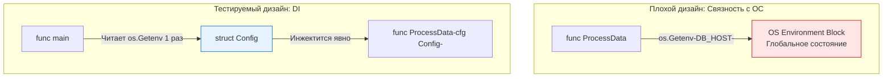

Любое бэкенд-приложение зависит от конфигурации. Мы передаем ключи доступа к AWS, адреса баз данных, уровни логирования и флаги (feature toggles) через переменные окружения (Environment Variables). Это стандарт де-факто (The Twelve-Factor App). 

Но когда дело доходит до тестирования, переменные окружения превращаются в архитектурный кошмар. Переменные окружения — это **глобальное мутабельное состояние**, разделяемое между всеми горутинами в рамках одного процесса операционной системы. 

В этой статье мы разберем, как безопасно тестировать код, зависящий от конфигурации, как рантайм Go защищает вас от выстрела в ногу, и почему `os.Getenv` глубоко в бизнес-логике — это преступление против тестируемости.

## Анатомия переменных окружения

С точки зрения операционной системы (будь то Linux, macOS или Windows), переменные окружения — это массив строк формата `KEY=VALUE`, который передается процессу при его запуске через системный вызов (например, `execve` в POSIX-системах). 

Этот массив (Environment Block) копируется в адресное пространство процесса (в User Space). 

Когда вы вызываете `os.Getenv` или `os.Setenv` в Go, вы обращаетесь к этой области памяти. Операция записи (`setenv`) не является потокобезопасной на уровне стандарта C POSIX, поэтому рантайм Go вынужден использовать внутренние глобальные блокировки (`sync.RWMutex` внутри пакета `syscall`), чтобы избежать Segmentation Fault при конкурентном доступе.

## Наследие: Темные века до Go 1.17

Раньше, чтобы протестировать функцию, которая читает конфиг из `os.Getenv`, разработчикам приходилось писать тонны хрупкого бойлерплейта:

```go
// АНТИПАТТЕРН: Старый способ работы с env (До Go 1.17)
func TestLegacyEnv(t *testing.T) {
	// 1. Сохраняем старое значение
	oldDBHost, exists := os.LookupEnv("DB_HOST")
	
	// 2. Устанавливаем новое для теста
	os.Setenv("DB_HOST", "localhost:5432")
	
	// 3. Гарантируем возврат состояния
	defer func() {
		if exists {
			os.Setenv("DB_HOST", oldDBHost)
		} else {
			os.Unsetenv("DB_HOST")
		}
	}()
	
	// Выполняем тест...
}
```

Этот код не только уродлив, он опасен. Если вы забудете восстановить переменную, все последующие тесты в пакете начнут подключаться к `localhost:5432` и падать с ошибками сети. 

## Современный стандарт: t.Setenv()

Начиная с Go 1.17, стандартная библиотека забрала эту боль на себя. Метод `t.Setenv(key, value)` делает ровно то, что мы писали выше, но элегантно и безопасно.

```go
func TestModernEnv(t *testing.T) {
	// t.Setenv автоматически сохраняет старое значение 
	// и восстанавливает его после завершения теста (через t.Cleanup)
	t.Setenv("DB_HOST", "localhost:5432")
	
	host := os.Getenv("DB_HOST")
	if host != "localhost:5432" {
		t.Fatalf("unexpected host: %s", host)
	}
}
```

> [!info] Под капотом
> Как работает `t.Setenv`?
> Когда вы вызываете этот метод, структура `testing.T` запоминает, что вы изменили переменную. Внутри себя она регистрирует функцию восстановления через `t.Cleanup()`. 
> 
> Более того, `t.Setenv` отслеживает **первичное** состояние переменной. Если вы вызовете `t.Setenv("KEY", "A")`, а потом `t.Setenv("KEY", "B")` в одном и том же тесте, при очистке рантайм восстановит изначальное состояние (до "A"), а не промежуточное. Это гарантирует абсолютную изоляцию.

## Ловушка: t.Parallel() и t.Setenv()

Здесь начинается хардкорная инженерия. Что произойдет, если вы захотите ускорить выполнение и запустите тесты с подменой окружения параллельно?

```go
func TestConfigParallel(t *testing.T) {
	t.Parallel() // Включаем конкурентность
	t.Setenv("LOG_LEVEL", "DEBUG") // ОШИБКА! ПАНИКА!
	// ...
}
```

> [!warning] Ловушка / Gotcha
> Вызов `t.Setenv()` в тесте, который помечен как `t.Parallel()`, вызывает немедленную панику: `panic: testing: t.Setenv called after t.Parallel`.
> 
> **Почему авторы Go так жестоки?**
> Представьте, что рантайм разрешил бы это. Тест A ставит `LOG_LEVEL=DEBUG`, а Тест B, бегущий на другом ядре CPU, в этот же момент ставит `LOG_LEVEL=ERROR`. Так как переменные окружения — это глобальный словарь всего процесса ОС, возникает классическое состояние гонки (Data Race). Тест A прочитал бы `ERROR` вместо `DEBUG` и упал. 
> В Go "panicking early" — это философия дизайна. Лучше уронить тест сразу с четким сообщением, чем позволить инженеру тратить часы на поиск плавающего (flaky) бага в CI.

## Архитектурный выход: Dependency Injection (DI)

Как тогда тестировать конкурентный код? Ответ прост: **ваш код вообще не должен знать о существовании `os.Getenv`**.

Чтение переменных окружения в случайных местах бизнес-логики — это антипаттерн (Hidden Dependency). Функция, которая делает системный вызов для получения конфига, становится привязанной к глобальному состоянию ОС.



### Правильный паттерн работы с конфигурацией

1. **Единая точка входа:** Переменные окружения читаются ровно один раз при старте приложения (в `main.go` или пакете `config`).
2. **Парсинг в структуру:** Данные перекладываются в строго типизированную структуру `Config` (с использованием библиотек типа `envconfig` или `viper`).
3. **DI:** Эта структура передается во все компоненты приложения как зависимость.

```go
// 1. Типизированный конфиг
type Config struct {
	DBHost string
	LogLevel string
}

// 2. Бизнес-логика зависит ТОЛЬКО от структуры
type Service struct {
	cfg Config
}

func NewService(cfg Config) *Service {
	return &Service{cfg: cfg}
}

func (s *Service) DoWork() string {
	return "Connecting to " + s.cfg.DBHost
}

// 3. Тест становится простым и параллельным
func TestService_DoWork(t *testing.T) {
	t.Parallel() // Теперь это АБСОЛЮТНО безопасно
	
	// Конструируем любое окружение прямо в памяти
	svc := NewService(Config{
		DBHost: "test-db:5432",
		LogLevel: "DEBUG",
	})
	
	got := svc.DoWork()
	if got != "Connecting to test-db:5432" {
		t.Errorf("unexpected output: %s", got)
	}
}
```

> [!tip] Собеседование
> **Вопрос:** В чем разница между использованием глобального `var Cfg *Config` и инъекцией `cfg Config` в конструкторы?
> **Ответ:** Использование глобальной переменной `Cfg` (даже если она прочитана из переменных окружения один раз) переносит проблему на уровень памяти Go. Конкурентные тесты, изменяющие поля `Cfg.DBHost`, вызовут Data Race в куче (Heap), а не в ядре ОС. `go test -race` немедленно поймает это. Инъекция зависимости (DI) позволяет каждому подтесту создать свой собственный, локальный на стеке экземпляр конфига, гарантируя 100% изоляцию и максимальную скорость выполнения через `t.Parallel()`.

## Итог

1. Переменные окружения — это глобальное состояние процесса. Работа с ними в тестах требует осторожности.
2. Используйте `t.Setenv()` для безопасной мутации и автоматической очистки окружения.
3. Рантайм Go намеренно роняет тесты, если вы комбинируете `t.Setenv()` и `t.Parallel()`, чтобы защитить вас от Data Race.
4. Единственный правильный способ работы с конфигурацией — парсить `os.Getenv` на самом верху приложения и передавать параметры через Dependency Injection. Это отвязывает бизнес-логику от ОС и позволяет распараллелить 100% тестов.

На этом мы завершаем разбор функционального тестирования в пакете `testing`. Вы научились изолировать тесты, управлять потоком выполнения, работать с IO и конфигурацией. Но бэкенд на Go должен работать не только правильно, но и быстро. Пришло время перейти к инструментам оценки производительности. В следующей статье мы разберем: [[10. Benchmark тесты]].