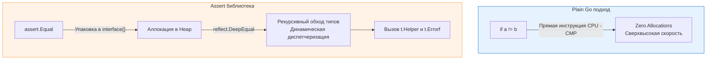

Разработчики, приходящие в Go из экосистем Java (JUnit), C# (NUnit), Python (pytest) или PHP (PHPUnit), испытывают культурный шок в первый же день написания тестов. Они инстинктивно ищут в стандартной библиотеке функции вроде `assertEquals`, `assertTrue` или `assertThrows`. И не находят их.

В Go "из коробки" нет никаких assert-функций. Вместо этого язык предлагает использовать обычные конструкции управления потоком — `if`, `for` и операторы сравнения, вызывая `t.Errorf` при несовпадении ожиданий. Этот подход называется **Plain Go**. 

В этой статье мы разберем философские причины такого решения, посмотрим, как устроены assert-библиотеки "под капотом", и выясним, какую цену на уровне CPU мы платим за сокращение бойлерплейта.

## Философия Plain Go: Почему в стандартной библиотеке нет assert?

Создатели Go (в частности, Роб Пайк) намеренно отказались от включения встроенных assert-ов. Их аргументация базируется на следующих инженерных принципах:

1. **Отказ от мини-языков (DSL):** Assert-фреймворки часто эволюционируют в собственные предметно-ориентированные языки. Разработчику приходится учить конструкции вроде `assert.That(result).IsInstanceOf(User.class).And().HasField("Age").GreaterThan(18)`. В Go философия иная: если вы умеете писать код на Go, вы уже умеете писать тесты на Go. 
2. **Обработка ошибок как значений:** Концепция "Errors are values" пронизывает весь язык. Если функция возвращает ошибку, вы проверяете её обычным `if err != nil`. Тесты не должны быть исключением.
3. **Контекст падения:** Простой `assert.Equal` часто выводит сухую констатацию факта: `Expected 4, got 5`. При использовании `t.Errorf` разработчик вынужден (или имеет возможность) написать осмысленное сообщение, объясняющее, *почему* этот тест важен и что именно пошло не так в контексте бизнес-логики.

### Как выглядит Plain Go подход

```go
func TestCalculateDiscount_PlainGo(t *testing.T) {
	got, err := CalculateDiscount(100, "PROMO20")
	
	// Явная обработка ошибки
	if err != nil {
		t.Fatalf("unexpected error during calculation: %v", err)
	}
	
	want := 80.0
	// Явное сравнение
	if got != want {
		t.Errorf("CalculateDiscount(100, PROMO20) = %f; want %f", got, want)
	}
}
```

Все прозрачно, типизировано на этапе компиляции и работает со скоростью света, так как используются нативные инструкции процессора для сравнения чисел (например, ассемблерная инструкция `CMP`).

## Появление Assert-подхода

Несмотря на красивую философию, реальность коммерческой разработки диктует свои правила. Когда вам нужно проверить вложенную JSON-подобную структуру из 20 полей, написание Plain Go проверок превращается в генерацию десятков строк однотипного `if got.Field != want.Field` бойлерплейта.

Сообщество ответило на это созданием сторонних библиотек, самой популярной из которых стала `testify` (от команды stretchr).

### Как выглядит Assert подход

```go
import "[github.com/stretchr/testify/assert](https://github.com/stretchr/testify/assert)"
import "[github.com/stretchr/testify/require](https://github.com/stretchr/testify/require)"

func TestCalculateDiscount_Assert(t *testing.T) {
	got, err := CalculateDiscount(100, "PROMO20")
	
	// require прерывает тест (эквивалент t.Fatalf)
	require.NoError(t, err, "calculation should not fail")
	
	// assert продолжает тест при ошибке (эквивалент t.Errorf)
	assert.Equal(t, 80.0, got, "discount should be correctly applied")
}
```

Код становится в два раза короче. Он читается как английский текст. Но за эту лаконичность приходится платить абстракцией.

> [!tip] Собеседование
> **Вопрос:** В чем разница между пакетами `assert` и `require` в библиотеке testify?
> **Ответ:** Пакет `assert` при провале проверки вызывает `t.Errorf()` — то есть тест помечается как упавший, но выполнение текущей горутины продолжается. Пакет `require` вызывает `t.Fatalf()`, что немедленно прерывает выполнение теста (вызывая `runtime.Goexit()`). Если ошибка фатальна (например, не удалось открыть тестовую БД), нужно использовать `require`, иначе последующие `assert`-проверки приведут к `panic: nil pointer dereference`.

## Mechanical Sympathy: Цена рефлексии

Чтобы написать функцию `assert.Equal`, которая может принимать *любые* типы данных (от `int` до сложных вложенных структур с мапами и слайсами), до появления дженериков в Go 1.18 был только один путь — **Рефлексия (Reflection)**. Пакет `testify` до сих пор обильно использует пакет `reflect` и функцию `reflect.DeepEqual`.

> [!info] Под капотом
> Как работает условный `assert.Equal` на уровне рантайма?
> 1. Аргументы `got` и `want` передаются как пустые интерфейсы `interface{}`.
> 2. Компилятор не может доказать время жизни этих переменных (Escape Analysis), поэтому они **гарантированно аллоцируются в куче (Heap)**.
> 3. Рантайм распаковывает структуру интерфейса (`eface`), извлекая указатели на типы.
> 4. `reflect.DeepEqual` рекурсивно обходит структуру. Для каждого поля он делает динамические проверки типов (Type Assertions), прежде чем выполнить фактическое сравнение.

Сравним это с Plain Go:
* **Plain Go `a == b`:** Выполняется за **~1 наносекунду**. Никаких аллокаций. Данные лежат в регистрах CPU или L1-кэше.
* **`assert.Equal(t, a, b)`:** Выполняется за **сотни наносекунд или микросекунды** в зависимости от сложности структуры. Порождает аллокации, нагружает Garbage Collector.



### Важно ли это для тестов?

Для 99% модульных и интеграционных тестов — **абсолютно не важно**. Ваш тест скорее всего ходит в БД (что занимает миллисекунды), поэтому микросекунды, потраченные на рефлексию, теряются как капля в море. Экономия времени разработчика на написание и чтение тестов окупает затраты CPU.

> [!warning] Ловушка / Gotcha
> Единственное место, где **категорически запрещено** использовать библиотеки вроде `testify` — это внутри цикла `b.N` в **Benchmark-тестах** (см. [[10. Benchmark тесты]]). Если вы обернете результат функции в `assert.Equal` внутри бенчмарка, вы будете измерять не скорость вашего алгоритма, а скорость работы пакета `reflect` и давление на Garbage Collector, создаваемое самим ассертом. В бенчмарках используйте только Plain Go.

## Анатомия правильного Assert-хелпера

Если вы все же решили написать собственный специализированный assert-хелпер (например, для проверки сложной доменной структуры, где `testify` выдает нечитаемый diff), помните про правило из статьи [[7. Helper функции и t.Helper]].

```go
// Идиоматичный доменный хелпер (Go 1.18+ с дженериками)
func AssertUserValid[T any](t *testing.T, user *User) {
	t.Helper() // КРИТИЧЕСКИ ВАЖНО для правильного Stack Trace
	
	if user.ID <= 0 {
		t.Errorf("user ID must be positive, got %d", user.ID)
	}
	if user.Email == "" {
		t.Errorf("user Email cannot be empty")
	}
}
```
Использование дженериков `[T any]` в новых версиях Go позволяет писать типобезопасные хелперы, которые избегают аллокаций `interface{}`, объединяя скорость Plain Go с лаконичностью Assert-подхода.

## Итог

1. **Plain Go** — это идиоматичный стандарт, продвигаемый создателями языка. Он заставляет писать тесты как обычный код, исключает "магию" и работает максимально быстро, без аллокаций.
2. **Assert-библиотеки** — это ответ индустрии на необходимость сокращения бойлерплейта. Они экономят часы разработки ценой использования рефлексии под капотом.
3. В production-бэкенде абсолютным стандартом стало смешение подходов: базовые вещи (например, ошибки) проверяются через `require.NoError`, а сложная логика — через `assert.Equal`.
4. В бенчмарках использование assert-ов под запретом из-за колоссального оверхеда рефлексии.

Поскольку `testify` стал де-факто индустриальным стандартом для Go-разработчиков, мы обязаны рассмотреть его инструментарий под микроскопом. В следующей статье мы подробно разберем его функционал, разницу пакетов и подводные камни сравнения сложных структур: [[2. Testify. assert и require]].