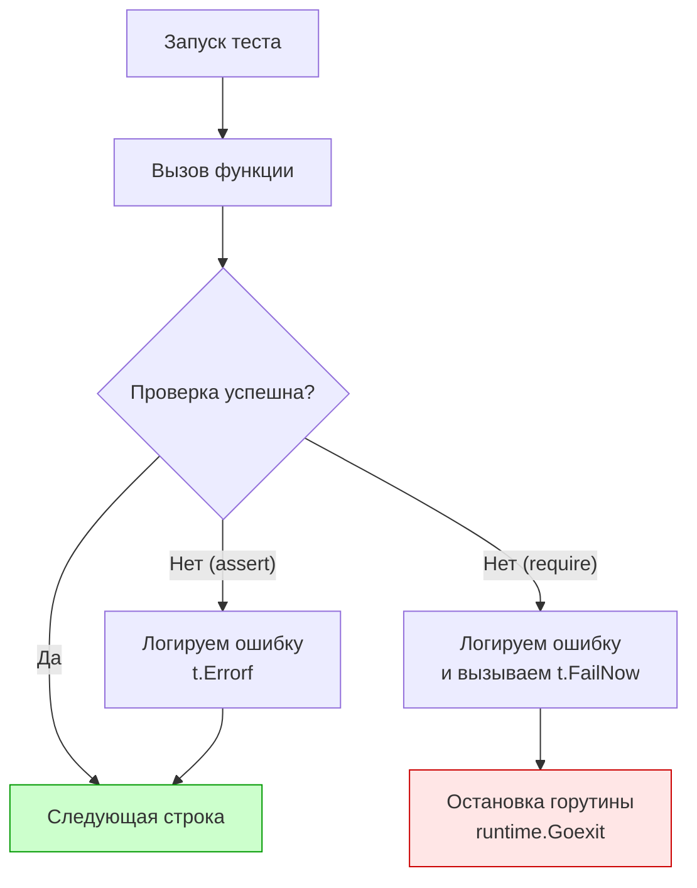

В предыдущей статье [[1. Assert подход vs plain Go]] мы обсудили философские разногласия между "ванильным" подходом создателей Go и потребностями энтерпрайз-разработки. Итог этого противостояния прост: де-факто стандартом индустрии стала библиотека `github.com/stretchr/testify`. Вы встретите её в 95% коммерческих проектов на Go.

Эта библиотека предоставляет два главных пакета: `assert` и `require`. Непонимание разницы между ними и внутренней механики их работы — одна из самых частых причин "мигающих" (flaky) тестов и паник в CI-пайплайнах.

В этой статье мы разберем, как правильно комбинировать эти пакеты, заглянем под капот их рефлексии и научимся избегать классических ловушек сравнения.

## Фундаментальная разница: assert vs require

Оба пакета предоставляют абсолютно идентичный набор функций (`Equal`, `NotNil`, `NoError`, `Contains` и т.д.). Разница заключается только в одном: **что происходит после того, как проверка провалилась**.

### Пакет assert (Мягкая проверка)
Функции из `assert` вызывают под капотом `t.Errorf()`. 
Если проверка не проходит, в лог записывается ошибка, тест помечается как упавший (`FAIL`), но **выполнение текущей горутины (теста) продолжается**.

**Когда использовать:** Для проверки набора независимых полей структуры. Вы хотите увидеть *все* несовпадения за один прогон теста, а не падать на первом же ошибочном поле.

### Пакет require (Жесткая проверка)
Функции из `require` вызывают под капотом `t.Fatalf()`, которая, как мы знаем, вызывает `runtime.Goexit()`.
Если проверка не проходит, тест **немедленно прерывается**. Ни одна строчка кода ниже `require` выполнена не будет.

**Когда использовать:** Для проверки *предусловий* (prerequisites). Если ваш код вернул ошибку при запросе к БД, нет смысла проверять поля возвращенной структуры — там будет `nil`, и вы получите `panic: nil pointer dereference`.



## Золотой стандарт: Паттерн "Require -> Assert"

Опытные Go-разработчики комбинируют оба пакета в рамках одного теста. Это формирует четкий, предсказуемый и безопасный поток выполнения.

```go
package payment_test

import (
	"testing"
	"[github.com/stretchr/testify/assert](https://github.com/stretchr/testify/assert)"
	"[github.com/stretchr/testify/require](https://github.com/stretchr/testify/require)"
)

func TestProcessPayment(t *testing.T) {
	result, err := ProcessPayment(100.0)
	
	// 1. ПРЕДУСЛОВИЕ (Require)
	// Если err != nil, тест остановится здесь. 
	// Мы защищаем код ниже от panic(nil pointer)
	require.NoError(t, err, "payment processing must not fail")
	require.NotNil(t, result, "result must not be nil")
	
	// 2. БИЗНЕС-ПРОВЕРКИ (Assert)
	// Если Status не совпал, мы всё равно проверим Amount.
	// Мы получим полную картину ошибок в консоли.
	assert.Equal(t, "SUCCESS", result.Status)
	assert.Equal(t, 100.0, result.Amount)
}
```

> [!warning] Ловушка / Gotcha
> Самая частая ошибка Junior-разработчиков — использовать `assert.NoError(t, err)`.
> ```go
> user, err := GetUser(id)
> assert.NoError(t, err) // Тест не остановится, если err != nil!
> assert.Equal(t, "admin", user.Role) // ПАНИКА! user == nil
> ```
> В результате CI выдаст вам не красивый diff ошибки, а нечитаемый `panic: runtime error: invalid memory address or nil pointer dereference` с огромным трейсом рантайма. **Правило:** Всё, что возвращает `error`, проверяется только через `require.NoError`.

## Мощный арсенал Testify

Помимо банального `Equal`, библиотека предоставляет методы, решающие специфичные боли тестирования бэкенда.

### 1. ErrorIs и ErrorAs
Начиная с Go 1.13, ошибки объединяются в цепочки (error wrapping). Обычный `assert.Equal` не сработает, если ошибка обернута через `fmt.Errorf("wrap: %w", err)`.
Используйте `require.ErrorIs(t, err, targetErr)` — под капотом он использует `errors.Is`.

### 2. ElementsMatch (Слайсы без учета порядка)
Если ваша БД или конкурентный код возвращает массив элементов, порядок которых не гарантирован (например, результаты из `sync.Map` или `SELECT` без `ORDER BY`), `assert.Equal` будет мигать (flaky).
`assert.ElementsMatch(t, wantSlice, gotSlice)` проверяет, что оба слайса содержат одни и те же элементы с одинаковой частотой, игнорируя их порядок.

### 3. Eventually (Асинхронные тесты)
Тестирование eventual consistency — ад для бэкендера. Если после отправки события в Kafka база обновится "где-то через 100-500мс", `time.Sleep` убьет скорость тестов.

```go
// require.Eventually опрашивает условие каждые 10мс на протяжении 1 секунды
require.Eventually(t, func() bool {
	user := db.GetUser(id)
	return user.Status == "ACTIVE"
}, 1*time.Second, 10*time.Millisecond, "user should become active asynchronously")
```

## Mechanical Sympathy: Что под капотом Equal?

Функция `assert.Equal` принимает аргументы как `interface{}`:
`func Equal(t TestingT, expected, actual interface{}, msgAndArgs ...interface{}) bool`

> [!info] Под капотом
> 1. **Escape Analysis:** Передача переменных в пустой интерфейс заставляет компилятор аллоцировать их на Heap (куче). Это одна из причин, почему `testify` нельзя использовать в бенчмарках.
> 2. **Динамическая типизация:** `assert.Equal` не скомпилируется с ошибкой, если вы напишете `assert.Equal(t, int64(5), int32(5))`. Код соберется, но тест **упадет в рантайме**. Testify использует строгое сравнение типов внутри рефлексии. Типы должны совпадать абсолютно.
> 3. **Обход структур:** Внутри пакета вызывается `reflect.DeepEqual` (точнее, его немного модифицированная версия). Рефлексия обходит все поля структуры, включая приватные (unexported).

### Проблемы с unexported полями и time.Time

Обилие рефлексии порождает ловушки при сравнении сложных структур.

**Ловушка 1: Функции внутри структур.**
Если в вашей структуре есть поле-функция (`Callback func()`), `assert.Equal` упадет с паникой `reflect: call of reflect.Value.Pointer on zero Value` или подобной, потому что функции в Go нельзя сравнивать (кроме проверки на `nil`).

**Ловушка 2: `time.Time`.**
Структура `time.Time` содержит скрытое неэкспортируемое поле монотонного таймера (`ext` / `wall`), которое зависит от того, как было получено время.
Две переменные времени, указывающие на одну и ту же наносекунду, но созданные по-разному (одна через `time.Now()`, другая распарсена из БД), **не равны** для `assert.Equal`.

**Решение для времени:**
Для сравнения структур, содержащих время, нужно либо обнулить монотонные часы через `t = t.Truncate(0)`, либо использовать специализированный метод:
`assert.WithinDuration(t, expectedTime, actualTime, 0)`

> [!tip] Собеседование
> **Вопрос:** Библиотека `testify/assert` хороша, но есть ли альтернатива для глубокого сравнения огромных, сложных вложенных структур, где `testify` выдает простыню нечитаемого текста при ошибке?
> **Ответ:** Да. Пакет `github.com/google/go-cmp/cmp` (разработанный Google) является более современным, гибким и производительным стандартом для структурного сравнения (Diffing). В отличие от `testify`, `cmp.Equal` по умолчанию вообще **отказывается сравнивать структуры с неэкспортируемыми полями**, требуя от разработчика явно прописать правила сравнения (через `cmp.AllowUnexported` или кастомные `cmp.Comparer`). Это делает тесты более предсказуемыми.

## Объекты Assert и Require (Оптимизация бойлерплейта)

Если в вашем тесте очень много проверок, вы можете устать передавать `t` в каждый вызов.
Testify позволяет инстанцировать объекты:

```go
func TestWithObjects(t *testing.T) {
	// Создаем объекты, привязанные к текущему t
	as := assert.New(t)
	req := require.New(t)
	
	result, err := Process()
	
	// Вызовы становятся короче
	req.NoError(err)
	as.Equal("OK", result.Status)
	as.Len(result.Items, 5)
}
```

Это особенно полезно при вынесении проверок в отдельные хелперы (совместно с `t.Helper()`).

## Итог

1. **`assert`** продолжает тест при провале (для бизнес-полей).
2. **`require`** прерывает тест через `Goexit()` (для ошибок, указателей и предусловий).
3. Золотой стандарт — использовать `require.NoError`, а затем пачку `assert.Equal`.
4. Под капотом используется `interface{}` и тяжеловесная рефлексия, что означает строгую проверку типов в рантайме (а не при компиляции) и аллокации в куче.
5. Для сравнения времени и массивов без порядка используйте специализированные методы (`WithinDuration`, `ElementsMatch`).

Когда `assert` падает, он печатает сообщение в консоль. Но если вы не добавили контекст, дебаг сломавшегося в CI теста превратится в расследование убийства. О том, как писать логи в тестах так, чтобы ваши коллеги не желали вам зла, мы поговорим в следующей статье: [[3. Грамотные сообщения об ошибках]].