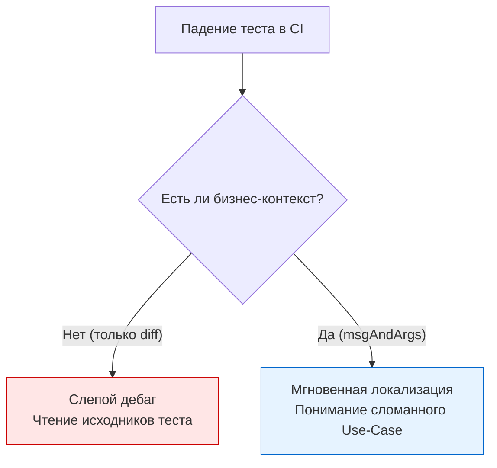

Представьте ситуацию: пятница, 23:00. Вы находитесь вне дома, и вам звонит дежурный DevOps. Критический хотфикс не может уехать на production, потому что в CI-пайплайне упал один из 5000 тестов. Вы открываете логи с телефона и видите это:

```text
--- FAIL: TestProcessPayment (0.01s)
    payment_test.go:42: Expected true, but got false
```

Что `true`? Что `false`? Какой именно платеж тестировался? Какое было состояние системы? Чтобы ответить на эти вопросы, вам придется открывать IDE, искать 42-ю строку, восстанавливать контекст и запускать тест локально под отладчиком. 

В предыдущих статьях ([[1. Assert подход vs plain Go]] и [[2. Testify. assert и require]]) мы разобрали механику проверок. В этой статье мы поговорим об их семантике. Грамотное сообщение об ошибке — это ваш единственный интерфейс общения с тестом, когда он работает на удаленном CI-сервере. 

## Золотой стандарт Go: "got / want"

В экосистеме Go существует жесткий, негласный стандарт логирования ошибок в тестах. Он пришел из исходников стандартной библиотеки и называется **got / want** (получил / ожидал).

**Антипаттерны (как писать нельзя):**
* `t.Errorf("Mismatch. Expected %d, actual %d", a, b)` — лишние слова, нестандартный порядок.
* `t.Errorf("User name is wrong")` — нет ни ожидаемого, ни фактического результата.

**Идиоматичный подход:**
```go
if got != want {
	// Конструкция всегда строится по шаблону: 
	// [Вызов функции или контекст] = [got], want [want]
	t.Errorf("CalculateDiscount(%f) = %f; want %f", input, got, want)
}
```

Этот паттерн мгновенно считывается глазом. Когда разработчик просматривает сотни строк логов, его мозг работает как парсер: он ищет паттерн `got X, want Y`. Не заставляйте мозг коллег парсить нестандартные сообщения.

## Искусство форматирования: Глаголы пакета fmt

Ваш главный инструмент для формирования сообщений — пакет `fmt`. Большинство разработчиков по привычке используют глагол `%v` (default format) для всего подряд. Это часто приводит к слепым пятнам.

### Проблема пробелов и невидимых символов
Представьте тест, который обрезает пробелы у строки:
```go
got := strings.TrimSpace(" admin ")
want := "admin"
if got != want { // Спойлер: функция была с багом и вернула "admin "
	t.Errorf("TrimSpace() = %v, want %v", got, want)
}
```
В логах вы увидите: `TrimSpace() = admin , want admin`. Заметить лишний пробел крайне сложно.

> [!tip] Собеседование
> **Вопрос:** Какой глагол `fmt` следует использовать для вывода строк в тестах, чтобы явно видеть спецсимволы, переносы строк и пробелы?
> **Ответ:** Необходимо использовать `%q` (quoted string). Он обернет строку в двойные кавычки и заэкранирует спецсимволы. Вывод станет очевидным: `TrimSpace() = "admin ", want "admin"`.
> Для сложных типов и структур еще лучше подходит **`%#v`** (Go-syntax representation). Он выводит не только значение, но и тип переменной, что спасает от багов вида `got int64(42), want int32(42)`.

### Вывод структур: `%+v` vs `%#v`
Если вы сравниваете две структуры, `%v` выведет только значения полей `{42 admin@mail.com true}`. Понять, к какому полю относится `true`, невозможно.
* Используйте `%+v`, чтобы добавить имена полей: `{ID:42 Email:admin@mail.com IsActive:true}`.
* Используйте `%#v`, чтобы добавить имя типа: `user.Profile{ID:42, Email:"admin@mail.com", IsActive:true}`.

## Контекст в табличных тестах

Как мы разбирали в [[4. Table driven tests]], один и тот же код выполняется в цикле для разных наборов данных. Если тест падает, сообщение *обязано* идентифицировать конкретную итерацию.

```go
for _, tt := range tests {
	t.Run(tt.name, func(t *testing.T) {
		got, err := Process(tt.input)
		if err != nil {
			// Отлично: Имя подтеста добавится автоматически благодаря t.Run,
			// но мы дополнительно указываем входной параметр для полноты картины.
			t.Fatalf("Process(%#v) unexpected error: %v", tt.input, err)
		}
		if got != tt.want {
			t.Errorf("Process(%#v) = %#v, want %#v", tt.input, got, tt.want)
		}
	})
}
```
Благодаря `t.Run(tt.name, ...)`, в CI вы увидите:
`--- FAIL: TestProcess/admin_user (0.00s)`
`    process_test.go:45: Process(User{ID:1}) = "denied", want "allowed"`

## Сообщения в Testify

Библиотека `testify` генерирует красивые диффы (diffs) для несовпадающих значений. Однако, если проверка упала в цикле или внутри хелпера, голого диффа недостаточно — нужен контекст бизнес-логики.

Все функции в пакетах `assert` и `require` принимают вариативный аргумент `msgAndArgs ...interface{}` в конце.

**Плохо:**
```go
// Если упадет, вы увидите diff, но не поймете, для какого пользователя это произошло
assert.Equal(t, tt.want, got) 
```

**Отлично (Production Grade):**
```go
// Добавляем бизнес-контекст
assert.Equal(t, tt.want, got, "failed to apply discount logic for user role %q and cart total %d", tt.role, tt.total)
```



## Борьба с гигантскими структурами: cmp.Diff

Когда вы тестируете сложные доменные агрегаты или гигантские JSON-ответы API, стандартный вывод (и даже diff от `testify`) превращается в нечитаемую стену текста.

> [!info] Под капотом
> Для глубокого сравнения структур в Go существует золотой стандарт — библиотека `github.com/google/go-cmp/cmp`. 
> В отличие от рефлексии в `testify`, пакет `cmp` спроектирован специально для выдачи удобочитаемых дельт (разниц) между объектами, игнорируя неэкспортируемые поля и позволяя писать кастомные компараторы (например, для игнорирования `time.Time` или округления `float64`).

```go
import "[github.com/google/go-cmp/cmp](https://github.com/google/go-cmp/cmp)"

func TestComplexGraph(t *testing.T) {
	got := GetComplexGraph()
	want := ExpectedGraph()

	// cmp.Diff возвращает пустую строку, если объекты равны
	if diff := cmp.Diff(want, got); diff != "" {
		// Обязательно добавляем префикс, чтобы было понятно, где want, а где got
		t.Errorf("GetComplexGraph() mismatch (-want +got):\n%s", diff)
	}
}
```
Вывод `cmp.Diff` выглядит как патч в Git, четко подсвечивая `-` (удаленные/отличающиеся поля в want) и `+` (что пришло по факту в got). Это экономит десятки минут при отладке интеграционных тестов.

## Ловушка многострочных строк (Multiline strings)

Если ваш код генерирует SQL-запросы, HTML, XML или большие текстовые отчеты, сравнение их через `assert.Equal` или `if got != want` выведет всю строку целиком, заставив вас играть в игру "найди 1 отличающийся символ в 50 строках текста".

> [!warning] Ловушка / Gotcha
> Никогда не встраивайте гигантские многострочные строки (через backticks ```) прямо в код теста для сравнения. 
> 1. Это убивает читаемость тестового файла.
> 2. Редакторы по-разному обрабатывают символы `\r\n` (CRLF) и `\n` (LF). Ваш тест может быть зеленым на macOS, но падать в CI (Linux) или у коллеги на Windows просто из-за невидимых символов переноса каретки.

Для тестирования больших текстовых блоков, генерации кода, JSON-структур или бинарных файлов (изображений, PDF) Plain Go подходы и классические Assert-ы становятся неэффективными. Вы не можете (и не должны) писать сообщение об ошибке для каждой строчки сгенерированного отчета.

Для решения этой архитектурной задачи применяется отдельный вид тестирования, который выносит ожидаемые результаты за пределы кода. Об этом паттерне мы поговорим в следующей статье: [[4. Golden tests]].