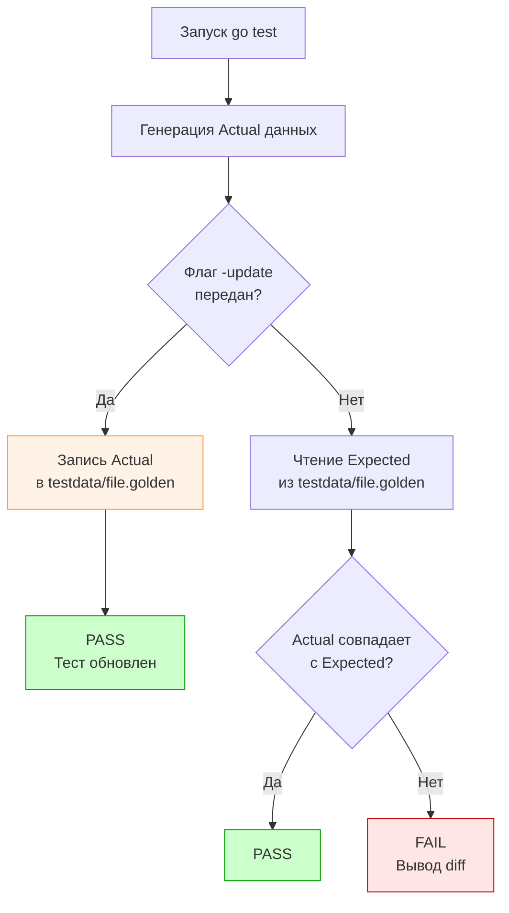

В статье [[3. Грамотные сообщения об ошибках]] мы остановились на фундаментальной проблеме: как тестировать гигантские объемы данных? 

Представьте, что ваш микросервис генерирует сложный финансовый отчет в формате JSON на 500 строк, рендерит HTML-шаблон письма или отдает бинарный файл (например, PDF или сгенерированную картинку). 

Если вы попытаетесь использовать стандартный подход и захардкодите ожидаемый результат в виде многострочной строки (multiline string) прямо в файле `report_test.go`, вы получите нечитаемый файл. Хуже того, когда бизнес-требования изменятся и в отчет добавится одно новое поле, вам придется вручную искать и обновлять эту гигантскую строку. Это контрпродуктивно.

Для решения таких архитектурных задач в инженерии качества применяется паттерн **Golden Tests (Золотые тесты)**, также известный как тестирование по "золотому стандарту" (Golden Master).

## Что такое Golden Test?

Суть паттерна предельно проста:
1. Вы выносите ожидаемый (эталонный) результат выполнения функции в отдельный файл (обычно в директорию `testdata/`, о которой мы говорили в [[2. Структура тестов в Go]]). Этот файл и называется "золотым".
2. Ваш тест выполняет бизнес-логику, получает фактический результат (Actual) в виде набора байтов.
3. Тест читает "золотой" файл с диска и побайтово сравнивает его с фактическим результатом.

**Главная киллер-фича паттерна:** Вы не обновляете эталонные файлы вручную! Тест содержит логику, которая при передаче специального флага (например, `go test -update`) перезаписывает "золотой" файл новым фактическим результатом.



## Идиоматичная реализация на Go

В Go нет встроенного пакета "golden", потому что этот паттерн реализуется за 15 строк кода с использованием стандартной библиотеки.

```go
package report_test

import (
	"bytes"
	"flag"
	"os"
	"path/filepath"
	"testing"
)

// 1. Объявляем кастомный флаг для CLI
// go test ./... -update
var update = flag.Bool("update", false, "update golden files")

func TestGenerateReport(t *testing.T) {
	// Генерируем реальные данные
	actualBytes, err := GenerateFinancialReport(42)
	if err != nil {
		t.Fatalf("unexpected error: %v", err)
	}

	// Формируем путь к золотому файлу
	goldenPath := filepath.Join("testdata", "report_42.golden.json")

	// 2. Магия автообновления
	if *update {
		// Если передан флаг -update, просто сохраняем новые данные как эталон
		err := os.WriteFile(goldenPath, actualBytes, 0644)
		if err != nil {
			t.Fatalf("failed to update golden file: %v", err)
		}
		// Завершаем тест, так как мы его только что обновили
		return 
	}

	// 3. Стандартный режим проверки
	expectedBytes, err := os.ReadFile(goldenPath)
	if err != nil {
		t.Fatalf("failed to read golden file: %v", err)
	}

	// Побайтовое сравнение
	if !bytes.Equal(actualBytes, expectedBytes) {
		// В идеале здесь нужно вывести diff, например через cmp.Diff
		t.Errorf("report mismatch! run 'go test -update' to accept new format")
	}
}
```

> [!info] Под капотом
> Как работает парсинг флага `update`? 
> Пакет `testing` в Go сам по себе использует пакет `flag` под капотом (например, для флагов `-v`, `-run`, `-bench`). Когда компилятор генерирует синтетическую точку входа `_testmain.go`, рантайм `testing` вызывает `flag.Parse()` до запуска ваших тестов. 
> Поэтому любая глобальная переменная, инициализированная через `flag.Bool`, автоматически подхватит значение из командной строки, если вы вызовете `go test -update`.

## Ловушки и проблемы (Gotchas)

Использование Golden Tests — это мощный инструмент, но он требует строгой дисциплины, иначе ваши тесты начнут "мигать" (flaky) или ломаться у коллег на других ОС.

### Ловушка 1: Недетерминированные данные
Если ваш JSON-отчет содержит текущую дату (`"created_at": "2026-04-27T10:00:00Z"`) или случайно сгенерированный UUID, побайтовое сравнение `bytes.Equal` будет падать *каждый раз*.

**Решение:** Перед сохранением фактического результата в байты (и перед сравнением) вы обязаны детерминировать данные. 
* Для структур: подмените генератор UUID на мок, возвращающий `0000-0000...`, а время "заморозьте" через инъекцию зависимости (см. [[5. Determinism и воспроизводимость]]).
* Для сырых байтов: прогоните `actualBytes` через регулярное выражение, заменяющее все Timestamp на строку `[TIMESTAMP_MOCKED]`.

### Ловушка 2: Линии переноса каретки (CRLF vs LF)
Это классическая боль при работе в смешанных командах (macOS/Linux vs Windows).
Вы сгенерировали золотой файл на Linux (`\n`). Закоммитили в Git. Коллега на Windows делает `git pull`, и Git (из-за настройки `core.autocrlf`) прозрачно конвертирует переносы строк в файле на `\r\n`. 
Коллега запускает тест: функция генерирует `\n`, а в золотом файле `\r\n`. Побайтовое сравнение падает!

> [!warning] Ловушка / Gotcha
> Никогда не используйте прямое `bytes.Equal` для текстовых форматов без предварительной нормализации переносов строк.
> Обязательно добавляйте в свой хелпер нормализацию перед сравнением:
> ```go
> actualNormal := bytes.ReplaceAll(actualBytes, []byte("\r\n"), []byte("\n"))
> expectedNormal := bytes.ReplaceAll(expectedBytes, []byte("\r\n"), []byte("\n"))
> if !bytes.Equal(actualNormal, expectedNormal) { ... }
> ```

> [!tip] Собеседование
> **Вопрос:** Если я тестирую REST API, почему бы мне просто не использовать `assert.JSONEq(t, string(expected), string(actual))` вместо побайтового сравнения золотых файлов?
> **Ответ:** `assert.JSONEq` распаковывает оба JSON в `map[string]interface{}` и сравнивает их. Это отлично решает проблему форматирования (пробелы, переносы) и порядка ключей. Но:
> 1. Это требует парсинга и рефлексии (медленно на больших объемах).
> 2. Это работает *только* для валидного JSON. Золотые тесты универсальны: они проверяют XML, gRPC Protobuf дампы, сгенерированный Go-код, бинарные протоколы и даже картинки. Кроме того, `JSONEq` не решает проблему удобного автообновления ожидаемого результата при изменении контракта. Senior-инженеры часто комбинируют подходы: читают эталон из золотого файла, а сравнивают через `JSONEq`.

## Улучшение Developer Experience (DX)

В реальных проектах никто не пишет чтение файла в каждом тесте вручную. Разработчики создают хелперы, совмещая мощь золотых тестов с красивым диффом из библиотеки `cmp`.

```go
// Где-то в пакете testutils
func AssertGolden(t *testing.T, update bool, name string, actual []byte) {
	t.Helper() // см. статью про хелперы
	goldenPath := filepath.Join("testdata", name+".golden")

	if update {
		if err := os.WriteFile(goldenPath, actual, 0644); err != nil {
			t.Fatalf("failed to update golden file: %v", err)
		}
		return
	}

	expected, err := os.ReadFile(goldenPath)
	if err != nil {
		t.Fatalf("failed to read golden file: %v", err)
	}

	// Нормализация CRLF
	actual = bytes.ReplaceAll(actual, []byte("\r\n"), []byte("\n"))
	expected = bytes.ReplaceAll(expected, []byte("\r\n"), []byte("\n"))

	if !bytes.Equal(actual, expected) {
		// Используем cmp.Diff для красивого вывода разницы строк
		diff := cmp.Diff(string(expected), string(actual))
		t.Errorf("Golden mismatch %s:\n%s\nRun 'go test -update' to fix.", name, diff)
	}
}
```

## Итог

1. **Golden Tests** — единственный адекватный паттерн для проверки больших объемов данных (JSON, HTML, бинарники).
2. Эталонные данные хранятся в директории `testdata/`, изолируя визуальный шум от исходного кода тестов.
3. Магия паттерна заключается во флаге командной строки (`-update`), который позволяет автоматически перезаписывать эталоны при легитимном изменении бизнес-логики.
4. Вы обязаны контролировать детерминированность данных и нормализовать символы переноса строк, чтобы тесты не падали на разных ОС.

Подход с золотыми файлами был настолько успешен в индустрии, что в экосистемах вроде JavaScript (Jest) он эволюционировал в отдельную концепцию с собственными фреймворками, скрывающими работу с файлами. В Go этот подход также прижился в виде специализированных библиотек. О том, чем эта эволюция отличается от классических золотых тестов, мы поговорим в следующей статье: [[5. Snapshot testing]].