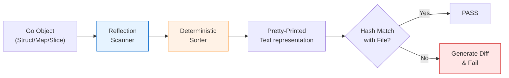

Развитием идеи [[4. Golden tests]] стал паттерн **Snapshot Testing (Снимки)**. Популяризированный в экосистеме JavaScript (фреймворк Jest), этот подход быстро перекочевал в Go через специализированные библиотеки. 

Если в классических "Золотых тестах" мы берем на себя управление файлами, путями и флагами, то Snapshot-библиотеки автоматизируют этот процесс, превращая сравнение сложных структур в одну строчку кода. В бэкенде на Go это особенно удобно для тестирования ответов API, деревьев объектов и даже SQL-запросов, генерируемых ORM.

## Что такое Snapshot Testing?

Snapshot-тестирование — это способ проверки данных, при котором состояние объекта "замораживается" в эталонный снимок при первом запуске теста. При последующих запусках новые данные сравниваются с этим снимком. Если они не совпадают, тест падает, предлагая либо исправить код, либо обновить снимок.

Главное отличие от Golden-тестов: **автоматическое управление именованием и хранением**. Вам не нужно придумывать имена файлов для `testdata/`, библиотека сама свяжет снимок с именем функции и её порядковым номером в коде.

### Популярные инструменты в Go
1. `github.com/bradleyjkemp/cupaloy` — простая и идиоматичная библиотека.
2. `github.com/alecthomas/repr` — часто используется для текстового представления структур.
3. `github.com/tidwall/gjson` — в связке со снимками для частичной проверки JSON.

## Практическая реализация (cupaloy)

Рассмотрим, как с помощью снимков протестировать сложный ответ от микросервиса:

```go
package user_test

import (
	"testing"
	"[github.com/bradleyjkemp/cupaloy/v2](https://github.com/bradleyjkemp/cupaloy/v2)"
)

type UserProfile struct {
	ID    int
	Name  string
	Roles []string
}

func TestUserProfile_Snapshot(t *testing.T) {
	// Представим сложный агрегат, полученный из нескольких БД
	profile := UserProfile{
		ID:    1,
		Name:  "Principal Go Engineer",
		Roles: []string{"admin", "developer", "mentor"},
	}

	// Одной строчкой проверяем весь объект
	// Библиотека сама создаст файл в .snapshots/TestUserProfile_Snapshot.snap
	err := cupaloy.Snapshot(profile)
	if err != nil {
		t.Fatalf("snapshot mismatch: %v", err)
	}
}
```

Чтобы обновить снимок, если вы намеренно изменили структуру профиля, достаточно установить переменную окружения:
`UPDATE_SNAPSHOTS=true go test ./...`

## Mechanical Sympathy: Сериализация и Рефлексия

Как Snapshot-библиотеки превращают Go-структуру в текст для файла?

> [!info] Под капотом
> Большинство библиотек (включая `cupaloy`) используют пакет `reflect` и встроенный механизм `fmt.Sprintf("%#v")` или специализированные сериализаторы типа `repr`.
> 
> Процесс выглядит так:
> 1. **Рекурсивный обход:** Библиотека проходит по всем полям структуры.
> 2. **Сортировка мап:** Для обеспечения детерминизма ключи в `map` всегда сортируются (мы помним из [[5. Determinism и воспроизводимость]], что итерация по мапам случайна).
> 3. **Хеширование:** Сгенерированный текст сравнивается с хешем существующего файла на диске. Если хеши совпадают, дорогостоящее побайтовое сравнение не проводится.



## Преимущества перед классическим Assert.Equal

1. **Читаемость Diff:** Когда падает `assert.Equal` на структуре из 100 полей, вы видите мешанину в консоли. Snapshot-библиотеки обычно генерируют красивый многострочный Diff, где четко видно, какая именно строка внутри снимка изменилась.
2. **Скорость написания:** Вам не нужно писать `assert.Equal(t, want.Name, got.Name)` для каждого поля. Вы проверяете "всё сразу".
3. **Обнаружение лишних данных:** Если в ответе API появилось новое поле, которое вы не ожидали, Snapshot-тест это поймает. Обычный `assert.Equal` на специфичные поля — нет.

## Риски и Ловушки (Gotchas)

### 1. Тесты-"ленивцы"
Это главная опасность. Разработчики начинают бездумно нажимать `UPDATE_SNAPSHOTS=true`, когда тест падает, не вчитываясь в разницу (diff). Snapshot-тестирование требует высокой культуры ревью кода.

### 2. Приватные поля (Unexported fields)
Так как снимки часто строятся на рефлексии или JSON-маршалинге, приватные поля структуры могут просто не попасть в снимок. Вы можете сломать внутреннюю логику объекта, но снимок останется "зеленым".

> [!warning] Ловушка / Gotcha
> Будьте крайне осторожны с типами `time.Time`, `json.RawMessage` и указателями. 
> Если в вашей структуре есть указатель на самого себя (циклическая ссылка), сериализатор снимка может уйти в бесконечную рекурсию и уронить тест с `stack overflow`. Всегда проверяйте, как библиотека обрабатывает сложные типы.

### 3. Хрупкость при рефакторинге
Если вы переименуете поле в структуре, Snapshot-тест упадет, даже если бизнес-логика не изменилась. Это делает тесты более "шумными" при активном рефакторинге.

## Когда использовать Snapshot-тесты?

* **Тестирование CLI-утилит:** Проверка выхлопа команды в `stdout`.
* **Тестирование SQL-генераторов:** Если ваш код строит сложные SQL-запросы.
* **Интеграция с внешними API:** Сохранение эталонных ответов (JSON/XML).
* **Конфигурации:** Проверка больших YAML/TOML конфигов.

> [!tip] Собеседование
> **Вопрос:** В чем разница между Snapshot-тестированием и регрессионным тестированием?
> **Ответ:** Snapshot-тестирование — это *метод* реализации регрессионного тестирования. Оно фиксирует текущее поведение как правильное ("Золотой стандарт") и гарантирует, что будущие изменения его не нарушат. Это идеальный способ быстрого обнаружения регрессий в сложных данных без написания сотен ассертов.

## Итог

1. **Snapshot testing** — это автоматизированная версия Golden-тестов, где библиотека берет на себя управление файлами и диффами.
2. Идеально подходит для больших структур и текстовых данных, где ручное написание ассертов слишком трудозатратно.
3. Требует детерминизма данных (никаких текущих дат и рандома в снимках).
4. Главный риск — деградация качества тестов из-за привычки бездумно обновлять снимки.

Несмотря на удобство всех этих инструментов, иногда лучшим решением будет отказ от них. Избыточное использование библиотек может сделать вашу базу знаний и кода слишком зависимой. О том, когда стоит вернуться к истокам, мы поговорим в финальной статье раздела: [[6. Когда не нужны assertion библиотеки]].