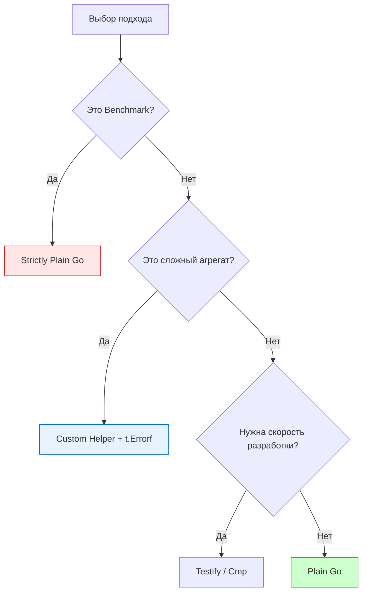

Завершая блок об инструментарии для проверок, необходимо сделать важный шаг назад. Мы изучили мощь `testify` в [[2. Testify. assert и require]] и удобство снимков в [[5. Snapshot testing]]. Однако опытный системный архитектор знает: **любая зависимость — это пассив**.

В экосистеме Go существует сильное течение "минимализма", которое призывает использовать стандартную библиотеку везде, где это возможно. В этой статье мы разберем ситуации, когда использование библиотек ассертов не просто избыточно, а вредно для проекта.

## 1. Бенчмарки и Hot Path

Как мы уже вскользь упоминали, использование `assert.Equal` или `cmp.Diff` внутри цикла `b.N` в бенчмарках — это архитектурная ошибка.

> [!info] Под капотом
> Пакет `reflect`, на котором строятся ассерты, выполняет колоссальную работу: он анализирует таблицы типов, динамически распределяет память в куче для интерфейсов и выполняет рекурсивные обходы. 
> В бенчмарке вы хотите измерить скорость вашей бизнес-функции (например, 20 нс). Но запуск `assert.Equal` может добавить ещё 200 нс оверхеда. Ваши результаты будут показывать производительность библиотеки тестирования, а не вашего кода.

**Правило:** В [[10. Benchmark тесты]] используйте только Plain Go (`if got != want { b.Fail() }`).

## 2. Глубокая доменная логика и кастомные Diff-ы

Библиотеки ассертов универсальны, и в этом их слабость. Они выдают стандартное сообщение: `Expected A, got B`. Но в сложной доменной логике вам часто нужно знать не просто *что* не совпало, а *почему* это критично.

Если вы проверяете состояние сложного банковского транзакционного агрегата, вам может потребоваться специфичный вывод, который `testify` никогда не обеспечит.

```go
// Вместо безликого assert.Equal
if got.Balance != want.Balance {
    t.Errorf("Transaction %s: integrity breach! Currency %s has balance %d, but ledger expects %d. Diff: %d",
        got.ID, got.Currency, got.Balance, want.Balance, got.Balance-want.Balance)
}
```

Такой лог в CI сэкономит часы дебага, в то время как стандартный ассерт заставит вас вручную высчитывать разницу между двумя большими числами.

## 3. Динамические проверки и "Мягкие" условия

Иногда "равенство" — это не то, что вам нужно. Библиотеки ассертов хороши для бинарных состояний (равно/не равно), но бэкенд полон нюансов:
* Проверка, что число входит в диапазон (например, Latency в пределах допустимого).
* Проверка, что слайс содержит *хотя бы один* элемент, удовлетворяющий условию.
* Проверка, что строка соответствует сложному регулярному выражению с захватом групп.

Писать `assert.True(t, val > 10 && val < 20)` — плохо, так как при ошибке вы получите неинформативное `Expected true, got false`. В таких случаях Plain Go с осмысленным `t.Errorf` дает на порядок больше информации.

## 4. Обучение и чистота кодовой базы

Если вы работаете над Open Source библиотекой, которую будут использовать тысячи других разработчиков, добавление `testify` в `go.mod` (даже в `test` секцию) — это плохой тон. 
1. Это увеличивает время скачивания зависимостей (go mod download).
2. Это привносит потенциальные транзитивные уязвимости.
3. Это заставляет контрибьюторов учить еще один API.

**Стандартная библиотека Go (`testing`) стабильна десятилетиями.** Сторонние библиотеки могут менять API, уходить в `v2`, `v3` или переставать поддерживаться.

## Когда библиотеки ПРАВДА мешают: Портируемость и Tooling

Инструменты статического анализа (линтеры, такие как `go vet` или `staticcheck`) отлично понимают стандартные `if` проверки. Когда вы используете сложные цепочки ассертов, линтеры иногда "слепнут".

Например, Race Detector (`go test -race`) гораздо эффективнее подсвечивает проблемы в простых конструкциях, так как в них меньше промежуточных вызовов функций рантайма, которые могут маскировать реальные обращения к памяти.



## Резюме: Здоровый прагматизм

Senior Go Engineer не является фанатиком одного подхода. 
* Используйте `testify/require` для быстрой проверки ошибок (`require.NoError`). Это стандарт.
* Используйте `google/go-cmp` для сравнения больших DTO и структур API.
* **Отказывайтесь от библиотек**, когда пишите код "горячего пути", бенчмарки или когда стандартный вывод ассерта не дает вам понимания причины ошибки.

> [!tip] Собеседование
> **Вопрос:** В проекте используется 5 разных библиотек для ассертов в разных пакетах. Что вы сделаете как архитектор?
> **Ответ:** Я предложу унификацию. Избыточность инструментария — это когнитивная нагрузка. В Go лучше иметь один стандарт (например, `testify` для простых тестов и `go-cmp` для сложных), а в критических местах возвращаться к Plain Go. "Зоопарк" библиотек тестирования — признак отсутствия контроля над качеством кодовой базы.

Мы закончили с инструментами проверок. Теперь у нас есть всё, чтобы убедиться в правильности данных. Но что, если данные "грязные"? Что, если мы не хотим зависеть от реальных внешних систем? Мы переходим к самому сложному и дискуссионному разделу тестирования — имитации поведения. 

Следующая остановка: [[1. Mocking. Основы]].