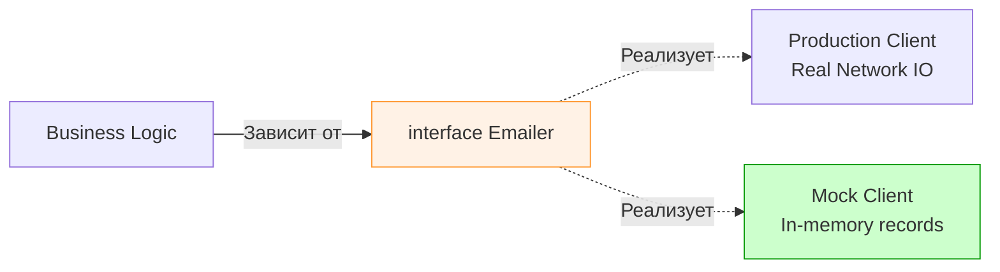

В реальном бэкенде ваш код редко живет в вакууме. Он обращается к базе данных, шлет HTTP-запросы к сторонним API, пишет сообщения в Kafka или проверяет права доступа в Redis. Если вы будете использовать реальные зависимости в Unit-тестах, ваши тесты станут медленными, хрупкими и зависимыми от состояния сети.

**Мокирование (Mocking)** — это техника замены реальной зависимости на имитацию (дублер), которая ведет себя предсказуемым образом. В Go мокирование неразрывно связано с использованием интерфейсов и принципом инверсии зависимостей (Dependency Injection).

В этой статье мы разберем философию моков в Go, узнаем, почему в этом языке моки "страдают" меньше, чем в Java, и научимся отличать хорошую имитацию от плохой.

## Зачем нужны моки в бэкенде?

Представьте функцию, которая регистрирует пользователя: она должна проверить уникальность Email в БД и отправить письмо через сервис SendGrid.

Без моков ваш тест:
1. Будет требовать запущенного PostgreSQL.
2. Будет тратить деньги на реальную отправку Email.
3. Упадет, если у SendGrid временные проблемы с API.

С моками вы создаете "контролируемую лабораторию", где база данных всегда возвращает "Email свободен", а почтовый сервис просто подтверждает получение команды без реальной отправки байтов в сеть.

## Интерфейс — фундамент мокирования

В Go вы не можете (без грязных хаков) "подменить" метод конкретной структуры. Чтобы сделать код тестируемым, он должен зависеть не от реализации (`*sql.DB`), а от поведения (интерфейса).

> [!info] Под капотом: Duck Typing
> Go использует неявную реализацию интерфейсов. Если ваша структура имеет метод `Send(msg string) error`, она автоматически реализует интерфейс `type Emailer interface { Send(string) error }`. 
> Это позволяет нам в тестах передавать вместо реального клиента любую структуру-пустышку, удовлетворяющую этому контракту. Это происходит на уровне таблицы методов (`itab`) в рантайме.



## Основные типы дублеров (Test Doubles)

В разговорной речи мы называем "моком" всё подряд, но технически существует классификация по Мартину Фаулеру, которую важно знать для Senior-позиций:

1.  **Stub (Заглушка):** Самый простой тип. Она просто возвращает заранее заданный ответ на вызов метода. Она не проверяет, сколько раз её вызвали или с какими параметрами.
2.  **Mock (Мок):** Более сложный объект. Он содержит логику проверок (Expectations). Мок "обидится", если вы вызвали его не 2 раза, а 1, или если передали не тот ID пользователя.
3.  **Fake (Фейк):** Работающая, но упрощенная реализация. Например, `In-memory SQLite` вместо `PostgreSQL` или слайс в памяти вместо сложного хранилища.
4.  **Spy (Шпион):** Записывает информацию о вызовах (какие аргументы пришли, сколько раз), чтобы тест мог проверить это постфактум.

## Механика мокирования в Go: Ручной подход

Прежде чем браться за генераторы моков, нужно понять, как они устроены. Самый чистый и понятный способ — написать мок руками.

```go
// 1. Контракт
type Store interface {
    GetBalance(ctx context.Context, userID int) (int, error)
}

// 2. Наш сервис
type PaymentService struct {
    storage Store
}

// 3. Ручной мок в файле _test.go
type storeMock struct {
    balance int
    err     error
    calls   int // Счётчик для шпионажа
}

func (m *storeMock) GetBalance(ctx context.Context, userID int) (int, error) {
    m.calls++
    return m.balance, m.err
}

func TestPayment(t *testing.T) {
    mock := &storeMock{balance: 100, err: nil}
    svc := PaymentService{storage: mock}
    
    // ... логика теста ...
    
    if mock.calls != 1 {
        t.Errorf("expected 1 call to Store, got %d", mock.calls)
    }
}
```

## Mechanical Sympathy: Почему моки могут замедлять тесты?

Хотя моки избавляют нас от сетевого I/O, они не бесплатны.

> [!warning] Ловушка / Gotcha: Динамическая диспетчеризация
> Каждый вызов метода через интерфейс (который использует мок) — это вызов через таблицу виртуальных методов. Это предотвращает **инлайнинг (Inlining)** функций компилятором. 
> Если ваш мок используется в очень "горячем" цикле (миллионы вызовов в секунду), накладные расходы на вызов интерфейса и проверку типов в рантайме могут стать заметными. Однако для 99.9% бэкенд-тестов это не является проблемой.

## Когда моки — это зло? (Overmocking)

Самая большая архитектурная ловушка — попытка замокать всё. Если ваш тест состоит на 80% из настройки моков (`On("Method").Return(...)`) и на 20% из самой проверки, вы занимаетесь тестированием реализации, а не поведения.

**Признаки "отравления" моками:**
* Вы изменили имя приватной переменной, и 50 тестов упало (хотя логика не изменилась).
* Вы не можете понять, что делает тест, из-за гигантской простыни настроек `gomock`.
* Вы мокаете внутренние компоненты своего же пакета.

> [!tip] Собеседование
> **Вопрос:** Стоит ли мокать стандартную библиотеку (например, `os.File` или `http.Client`)?
> **Ответ:** Прямое мокание стандартной библиотеки часто ведет к созданию очень сложных интерфейсов. Лучше создать свою небольшую абстракцию (Wrapper), которая делает именно то, что нужно вашему домену, и мокать уже её. Например, вместо моканья всей файловой системы, создайте интерфейс `ConfigReader` с одним методом `Read()`.

## Итог

1.  Мокирование позволяет изолировать Unit-тесты от внешнего мира и недетерминированных систем.
2.  В Go мокирование базируется на интерфейсах и Dependency Injection.
3.  Различайте Stubs, Fakes и Mocks — это база технического языка архитектора.
4.  Избегайте Overmocking. Если моков слишком много, возможно, ваш код слишком сильно связан (tightly coupled).

Ручное написание моков утомляет, когда в интерфейсе больше 5 методов. Для автоматизации этой рутины существуют мощные инструменты. О том, как заставить компьютер писать моки за вас, мы поговорим в следующей статье: [[2. Интерфейсы как инструмент тестирования]].