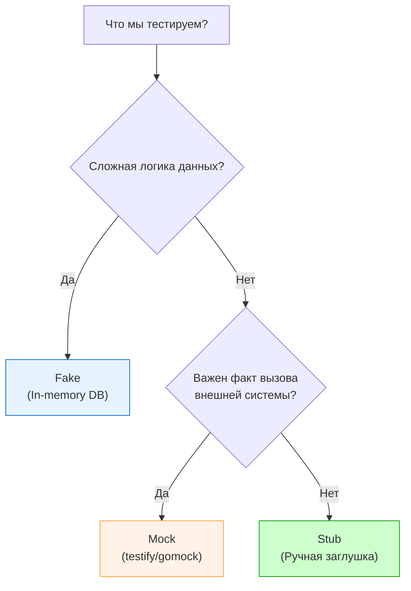

В инженерной среде слово «мок» стало зонтичным термином для любого тестового дублера. Однако, когда мы говорим об архитектуре тестов на уровне Senior/Lead, путаница в этих понятиях ведет к неправильному выбору инструмента. 

В классической работе Джерарда Месароша (и позже Мартина Фаулера) выделяется 5 типов **Test Doubles** (тестовых дублеров). В Go-разработке мы чаще всего сталкиваемся с тремя: **Stubs**, **Mocks** и **Fakes**. Разница между ними заключается не в том, *как* они написаны, а в том, *как* они используются для верификации.

## 1. Stub (Заглушка): Состояние важнее поведения

**Stub** — это простейший дублер, который возвращает жестко заданные («заглушенные») данные. Его задача — обеспечить тестируемый код необходимыми входными данными, чтобы тот мог продолжить выполнение.

* **Фокус:** Наполнение входящих данных (Indirect Inputs).
* **Верификация:** Мы проверяем состояние *самого тестируемого объекта*, а не заглушки.
* **Пример в Go:** Ручной мок, где мы просто прописали `return 100, nil`.

```go
// Это Stub. Мы не проверяем, вызывался ли он. 
// Нам просто нужно, чтобы он вернул баланс для логики перевода.
stubRepo := &MyRepoStub{balance: 100}
service := NewService(stubRepo)

err := service.Transfer(42, 10) // Тестируем логику Transfer

assert.NoError(t, err) 
// Верификация состояния: проверяем, что в РЕАЛЬНОМ объекте что-то изменилось
```

---
## 2. Mock (Мок): Поведение важнее состояния

**Mock** — это дублер, который ориентирован на проверку **взаимодействий**. Он знает, сколько раз его должны вызвать, в каком порядке и с какими аргументами.

* **Фокус:** Проверка исходящих вызовов (Indirect Outputs).
* **Верификация:** Тест падает, если мок не был вызван так, как ожидалось.
* **Пример в Go:** Использование `gomock` или `testify/mock` с методами `EXPECT()` или `On().Once()`.

```go
// Это Mock. Главная цель — убедиться, что Email БЫЛ ОТПРАВЛЕН.
mockEmail := new(MockEmailService)
mockEmail.On("Send", "admin@test.com", mock.Anything).Return(nil).Once()

service := NewService(mockEmail)
service.NotifyAdmin()

mockEmail.AssertExpectations(t) // Верификация поведения
```

---
## 3. Fake (Фейк): Упрощенная реальность

**Fake** — это объект, который имеет рабочую реализацию, но обычно упрощенную и непригодную для production. В отличие от моков и стабов, фейк обладает реальной внутренней логикой.

* **Фокус:** Имитация внешней системы без сетевого оверхеда.
* **Пример в Go:** In-memory база данных (например, использование мапы вместо PostgreSQL) или `SQLite` вместо `Oracle`.

```go
// Это Fake. У него есть логика сохранения и поиска, но он живет в RAM.
fakeRepo := NewInMemoryUserRepo() 
service := NewService(fakeRepo)

service.Register("alice")
user, _ := fakeRepo.Find("alice") // Фейк реально сохранил и нашел данные

assert.Equal(t, "alice", user.Name)
```

> [!tip] Собеседование
> **Вопрос:** В чем фундаментальный риск использования Fakes (фейков)?
> **Ответ:** Риск **расхождения поведени (Implementation Drift)**. Если логика вашего `InMemoryRepo` начнет отличаться от логики реального `PostgreSQL` (например, в части уникальных индексов или транзакций), ваши тесты будут "зелеными", а production упадет. Фейки требуют регулярной синхронизации с реальной реализацией.

---
## Сравнительная таблица

| Тип дублера | Основная цель | Проверка (Assert) | Сложность реализации |
| :--- | :--- | :--- | :--- |
| **Stub** | Подсунуть данные | Проверяем результат функции | Низкая |
| **Mock** | Проверить вызов | Проверяем сам дублер | Средняя (инструменты) |
| **Fake** | Заменить систему | Проверяем состояние системы | Высокая |
| **Spy** | Записать историю | Проверяем количество/аргументы | Средняя |

---
## Mechanical Sympathy: Когда что выбирать?

Для Senior-разработчика выбор дублера — это баланс между **скоростью**, **надежностью** и **хрупкостью**.

1.  **Выбирайте Stubs**, если вы тестируете чистые алгоритмы, которым просто нужны данные. Это самые быстрые и стабильные тесты.
2.  **Выбирайте Mocks**, если вы тестируете интеграцию или сайд-эффекты (отправка письма, пуш в очередь, запись в лог). Но помните: избыток моков делает тесты хрупкими (Fragile Tests) — любое изменение порядка вызовов ломает тест.
3.  **Выбирайте Fakes**, если вы тестируете сложный сценарий с множеством взаимодействий с БД. Фейк позволяет писать тесты, которые выглядят как реальный код, без бесконечных `On(...).Return(...)`.



> [!warning] Ловушка / Gotcha: Mocking Fakes
> Никогда не пытайтесь "замокать" фейк. Если вы используете `InMemoryRepo`, не нужно писать `mock.On("Save").Return(nil)`. Фейк должен работать сам по себе. Смешивание этих подходов создает "архитектурного монстра", которого невозможно поддерживать.

## Итог

1.  **Stub** — дает данные.
2.  **Mock** — проверяет вызов (сколько раз, с чем).
3.  **Fake** — легкая рабочая копия (в памяти).
4.  Используйте подходящий инструмент под задачу: не забивайте гвозди (Stubs) микроскопом (Mocks).

Чрезмерное увлечение моками и стабами ведет к тому, что тесты перестают отражать реальность. Чтобы избежать этой ловушки, нужно знать меру. О том, как не превратить тесты в бесполезную бюрократию, читайте в следующей статье: [[7. Overmocking как анти паттерн]].