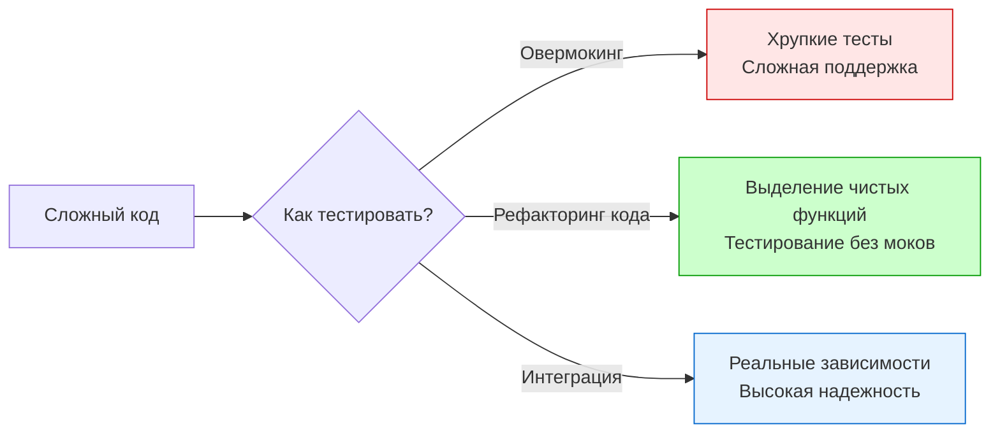

Завершая блок про мокирование, необходимо разобрать самую опасную ловушку, в которую попадают Senior-разработчики при проектировании тестов. **Overmocking (избыточное мокирование)** — это ситуация, когда тесты настолько сильно завязаны на внутреннюю реализацию и поведение дублеров, что они перестают выполнять свою главную функцию: обеспечивать уверенность в работоспособности системы.

Если вы чувствуете, что любое изменение названия метода или порядка вызовов (даже если результат функции не изменился) приводит к падению десятков тестов — поздравляю, вы столкнулись с «хрупкими тестами» (Fragile Tests) из-за овермокинга.

## Суть проблемы: Тестирование реализации вместо поведения

Идеальный тест должен быть «черным ящиком»: мы подаем входные данные и проверяем результат. Овермокинг превращает тест в «прозрачный ящик», который следит за каждым шагом внутри функции.

### Признаки Overmocking

1.  **Огромный Setup:** Настройка моков (`On().Return()`) занимает 70-80% тела теста.
2.  **Завязка на порядок:** Тесты падают при изменении порядка двух независимых вызовов (например, логгера и метрик).
3.  **Мокирование внутренних компонентов:** Вы мокаете структуры, которые находятся в том же пакете, что и тестируемый код.
4.  **Мокирование простых структур:** Вместо того чтобы просто создать экземпляр DTO или объекта, вы создаете интерфейс и мок для него.

## Почему это плохо? (Engineering Impact)

### 1. Ложное чувство безопасности
Моки всегда отвечают так, как вы их запрограммировали. Если вы неправильно поняли контракт внешней системы и заложили эту ошибку в мок, ваш тест будет «зеленым», а реальное приложение упадет в production.

### 2. Препятствие для рефакторинга
Суть рефакторинга — изменить *внутреннее устройство* кода, не меняя его *внешнее поведение*. Тесты с овермокингом жестко цепляются за «внутрянку». В итоге разработчики боятся трогать код, потому что «придется переписывать сотню моков». Тесты начинают не помогать, а мешать развитию системы.

### 3. Потеря смысла (Tautological Tests)
Тест превращается в повторение кода.
* **Код:** Вызвать `A()`, затем `B()`.
* **Тест:** Проверить, что вызван `A()`, а затем `B()`.
Такой тест не ищет логические ошибки, он просто проверяет, умеете ли вы копировать строки из одного файла в другой.

---
## Как бороться с овермокингом: Стратегии Senior-инженера

### 1. Используйте реальные объекты для простых данных
Если зависимость — это простая структура (DTO, конфигурация, Value Object), не нужно её мокать. Просто создайте её экземпляр. Go — язык с эффективным управлением памятью, создание структуры на стеке практически бесплатно.

### 2. Фокус на результатах, а не на вызовах
Вместо того чтобы проверять, что `repo.Save()` был вызван с определенными параметрами, постарайтесь проверить результат через публичный API. Если вы используете **Fake** (см. [[6. Fake vs mock vs stub]]), вы можете проверить, что данные реально «сохранились» в памяти фейка.

### 3. Интеграционные тесты как альтернатива
Иногда вместо того, чтобы мокать сложную логику базы данных, проще и надежнее поднять реальную БД в контейнере через [[4. testcontainers go]]. Это даст 100% уверенность в SQL-запросах, которую никакой мок не обеспечит.

### 4. Мокайте только "границы" (I/O)
Мокированию подлежат только те вещи, которые вы действительно не контролируете или которые слишком медленны:
* Внешние HTTP API (платежные шлюзы, соцсети).
* Отправка Email/SMS.
* Тяжелые распределенные системы (S3, Kafka).

> [!tip] Собеседование
> **Вопрос:** Как понять, что интерфейс создан только ради тестов и является признаком плохого дизайна?
> **Ответ:** Если у интерфейса только одна реализация в production и одна в тестах (мок), и при этом он не служит для разделения слоев или обеспечения плагинной архитектуры — это «интерфейс ради интерфейса». В Go лучше начинать с конкретных типов и выделять интерфейс только тогда, когда появляется реальная потребность в полиморфизме или изоляции тяжелого I/O.

---
## Mechanical Sympathy: Рефлексия и когнитивная нагрузка

С точки зрения рантайма, каждый мок — это лишний слой косвенности и рефлексии. Но важнее «цена» для мозга разработчика.

> [!info] Под капотом
> При чтении теста с овермокингом мозг тратит ресурсы на удержание в памяти графа ожиданий (`Expectations`). Когда этот граф становится слишком сложным, разработчик перестает видеть логику функции за лесом из `mock.On()`. Это приводит к тому, что баги в самих тестах становятся обычным делом.

## Итог

1.  **Мок — это крайняя мера**, а не инструмент по умолчанию.
2.  Тестируйте **поведение**, а не последовательность вызовов методов.
3.  Если тест сложно написать без 20 моков — это сигнал о том, что **архитектура кода переусложнена**. Разбейте компонент на более мелкие, чистые функции.
4.  Помните о пирамиде тестирования: иногда один интеграционный тест лучше десяти юнитов с моками.

Иногда моков недостаточно, потому что нам нужно гарантировать, что две разные системы (например, два микросервиса) одинаково понимают интерфейс взаимодействия. В этом случае на помощь приходит другой подход. Переходим к: [[8. Contract testing]].