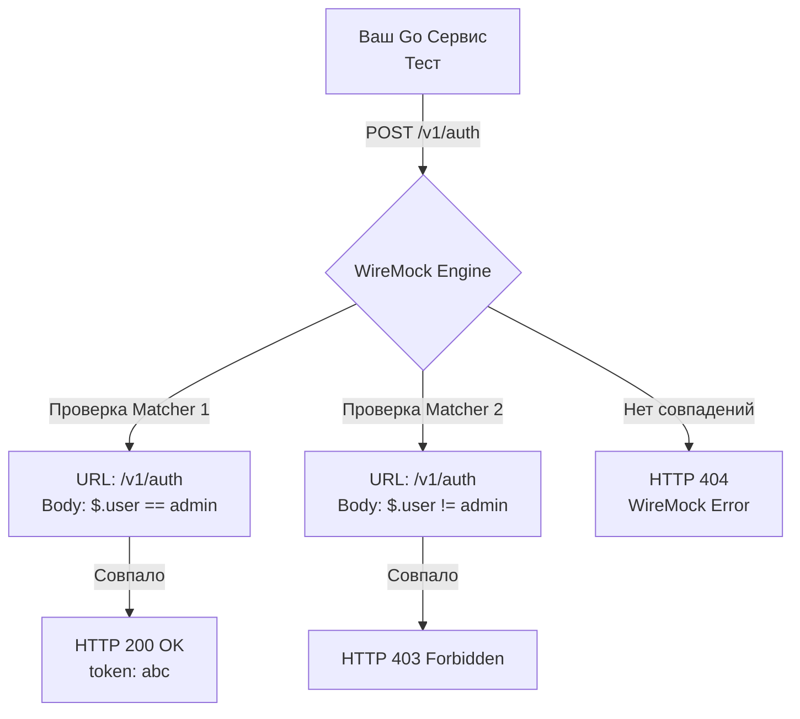

## Управление хаосом: Когда httptest.Server уже недостаточно

В прошлой статье [[9. Тестирование внешних API]] мы выяснили, что мокировать интерфейсы HTTP-клиентов — это антипаттерн, скрывающий сетевые баги. Мы научились поднимать `httptest.NewServer` для имитации внешних зависимостей.

Этот подход идеально работает, когда ваш микросервис интегрируется с 1-2 простыми внешними API. Но что происходит в энтерпрайзе?
Представьте, что ваш сервис агрегирует данные: он должен сходить в сервис авторизации, затем в биллинг, затем в CRM-систему по gRPC-web, а в конце отправить push-уведомление через Firebase. 

Если вы попытаетесь написать `httptest.Server` для всей этой инфраструктуры, ваш `http.HandlerFunc` превратится в бесконечную "лапшу" из `switch-case` по URL-ам, парсинга JSON и проверки заголовков. Вы начнете писать свой собственный фреймворк для мокирования. 

Для решения этой архитектурной проблемы в индустрии существует паттерн **Declarative HTTP Mocking** и его главный представитель — **WireMock**.

## Что такое WireMock?

**WireMock** — это полноценный, отдельно стоящий HTTP-сервер, который конфигурируется декларативно (через JSON-файлы или REST API). Вы не пишете логику обработки запросов кодом; вместо этого вы задаете **Структуры совпадений (Stubs/Matchers)**.

Вы говорите WireMock: *"Если придет POST-запрос на `/v1/payments`, в заголовках будет `Authorization: Bearer X`, а в теле JSON будет поле `$.amount` равное `100`, то ответь со статусом 201, задержкой в 500мс и вот этим JSON-телом"*.

> [!info] Под капотом: Движок матчинга
> В отличие от `httptest`, где запрос напрямую попадает в скомпилированную Go-функцию, WireMock (написанный на Java) работает как сложный конечный автомат.
> При получении запроса он прогоняет его через дерево (Radix tree) зарегистрированных "стабов" (Stubs). Для проверки тела запроса он на лету компилирует и выполняет регулярные выражения или выражения **JSONPath**.
> 
> **Mechanical Sympathy:** Из-за этого оверхеда (сетевой хоп до Docker-контейнера + парсинг JSONPath) WireMock работает медленнее, чем `httptest.NewServer` (единицы миллисекунд против микросекунд). Но мы жертвуем процессорным временем тестов ради колоссального ускорения времени разработки (Developer Velocity).



## Интеграция WireMock в Go через Testcontainers

В Go-сообществе идиоматичным способом работы с WireMock стало использование модуля из `testcontainers-go` в связке с официальным Go-клиентом `github.com/wiremock/go-wiremock`.

Развернем инфраструктуру для теста биллинга:

```go
package integration_test

import (
	"context"
	"net/http"
	"testing"

	"[github.com/stretchr/testify/require](https://github.com/stretchr/testify/require)"
	"[github.com/testcontainers/testcontainers-go](https://github.com/testcontainers/testcontainers-go)"
	"[github.com/testcontainers/testcontainers-go/modules/wiremock](https://github.com/testcontainers/testcontainers-go/modules/wiremock)"
	wiremock_client "[github.com/wiremock/go-wiremock](https://github.com/wiremock/go-wiremock)"
)

// setupWireMock поднимает контейнер и возвращает настроенный клиент
func setupWireMock(t *testing.T) (*wiremock_client.Client, string) {
	t.Helper()
	ctx := context.Background()

	// Поднимаем легковесный контейнер WireMock
	container, err := wiremock.RunContainer(ctx, testcontainers.WithImage("wiremock/wiremock:3.3.1"))
	require.NoError(t, err)

	t.Cleanup(func() {
		_ = container.Terminate(ctx)
	})

	url, err := container.PortEndpoint(ctx, "8080", "http")
	require.NoError(t, err)

	// Инициализируем Go-клиент для конфигурации моков по REST API
	client := wiremock_client.NewClient(url)

	return client, url
}
```

Теперь напишем тест, который декларативно настраивает стаб (Stub) перед выполнением запроса:

```go
func TestBillingService_ProcessPayment(t *testing.T) {
	t.Parallel()
	wmClient, wmURL := setupWireMock(t)

	// 1. Arrange: Декларативно настраиваем мок внешнего API
	stub := wiremock_client.Post(wiremock_client.URLPathEqualTo("/v1/charge")).
		WithHeader("Authorization", wiremock_client.EqualTo("Bearer secret")).
		// Используем JSONPath для точечной проверки тела
		WithBodyPattern(wiremock_client.MatchesJsonPath("$.amount", wiremock_client.EqualTo("500.0"))).
		WillReturn(
			"{\"status\": \"success\", \"tx_id\": \"12345\"}",
			map[string]string{"Content-Type": "application/json"},
			http.StatusOK,
		)

	// Отправляем конфигурацию в контейнер
	err := wmClient.StubFor(stub)
	require.NoError(t, err)

	// 2. Act: Инициализируем наш сервис с подмененным URL
	billingSvc := billing.NewService(wmURL, "secret")
	txID, err := billingSvc.ProcessPayment(context.Background(), 500.0)

	// 3. Assert: Проверяем результат
	require.NoError(t, err)
	require.Equal(t, "12345", txID)

	// 4. Verify: WireMock позволяет строго проверить, был ли сделан запрос!
	verifyCount, err := wmClient.Verify(stub.Request(), 1)
	require.NoError(t, err)
	require.True(t, verifyCount)
}
```

## Stateful сценарии: Тестирование ретраев

Самая мощная фича WireMock — **Scenarios (Сценарии)**. Это машина состояний внутри мок-сервера.

Частая задача Middle/Senior разработчика — написать механизм экспоненциального ретрая (Exponential Backoff). Как протестировать, что ваш клиент падает при первом вызове (HTTP 503), но успешно отрабатывает при повторном запросе? Написать это через `httptest` больно (нужно хранить глобальные счетчики вызовов с мьютексами).

В WireMock это делается элегантно:

```go
// Шаг 1: При первом запросе отдаем 503 и переводим состояние сценария в "Retry_Success"
stubFail := wiremock_client.Get(wiremock_client.URLEqualTo("/api/data")).
	InScenario("Retry_Scenario").
	WhenScenarioStateIs(wiremock_client.ScenarioStateStarted).
	WillSetStateTo("Retry_Success").
	WillReturn("", nil, http.StatusServiceUnavailable)

// Шаг 2: Если состояние "Retry_Success", отдаем 200 OK
stubSuccess := wiremock_client.Get(wiremock_client.URLEqualTo("/api/data")).
	InScenario("Retry_Scenario").
	WhenScenarioStateIs("Retry_Success").
	WillReturn(`{"data": "ok"}`, nil, http.StatusOK)

wmClient.StubFor(stubFail)
wmClient.StubFor(stubSuccess)

// Запускаем ваш код с ретраями
result, err := myService.FetchData(context.Background())
require.NoError(t, err) // Тест пройдет, если ваш код делает повторный запрос!
```

## Fault Injection: Инженерия хаоса

Ваш бэкенд должен выживать в суровой реальности Kubernetes, где пакеты теряются, а TCP-соединения внезапно обрываются. WireMock позволяет симулировать сетевые аномалии на уровне транспортного протокола.

> [!warning] Ловушка / Gotcha: Тестирование таймаутов
> Просто вернуть долгий ответ — недостаточно. Реальные API могут "проглотить" часть байтов и зависнуть, или сбросить соединение. WireMock позволяет это сымитировать через `Fault`:
> * **Empty response:** Закрыть TCP-соединение сразу после получения запроса (возврат EOF).
> * **Random data then close:** Отправить мусор (невалидный HTTP) и закрыть сокет. Ошибка `net/http: server closed idle connection`.
> * **Chunked Dribble Delay:** Отдавать тело ответа по 1 байту в секунду. Это классическая атака "Slowloris", которая выявляет отсутствие таймаутов на *чтение тела* (`ResponseHeaderTimeout` вас тут не спасет, нужен `context.WithTimeout` на весь процесс чтения).

```go
// Имитируем жесткий обрыв соединения сервером (Connection Reset)
stubChaos := wiremock_client.Get(wiremock_client.URLEqualTo("/api/unstable")).
	WillReturnFault(wiremock_client.FaultConnectionResetByPeer)

wmClient.StubFor(stubChaos)

// Ваш код должен корректно обработать эту ошибку и не запаниковать
err := myService.FetchData(context.Background())
require.Error(t, err)
require.Contains(t, err.Error(), "connection reset by peer")
```

> [!tip] Собеседование
> **Вопрос:** Мы написали 50 интеграционных тестов с WireMock. Мы уверены, что наш код работает правильно. В чем главная уязвимость этого подхода в Production?
> **Ответ:** Drift контрактов (Рассинхронизация). WireMock тестирует поведение *нашего* кода при ответах, которые мы *сами придумали*. Если реальный Stripe завтра изменит структуру JSON-ответа (например, поле `amount` станет строкой вместо числа), наши тесты с WireMock продолжат гореть зеленым, а Production упадет. Чтобы защититься от этого, HTTP Mocking комбинируют с парадигмой **Consumer-Driven Contract Testing**.

## Итог раздела

Этой статьей мы завершаем гигантский блок, посвященный интеграционному тестированию. 
Вы прошли путь от изоляции транзакций в базе данных до поднятия Kafka в контейнерах и оркестрации хаоса через WireMock. Теперь у вас есть полный арсенал для тестирования любых внешних зависимостей бэкенда на Go.

Но мы смотрели на систему "изнутри". Пора подняться на самый верхний уровень — к точкам входа. В следующем разделе мы начнем препарировать наши собственные хэндлеры, роутеры и API-контракты. 

Следующая статья: [[1. net_http_httptest пакет]].