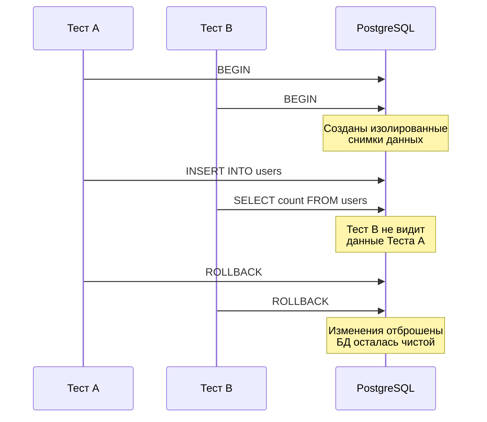

## Иллюзия стерильности: почему очистка базы работает плохо

В прошлой статье мы столкнулись с фундаментальной проблемой: очистка таблиц через `TRUNCATE` или `DELETE` не позволяет использовать `t.Parallel()`, превращая прогон тестов в медленное, последовательное "бутылочное горлышко". Создание уникальных схем под каждый тест решает проблему параллелизма, но невероятно нагружает диск и CPU на этапе выполнения миграций.

В enterprise-разработке на Go золотым стандартом для тестирования уровня доступа к данным (Repository Layer) стал **транзакционный подход (Rollback подход)**.

Суть метода элегантна и проста: перед началом теста мы открываем транзакцию (`BEGIN`), передаем объект транзакции в тестируемый код вместо пула соединений, выполняем бизнес-логику, проверяем результаты в базе, а в конце теста — отменяем изменения через `ROLLBACK`.

## Mechanical Sympathy: Как база прощает нам ошибки

Чтобы понять, почему `ROLLBACK` работает на порядки быстрее `TRUNCATE`, нужно спуститься на уровень движка базы данных (на примере PostgreSQL).

> [!info] Под капотом: MVCC и WAL
> Когда вы выполняете `INSERT` или `UPDATE` внутри транзакции, PostgreSQL не записывает данные сразу в основные файлы таблиц на диске (Heap). 
> 1. Сначала изменения пишутся в **WAL (Write-Ahead Log)** — журнал предзаписи. Это строго последовательная запись на диск (Sequential I/O), которая работает очень быстро.
> 2. Сами строки (tuples) помещаются в оперативную память (Shared Buffers). 
> 3. Благодаря механизму **MVCC (Multi-Version Concurrency Control)**, эти новые строки помечаются системным полем `xmin` (ID текущей транзакции). Для всех остальных конкурентных транзакций (других параллельных тестов) этих строк просто не существует, так как они не зафиксированы (`COMMIT`).
> 
> Когда тест завершается и вы делаете `ROLLBACK`, база просто помечает эту транзакцию как отмененную. Страницы памяти помечаются как "грязные" (dirty), а сборщик мусора (Autovacuum) позже незаметно вычистит эти "мертвые" строки. Никаких дорогостоящих эксклюзивных блокировок уровня таблиц (`ACCESS EXCLUSIVE`), как при `TRUNCATE`, не происходит.

Это означает, что сотни тестов могут одновременно писать в одну и ту же таблицу `users`, не мешая друг другу. MVCC обеспечивает полную изоляцию, а отсутствие фиксации на диске сохраняет высочайшую производительность.



## Архитектура кода для транзакционных тестов

Чтобы этот подход сработал, наш код должен быть спроектирован с учетом [[8. Dependency injection для тестируемости]]. Главная сложность: стандартный `*sql.DB` (пул соединений) и `*sql.Tx` (конкретная транзакция) — это разные типы.

Если ваш репозиторий жестко завязан на `*sql.DB`, вы не сможете передать ему транзакцию в тесте.

### Решение: Интерфейс DBTX

В идиоматичном Go эту проблему решают через абстракцию (именно так работает популярный генератор `sqlc`). Мы объявляем интерфейс `DBTX`, который описывает методы, общие как для пула соединений, так и для транзакции.

```go
package repository

import (
	"context"
	"database/sql"
)

// DBTX описывает методы, доступные и в *sql.DB, и в *sql.Tx
type DBTX interface {
	ExecContext(ctx context.Context, query string, args ...any) (sql.Result, error)
	QueryContext(ctx context.Context, query string, args ...any) (*sql.Rows, error)
	QueryRowContext(ctx context.Context, query string, args ...any) *sql.Row
}

type UserRepo struct {
	db DBTX
}

func NewUserRepo(db DBTX) *UserRepo {
	return &UserRepo{db: db}
}

// Пример метода бизнес-логики
func (r *UserRepo) Create(ctx context.Context, name string) error {
	_, err := r.db.ExecContext(ctx, "INSERT INTO users (name) VALUES ($1)", name)
	return err
}
```

### Идиоматичный тест с rollback

Теперь в тестах мы можем легко стартовать транзакцию и передать её в репозиторий. Используем `t.Cleanup` для гарантированного отката.

```go
package repository_test

import (
	"context"
	"testing"

	"[github.com/stretchr/testify/require](https://github.com/stretchr/testify/require)"
	"yourproject/internal/repository"
)

func TestUserRepository_Create(t *testing.T) {
	t.Parallel() // Теперь мы можем безопасно запускать тесты параллельно!

	ctx := context.Background()
	db := getTestDB(t) // Функция инициализации из предыдущей статьи

	// 1. Начинаем транзакцию специально для этого теста
	tx, err := db.BeginTx(ctx, nil)
	require.NoError(t, err, "не удалось стартовать транзакцию")

	// 2. Гарантируем откат в конце теста
	t.Cleanup(func() {
		// Rollback вернет ошибку sql.ErrTxDone, если транзакция 
		// уже была закрыта, это нормальное поведение.
		_ = tx.Rollback() 
	})

	// 3. Подменяем пул соединений на нашу транзакцию
	repo := repository.NewUserRepo(tx)

	// Act
	err = repo.Create(ctx, "Gopher")
	require.NoError(t, err)

	// Assert
	var count int
	err = tx.QueryRowContext(ctx, "SELECT count(*) FROM users WHERE name = $1", "Gopher").Scan(&count)
	require.NoError(t, err)
	require.Equal(t, 1, count)
}
```

> [!tip] Собеседование
> **Вопрос:** Что произойдет "под капотом" рантайма Go, когда мы вызовем `db.BeginTx()`?
> **Ответ:** Пакет `database/sql` захватит `sync.Mutex` пула, извлечет одно свободное сетевое соединение (`*driverConn`) и **жестко привяжет** его к объекту `*sql.Tx`. Пока не будет вызван `Rollback()` или `Commit()`, это соединение недоступно для других горутин. Если вы забудете вызвать завершение транзакции в тесте, соединение "утечет" (leak), и пул рано или поздно исчерпает лимит (`MaxOpenConns`), что приведет к зависанию (Deadlock) следующих тестов. Именно поэтому `t.Cleanup()` критически важен.

## Ловушка: Вложенные транзакции (Nested Transactions)

Подход с Rollback идеален для тестирования атомарных запросов репозитория. Но он ломается, если мы поднимаемся на слой выше (Usecase / Service) и хотим протестировать бизнес-логику, которая **сама управляет транзакциями**.

Представьте сервис, который переводит деньги и делает это внутри своей транзакции:

```go
func (s *TransferService) Transfer(ctx context.Context, from, to int, amount float64) error {
	tx, err := s.db.BeginTx(ctx, nil)
	// ... логика снятия и зачисления
	return tx.Commit()
}
```

> [!warning] Ловушка / Gotcha
> Если вы обернете вызов этого сервиса в "тестовую транзакцию", вы столкнетесь с тем, что стандартный PostgreSQL **не поддерживает вложенные транзакции** (`BEGIN` внутри `BEGIN` вызовет ошибку `WARNING: there is already a transaction in progress`).
> 
> Более того, если код сервиса вызовет `tx.Commit()`, он зафиксирует изменения в реальной БД, нарушив изоляцию, а ваш тестовый `ROLLBACK` в `t.Cleanup` упадет с `sql.ErrTxDone`.

**Как решать эту архитектурную проблему в Go?**

Есть два пути для Senior-разработчиков:

1. **Использование SAVEPOINT:** Вы можете написать кастомный драйвер или обертку над `database/sql`, которая перехватывает вызов `BeginTx` внутри активной "тестовой" транзакции и вместо реального `BEGIN` выполняет SQL-команду `SAVEPOINT sub_tx`. Вызов `Rollback` внутри кода транслируется в `ROLLBACK TO SAVEPOINT sub_tx`. Это сложно, требует глубокого знания SQL и может конфликтовать со сторонними библиотеками.
2. **Отказ от Rollback для сложных сценариев E2E:** Интеграционные тесты слоя репозитория тестируются через Rollback (быстро, сотни в секунду). А тесты комплексных сервисных слоев, где явно стартуют транзакции, выделяются в отдельный пакет (например, `test/integration`). Для таких тестов используется изоляция на уровне схемы базы данных или применяется `TRUNCATE` (с отключением `t.Parallel()`), о чем мы говорили в прошлой статье.

## Итог

Транзакции и `ROLLBACK` — это фундаментальный паттерн для написания быстрых, не подверженных состоянию гонки (race-condition free) и детерминированных интеграционных тестов БД в Go. Он заставляет нас писать более чистый код (используя интерфейсы вроде `DBTX`) и позволяет в полной мере использовать `t.Parallel()`.

Однако для работы этого подхода нам по-прежнему нужна живая база данных. Разворачивать её вручную или через глобальный `docker-compose` — прошлый век. В следующей статье мы перейдем к стандарту де-факто современной инфраструктуры тестирования и разберем: [[4. testcontainers go]].