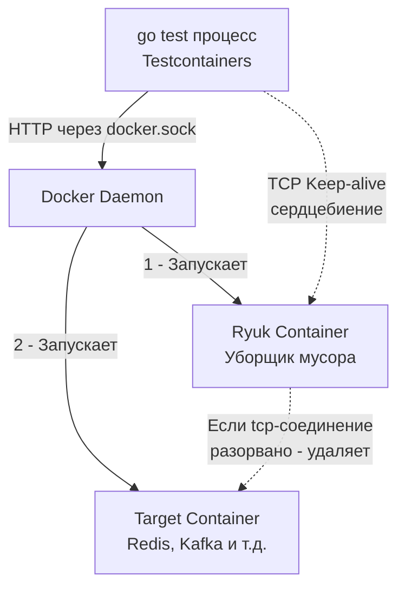

## Инфраструктура как код прямо в тестах

В предыдущих статьях мы разобрали [[3. Транзакции и rollback подход]], который позволяет быстро гонять тесты на реальной базе данных, не теряя изоляции. Но за кадром остался главный вопрос: **откуда берется эта база данных?**

Исторически существовало три пути:
1. **Локальный инстанс:** Каждый разработчик ставит PostgreSQL/Redis/Kafka на свой ноутбук. Это ломает воспроизводимость — разные версии, разные ОС, разные конфиги.
2. **Shared Database:** Одна общая база на сервере для всех разработчиков. Приводит к конфликтам данных и невозможности запускать деструктивные тесты.
3. **docker-compose.yml в корне проекта:** Лучше, но разработчик должен не забыть сделать `docker-compose up` перед `go test`. А в CI/CD пайплайнах нужно писать сложные bash-скрипты, чтобы дождаться поднятия базы перед запуском тестов.

**`testcontainers-go`** решает эту проблему радикально. Это библиотека, которая позволяет вашему Go-коду программно обращаться к Docker Daemon и на лету поднимать нужные контейнеры прямо во время выполнения тестов. Когда тесты заканчиваются — контейнеры уничтожаются. Инфраструктура становится неотъемлемой частью кода теста.

## Под капотом: Как Testcontainers общается с Docker

Чтобы писать надежные тесты, нужно понимать механику работы библиотеки на уровне системных вызовов и сети. `testcontainers-go` — это не магия, это просто HTTP-клиент, который работает поверх **Docker Engine API**.

> [!info] Под капотом: Unix Domain Sockets и Docker API
> По умолчанию в Linux Docker Daemon не слушает TCP-порты (из соображений безопасности). Он слушает локальный Unix Domain Socket: `/var/run/docker.sock`. 
> 
> Когда вы вызываете функцию создания контейнера в Go, библиотека формирует обычный HTTP-запрос (например, `POST /v1.41/containers/create`), но отправляет его не через TCP, а через этот IPC-механизм (Inter-Process Communication) ОС. Это значит, что для работы тестов вашему процессу `go test` нужны права на чтение/запись в этот сокет (или запуск от root, или добавление пользователя в группу `docker`).

### Проблема "Осиротевших" контейнеров и Ryuk

Представьте ситуацию: ваш тест поднял тяжелый контейнер с базой данных, но в середине выполнения случилась `panic`, или вы прервали тест через `Ctrl+C` (сигнал `SIGINT`). Функция `t.Cleanup(terminate)` не успела выполниться. Контейнер остался висеть в памяти (orphaned), "поедая" RAM и занимая порты.

Инженеры Testcontainers решили эту проблему с помощью паттерна **Sidecar**.



Библиотека первым делом прозрачно для вас поднимает крошечный легковесный контейнер **Ryuk** (назван в честь бога смерти из аниме "Тетрадь смерти"). 
Процесс Go устанавливает TCP-соединение с Ryuk и держит его открытым. Если процесс `go test` внезапно умирает, TCP-соединение рвется (ОС закрывает файловые дескрипторы мертвого процесса). Ryuk мгновенно детектирует это через `EOF`, просыпается и отправляет Docker Daemon команду на жесткое удаление (`rm -f`) всех контейнеров, сетей и томов, созданных в рамках этой тестовой сессии.

## Идиоматичный запуск контейнера

Рассмотрим базовый пример поднятия Redis. (Работу с тяжеловесными реляционными БД мы детально разберем в следующей статье).

```go
package integration_test

import (
	"context"
	"testing"

	"[github.com/stretchr/testify/require](https://github.com/stretchr/testify/require)"
	"[github.com/testcontainers/testcontainers-go](https://github.com/testcontainers/testcontainers-go)"
	"[github.com/testcontainers/testcontainers-go/wait](https://github.com/testcontainers/testcontainers-go/wait)"
)

func setupRedisContainer(t *testing.T) (string, func()) {
	t.Helper()
	ctx := context.Background()

	// Описываем спецификацию контейнера
	req := testcontainers.ContainerRequest{
		Image:        "redis:7.2-alpine",
		ExposedPorts: []string{"6379/tcp"},
		// Критически важно: ожидание готовности
		WaitingFor: wait.ForLog("Ready to accept connections"),
	}

	// Отправляем запрос в Docker Daemon
	redisC, err := testcontainers.GenericContainer(ctx, testcontainers.GenericContainerRequest{
		ContainerRequest: req,
		Started:          true, // Создать и сразу запустить (docker run)
	})
	require.NoError(t, err, "не удалось запустить Redis контейнер")

	// Получаем динамический порт
	mappedPort, err := redisC.MappedPort(ctx, "6379")
	require.NoError(t, err)

	host, err := redisC.Host(ctx)
	require.NoError(t, err)

	dsn := host + ":" + mappedPort.Port()

	// Функция очистки возвращается для гибкости, 
	// но можно использовать t.Cleanup прямо здесь
	cleanup := func() {
		if err := redisC.Terminate(context.Background()); err != nil {
			t.Logf("Ошибка при остановке контейнера: %s", err)
		}
	}

	return dsn, cleanup
}

func TestRedisCache(t *testing.T) {
	// Мы можем запускать тесты параллельно!
	t.Parallel() 

	dsn, cleanup := setupRedisContainer(t)
	t.Cleanup(cleanup)

	// Инициализация вашего клиента:
	// client := redis.NewClient(&redis.Options{Addr: dsn})
	
	t.Logf("Redis успешно поднят по адресу: %s", dsn)
	// Act & Assert...
}
```

## Главная ловушка: Статические порты и t.Parallel

Самая частая ошибка разработчиков, приходящих из мира `docker-compose` — попытка забиндить статический порт.

> [!warning] Ловушка / Gotcha
> Если вы напишете в конфиге Testcontainers: `ExposedPorts: []string{"6379:6379/tcp"}`, ваши тесты сломаются при использовании `t.Parallel()`.
> Первый параллельный тест захватит порт 6379 на хост-машине. Второй тест, стартующий на миллисекунду позже, получит от Docker Daemon ошибку `bind: address already in use`. Это прямая дорога к нестабильным сборкам и необходимости изучать [[6. Flaky тесты и их причины]].

**Правильный подход (Mechanical Sympathy):**
Мы отдаем управление портами Docker'у. Указывая `"6379/tcp"`, мы говорим: "Внутри контейнера приложение слушает порт 6379. Снаружи, на хосте, выдели *любой свободный эфемерный порт* (из диапазона 32768-60999)".

Затем в коде мы вызываем `MappedPort()`. Go обращается к Docker API и спрашивает: "На какой порт хоста ты замапил 6379?". Docker отвечает, например, `54391`. Именно этот порт мы передаем в наш DSN для подключения. Таким образом, сотни параллельных тестов поднимут сотни изолированных контейнеров, каждый на своем уникальном порту.

## Стратегии ожидания (Wait Strategies)

Контейнер может перейти в статус `Running` в Docker, но приложение внутри него (особенно Java-приложения типа Kafka или тяжелые СУБД) может еще 10-20 секунд инициализировать кэши, аллоцировать память и применять миграции. Если Go-код попытается подключиться в этот момент — он получит `connection refused`.

Testcontainers предоставляет набор Wait Strategies (стратегий ожидания):

1. **`wait.ForLog("...")`**: Читает `stdout/stderr` контейнера и ждет появления специфичной строки. Самый надежный способ, если вы знаете, что пишет сервис при старте.
2. **`wait.ForListeningPort("...")`**: Пытается установить TCP-соединение. Быстро, но иногда порт открывается до того, как сервис реально готов обрабатывать запросы (например, PostgreSQL открывает порт, но может возвращать ошибку "the database system is starting up").
3. **`wait.ForSQL(...)`**: Специфичная стратегия для баз данных. Она в цикле пытается сделать реальный `SELECT 1` или `Ping`, используя переданный драйвер, пока не получит успех.

> [!tip] Собеседование
> **Вопрос:** В чем проблема поднимать контейнер на каждый Test Case в CI/CD?
> **Ответ:** Время выполнения (Overhead). Запуск контейнера PostgreSQL занимает 2-3 секунды. Если у вас 500 интеграционных тестов, последовательный запуск каждого в своем контейнере займет около 25 минут. 
> **Решение:** Вместо поднятия контейнера на каждый `t.Run`, поднимается **один** контейнер в `TestMain` (или используется синглтон/пул) для всего пакета тестов. А изоляция данных между тестами внутри этого одного контейнера достигается за счет `ROLLBACK` транзакций или уникальных схем.

Использование `testcontainers-go` требует сдвига парадигмы: мы перестаем относиться к инфраструктуре как к чему-то внешнему. Теперь это просто часть setup-фазы нашего теста. В следующей статье мы применим эту мощь на практике и разберем все нюансы работы с самой популярной реляционной БД в Go-бэкенде: [[5. Поднятие PostgreSQL в тестах]].