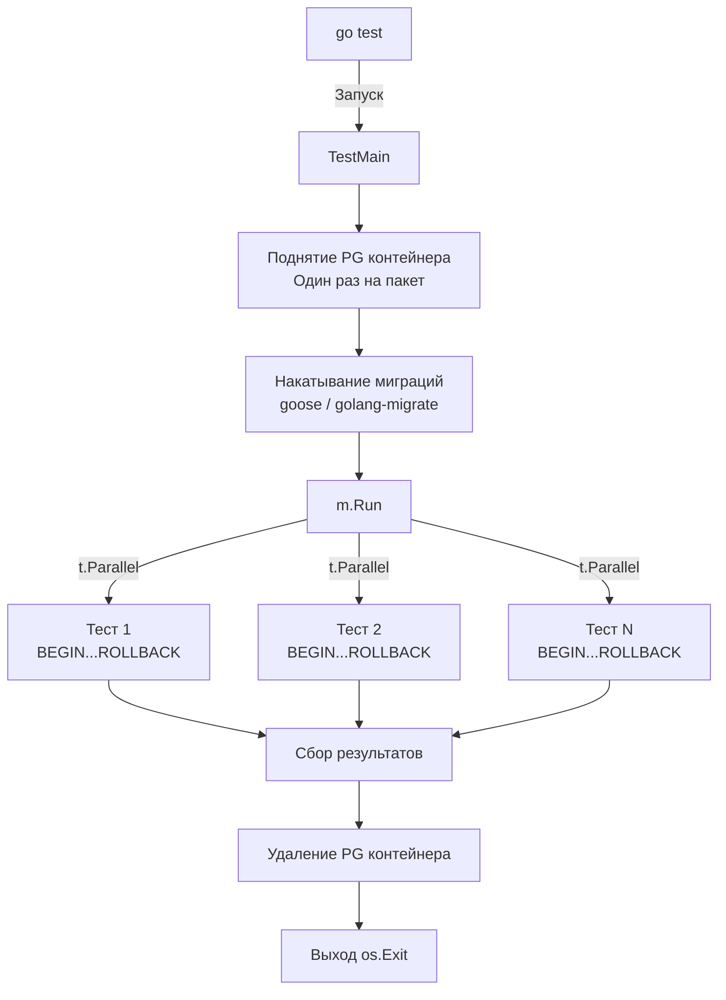

## Прагматичный подход к тяжелым СУБД

В предыдущей статье [[4. testcontainers go]] мы изучили механику работы с Docker daemon из Go-кода. Теперь мы применим эту мощь к самой популярной реляционной базе данных в мире Go-бэкенда — PostgreSQL.

PostgreSQL — это сложный, тяжеловесный (по меркам микросервисов) C-процесс. Он спроектирован для максимальной надежности хранения данных (Durability из ACID). Но в интеграционных тестах нам **не нужна надежность**. Если тест упадет, база будет уничтожена. Нам нужна **максимальная скорость**.

## Идиоматичный запуск через postgres module

Разработчики `testcontainers-go` выделили запуск популярных сервисов в отдельные модули. Вместо ручной настройки `GenericContainer` (с указанием портов и написанием кастомных стратегий ожидания), мы используем готовый пакет `github.com/testcontainers/testcontainers-go/modules/postgres`.

> [!info] Под капотом: Модули Testcontainers
> Модуль `postgres` под капотом сам знает, что база слушает порт 5432, сам прокидывает нужные переменные окружения (`POSTGRES_USER`, `POSTGRES_PASSWORD`) и, что самое важное, использует оптимизированную Wait-стратегию. Он не просто ждет открытия TCP-порта (что происходит до фактической готовности БД), а парсит логи на предмет строки `database system is ready to accept connections`, гарантируя, что ваш Go-код не получит ошибку `connection refused`.

### Mechanical Sympathy: Тюнинг PostgreSQL для тестов

По умолчанию PostgreSQL при каждом `COMMIT` вызывает системный вызов `fsync()` (или `fdatasync()`), приказывая ОС сбросить данные из дисковых кэшей (Page Cache) на физический накопитель. Это блокирующая операция, занимающая миллисекунды. Для 1000 тестов это выльется в секунды или минуты задержек.

В тестах мы отключаем эту механику, перенося всю работу в оперативную память.

```go
package integration_test

import (
	"context"
	"testing"
	"time"

	"[github.com/jackc/pgx/v5/pgxpool](https://github.com/jackc/pgx/v5/pgxpool)"
	"[github.com/stretchr/testify/require](https://github.com/stretchr/testify/require)"
	"[github.com/testcontainers/testcontainers-go](https://github.com/testcontainers/testcontainers-go)"
	"[github.com/testcontainers/testcontainers-go/modules/postgres](https://github.com/testcontainers/testcontainers-go/modules/postgres)"
	"[github.com/testcontainers/testcontainers-go/wait](https://github.com/testcontainers/testcontainers-go/wait)"
)

func setupPostgres(t *testing.T) *pgxpool.Pool {
	t.Helper()
	ctx := context.Background()

	// Настраиваем контейнер с агрессивными оптимизациями для тестов
	pgContainer, err := postgres.RunContainer(ctx,
		testcontainers.WithImage("postgres:16-alpine"),
		postgres.WithDatabase("test_db"),
		postgres.WithUsername("postgres"),
		postgres.WithPassword("postgres"),
		wait.ForLog("database system is ready to accept connections").
			WithOccurrence(2).
			WithStartupTimeout(10*time.Second),
		
		// 1. Отключаем сброс на диск (fsync)
		testcontainers.WithCommand("-c", "fsync=off", "-c", "full_page_writes=off"),
		
		// 2. Размещаем директорию данных в tmpfs (RAM-диск)
		testcontainers.WithTmpfs(map[string]string{"/var/lib/postgresql/data": "rw"}),
	)
	require.NoError(t, err, "не удалось поднять PostgreSQL")

	// Регистрируем очистку
	t.Cleanup(func() {
		if err := pgContainer.Terminate(context.Background()); err != nil {
			t.Logf("Ошибка при остановке PG: %v", err)
		}
	})

	// Получаем DSN для подключения
	connStr, err := pgContainer.ConnectionString(ctx, "sslmode=disable")
	require.NoError(t, err)

	// Инициализируем пул соединений pgx
	pool, err := pgxpool.New(ctx, connStr)
	require.NoError(t, err)

	return pool
}
```

> [!warning] Ловушка / Gotcha
> Обратите внимание на `WithOccurrence(2)` в стратегии ожидания логов.
> При инициализации пустой директории (initdb) PostgreSQL стартует, выполняет настройку, выводит `ready to accept connections`, затем **перезапускается**, и только после второго вывода этой строки он реально готов к приему внешних TCP-соединений. Если ждать только одно вхождение (как по умолчанию), ваши тесты начнут падать с вероятностью 50/50.

## Архитектура: TestMain vs t.Run

Поднять PostgreSQL в RAM — это быстро (около 1.5 - 2 секунд). Но если у вас в пакете `repository` 150 тестовых функций, и каждая делает это в начале, вы потратите 5 минут только на запуск контейнеров.

Для интеграционных тестов уровня пакета (Package-level tests) применяется паттерн с использованием `TestMain`.

`TestMain` — это специальная функция в Go, которая берет на себя управление запуском всех тестов в текущем пакете (папке).



### Реализация TestMain с миграциями

В `TestMain` мы поднимаем базу один раз, накатываем на неё схему (миграции) и сохраняем пул соединений в глобальную переменную. А сами тесты используют [[3. Транзакции и rollback подход]], чтобы изолировать данные друг от друга.

```go
package repository_test

import (
	"context"
	"os"
	"testing"
	"log"

	"[github.com/jackc/pgx/v5/pgxpool](https://github.com/jackc/pgx/v5/pgxpool)"
	// импорты testcontainers и мигратора (например, golang-migrate)
)

// Глобальный пул для тестов в ЭТОМ пакете
var testDB *pgxpool.Pool

func TestMain(m *testing.M) {
	ctx := context.Background()

	// 1. Поднимаем базу (псевдокод, используем логику из примера выше)
	pgContainer, err := startPostgres(ctx)
	if err != nil {
		log.Fatalf("Не удалось стартовать PG: %v", err)
	}

	dsn, _ := pgContainer.ConnectionString(ctx, "sslmode=disable")
	testDB, _ = pgxpool.New(ctx, dsn)

	// 2. Накатываем миграции
	// Важно: читаем SQL файлы из папки проекта (например, ../../migrations)
	if err := runMigrations(dsn, "../../migrations"); err != nil {
		log.Fatalf("Ошибка миграций: %v", err)
	}

	// 3. Запускаем все тесты пакета
	code := m.Run()

	// 4. Очищаем ресурсы
	testDB.Close()
	pgContainer.Terminate(ctx)

	os.Exit(code)
}
```

> [!tip] Собеседование
> **Вопрос:** В чем недостаток использования глобальной переменной `testDB` в `TestMain`?
> **Ответ:** Глобальное состояние всегда усложняет архитектуру. Если вы захотите запускать тесты *разных пакетов* параллельно (`go test ./... -p 4`), каждый пакет поднимет свой контейнер PostgreSQL, что может привести к исчерпанию оперативной памяти (OOM) на CI-сервере, так как `TestMain` изолирован на уровне пакета. В крупных проектах (монорепозиториях) часто пишут кастомный "Test Environment Builder", который поднимает один инстанс PG для всего проекта перед стартом `go test`, передавая DSN через переменные окружения.

## Практика: Инжектирование транзакций

Теперь, когда у нас есть идеально настроенная схема базы данных, любой тест внутри пакета `repository` пишется тривиально:

```go
func TestUserRepo_FindByID(t *testing.T) {
	t.Parallel()

	// Запрашиваем транзакцию из глобального пула
	tx, err := testDB.Begin(context.Background())
	require.NoError(t, err)
	
	// Гарантированный откат после теста
	t.Cleanup(func() { _ = tx.Rollback(context.Background()) })

	repo := repository.NewUserRepo(tx) // Передаем транзакцию вместо пула

	// Подготавливаем фикстуры прямо в этой транзакции
	_, err = tx.Exec(context.Background(), "INSERT INTO users (id, name) VALUES (1, 'Gopher')")
	require.NoError(t, err)

	// Тестируем логику
	user, err := repo.FindByID(context.Background(), 1)
	
	require.NoError(t, err)
	require.Equal(t, "Gopher", user.Name)
}
```

Мы получили бескомпромиссный сетап: полная достоверность (реальный PostgreSQL), изоляция данных (MVCC и Rollback) и максимальная утилизация ядер процессора (`t.Parallel()`).

Реляционные базы данных — это фундамент. Но современные бэкенды редко обходятся без in-memory хранилищ для кэширования или управления сессиями. В следующей статье мы разберем нюансы тестирования таких компонентов: [[6. Тестирование Redis]].